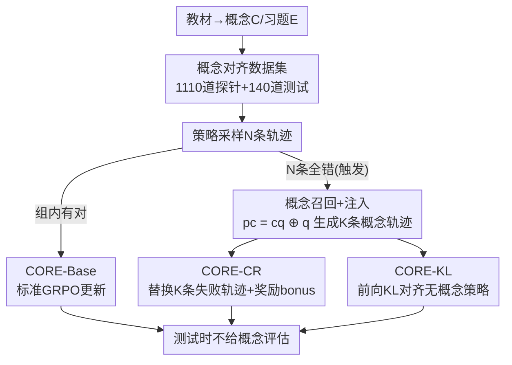

# CORE: Concept-Oriented Reinforcement for Bridging the Definition–Application Gap in Mathematical Reasoning

**会议**: ICLR 2026  
**OpenReview**: [https://openreview.net/forum?id=pRSRiXdpkm](https://openreview.net/forum?id=pRSRiXdpkm)  
**代码**: https://github.com/ARC-ASU/CORE  
**领域**: LLM推理  
**关键词**: 概念推理, 可验证奖励RL, GRPO, 数学推理, 定义-应用鸿沟

## 一句话总结
针对 LLM「能背定义却用不对概念」的问题，CORE 用一本干净的线性代数教材构造概念对齐的题目，在 RL（GRPO）训练中当一组采样全错时注入概念文本来纠偏——可以直接替换失败轨迹（CORE-CR），也可以用前向 KL 把「带概念」的推理分布蒸馏进「不带概念」的策略（CORE-KL），测试时不给概念也能稳定涨点。

## 研究背景与动机
**领域现状**：当前数学推理 LLM 的主流训练范式是 RLVR（Reinforcement Learning with Verifiable Rewards），用 GRPO 这类策略梯度算法、以「最终答案对不对」作为可验证奖励来强化模型。在 GSM8K、MATH 这类基准上，模型靠模仿解题模板、串联例行代数步骤、甚至记住反复出现的套路就能拿到高分。

**现有痛点**：高分掩盖了一个细粒度失败——模型常常**选错概念**或**用错概念**。论文用一个 sanity probe 把这点钉死了：GPT-4o 在选择题答错后，让它复述「有理根定理」，它能一字不差地背出来（$p \mid a_0$、$q \mid a_n$），但回到原题它仍然把分子分母的整除关系搞反。这就是论文命名的**定义-应用鸿沟（definition–application gap）**：参数里存着知识，却没法在推理中灵活部署。作者进一步做了鲁棒性实验——把选择题选项顺序随机打乱 3 次、要求原题和 3 个变体全对才算「鲁棒解出」，OLMo-2-7B 的准确率从 70%+ 直接跌到 50% 以下，证明高分主要靠浅层启发式而非结构化理解。

**核心矛盾**：两个因素共同造成鸿沟。其一，习题式语料奖励的是利用表面规律（格式、关键词、步骤模板），而不是应用背后的概念；其二，RLVR 只有一个终点正确性奖励，**信号太粗**，教不了「该调用哪个概念、概念该如何支撑中间步骤」。概念需要在具体目标下被实例化才能被检验，而终点奖励对这一切都是盲的。

**本文目标**：把「显式概念」变成可控的、细粒度的监督信号，注入到标准 RL 训练里，让模型在**测试时不给概念**的情况下也真正学会选概念、用概念。

**切入角度**：作者找了一本经典教材《高等代数（第 3 版）》——它把概念定义（C）、例题、概念对齐习题（E）按章节严格组织，每章习题主要考本章概念，依赖关系清晰；而且通过人工把这本中文教材翻译成英文，大幅降低了英文语料常见的训练数据污染风险。这本教材既是 in-domain 测试集，也是生成训练信号的种子。

**核心 idea**：不改模型结构、不换 RL 算法，只在**采样阶段条件性地干预**——当模型对一道题彻底失败（一组 rollout 全错）时，才把对应的概念文本喂进去引导，再用替换轨迹或 KL 对齐把这种「概念引导下的推理」固化进策略。

## 方法详解

### 整体框架
CORE 是一个套在标准策略梯度 RL（本文用 GRPO）外面的框架，整条管线分三段：**数据集构造 → gap 诊断 → 概念强化**。先从教材抽取出 236 条概念文本、703 个例题、140 道选择题；用 Qwen2.5-72B 为每条概念生成 5–8 道选择题（共 1200 道候选），再用 GPT-4o 跨模型从 6 个维度过滤掉 90 道低质量题，得到 1110 道高质量「概念探针（Concept Probes）」作为训练池，140 道教材原题作为 in-domain 测试集（Textbook）。

训练时的核心机制是**条件触发的概念干预**：对每个 query，策略 $\pi_\theta$ 先采样一组 $N$ 条轨迹。如果组内有任何一条答对，就走默认路径 **CORE-Base**（直接在概念题上跑标准 GRPO）；如果 $N$ 条**全错**（conceptual failure event），就激活概念干预子系统——Concept Recall 从概念库取出该题关联的真值概念文本 $c_q$，Concept Injection 用 $p_c = c_q \oplus q$ 重新 prompt 模型，生成 $K$ 条「概念预热」轨迹（$1 \le K < N$）。这些概念引导的轨迹有两种用法：**CORE-CR** 把它们替换掉原来失败组里的 $K$ 条并加奖励 bonus；**CORE-KL** 不替换，而是用前向 KL 把概念引导分布对齐进无概念分布。测试时一律不提供概念文本，考的是「概念感知训练」是否真的内化成了概念能力。

### 关键设计

**1. 概念对齐数据集与定义-应用 gap 的量化诊断**

要训练「用对概念」，先得有能区分「会做题」和「懂概念」的可验证数据，并证明这个 gap 真实存在。CORE 选用一本结构严谨、概念-习题映射明确的经典教材，靠人工翻译规避污染，再用「强生成器（Qwen2.5-72B）出题 + 强评估器（GPT-4o）过滤」的跨模型流水线把 236 条概念扩成 1110 道高质量探针——刻意用不同模型出题和判题来降低 harvester bias。诊断的关键是一个**鲁棒评估协议**：对每道选择题随机置换 3 次选项顺序，只有原题加 3 个变体**全对**才算鲁棒解出。这个协议把「答案对但理解浅」的伪能力暴露出来——多个模型在标准协议下 70%+、鲁棒协议下跌破 50%，为整个框架提供了「问题确实存在、且不是偶然」的实证地基。

**2. CORE-CR：概念引导的轨迹替换**

这个设计针对的痛点是「终点奖励太粗、全错时没有任何可学的正信号」。当一组 $N$ 条 rollout 全错，说明模型在这道题上彻底缺乏概念支撑，此时 CORE-CR 拼出概念引导 prompt $p_c = c_q \oplus q$，从概念引导策略采样 $K$ 条新轨迹，**随机替换**掉失败组里的 $K$ 条，并给替换进来的轨迹一个增广奖励：

$$R'(\tau_{c,j}) = R(\tau_{c,j}) + r_{\text{bonus}}$$

其中 $r_{\text{bonus}} > 0$ 是超参。然后在这个「部分替换、概念引导」的 batch 上做 GRPO 更新。它的巧妙之处在于：只在真正失败时介入，把原本只能产生负优势的「全错组」改造成带有概念支撑的可学信号，相当于在最需要纠偏的样本上**自我生成**了正确示范。论文特别强调，CORE-CR 和近期工作 BREAD 方法形态相似，但 BREAD 依赖更强的外部教师模型蒸馏轨迹，而 CORE-CR 的概念轨迹由模型自己在概念提示下生成、不需要更大的 anchor 模型，这种自主性是关键区别（§5.4 实证支持）。

**3. CORE-KL：前向 KL 把「带概念」的推理蒸馏进「不带概念」的策略**

CORE-CR 是在轨迹/奖励层面的显式替换，CORE-KL 则提供一个更细粒度的、损失函数层面的隐式约束，针对的是「希望模型内部逐步推理过程本身就向概念引导对齐」。同样在全错触发时，先从在线的概念引导策略采样一条高质量参考轨迹 $Y^* \sim \pi_\theta(\cdot \mid p_c)$，然后在该轨迹每个时间步的前缀 $y^*_{<t}$ 上，最小化「带概念」与「不带概念」两个 next-token 分布之间的前向 KL，作为 GRPO 目标的附加项：

$$L_{\text{total}} = L_{\text{GRPO}} + \lambda_{\text{KL}} \mathbb{E}_{Y^* \sim \pi_\theta(\cdot \mid p_c)}\left[\sum_{t=1}^{|Y^*|} D_{\text{KL}}\big(\pi_\theta(\cdot \mid p_c, y^*_{<t}) \,\|\, \pi_\theta(\cdot \mid q, y^*_{<t})\big)\right]$$

选用**前向** KL 是刻意的：它鼓励基础策略去覆盖概念引导「教师」考虑的全部推理路径分布，而不是塌缩到单一 mode，从而更完整地蒸馏整个推理过程。直觉上，它强迫模型在原题 $q$ 上的内部推理，去忠实模仿「如果显式给了概念 $c_q$ 会怎么推」的过程。和 CORE-CR 互补——后者纠正尚未掌握的概念用的是显式轨迹，前者用的是隐式分布对齐；而 CORE-Base 主要起巩固作用，强化预训练中已见过的概念应用。三者共同构成在统一框架下、把概念信号注入 RL 的并行互补路径。

## 实验关键数据

### 主实验
主模型 Qwen2-Math-7B，全部在 SC@21（T=0.7）下报告，跨 in-domain（Textbook）和多个 out-of-domain 基准对比 Vanilla / SFT：

| 基准 | Vanilla | SFT | CORE-Base | CORE-CR | CORE-KL |
|------|---------|-----|-----------|---------|---------|
| Textbook (TB) | 46.4 | 45.0 | 50.7 | 52.1 | **55.7** |
| GSM8K | 89.8 | 86.6 | **90.8** | 91.1 | 90.7 |
| TabMWP | 90.2 | 85.6 | 92.6 | **93.6** | 90.6 |
| MATH | 69.1 | 59.4 | **71.1** | 71.4 | 70.5 |
| Gaokao 2023 | 55.3 | 46.5 | 59.5 | 58.4 | **59.5** |
| TheoremQA | 34.6 | 44.2 | 40.4 | 42.3 | **44.2** |
| OlympiadBench | 28.7 | 19.7 | 33.9 | **34.5** | 32.9 |

In-domain Textbook 最高 +9.3%（46.4→55.7，CORE-KL），TheoremQA +9.6%（34.6→44.2）。值得注意的是 **SFT 在多数基准上反而掉点**（如 MATH 69.1→59.4、OlympiadBench 28.7→19.7），说明单纯监督微调概念题会损害泛化，而 CORE 的 RL 式概念注入能稳定涨点。

### 跨模型与机制分析
CORE-CR 在三个 base / instruct 模型上的平均提升（out-of-domain 套件，SC@21）：

| 模型 | Vanilla 均值 | CORE-CR 均值 | 提升 |
|------|--------------|--------------|------|
| DeepSeek-R1-DQ-1.5B | 72.7 | 73.1 | +0.4 |
| Qwen2.5-Math-1.5B | 72.1 | 72.4 | +0.3 |
| Llama-3-8B-Instruct | 58.1 | 58.9 | +0.8 |

机制诊断（Table 3）：取一个子集 $W$（$|W|=19$，CORE-CR 和 CORE-KL 都解出、但 Vanilla 或 CORE-Base 解不出的题），人工标注两个维度——概念命中（显式提到目标概念并正确使用）vs 启发式线索（无理由排除选项、表面模式匹配）。结果 **10/19（52.6%）属于 Concept-Selection，9/19 为 Mixed，0/19 为纯 Heuristic**，在严格「两个变体都要命中」的约束下排除了「靠浅层捷径」是涨点主因。

### 关键发现
- **CORE-KL 在概念密集的 in-domain 任务上最强**（Textbook 55.7、TheoremQA 44.2），因为它在分布层面对齐了整个推理过程；CORE-CR 在需要鲁棒性的任务上更稳（TabMWP、OlympiadBench 最高）。
- **鲁棒性提升**：在题前 prepend $K \in \{1,2,3\}$ 个无关概念作干扰，用 RUDK（Retention Under Distractors，只在模型无干扰能解出的题上统计扰动后保持率）衡量，CORE（尤其 CORE-CR）随 $K$ 增大掉得比 Vanilla / CORE-Base 都慢。
- **不是知识蒸馏**：用 Qwen2-Math-7B-Instruct 当生成器、Qwen2-Math-7B 当学习器做自监督实验（§5.4），概念轨迹由同级模型自己生成、不依赖更强教师，仍有提升，证明涨点来自内在的概念强化而非从更大模型偷信号。

## 亮点与洞察
- **「全错才触发」是个低成本的精准干预**：只在一组 rollout 全部失败时才召回概念、生成引导轨迹，把训练算力花在模型最缺概念支撑的样本上，避免了对每道题都注入概念的开销，也避免了「会做的题被概念干扰」。
- **前向 KL 的选择有讲究**：用前向而非反向 KL，是为了让基础策略覆盖概念引导教师的完整推理路径分布、不塌缩到单一 mode——这是把「过程对齐」而非「答案对齐」写进损失的巧思，可迁移到任何想做「带提示→不带提示」蒸馏的场景。
- **鲁棒评估协议（置换选项全对才算对）** 是一个轻量却有力的诊断工具，能把选择题里靠位置/启发式刷出来的伪能力照出原形，值得复用到任何概念理解类评测。
- **靠翻译经典教材构造低污染数据**：用一本结构严谨、概念-习题对齐清晰的教材 + 人工翻译规避污染，是构造「可验证概念信号」的实用配方。

## 局限与展望
- **绝对增益偏小**：除 in-domain Textbook（最高 +9.3%）和 TheoremQA（+9.6%）外，多数 out-of-domain 基准提升在 1% 量级，三个跨模型实验平均增益仅 +0.3~+0.8，概念强化对通用数学推理的迁移幅度有限。
- **机制诊断样本极小**：核心的「是概念选择还是启发式」结论建立在 $|W|=19$ 的子集和人工标注上，外加一个单题 case，统计说服力受限。
- **领域窄**：概念库来自单一线性代数教材，概念召回依赖人工标注的真值概念文本 $c_q$，能否推广到没有干净概念-习题映射的领域（如证明、组合、应用题）未验证。
- **超参敏感**：$r_{\text{bonus}}$、$\lambda_{\text{KL}}$、替换条数 $K$ 都是方法引入的新超参（细节在附录），全错触发的稀疏性也意味着干预频率取决于模型初始水平。

## 相关工作与启发
- **vs 标准 RLVR / GRPO（DeepSeekMath）**：它们只用终点正确性奖励，概念选择与应用「教不到」；CORE 在不改算法的前提下，把概念文本作为条件触发的细粒度监督注入采样，针对的是奖励信号粒度太粗这个根因。
- **vs BREAD**：方法形态（失败后注入引导轨迹）相似，但 BREAD 从「SFT vs RL 优势」出发、依赖更强外部教师蒸馏轨迹；CORE-CR 的概念轨迹由模型自身在概念提示下生成，不需要 expert-anchor，§5.4 证明涨点非来自蒸馏。
- **vs SFT 概念微调**：直接在概念题上 SFT 在本文实验里多数基准掉点（如 MATH -9.7），说明监督拟合概念题会损害泛化；CORE 的 RL 式概念强化能在保泛化的同时涨点。
- **vs THEOREMQA / COUNTERMATH 等概念评测**：这些工作侧重「诊断」模型是否选对用对概念，CORE 把诊断思路（探针、鲁棒评估）进一步转化为可注入训练的「信号」，从评测走向干预。

## 评分
- 新颖性: ⭐⭐⭐⭐ 把「定义-应用 gap」量化诊断 + 条件触发的概念注入（替换/前向 KL）统一进 RLVR，角度清晰且 algorithm-agnostic。
- 实验充分度: ⭐⭐⭐⭐ 4 个模型族、十余个基准、机制/鲁棒/蒸馏多角度分析，但跨模型绝对增益偏小、机制诊断样本仅 19。
- 写作质量: ⭐⭐⭐⭐ 动机（背得出用不对）讲得生动，三个变体定位清楚；部分增益陈述需对照表格才自洽。
- 价值: ⭐⭐⭐⭐ 提供了一套低成本、不改结构、可复用的「概念信号注入 RL」配方，对做概念推理与可验证奖励的研究有直接借鉴。

<!-- RELATED:START -->

## 相关论文

- [\[ICLR 2026\] NFT: Bridging Supervised Learning and Reinforcement Learning in Math Reasoning](nft_bridging_supervised_learning_and_reinforcement_learning_in_math_reasoning.md)
- [\[ICLR 2026\] Generative Adversarial Reasoner: Enhancing LLM Reasoning with Adversarial Reinforcement Learning](generative_adversarial_reasoner_enhancing_llm_reasoning_with_adversarial_reinfor.md)
- [\[ICLR 2026\] Hybrid Reinforcement: When Reward Is Sparse, Better to Be Dense](hybrid_reinforcement_when_reward_is_sparse_better_to_be_dense.md)
- [\[ICLR 2026\] Temperature as a Meta-Policy: Adaptive Temperature in LLM Reinforcement Learning](temperature_as_a_meta-policy_adaptive_temperature_in_llm_reinforcement_learning.md)
- [\[NeurIPS 2025\] Mind the Gap: Bridging Thought Leap for Improved Chain-of-Thought Tuning](../../NeurIPS2025/llm_reasoning/mind_the_gap_bridging_thought_leap_for_improved_chain-of-thought_tuning.md)

<!-- RELATED:END -->
