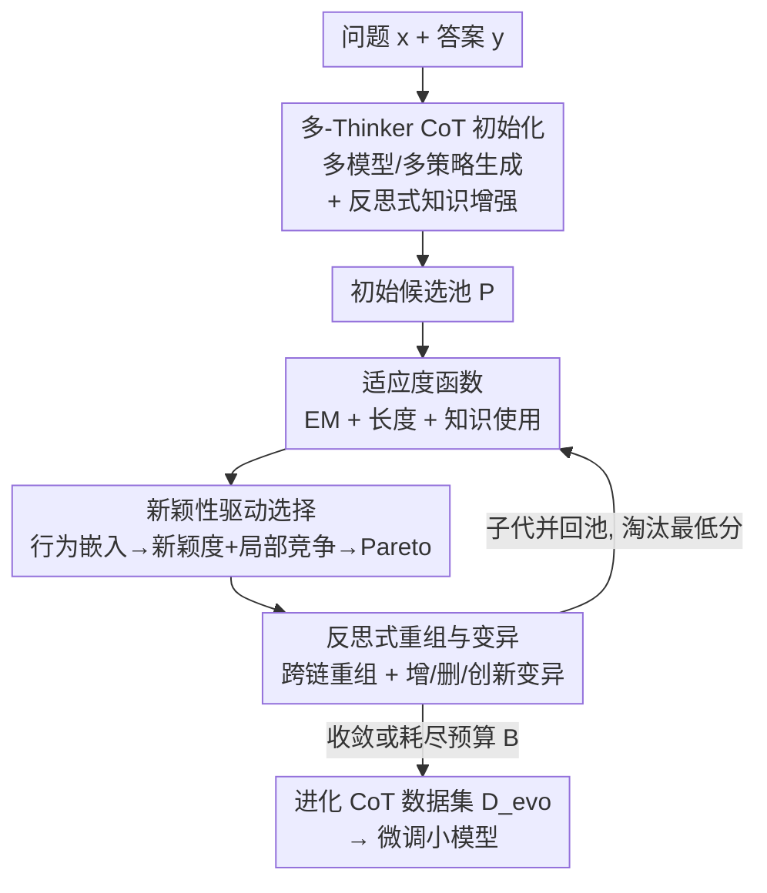

# CoT-Evo: Evolutionary Distillation of Chain-of-Thought for Scientific Reasoning

**会议**: ICLR2026  
**OpenReview**: [https://openreview.net/forum?id=OMf3w00d95](https://openreview.net/forum?id=OMf3w00d95)  
**代码**: https://github.com/weiji-Feng/MAD-Eval  
**领域**: LLM推理  
**关键词**: 思维链蒸馏, 科学推理, 进化算法, 新颖性搜索, 数据合成

## 一句话总结
CoT-Evo 把"多教师思维链蒸馏"重写成一套遗传算法：先用多个 LLM thinker 加检索知识造出一池子推理轨迹，再用"答案对不对 + 长度合不合适 + 知识用得对不对"的适应度函数打分，靠新颖性驱动选择挑出多样且优质的父代，最后用反思式重组和变异把它们融合改写成一条高质量链，用进化出的数据集微调 7-8B 小模型，在化学/生物两个科学推理 benchmark 上拿到 SOTA。

## 研究背景与动机
**领域现状**：从 DeepSeek-R1、OpenAI-o1/o3 这类强推理模型蒸馏长思维链（CoT）到小模型，已经是在算力受限下提升推理能力的标准套路。现有优化分两条线：一条是单教师内部优化（压缩 token 长度、剪掉错误步骤），另一条是多教师聚合（从不同教师或不同 prompt 范式收集多条路径，每个样本选最合适的一条）。

**现有痛点**：到了科学领域，连最强的 LLM 都常常生成错误或浮于表面的推理——分子设计、实验方案这类任务复杂度高、专业知识密集。直接蒸馏这些有缺陷的输出，得到的就是低质量训练数据，小模型自然学不好。而现有两条优化线都不够：单教师优化会引入偏置，且光剪冗余/错误步骤并不能保证核心推理里的知识用得对；多教师虽然增加了多样性，却**只能在多条链里选一条**，没法在细粒度上修内部逻辑。

**核心矛盾**：现有方法本质都是"链间选择"（inter-chain selection）——每个样本最多挑一条现成的链。但科学推理里一条链往往这里对、那里错，单条链里没有一条是完美的；真正需要的是把多条链里各自正确的片段和知识**揉进同一条链**，这是"链内聚合"（intra-chain aggregation），现有框架做不到。

**本文目标**：在科学推理场景下，从一堆"又多样又会犯错"的 LLM 教师里，合成出既准确又紧凑、知识用得对的高保真 CoT 数据集。

**切入角度**：作者把 CoT 蒸馏类比成进化优化——一池子候选轨迹就是种群，好坏由适应度函数评判，靠选择+重组+变异迭代逼近最优。遗传算法天然适合"在解空间里融合不同个体的优点"，正好对上"链内聚合"的需求。

**核心 idea**：提出 **CoT-Evo**，第一个面向链内多轨迹聚合的进化式 CoT 蒸馏框架——用"评估→选择→变异→更新"的进化循环，把多个 thinker 的推理片段融合改写成单条高质量链。

## 方法详解

### 整体框架
CoT-Evo 接收一个无 CoT 的原始数据集 $D_{ori}=\{(x_i,y_i)\}_{i=1}^N$，目标是给每个问题 $x_i$ 产出一条高保真、紧凑的思维链 $t_i^\star$ 用于下游训练。它沿用遗传算法的骨架，由四个核心模块组成，串成一个迭代进化循环：

1. **多 thinker 初始化**先造出一个既多样又有潜力的候选池 $P=\{t_1,\dots,t_n\}$；
2. **适应度函数**给每条轨迹打一个综合分（对不对 + 长不长合适 + 知识用得对不对）；
3. **新颖性驱动选择**不贪心挑高分，而是按"多样性 + 局部优越"挑一组父代；
4. **反思式重组与变异**把父代融合/改写成更优的子代。

子代并回种群、淘汰最低分者维持种群规模 $n_{pop}$，进入下一代评估，直到收敛或耗尽预算 $B$，最后每个问题取池中适应度最高者 $t_i^\star=\arg\max_{t\in P_{x_i}}R(t)$ 组成进化数据集 $D_{evo}$。

### 关键设计

**1. 多-Thinker CoT 初始化：用异质教师 + 自动检索知识撑开候选池**

进化算法成败的第一步在初始种群够不够"既多样又有潜力"。CoT-Evo 用两阶段构池。第一阶段 **CoT 生成**：集合一组 thinker $L=\{l_1,\dots,l_m\}$，既包含不同家族/规模的推理模型（DeepSeek-R1、Qwen3-235B-A22B、Qwen3-32B），也包含同一指令模型套不同 prompt 策略（思维链、思维树、逆向推理），对每个问题各生成一条轨迹 $t_i=l_i(x)$，得到 $P_G$。第二阶段 **知识增强**：科学任务光靠模型内部知识不够，于是用一个高级专有模型 $\Theta$ 对每个 QA 对做"从答案 $y$ 反推解题所需知识"的反思推理，抽象成与上下文无关的通用知识片段 $K_x$；再随机选一部分 thinker，把 $K_x$ 当额外上下文喂进去，生成知识增强轨迹 $t_j=l_j(x,K_x)$，得到 $P_K$。最终初始池 $P=P_G\cup P_K$ 同时最大化认知难度和策略多样性，覆盖更广的解空间。这一步直接对应痛点：单教师有偏、内部知识不足，所以一开始就要异质教师 + 外部知识双重撑开。

**2. 适应度函数：把"科学推理对不对"拆成可计算的三维打分**

进化需要一个能区分好坏的标尺，但科学推理的"好"不只是答案对。CoT-Evo 的适应度由三部分加权组成 $R(t)=s_{EM}+\lambda_1 s_{LEN}+\lambda_2 s_{KNOW}$。**Exact Match** $s_{EM}\in\{0,1\}$ 用任务专用脚本判最终答案是否精确命中真值，是硬约束。**长度适当性** $s_{LEN}$ 从科学推理数据集统计 token 长度的 15%/85% 分位作上下界：短于 15% 分位常漏关键知识记 0.0，长于 85% 分位往往啰嗦记 0.5，区间内记 1.0——鼓励简洁但不欠解释。**知识使用正确性** $s_{KNOW}$ 用 LLM-as-a-Judge，给定参考知识 $K_x$ 和链 $t$，对核心思路里知识用得准不准打 1-5 的类别分。论文设 $\lambda_1=0.3,\lambda_2=0.1$，意味着答案正确权重最高，其次是知识使用，长度只做轻微调节。这个三维标尺是后面所有选择/变异的依据，专门针对"光剪步骤保证不了知识用得对"这个科学领域痛点。

**3. 新颖性驱动选择：不贪心挑高分，用 Pareto 同时奖励"够不一样"和"局部更优"**

如果每代只贪心选适应度最高的几条，种群会过早收敛到一小撮相似 CoT，丧失进化所需的多样性。CoT-Evo 借鉴 NSLC（Novelty Search with Local Competition）做双目标选择。先用 Qwen3-Embedding-8B 把每条链映射进 $d$ 维行为空间 $z_t=b(t)$。**新颖度** $N(t)=\frac{1}{k}\sum_{t'\in N_k(t)}\lVert z_t-z_{t'}\rVert_2$ 衡量它到 $k$ 近邻的平均距离，越大代表推理风格越独特。**局部竞争分** $L(t)=\frac{1}{k}\sum_{t'\in N_k(t)}(R(t)-R(t'))_+$ 衡量它相对同行为区邻居的适应度优势，奖励"在自己这一片里更强"。把 $(N(t),L(t))$ 当二维性能向量，求 Pareto 前沿 $F_t$（没有任何 $t'$ 在两维上都不差且至少一维严格更优地支配它），再从前沿按概率 $p(t)=\frac{L(t)+\varepsilon}{\sum_{t'\in F_t}(L(t')+\varepsilon)}$ 采样父代，$\varepsilon$ 保证数值稳定并略偏向局部表现更好者。这样既不会塌成一种风格，又持续往高质量推。实验里它比贪心/随机选择收敛更快更稳，且 $B=5$ 预算还远没到饱和点。

**4. 反思式重组与变异：跨链搬运正确片段、定向修错，把"链间选择"升级成"链内聚合"**

这是 CoT-Evo 区别于一切多教师选择法的核心算子——真正把多条链揉进一条。**重组**只在目标链 $t_o$ 答案错（$s_{EM}(t_o)=0$）时触发，且与标准遗传算法不同，是"单目标链 + 策略提供者 $t_p$"的非对称交叉：第一步用过渡关键词把 $t_p$ 切成若干 thought，由重组器 $C_r$（默认就是产出 $t_o$ 的那个模型 $l_o$）选最后一个合理 thought 的终点作为绑定点 $B$；第二步抽出 $t_p$ 中 $t_o$ 没有的独特步骤和知识 $I$，让 $C_r$ 在前缀 $t_o[:B]$ 基础上条件生成新链 $t'=t_o[:B]+C_r(t_o[:B],I)$。由于当前推理模型指令遵循能力有限，作者还在 $C_r$ 的 `<think>` 标记后显式插入引导语，告诉它"会通过 `<info></info>` 收到外部信息、收到后应切换到新思路去验证并使用"。**变异**则改 $t_o$ 自身的策略/逻辑/表达，分三种：加法变异 $t'_{(a)}=Mu(t_o,\text{Add})$ 补充逻辑细节和领域知识；删法变异 $t'_{(d)}=Mu(t_o,\text{Delete})$ 剪冗余和无效探索；创新变异 $t'_{(c)}=Mu(Mu(t_o,\text{Innovate}),\text{Delete})$ 先借正确答案 $y$ 诊断 $t_o$ 的逻辑错误、再生成一条规避这些错误的新链最后去冗余。消融显示重组主要提升轨迹多样性和知识利用，变异主要纠错降冗、加快收敛——两者缺一都明显掉点。

### 损失函数 / 训练策略
进化本身不涉及梯度，产出的是数据集 $D_{evo}=\{(x_i,t_i^\star,y_i)\}$。下游用标准 SFT 把这套进化 CoT 蒸馏进 Qwen3-8B、Qwen2.5-7B-Instruct、Llama3.1-8B-Instruct 三个开源小模型。进化超参：thinker 含 Qwen3-32B-think / DeepSeek-R1 / Qwen3-235B-A22B-think 加 Llama4-Scout 的三种 prompt 策略，知识片段用 GPT-5-mini 生成；$\lambda_1=0.3,\lambda_2=0.1$；种群 $n_{pop}=6$、预算 $B=5$ 代、$k=2$ 近邻，每代采 3 个父代，故每个问题理论上最多产 $6+3\times5=21$ 条 CoT。

## 实验关键数据

### 主实验
两个科学推理 benchmark：BioProBench（生物实验方案，PQA/ORD/ERR 三任务）和 ChemCoTBench（化学，分子理解/编辑/反应预测/优化四任务）。对比单教师（ST）、多教师（MT）、Best-of-K（BoK）、Retro-Search、TwT 等蒸馏基线。下表摘取 Qwen3-8B 学生在代表性指标上的对比：

| 学生模型 (Qwen3-8B) 方法 | BioProBench PQA Acc↑ | BioProBench ORD EM↑ | ChemCoT Edit Acc↑ | ChemCoT Reaction FTS↑ |
|--------|--------|--------|--------|--------|
| 基座 (Qwen3-8B-think) | 0.602 | 0.371 | 0.612 | 0.352 |
| + Single Teacher | 0.601 | 0.368 | 0.583 | 0.599 |
| + Multi Teacher | 0.603 | 0.434 | 0.647 | 0.424 |
| + Best-of-K | 0.603 | 0.369 | 0.651 | 0.516 |
| **+ CoT-Evo** | **0.649** | **0.544** | **0.674** | **0.629** |

整体上 CoT-Evo 在 BioProBench 相对 ST 提升 12.6%、相对 MT 提升 8.4%，在 ChemCoTBench 分别达 27.0% 和 19.3%，并超过 Retro-Search、TwT 等强基线，部分任务甚至逼平作为上界的教师模型本身。

### 数据质量与利用率
作者另用 GPT-5 当裁判从知识多样性/准确性、推理多样性、逻辑连贯、步骤冗余五维评分，并做成对胜率：

| 方法 | BioPro Pass↑ | BioPro Quality↑ | BioPro WR↑ | Chem Pass↑ | Chem Quality↑ |
|------|------|------|------|------|------|
| MT | 0.536 | 6.776 | 0.374 | 0.524 | 5.935 |
| BoK | 0.498 | 6.763 | 0.353 | 0.389 | 5.571 |
| Retro | 0.446 | 7.024 | 0.362 | 0.413 | 5.857 |
| **CoT-Evo** | **0.729** | **8.230** | — | **0.704** | **7.847** |

CoT-Evo 保持 70%+ 可用数据、质量分明显领先，最强基线对它的胜率也不到 40%——说明增益来自"更好的数据"而非"更多数据"。

### 消融实验

| 配置 | Qwen3-8B | Qwen2.5-7B | Llama3.1-8B | 说明 |
|------|---------|---------|---------|------|
| CoT-Evo (Full) | 0.612 | 0.579 | 0.572 | 完整模型 |
| w/o Recombination | 0.591 | 0.564 | 0.553 | 去重组，多样性/知识利用下降 |
| w/o Mutation | 0.568 | 0.548 | 0.534 | 去变异，纠错降冗失效、收敛受阻，掉得更多 |

### 关键发现
- **变异比重组更关键**：去掉变异（纠错+降冗）三个学生掉得都比去重组多，因为缺了纠错会让可用的正确 CoT 变少、进化难收敛。
- **新颖性选择 > 贪心/随机**：贪心几代内就饱和并陷局部最优，随机进步慢而稳，新颖性驱动选择收敛最快最稳；且 $B=5$ 还没到饱和点，加预算仍有空间。
- **增益不是采样多带来的**：CoT-Evo 显著超过同样采 21 条再选最优的 Best-of-K，证明是"进化出更高质量"而非"暴力扩样本"。
- **超参可扩展性**：迭代预算 $B\le3$ 时收益明显、之后趋平；种群规模增大也带来稳定提升。

## 亮点与洞察
- **把 CoT 蒸馏从"选一条链"升级成"造一条链"**：现有多教师方法本质都是 inter-chain selection，CoT-Evo 用重组算子做 intra-chain aggregation，把多条链里各自正确的片段融进同一条，这是真正的范式差别，也是它能逼平甚至超过教师的原因。
- **新颖性 + 局部竞争的双目标选择很值得迁移**：在任何"会过早收敛到单一模式"的数据合成/拒绝采样场景里，把"够不一样"和"局部更优"当 Pareto 双目标，都能避免多样性塌缩——比单纯按质量分贪心鲁棒。
- **反思式知识增强是个低成本好 trick**：从答案反推所需知识、抽象成上下文无关片段再回灌，等于给每个样本配了一份"标准答案要点"，对专业领域纠错特别有效。
- **针对推理模型指令遵循弱的工程补丁很实在**：在 `<think>` 后插入 `<info>` 引导语，提醒模型"收到外部信息要切换思路去验证使用"，是把进化算子落到现有 reasoning LLM 上的关键细节。

## 局限与展望
- **依赖多个强教师 + 专有模型**：初始化要 DeepSeek-R1、Qwen3-235B 等大模型，知识片段靠 GPT-5-mini，适应度的知识使用又靠 LLM-as-a-Judge，整条管线对外部强模型依赖重、成本不低。
- **进化开销随种群/预算线性涨**：每个问题理论上最多 21 条 CoT，进化循环的评估和变异都要反复调用大模型，规模化到百万级训练样本时算力是现实瓶颈。
- **只验证了化学/生物两域**：科学推理覆盖面广，数学证明、物理建模等是否同样有效未知；适应度里的 Exact Match 依赖任务专用脚本，开放式科学问答未必能直接套用。
- **适应度权重和长度分位是经验设定**：$\lambda_1=0.3,\lambda_2=0.1$ 与 15%/85% 分位都靠手调，换数据集/任务可能需重新校准，论文未给自动化方案。

## 相关工作与启发
- **vs 单教师内部优化 (压缩 token / 剪错误步骤, Wang/Luo 2025)**：他们在一个教师的一条链内部做剪裁，本文用异质多教师且做链间融合；区别在于单教师无法补足缺失知识、也会带教师偏置，CoT-Evo 靠重组从别的链搬正确片段进来。
- **vs 多教师选择 (Multi Teacher / TwT, Xu 2025)**：他们每个样本从多条链里选一条最优，本文做 intra-chain aggregation 把多条揉成一条；优势是能合成出比任何单条原始链都更准、更紧凑的 CoT，劣势是进化循环计算开销更大。
- **vs Best-of-K / Retro-Search (Lu 2025)**：BoK 暴力采样选最优、Retro 用 MCTS 回溯探索教师轨迹的替代续写，都仍在"已有轨迹里挑/改"，本文用进化的选择+重组+变异主动生成新轨迹，主实验显示增益超过单纯扩大采样预算。

## 评分
- 新颖性: ⭐⭐⭐⭐⭐ 首个把 CoT 蒸馏形式化为遗传算法、用重组实现链内多轨迹聚合，范式上确有突破。
- 实验充分度: ⭐⭐⭐⭐ 两 benchmark × 三学生 × 多基线 + 数据质量/选择策略/消融/超参扫描齐全，但仅化学+生物两域。
- 写作质量: ⭐⭐⭐⭐ 框架与四模块叙述清晰、公式完整，图 1 把进化循环讲得直观。
- 价值: ⭐⭐⭐⭐⭐ 提供了一条从"多样且会犯错的 LLM"合成高保真科学推理数据的可扩展路径，对科学 LLM 训练实用性强。

<!-- RELATED:START -->

## 相关论文

- [\[ICLR 2026\] Uni-CoT: Towards Unified Chain-of-Thought Reasoning Across Text and Vision](uni-cot_towards_unified_chain-of-thought_reasoning_across_text_and_vision.md)
- [\[ICLR 2026\] SIM-CoT: Supervised Implicit Chain-of-Thought](sim-cot_supervised_implicit_chain-of-thought.md)
- [\[ICLR 2026\] CoT-RVS: Zero-Shot Chain-of-Thought Reasoning Segmentation for Videos](cot-rvs_zero-shot_chain-of-thought_reasoning_segmentation_for_videos.md)
- [\[ICLR 2026\] SCI-Verifier: Scientific Verifier with Thinking](sci-verifier_scientific_verifier_with_thinking.md)
- [\[ICLR 2026\] KaVa: Latent Reasoning via Compressed KV-Cache Distillation](kava_latent_reasoning_via_compressed_kv-cache_distillation.md)

<!-- RELATED:END -->
