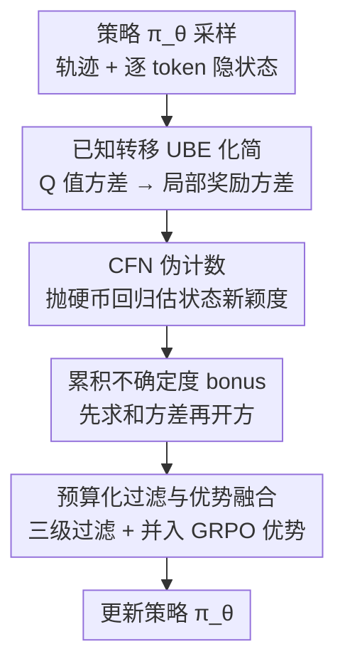

# Count Counts: Motivating Exploration in LLM Reasoning with Count-based Intrinsic Rewards

**会议**: ICLR2026  
**OpenReview**: [https://openreview.net/forum?id=9xIBbfItGP](https://openreview.net/forum?id=9xIBbfItGP)  
**代码**: https://github.com/dd88s87/MERCI  
**领域**: 强化学习 / LLM 推理  
**关键词**: 内在奖励, 基于计数的探索, 不确定性贝尔曼方程, GRPO, LLM 推理

## 一句话总结
针对 GRPO/DAPO 这类无价值函数 RL 在 LLM 推理上"探索不足、过早收敛到重复套路"的问题，MERCI 利用 LLM 生成过程"转移已知且确定"这一性质把不确定性贝尔曼方程化简成只需估计局部奖励方差，再用一个轻量"抛硬币网络"（CFN）估计状态新颖度并转成内在奖励，让策略探索更多样、更连贯的推理路径，在数学和 SQL 基准上稳定超过强基线。

## 研究背景与动机

**领域现状**：用 RL 强化 LLM 多步推理已成主流，尤其是 GRPO、DAPO 这类抛弃了显式价值网络、靠"组内相对奖励"做优势估计的 value-free 方法。它们训练高效，但奖励是稀疏的——只有走完一长串推理链、给出最终答案后才有一个 0/1 的结果奖励。

**现有痛点**：稀疏奖励让探索变成核心难题。现有做法基本靠**熵正则**来鼓励策略多样性，但熵正则只在 token 级别注入"无方向的局部噪声"，无法在整条推理轨迹的长程上提供"有方向、时序一致"的探索信号。结果就是策略容易陷入重复、次优的推理套路，过早收敛。

**核心矛盾**：RL 里经典的"深度探索"方法（伪计数、Bootstrapped DQN、RND、ICM、基于不确定性贝尔曼方程 UBE 的方法）本可以提供有方向的探索，但它们**估计认知不确定性的代价无法扩展到 LLM**：深度集成要训多个模型、太贵；MC dropout 推理开销大；密度型伪计数依赖归一化概率、无法高效批处理；好奇心方法没有"探索奖励该如何衰减"的理论保证；UBE 本身原则性强，但它要估计"局部不确定性"——这恰恰是出了名难、常被启发式糊弄过去的一环。经典不确定性量化与 LLM 的规模之间存在根本性的不匹配。

**切入角度**：作者抓住一个对"自包含"推理任务（如数学解题，模型不与外部随机世界交互）成立的关键观察——自回归生成的底层 MDP **转移函数是已知且确定的**：在状态 $s$（已生成的 token 序列）选动作 $a$（下一个 token），下一状态必然是 $s'=(s,a)$，毫无歧义。UBE 本要同时传播奖励估计 $\hat r$ 和转移估计 $\hat P$ 两个来源的不确定性，而转移已知时 $\hat P$ 的认知不确定性为零，于是 UBE 退化成"沿轨迹累加局部奖励不确定性"这一件简单的事。

**核心 idea**：用"已知转移"把估计 Q 值方差这个棘手问题降维成估计局部奖励方差，再用一个可扩展的抛硬币伪计数网络（CFN）把"状态新颖度"代理成奖励不确定性，转成内在奖励 bonus 接进 GRPO，引导策略去探索新颖的推理轨迹。作者把这套方法命名为 MERCI。

## 方法详解

### 整体框架

MERCI 要解决的是"如何为 LLM 推理设计有原则的探索"。它的运行依赖**两个并行的 LLM**：一个是被 RL 更新的**策略网络** $\pi_\theta$（从 SFT 检查点 $\pi_0$ 初始化），负责生成推理轨迹；另一个是**CFN 网络**（同样从 $\pi_0$ 初始化的 LLM 实例，在最后一层隐状态上挂一个轻量 MLP 头 $f_\phi$），唯一职责是估计认知不确定性。

一个训练步的数据流是：策略 $\pi_\theta$ 先 rollout 出一条推理轨迹 $\tau$；轨迹里每个 token 位置的上下文隐表示 $s_{hidden}$ 被当作"状态"喂给 CFN 头，估出该状态的**局部奖励方差** $\mathbb{V}[\hat r(s)]=\frac{1}{d}\lVert f_\phi(s)\rVert^2$；接着按"先把各步方差求和、再开平方"的方式聚合成整条轨迹的探索 bonus，经过三级过滤裁掉无用信号，最后在组内标准化、缩放后并入 GRPO 的优势项去更新策略。CFN 网络则用监督回归目标与策略协同训练。

### 关键设计

**1. 已知转移下的 UBE 化简：把估 Q 值方差降成估局部奖励方差**

这是全文的理论基石，也是它和"纯启发式探索"拉开差距的地方。UBE 原本要把认知不确定性（后验 Q 值分布的方差）沿时间传播，涉及奖励估计 $\hat r$ 和转移估计 $\hat P$ 两个来源。作者指出 LLM 推理的 MDP 转移是一个已知的 delta 函数（$s'=(s,a)$ 确定），于是后验贝尔曼方程里直接用真实 $P$ 而非其后验 $\hat P$。对其应用全方差定律，得到 Proposition 1——已知转移下的不确定性贝尔曼方程：

$$U^h(s,a)\le \mathbb{V}_t[\hat r^h(s)]+\sum_{s',a'}\pi^h_{s',a'}P^h_{s'sa}\,U^{h+1}(s',a'),$$

其中 $U^h(s,a)\triangleq\mathbb{V}_t[\hat Q^{\pi,h}(s,a)]$ 是 Q 值后验方差，$s'$ 是从 $(s,a)$ 唯一到达的下一状态，$U^{H+1}(\cdot)=0$。这个递归说明：一个状态-动作对的不确定性，被"即时奖励不确定性 + 唯一后继状态的期望不确定性"所界定。这就把"估 Q 值方差"这个棘手问题重写成了"估局部奖励方差 $\mathbb{V}_t[\hat r^h(s)]$"这件可操作的事。有了 $U^h(s,a)$，就能仿照 UCB 把优化目标改成 $Q^{\pi,h}(s,a)+\alpha\sqrt{U^h(s,a)}$ 来鼓励探索，并享有低 regret 的理论保证。再由标准集中不等式，奖励均值估计的不确定性与状态访问次数成反比，$\mathbb{V}_t[\hat r^h(s)]\propto 1/N(s)$——问题进一步落到"如何在语言这个高维状态空间里数 $N(s)$"。

**2. CFN 伪计数：用抛硬币回归把状态新颖度变成奖励方差**

语言空间里精确数访问次数几乎不可能（同一状态极少重复），所以需要一个能"泛化计数"的可扩展估计器。作者采用 Coin Flip Network（CFN）：每次访问状态 $s_i$，就采一个 $d$ 维随机标签 $c_i\sim\{-1,1\}^d$（一组抛硬币结果），训练 MLP 头 $f_\phi$ 用 MSE 回归这些标签：

$$f^*_\phi(s)=\arg\min_\phi\sum_{i=1}^{|\mathcal{D}_{cfn}|}\lVert c_i-f_\phi(s_i)\rVert^2.$$

由于同一状态在数据集里会被配上不同的随机向量，网络学不到完美映射，只能输出该状态所有标签的均值 $f^*_\phi(s)=\frac{1}{n}\sum_{i=1}^n c_i$。利用 Rademacher 分布样本均值的二阶矩 $\mathbb{E}[z_n^2]=1/n$，并通过同时抛 $d$ 枚硬币把方差降低 $1/d$，就得到伪计数估计 $\frac{1}{d}\lVert f_\phi(s)\rVert^2\approx\frac{1}{N(s)}$。把它接到设计 1 的结论上，正好给出局部奖励方差 $\mathbb{V}[\hat r(s)]=\frac{1}{d}\lVert f_\phi(s)\rVert^2$。这里的"状态"取的是 LLM 主干在该 token 位置输出的上下文隐表示 $s_{hidden}$，它天然编码了整段前缀。这套方法相比密度型伪计数最大的好处是"只需解一个监督回归"，可批处理、开销极小，且实验显示它对未见但相似的状态有良好泛化（在数学上训练的 CFN 直接用到 SQL 也估得合理）。

**3. 累积不确定度 bonus：先把各步方差求和、再开方，而不是把标准差求和**

这是一个看似细节、实则关键的算法点，直接源自 Proposition 1。要算一条轨迹价值的不确定性，正确做法是**先把每一步的局部奖励方差累加，再对总和开平方**——得到的是累积 Q 值后验的标准差，这才是真正的内在奖励。很多 RL 探索算法用的是另一种"理论上有缺陷"的启发式：每步算一个正比于局部标准差的 bonus，再把这些 bonus 直接加起来（等价于"对标准差求和"）。作者用一个清晰的例子点破区别：horizon 为 $H$、每步局部方差 $\sigma^2=1$ 时，正确 bonus 是 $\sqrt{\sum_{h=1}^H 1}=\sqrt{H}$，而启发式 bonus 是 $\sum_{h=1}^H\sqrt{1}=H$。后者在长程上会**系统性高估**不确定性，让 agent 过度乐观、在"长但不一定有希望"的路径上做无效探索。MERCI 严格遵循前者，保证探索信号反映真实的累积认知不确定性。

**4. 预算化 bonus 过滤与优势融合：让稠密的探索奖励既有用又不喧宾夺主**

非稀疏的探索 bonus 一旦变得无差别地稠密，会引诱 LLM 为了刷 bonus 做漫无目的的探索，带来不稳定。作者因此施加"预算化探索"，用三级过滤约束 bonus 在哪里、以多大力度起作用：**Percentile filtering** 每个样本内只保留 bonus 最强的固定比例 token（如 top 50%），自动跟随训练中 bonus 幅度的整体衰减、无需手动重调；**Spatial coherence filtering** 只保留 bonus 持续偏高的连续 token 簇，丢掉孤立的尖峰（哪怕数值很大），让更新更平稳；**Noise-suppression filtering** 移除挂在"与解题无关内容"上的激励，例如纯数学推理任务里 rollout 出来的无用 Python 代码、无意义重复、为骗 bonus 而生的罕见字符。过滤后，把保留 token 索引集合 $I$ 上的平方 CFN 输出取均值再开方，得到归一化 bonus

$$B=\sqrt{\frac{1}{l}\sum_{i\in I}\Big(\frac{1}{d}\lVert f_\phi(s^i_{hidden})\rVert^2\Big)}.$$

为了让同一 prompt 下不同轨迹可比，再在大小为 $G$ 的组内做标准化并截断负值，只保留正向探索激励 $\hat A^i_{exploration}=\max\!\big(0,\frac{B_i-\mu}{\sigma}\big)$。最后用探索系数 $\gamma$ 缩放后并入基础优势 $\hat A^i_{old}$，并用裁剪因子 $\alpha\in(0,1)$ 封顶，防止内在项淹没结果奖励：

$$\hat A^i_{new}=\begin{cases}\min\!\big(\hat A^i_{old}+\gamma\hat A^i_{exploration},\,(1+\alpha)\hat A^i_{old}\big),&\hat A^i_{old}\ge 0;\\[2pt]\min\!\big(\hat A^i_{old}+\gamma\hat A^i_{exploration},\,(1-\alpha)\hat A^i_{old}\big),&\hat A^i_{old}<0.\end{cases}$$

这样整套 bonus 控制就把一份"受控的探索预算"分配到真正有用的地方，既保住有效探索，又守住主奖励信号。

### 损失函数 / 训练策略
CFN 头用式 (1) 的 MSE 监督回归目标训练。整套流程分两段：先用主干模型在训练集上的 rollout 对 CFN 做**预训练**，让它先对"哪些状态更罕见"有基本认识；进入 RL 阶段后，CFN 从预训练权重初始化，并与策略模型**协同训练**。策略侧仍用原 GRPO/DAPO 目标，只是优势项替换为融合了探索 bonus 的 $\hat A^i_{new}$。CFN 维度 $d=20$（直观上即"抛了 20 次硬币"），$\gamma$ 用 cosine 调度。

## 实验关键数据

### 主实验

数学推理用 Qwen2.5-Math-7B 为主干、DAPO-17K 为训练集，在 AIME24/25、MATH500、OlympiadBench、College Math、Minerva 上评测；SQL 生成用 Llama-3.1-8B-Instruct、Bird 训练、在 Bird（域内）与 Spider（域外）测试。基线含 vanilla GRPO/DAPO、熵优势整形（Entropy Adv.）、基于 RND 的内在奖励（iMentor）。

数学推理平均分（MERCI 一致领先）：

| 配置 | pass@k 平均 | mean@k 平均 |
|------|------------|------------|
| GRPO | 65.8 | 40.5 |
| GRPO w/ Entropy Adv. | 65.9 | 41.2 |
| GRPO w/ iMentor | 66.4 | 40.9 |
| **GRPO w/ MERCI** | **67.4** | **42.2** |
| DAPO | 66.9 | 42.2 |
| DAPO w/ Entropy Adv. | 67.9 | 43.2 |
| DAPO w/ iMentor | 67.3 | 44.1 |
| **DAPO w/ MERCI** | **69.0** | **44.9** |

增益在最难的 AIME 套件上最明显（如 GRPO 的 AIME24 pass@256 76.7→80.0、mean@256 28.7→29.6），mean@k 的一致提升说明整体样本质量更稳更好，而非只刷高最佳个例。

SQL 生成（greedy / pass@8 / pass@16，节选）：

| 配置 | Bird 域内 greedy | Spider 域外 greedy | Spider pass@16 |
|------|------|------|------|
| GRPO | 60.7 | 74.7 | 82.9 |
| **GRPO w/ MERCI** | **63.0** | **78.0** | **85.6** |
| DAPO | 63.2 | 76.8 | 87.2 |
| **DAPO w/ MERCI** | **64.1** | 77.3 | **88.5** |

MERCI 在**域外 Spider 上增益更大**，说明它推动模型用更通用、更可迁移的 SQL 模式，而非过拟合训练 schema。

### 消融实验

| 配置 | 说明与影响 |
|------|-----------|
| Full MERCI | 完整方法，pass@k / mean@k 均最优 |
| w/o bonus 过滤 | 去掉三级过滤，bonus 无差别变稠密，训练不稳、被确认是成功的关键组件 |
| sum-of-std 替代 sum-of-variance | 用启发式"标准差求和"代替"先求和方差再开方"，长程上高估不确定性、探索低效（消融 G.2.4 验证） |
| 归一化轨迹聚合不确定度 | 被确认为方法成功的基础组件之一 |

### 关键发现
- **CFN 的高 bonus 确实落在"新颖"位置**：可视化显示被 CFN 赋予高不确定性的 token 多对应新颖推理路径、Python 代码及其输出、或专门的数学术语，印证"越新颖的位置认知不确定性越高"的假设。
- **CFN 有跨任务泛化**：在数学上训练的 CFN 直接估 SQL 响应的不确定性也合理；对"语言相近但不完全相同"的轨迹能捕捉语义相似性、给出相近估计；其 bonus 是非冗余信号，能有效度量策略的认知缺口。
- **探索更"聪明"而非更"啰嗦"**：MERCI 把概率质量集中到更多样但更可靠的好解上，用更短、更聚焦的推理表达，抑制无意义的链条拉长，提升样本效率、降低错误相关性，并增加高阶推理步骤的占比。

## 亮点与洞察
- **"LLM 是它自己完美已知的世界模型"这一观察很漂亮**：把"自回归转移确定"这个人人知道的事实，接到 UBE 上就把不可扩展的 Q 值方差估计降维成局部奖励方差估计，是把经典 model-aware RL 理论和通常 model-free 的 LLM RL 桥接起来的关键一跳。
- **sum-of-variance vs sum-of-std 的纠偏值得记住**：很多探索算法默认"每步 bonus 相加"，但正确做法是先累加方差再开方，否则长 horizon 系统性高估、诱发无效探索——这是可迁移到任何序列级内在奖励设计的 trick。
- **CFN 把"数状态"变成"解一个监督回归"**：抛硬币标签 + 二阶矩 $\mathbb{E}[z_n^2]=1/n$ 的技巧让伪计数可批处理、开销极小、还能与策略并行训练，对大规模系统很友好。
- **三级 bonus 过滤是工程上的清醒之处**：直面"稠密内在奖励会被模型钻空子刷分"的现实，用 percentile / 空间连贯 / 噪声抑制三道闸把探索预算花在刀刃上。

## 局限与展望
- **核心假设限定在"自包含、转移确定"的任务**：UBE 化简成立的前提是 LLM 无外部随机世界，适用于数学、SQL 这类自包含推理；一旦涉及工具调用、检索、与随机环境交互，转移不再确定，$\hat P$ 的不确定性不为零，理论基础需要重做。
- **引入了额外的 CFN 网络与多个超参**：虽然 CFN 头轻量、可并行，但仍需维护第二个 LLM 实例，且 $\gamma$ cosine 调度、Top-$p\%$ 过滤比例、维度 $d$、裁剪因子 $\alpha$ 等都需要调（论文把敏感性分析放在附录 G.2.5）。
- **绝对增益偏温和**：数学平均 pass@k 相对最强基线约 +1～2 点，部分单项（如 Minerva、MATH500）并非最优，提升主要集中在最难的 AIME；是否在更大模型/更广任务上持续受益仍待验证。
- **"状态=隐表示"的粒度选择缺乏更细致的对比**：把每个 token 位置的隐状态当状态是合理代理，但不同层、不同聚合方式对新颖度估计的影响未充分展开。

## 相关工作与启发
- **vs 熵正则探索（Entropy Adv. 等）**：熵正则在 token 级注入无方向噪声、缺乏"哪些状态更该探索"的判据，长程上力不从心；MERCI 用基于不确定性的有方向、时序一致信号引导探索，理论上有 UCB 式低 regret 保证。
- **vs 好奇心/RND 类内在奖励（iMentor 等）**：RND、ICM 等缺乏"探索 bonus 应如何衰减"的理论保证，且难以适配 LLM 的动态长度与巨大动作空间；MERCI 从已知转移化简 UBE，给出"如何把局部伪计数聚合成 sum-of-variance 轨迹 bonus"的原则性依据。
- **vs 密度型伪计数（Ostrovski 等）**：经典密度伪计数依赖归一化概率密度、资源密集且难批处理；MERCI 沿用 CFN（Lobel et al., 2023）的抛硬币回归路线，绕开密度模型，把计数变成可扩展的监督学习。
- **vs GRPO/DAPO 等 value-free RL**：它们高效但受限于外部稀疏奖励、探索不足；MERCI 把基于计数的内在动机无缝接进 GRPO 类框架，缓解过早收敛到重复次优解。

## 评分
- 新颖性: ⭐⭐⭐⭐⭐ 首个从"已知转移化简 UBE"出发为 LLM 推理推导深度探索算法，理论切口干净。
- 实验充分度: ⭐⭐⭐⭐ 覆盖数学+SQL、GRPO+DAPO、含探索类基线与消融，但绝对增益偏温和、部分单项非最优。
- 写作质量: ⭐⭐⭐⭐ 理论推导清晰、sum-of-variance 纠偏讲得透；部分实现细节散落附录。
- 价值: ⭐⭐⭐⭐ 给 LLM RL 探索提供了可扩展且有原则的内在奖励范式，trick 可迁移。

<!-- RELATED:START -->

## 相关论文

- [\[ICLR 2026\] Random Policy Valuation is Enough for LLM Reasoning with Verifiable Rewards](random_policy_valuation_is_enough_for_llm_reasoning_with_verifiable_rewards.md)
- [\[ICLR 2026\] Beyond Markovian: Reflective Exploration via Bayes-Adaptive RL for LLM Reasoning](beyond_markovian_reflective_exploration_via_bayes-adaptive_rl_for_llm_reasoning.md)
- [\[ICLR 2026\] Continuous Chain of Thought Enables Parallel Exploration and Reasoning](continuous_chain_of_thought_enables_parallel_exploration_and_reasoning.md)
- [\[ICLR 2026\] Agentic Reinforcement Learning with Implicit Step Rewards](agentic_reinforcement_learning_with_implicit_step_rewards.md)
- [\[ICLR 2026\] Attention as a Compass: Efficient Exploration for Process-Supervised RL in Reasoning Models](attention_as_a_compass_efficient_exploration_for_process-supervised_rl_in_reason.md)

<!-- RELATED:END -->
