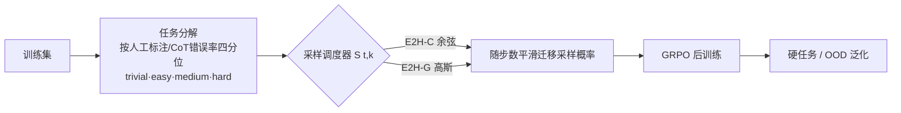

# Curriculum Reinforcement Learning from Easy to Hard Tasks Improves LLM Reasoning

**会议**: ICLR 2026  
**OpenReview**: [https://openreview.net/forum?id=KJvHnl3kUv](https://openreview.net/forum?id=KJvHnl3kUv)  
**代码**: [https://github.com/divelab/E2H-Reasoning](https://github.com/divelab/E2H-Reasoning)  
**领域**: LLM 推理 / 强化学习后训练  
**关键词**: 课程学习, 强化学习, GRPO, 推理, 任务调度, 采样策略  

## 一句话总结
提出 **E2H Reasoner**——把训练数据按难度分解为「平凡/简单/中等/困难」四档，再用一个概率调度器（余弦或高斯）从易到难逐步转移采样焦点，让小模型也能学会原本零样本根本做不出的硬推理任务，并配套给出了 CRL 的收敛性与样本复杂度理论保证。

## 研究背景与动机
- **领域现状**：DeepSeek-R1、OpenAI o1 等用 RL 后训练（GRPO 等）显著提升了 LLM 的数学/代码推理能力，RL 用基于答案正确性的稀疏奖励替代了 SFT 的模仿式监督。
- **现有痛点**：对于基模型零样本几乎做不出来的**本质困难任务**，单纯 RL 效果很差——奖励只在最终答案正确时给出，分布差距大导致正确样本极少、奖励信号极度稀疏，模型根本拿不到学习信号。
- **核心矛盾**：直接拟合单一困难目标分布既容易因奖励稀疏学不动，又容易过拟合记忆、损害泛化；而朴素课程学习（训完简单任务到固定步数后硬切到困难任务）又会带来**任务遗忘**和**简单任务过拟合（reward hacking）**两个新问题。
- **本文目标**：设计一个能平滑桥接「预训练分布 $d_0$ → 困难目标分布 $d_K$」的课程式 RL，既缓解奖励稀疏，又避免遗忘和过拟合，并从理论上证明它比直接学更省样本。
- **核心 idea**：**【任务分解 + 概率调度】** 把推理任务按难度切成多档作为中间分布，用一个随训练步平滑演化的采样概率函数控制「何时多看简单、何时切向困难」，关键洞察是——**简单任务初期重要，但必须通过合适的调度把它们"淡出"，否则会过拟合**。

## 方法详解

### 整体框架
E2H 把 LLM 推理建模为稀疏奖励 MDP（state 是 token 前缀，action 是词表，只有 `<answer>` 闭合且答案正确时给奖励），在 GRPO 之上加两层：先做**任务分解**，把训练集按人工难度标注（如 Blocksworld 的计划长度、Countdown 的运算数、MATH 的 level）或按基模型 CoT 错误率的四分位数自动分成 trivial/easy/medium/hard 四档；再用一个**采样调度器** $S(t,k)$ 在每个训练步 $t$ 给第 $k$ 档任务分配采样概率，随训练推进把焦点从易档平滑迁到难档。

### 关键设计

**1. 任务分解：把"奖励稀疏"拆成"分阶段的密集奖励"，点题是用难度梯度替代手工奖励塑形。** 困难推理任务（如 6 数 Countdown）需要算术、估距、回溯多种技能同时到位，逐步奖励塑形既任务专属又难以泛化。E2H 改为把目标分布 $d_K$ 与预训练分布 $d_0$ 之间插值出一串中间分布 $\{d_k\}_{k=1}^{K}$：2 数 Countdown 先练纯算术打基础，再逐步加到 6 数。这样每一档内部正确率不至于太低、奖励不至于太稀，模型先在易档习得"核心技能"再迁移到难档。Table 1 的消融直接验证了这点——只用 Hard 训练时 Blocksworld 各档全是 0.0，而加上 trivial+easy 后 trivial 档冲到 98.0、easy 到 100，且 OOD 也从 0.0 升到 2.6。

**2. 余弦调度 E2H-C：无参数地让易档"先高后低"。** 采样概率写作 $S_{\text{cosine}}(t,k)=\alpha_t\cdot(K-k-1)+(1-\alpha_t)\cdot k$，其中 $\alpha_t=0.5\cdot(1+\cos(\frac{\pi t}{T}))$，再归一化。直观上初始时按任务序号让最简单的档采样概率最高、最难的最低，训练末期则反转，中间用余弦函数平滑插值。它无超参、能同时缓解奖励稀疏与遗忘，在 MATH 这种各难度档基模型本就表现尚可的任务上很有效（Table 2 MATH 的 OOD 28.6 为该列最高）；但在 Blocksworld 这种硬档奖励极稀疏的任务上，余弦衰减太慢会过拟合简单档、硬档直接崩到 0.0。

**3. 高斯调度 E2H-G：用两个超参精细控制"淡出速度"，治本式防过拟合。** 借鉴高斯混合模型，假设各难度任务分布是等方差 $\sigma$、均值等间距 $\mu_k=k-1$ 的高斯，采样概率取当前位置 $x_t$ 落在各档高斯下的似然：$S_{\text{Gaussian}}(t,k)=\exp\!\big(-\frac{(x_t-\mu_k)^2}{2\sigma^2}\big)$，而采样位置 $x_t=(\frac{t}{T})^{\beta}(K-1)$。只有两个超参：$\sigma$ 控制采样集中度（越小越像传统课程学习），$\beta$ 控制 $x_t$ 的移动速度——当 $\beta<1$ 时早期在易档停留更短、在难档训练更久，正好**快速淡出 trivial/easy 以避免简单任务过拟合**，同时早期仍给足曝光启动学习。这正是 E2H-G 在稀疏奖励任务上全面胜出的原因（Table 3 Blocksworld Hard 32.9 vs CL 5.8、GRPO 21.1）。

**4. 收敛与样本复杂度保证：把课程学习放进 Approximate Policy Iteration 框架证明"更省样本"。** 作者把 CRL 建模为一串共享状态-动作空间、奖励/转移不同的 MDP $\{M_k\}$，在 API 框架下给出最终性能差界 $E_K\le\sum_k\big(\gamma^T\eta_k+\frac{2\gamma(1-\gamma^T)}{(1-\gamma)^2}\delta_k+\frac{2\gamma}{\beta(1-\gamma)^2}\big)+\sum_{k=1}^{K-1}\|Q_K^*-Q_k^*\|_{d_K}$，最后一项即"课程近似误差"，刻画中间课程最优值与最终最优值的累积偏差。进一步的有限样本分析（Theorem 3.2）证明：在几何误差/步长分配下，CRL 所需总样本数 $M_{\text{CRL}}<M_{\text{Direct}}$ 当且仅当 $\frac{(e\cdot l)^{2(1-K)}-1}{1-(e\cdot l)^2}<m-1$（如 $K=3,e\cdot l=1.4,m=1.8$ 可满足），从理论上支撑了"分阶段学比直接学更省样本"的经验观察。

## 实验关键数据

### 主实验表格
在 Qwen-1.5B / LLaMA-3.2-3B 上，跨 Blocksworld / Countdown / MATH 评测（每任务分 Trivial/Easy/Med/Hard/OOD），E2H-G 在硬档与 OOD 上几乎全面领先：

| 模型/方法 (Countdown) | Trivial | Easy | Med | Hard | OOD |
|---|---|---|---|---|---|
| Qwen-1.5B CoT | 16.0 | 5.6 | 1.7 | 0.1 | 0.1 |
| GRPO (All, 平衡) | 96.1 | 64.9 | 28.8 | 18.1 | 9.2 |
| GRPO (Hard 直接学) | 0.0 | 43.9 | 16.4 | 18.1 | 6.5 |
| CL (传统课程) | 57.7 | 85.8 | 57.2 | 31.5 | 12.6 |
| Self-Evolve | 96.6 | 65.3 | 34.2 | 17.8 | 9.5 |
| **E2H-G** | 97.9 | **87.2** | **70.4** | **41.0** | **19.2** |

GSM8K / AQuA（按错误率自动分档）上 E2H-G 平均分同样最高（GSM8K 78.7、AQuA 66.1，均超 GRPO 与 Self-Evolve）。

### 消融实验表格
任务分解（Table 1，Qwen-1.5B 平衡调度）显示「越全的难度梯度越好」：

| 训练档位组合 (Blocksworld) | Trivial | Easy | Med | Hard | OOD |
|---|---|---|---|---|---|
| 仅 Hard | 0.0 | 0.0 | 0.0 | 0.0 | 0.0 |
| Med+Hard | 2.0 | 0.0 | 0.0 | 0.0 | 0.0 |
| Easy+Med+Hard | 0.0 | 55.5 | 15.5 | 0.0 | 0.0 |
| **Trivial+Easy+Med+Hard** | 98.0 | 100 | 83.3 | 21.1 | 2.6 |

调度策略对比（Table 2）：E2H-G(0.25,0.75) 在 Blocksworld Hard 达 32.9，远超 CL 的 5.8 与 Balanced 的 26.3；不同 $(\beta,\sigma)$ 对结果影响显著，需按任务稀疏程度调。另外 E2H 与 DAPO 组合（Table 5）仍有一致增益，说明它与具体 RL 算法正交互补。

### 关键发现
- **直接学硬任务基本无效**：Qwen-1.5B 直接在 MATH Level-5 上训练甚至低于 CoT 基线；GRPO(Hard/OOD) 在 Blocksworld 全档为 0，强证 CRL 的必要性。
- **简单任务要"用完即弃"**：CL 因固定顺序会遗忘/过拟合，E2H-G 用 $\beta<1$ 快速淡出易档，在稀疏奖励任务上比 E2H-C（余弦衰减太慢）显著更稳。
- **任务特性决定调度选型**：MATH 各档表现均衡→E2H-C 即可；Blocksworld/Countdown 硬档奖励稀疏→必须 E2H-G。

## 亮点与洞察
- **"难度梯度即奖励塑形"的视角**很优雅：用任务分解把手工逐步奖励的活儿交给课程，天然可泛化到不同任务，无需任务专属奖励工程。
- **高斯调度的 $\beta$ 超参**把"简单任务过拟合"这个隐蔽问题显式化、可调化——这是相比传统课程学习和 Self-Evolve 的核心增量。
- **理论与经验罕见地对齐**：不只是给个 bound，而是直接推出"CRL < Direct"的可验证不等式条件，并被实验印证。

## 局限与展望
- 难度分档依赖人工标注或基模型 CoT 错误率估计，后者要对每题采 20 次响应，**预处理成本不低**，且分档质量直接影响课程效果。
- E2H-G 的 $(\beta,\sigma)$ 需按任务稀疏程度手调，论文未给自动选参方案；不同任务最优设置差异明显（Table 2）。
- 实验规模集中在 1.5B/3B 小模型与算术/规划类合成任务，向更大模型、开放域推理（代码、长链数学竞赛）的可扩展性仍待验证。
- 理论分析基于线性函数近似与若干 API 假设（concentrability、bounded curriculum drift），与真实 LLM 训练的差距是常见的理论-实践缺口。

## 相关工作与启发
- **RL 后训练**（DeepSeek-R1、o1、GRPO/PPO/DPO）：本文站在 GRPO 之上，把"调度"作为正交插件，可与 DAPO 等叠加。
- **课程式 RL for LLM**：相比 Self-Evolve（采 50% 解出率最大化可学习性）、固定步数硬切的手工课程（Team et al., Bercovich et al.），本文用**概率平滑调度**替代离散切换，是该线路的细化。
- **启发**：稀疏奖励 RL 中，"如何安排训练数据的难度时间表"可能和"设计奖励"同等重要；把课程调度写成可微/可调的概率函数，比"训到某步就切"这种硬阈值更值得借鉴，对具身/Agent 等稀疏奖励场景也有迁移价值。

## 评分
- **新颖性**: ⭐⭐⭐⭐ — 概率调度器（尤其高斯 $\beta$ 控制淡出速度）+ API 框架下的 CRL 样本复杂度证明，组合扎实，比同期"硬切课程"明显更细。
- **实验充分度**: ⭐⭐⭐⭐ — 5 个推理基准、3 个模型、任务分解/调度/直接学/Self-Evolve/DAPO 多维消融，划分了 OOD 评测；扣分在模型规模偏小、自动选参缺失。
- **写作质量**: ⭐⭐⭐⭐ — 问题拆解（distribution gap / reward design / forgetting / overfitting）清晰，理论与经验串联流畅，公式与图表配合到位。
- **价值**: ⭐⭐⭐⭐ — 给"小模型学硬推理"提供了即插即用且有理论背书的课程调度方案，代码开源，实用性强。

<!-- RELATED:START -->

## 相关论文

- [\[ICML 2026\] The Easy, the Hard, and the Learnable: Confidence and Difficulty-Adaptive Policy Optimization for LLM Reasoning](../../ICML2026/llm_reasoning/the_easy_the_hard_and_the_learnable_confidence_and_difficulty-adaptive_policy_op.md)
- [\[ICLR 2026\] NFT: Bridging Supervised Learning and Reinforcement Learning in Math Reasoning](nft_bridging_supervised_learning_and_reinforcement_learning_in_math_reasoning.md)
- [\[ICLR 2026\] Emergent Hierarchical Reasoning in LLMs through Reinforcement Learning](emergent_hierarchical_reasoning_in_llms_through_reinforcement_learning.md)
- [\[ICLR 2026\] Learning to Reason over Continuous Tokens with Reinforcement Learning (HyRea)](learning_to_reason_over_continuous_tokens_with_reinforcement_learning.md)
- [\[ICLR 2026\] RL of Thoughts: Navigating LLM Reasoning with Inference-Time Reinforcement Learning](rl_of_thoughts_navigating_llm_reasoning_with_inference-time_reinforcement_learni.md)

<!-- RELATED:END -->
