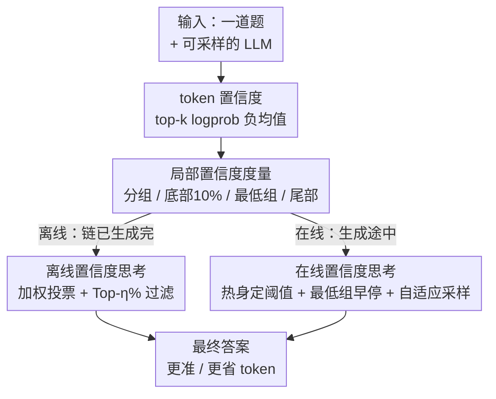

# Deep Think with Confidence

**会议**: ICLR 2026  
**OpenReview**: [https://openreview.net/forum?id=8LqHs0KIM7](https://openreview.net/forum?id=8LqHs0KIM7)  
**代码**: https://github.com/facebookresearch/deepconf  
**领域**: LLM推理  
**关键词**: 测试时扩展, 置信度, 自一致性, 多数投票, 推理效率

## 一句话总结
DeepConf 利用大模型生成时自带的局部置信度信号，在并行思考（多采样 + 多数投票）的基础上动态过滤掉低质量推理链：离线时用置信度加权投票 + Top-η% 过滤，在线时用最低分组置信度做早停 + 自适应采样——无需训练、无需调参，在 AIME 2025 上把 GPT-OSS-120B 的准确率推到 99.9%，同时把生成 token 砍掉最多 84.7%。

## 研究背景与动机
**领域现状**：当下提升 LLM 推理能力的主流测试时方法是 **self-consistency（自一致性）**，也叫并行思考：对同一道题采样很多条推理链，再用多数投票聚合出最终答案。这条路确实能显著提升准确率，是各家强推理模型刷榜的标配。

**现有痛点**：并行思考的代价极高，而且回报递减。论文给的例子很直白——在 AIME 2025 上用 Qwen3-8B 把 pass@1 从 68% 提到 82%，需要每题额外生成 511 条推理链、烧掉一亿个额外 token。更糟的是，准确率往往随着链数增加而饱和甚至下降，因为**标准多数投票把所有推理链一视同仁**，完全忽略了链与链之间的质量差异：一旦低质量链在投票里占了多数，结果反而被带偏。

**核心矛盾**：已有工作试图用模型内部的 token 分布统计（熵、置信度）来评估链的质量，把整条链的 token 统计平均成一个**全局置信度**（如 self-certainty）来过滤差链。但全局平均有两个硬伤：其一，整条链取平均会**掩盖局部的推理崩塌**——少数几个高置信 token 足以盖过大量低置信片段，把关键错误藏起来；其二，全局指标必须**等整条链生成完**才能算出来，根本无法在生成途中早停低质量链，省不下计算。

**本文目标**：找到一种既能精准识别差链、又能在生成过程中实时干预的置信度信号，让并行思考同时变得更准、更省。

**切入角度**：作者观察到推理链的崩塌往往是**局部**的——当模型在某段连续吐出 "wait"、"however"、"think again" 这类低置信 token 时，推理流被打断，后续大概率出错；而结尾几步对数学题的最终答案尤其关键。既然崩塌是局部现象，就应该用**局部置信度**而非全局平均去捕捉它。

**核心 idea**：用滑动窗口的**局部置信度**（尤其是一条链里最差的那段）替代全局平均，作为链质量的代理信号——离线时据此做加权投票与过滤，在线时把它当作早停的触发器。

## 方法详解

### 整体框架
DeepConf 的输入是「一道题 + 一个能采样多条推理链的 LLM」，输出是「一个聚合后的最终答案 + 大幅缩减的 token 开销」。整个方法围绕一个核心量——**token 置信度** $C_i = -\frac{1}{k}\sum_{j=1}^{k}\log P_i(j)$，即位置 $i$ 上 top-$k$ token 对数概率的负均值（论文用 top-20），值越高说明分布越尖锐、模型越确定。在 token 置信度之上，作者定义了若干**局部聚合**指标，再把它们分别接到两种使用场景：

- **离线模式**：所有推理链都已生成完，挑战是如何聚合多条链选出最终答案——用置信度加权投票 + Top-η% 过滤。
- **在线模式**：在生成途中实时评估链质量，对没希望的链动态早停——用最低分组置信度做触发器，配合离线热身阈值与自适应采样。

### 关键设计

**1. 局部置信度度量：用一条链里最差的片段替代全局平均**

这一组设计直击「全局平均掩盖局部崩塌」的痛点。作者不再把整条链取一个平均，而是用滑动窗口构造一系列**分组置信度**：每个 token 关联一个由前 $n$ 个 token（如 $n=1024$ 或 $2048$）组成的窗口 $G_i$，组内取均值 $C_{G_i} = \frac{1}{|G_i|}\sum_{t \in G_i} C_t$，相邻窗口重叠，得到一条比逐 token 更平滑、又比全局更局部的信号曲线。

在分组置信度之上，作者派生出几个面向不同失败模式的链级指标：**底部 10% 分组置信度** $C_{\text{bottom-10}}$ 取一条链里置信度最低的 10% 个组求均值，专门捕捉「最成问题的那几段」；**最低分组置信度** $C_{\text{least}} = \min_{G_j \in G} C_{G_j}$ 是它的极端特例，只看全链最差的那一个组，正因为它只盯单点、可以边生成边更新，成了在线早停的天然触发器；**尾部置信度** $C_{\text{tail}}$ 只平均最后固定数量（如 2048）个 token，对应「开头强、结尾弱」的链——数学题的结论步骤最关键，结尾一崩往往全错。论文用 HMMT25 的分布图证明：底部 10% 和尾部置信度对「正确链 vs 错误链」的区分度都明显优于全局平均置信度，说明局部信号确实更能反映质量。

**2. 离线置信度思考：把投票权交给高置信度的链**

离线场景里所有链都生成好了，问题是怎么投票。标准多数投票 $V(a) = \sum_{t \in T} \mathbb{I}(\text{answer}(t)=a)$ 给每条链同等一票，DeepConf 把它升级成**置信度加权投票** $V(a) = \sum_{t \in T} C_t \cdot \mathbb{I}(\text{answer}(t)=a)$，其中 $C_t$ 是上面任选的一种链级置信度——让高置信度的链投出更重的票，自然压低不确定链的影响。

在加权之上再叠一层**置信度过滤**：先按链级置信度排序，只保留 top-η% 的链参与投票。论文给两档：$\eta=10\%$ 激进过滤（只留约 1/10 最自信的链），在多数设置下增益最大，但当模型对错题也过度自信时可能反伤准确率；$\eta=90\%$ 保守过滤，保留更多链以维持多样性、抵消模型偏置，是更安全的选项。这套「加权 + 过滤」就是离线 DeepConf 的全部——把投票权从「数链数」改成「按质量加权并掐掉尾部」。

**3. 在线置信度思考：热身定阈值 + 最低组早停 + 自适应采样**

离线虽好，但要等所有链生成完才省得下 token。在线模式的目标是**生成途中就掐掉没希望的链**。它复用最低分组置信度，分三步：

其一**离线热身（Offline Warmup）**：对每道新题先生成 $N_{\text{init}}$ 条（如 16）完整链，把停止阈值定为 $s = \text{Percentile}_{100-\eta}(\{C_t\})$——即保留 top-η% 最自信链所对应的分位点。DeepConf-low 用 $\eta=10\%$（90 分位，阈值高、掐得狠），DeepConf-high 用 $\eta=90\%$（10 分位，阈值低、保守）。其二**实时早停**：在线生成新链时，每吐一个 token 就更新当前组的分组置信度 $C_{G_i}$，一旦 $C_{G_i} < s$ 立刻终止该链——因为它的组置信度已经低于「会被离线过滤掉」的水平，继续生成纯属浪费。其三**自适应采样（Adaptive Sampling）**：用已生成链的共识度 $\beta = \frac{V(\hat a)}{\sum_a V(a)}$ 衡量题目难度，若 $\beta \ge \tau$（预设共识阈值，如 0.95）说明已达成一致，直接停采；否则继续采样直到打满预算 $B$。简单题几条链就收敛、难题才舍得多花预算。

理论上当热身集足够大时 $s$ 估得准，任何被在线早停的链其组置信度都 $< s$、本就会被离线过滤掉，所以在线过程**近似**离线的最低分组置信度策略，准确率随 $N_{\text{init}}$ 增大而逼近离线结果。三步合起来，让在线 DeepConf 在不训练、不改服务框架的前提下既省 token 又保准确率。

### 一个完整示例
拿一道 AIME 难题走一遍在线 DeepConf-low：先热身采 16 条链，算出停止阈值 $s$（保留 top-10% 最自信链的分位点）。接着开始在线采样，第 17 条链生成到中途连吐 "wait, let me double check… I should rethink step 1…"，这段窗口的分组置信度跌破 $s$，于是这条链当场被掐断，只计入早停前产生的 token。每完成一条新链就更新加权投票和共识度 $\beta$；当 $\beta$ 突破 $\tau=0.95$（多数答案占了绝对优势）就停止采样，哪怕远没打满 512 的预算。最终在 GPT-OSS-120B / AIME25 上，token 从 cons@512 的 $3.23\times10^8$ 砍到 $0.49\times10^8$（-84.7%），准确率反而从 97.1% 升到 97.9%。

## 实验关键数据

实验覆盖三个模型家族五个开源推理模型（DeepSeek-8B、Qwen3-8B/32B、GPT-OSS-20B/120B），五个高难基准（AIME24/25、BRUMO25、HMMT25、GPQA-Diamond）。每道题预生成 4096 条链作为公共采样池，离线/在线再从中重采工作集，所有指标在 64 次独立重采下取平均。基线是标准 self-consistency 多数投票。

### 主实验（离线，K=512，准确率 %）

| 模型 / 数据集 | Pass@1 | Cons@512 | Bottom-10% Conf (η=10%) | Tail Conf (η=10%) |
|--------------|--------|----------|------------------------|-------------------|
| DeepSeek-8B / AIME25 | 76.9 | 82.3 | 87.5 | 87.4 |
| DeepSeek-8B / HMMT25 | 58.1 | 69.6 | 79.5 | 83.9 |
| Qwen3-32B / AIME24 | 80.6 | 85.3 | 90.8 | 89.4 |
| GPT-OSS-120B / AIME25 | 91.8 | 97.0 | 98.1 | **99.9** |

置信度加权 + 过滤在多数设置下稳定超过多数投票；激进过滤（η=10%）增益最大，GPT-OSS-120B 在 AIME25 上直接刷到 99.9%、几乎打满该基准。局部指标（Tail、Bottom-10%）与全局指标（Average Trace）都有效，但局部指标整体更优。

### 在线实验（K=512，token 单位 ×10⁸）

| 模型 / 数据集 | Cons@512 Token | DeepConf-low Token (∆%) | DeepConf-low Acc |
|--------------|----------------|------------------------|------------------|
| DeepSeek-8B / AIME24 | 3.55 | 0.78 (-77.9%) | 92.5% (vs 86.7%) |
| DeepSeek-8B / AIME25 | 4.01 | 1.24 (-69.0%) | 86.4% |
| Qwen3-32B / AIME24 | 2.00 | 0.66 (-66.8%) | 89.5% |
| GPT-OSS-120B / AIME25 | 3.23 | 0.49 (-84.7%) | 97.9% |

DeepConf-low 在四个数学集上把 token 砍掉 43–79%，多数情况下准确率持平或提升（DeepSeek-8B/AIME24 涨 +5.8%），偶有小幅回退（Qwen3-32B/BRUMO25 −0.9%）。保守版 DeepConf-high 省 18–59% token，准确率几乎无损。

### 关键发现
- **局部 > 全局**：底部 10% 和尾部置信度对「对/错链」的分布区分度明显优于全局平均，证实推理崩塌是局部现象、该用局部信号捕捉。
- **过滤强度是双刃剑**：η=10% 激进过滤增益最大，但当模型对错题也过度自信时会反伤准确率（如 GPT-OSS-120B 个别集），此时 η=90% 更稳——这是准确率与鲁棒性之间需要按场景权衡的旋钮。
- **在线≈离线**：因为早停的链本就会被离线过滤掉，在线策略近似离线最低分组置信度策略，且 $N_{\text{init}}$ 越大越逼近离线准确率。
- **同准确率下纯省钱**：在 DeepSeek-8B 上，相同准确率水平 DeepConf-low/high 分别省下 62.88% / 47.67% 的 token。

## 亮点与洞察
- **「最差的那一段」才是质量信号**：把链质量的代理从「整条链平均」换成「最低分组置信度」，既解决了全局平均掩盖局部崩塌的问题，又因为「最低值可边生成边更新」天然成了在线早停的触发器——一个指标同时服务离线过滤和在线早停，设计很经济。
- **零训练、零调参、可热插拔**：DeepConf 不碰模型权重、不引入新超参，置信度全来自生成时本就有的 logprob，可以直接嵌进现有 serving 框架，落地成本极低。
- **离线/在线统一在同一信号下**：在线早停的阈值正是「会被离线过滤掉」的水平，使在线过程可证地近似离线策略，理论与工程自洽，这套「热身定阈值 → 实时早停 → 自适应采样」的范式可迁移到其他多采样聚合任务（如代码生成的多候选筛选）。

## 局限与展望
- **依赖模型置信度的校准**：方法的根基是「高置信度≈高质量」，但模型可能对错误答案过度自信（论文自己在 GPT-OSS-120B 上观察到激进过滤反伤准确率），此时局部置信度也会失灵。
- **热身有固定开销**：在线模式每道题都要先采 $N_{\text{init}}$ 条完整链定阈值，对极简单题这部分热身可能并不划算；阈值估计质量也受 $N_{\text{init}}$ 大小影响。
- **窗口大小等是隐含超参**：虽宣称无需调参，但分组窗口 $n$、尾部长度、底部比例 10%、共识阈值 $\tau$ 等都是预设值，跨模型/数据集的最优取值是否稳健仍待更广验证。
- **聚焦数学/STEM 推理**：评测集以数学竞赛和研究生 STEM 为主，「结尾步骤最关键」「崩塌局部化」等观察在开放式生成、长程 agent 任务上是否成立尚未检验。

## 相关工作与启发
- **vs 标准 self-consistency / 多数投票**：后者把所有链等权聚合、忽略质量差异且必须跑满预算；DeepConf 按局部置信度加权 + 过滤 + 早停，在更高准确率下大幅省 token。
- **vs 全局置信度过滤（如 self-certainty / Kang et al. 2025）**：他们把整条链的 token 统计平均成一个全局分数来筛链，会掩盖局部崩塌且无法早停；DeepConf 改用滑动窗口的局部置信度（尤其最低组），既能定位崩塌段又能在生成途中实时干预。

## 评分
- 新颖性: ⭐⭐⭐⭐ 「用最低分组置信度统一离线过滤与在线早停」的视角清晰且实用，但置信度过滤投票本身是在已有路线上的精细化。
- 实验充分度: ⭐⭐⭐⭐⭐ 五模型五基准、64 次重采、离线在线全覆盖，token 与准确率双维度对比扎实。
- 写作质量: ⭐⭐⭐⭐ 动机层层递进、图示清楚，指标定义完整。
- 价值: ⭐⭐⭐⭐⭐ 零训练零调参、可热插拔进 serving，AIME25 刷到 99.9% 同时省 84.7% token，落地价值很高。

<!-- RELATED:START -->

## 相关论文

- [\[ICLR 2026\] Tricks or Traps? A Deep Dive into RL for LLM Reasoning](tricks_or_traps_a_deep_dive_into_rl_for_llm_reasoning.md)
- [\[ICLR 2026\] Think in Parallel, Answer as One: Logit Averaging for Open-Ended Reasoning](think_in_parallel_answer_as_one_logit_averaging_for_open-ended_reasoning.md)
- [\[ICLR 2026\] Adaptive Thinking: Large Language Models Know When to Think in Latent Space](adaptive_thinking_large_language_models_know_when_to_think_in_latent_space.md)
- [\[ICLR 2026\] C-Voting: Confidence-Based Test-Time Voting without Explicit Energy Functions](c-voting_confidence-based_test-time_voting_without_explicit_energy_functions.md)
- [\[ICLR 2026\] Reasoning with Sampling: Your Base Model is Smarter Than You Think](reasoning_with_sampling_your_base_model_is_smarter_than_you_think.md)

<!-- RELATED:END -->
