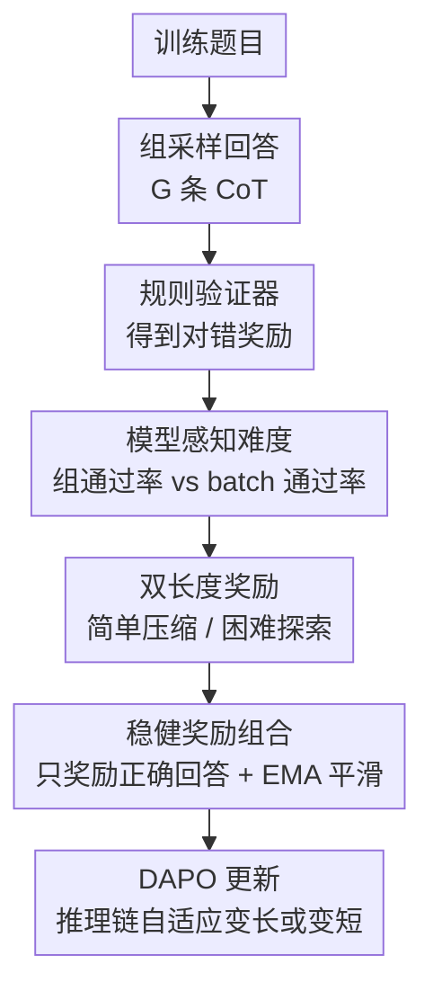

# DeepCompress: A Dual Reward Strategy for Dynamically Exploring and Compressing Reasoning Chains

**会议**: ICLR2026  
**OpenReview**: [https://openreview.net/forum?id=K5A2jBmEBK](https://openreview.net/forum?id=K5A2jBmEBK)  
**代码**: https://github.com/Skytliang/DeepCompress  
**领域**: LLM推理  
**关键词**: 推理链压缩, 大推理模型, 强化学习, 长度奖励, 数学推理  

## 一句话总结
DeepCompress 用“简单题压缩、难题探索”的双长度奖励改造大推理模型的 RL 训练，让模型在数学和科学推理上同时提升准确率并显著减少平均推理 token。

## 研究背景与动机
**领域现状**：以 o1、DeepSeek-R1、Gemini 2.5、Claude 3.7 为代表的大推理模型（Large Reasoning Models, LRMs）通常依靠较长的 Chain-of-Thought、反思、自检和多步搜索来提升复杂任务表现。在数学推理这类可验证任务上，Zero RL / RLVR 已经成为训练 reasoning model 的主流路线：模型对同一题采样多条解答，由规则验证器给出对错奖励，再通过 GRPO、DAPO 等相对策略优化方法更新。

**现有痛点**：长 CoT 并不总是好。简单题上，模型会出现 overthinking：明明几步能算完，却写出冗长推理，带来推理成本和错误暴露面；复杂题上，模型又可能 underthinking：过早收束到一个脆弱思路，缺少枚举、回溯、验证等有用探索。已有“压缩推理链”的方法多用 SFT 学短 CoT，或在 RL 奖励里加入长度惩罚，它们确实能省 token，但常见副作用是准确率下降。

**核心矛盾**：推理长度不是一个全局越短越好的变量。作者的预实验发现，对于 pass@1，较短回答往往更强；但在 GRPO/DAPO 这类一次采样多条答案的训练设置里，pass@k 反而会随更长回答提升，因为长回答覆盖了更多潜在解法，能为难题产生更多正确样本和正奖励信号。因此，统一惩罚长度会压缩掉复杂题所需的探索空间；统一奖励长回答又会让简单题浪费计算。

**本文目标**：这篇论文要解决的是推理模型训练中的长度分配问题：模型应当在已经掌握的题目上更短、更直接，在当前还不会的题目上更长、更愿意探索，并且这种判断不能依赖人工难度标签，而要随着模型训练状态实时变化。

**切入角度**：作者从 RL 训练本身可观察到的信号入手：同一题采样 $G$ 条回答后，正确样本比例就是当前模型“觉得这题有多容易”的即时估计；一个 batch 内所有题的平均正确率则反映当前模型的整体水平。二者相减，就能得到相对难度，而不需要额外标注。

**核心 idea**：DeepCompress 把长度奖励从固定惩罚改成模型感知的动态调节：当某题的组内通过率高于 batch 平均时奖励短答案，当低于 batch 平均时奖励长答案，同时只对正确答案施加长度奖励，避免模型为了长度而牺牲正确性。

## 方法详解

### 整体框架
DeepCompress 是一个插入 Zero RL 训练流程的奖励设计。训练时，模型对每道数学题生成一组回答，规则验证器先给出对错奖励；随后方法根据该题在组内的通过率和当前 batch 的平均通过率判断它对“当前模型”是简单还是困难，再把标准化后的回答长度转成正向或反向长度奖励。最终奖励用于 DAPO 这类 RL 算法更新模型，使它逐渐学会按题目难度分配推理预算。

这条流程里，规则验证器和 DAPO 是训练脚手架，真正的贡献在三个位置：用模型当前通过率定义难度，用难度符号控制长度奖励方向，以及用正确性条件和 EMA 把这个奖励做得更稳。它不是在推理时加一个外部控制器，而是在训练阶段把“何时多想、何时少想”写进策略模型本身。

### 关键设计
**1. 模型感知难度：用当前模型的组内通过率替代静态难度标签**

DeepCompress 不使用数据集自带的 easy / hard 标注，因为这种标注既贵，也会随着模型能力提升而过时。同一道题对弱模型可能很难，对训练后期的模型可能已经变成简单题；如果难度标签不变，长度奖励就会在后期继续鼓励不必要的探索。

具体做法是，对每个问题 $x_i$ 采样 $G$ 个回答，并用规则验证器得到二值 outcome reward：答案正确时 $R_o=1$，错误时 $R_o=-1$。该题的组内通过率定义为 $P_g(x_i)=\frac{\sum_{j=1}^{G} I(R_o(\hat y_i^j,y_i)=1)}{G}$，batch 通过率定义为 $P_b=\frac{\sum_{i=1}^{B}P_g(x_i)}{B}$。如果 $P_g(x_i)>P_b$，说明这道题相对当前 batch 里的平均题更容易；如果 $P_g(x_i)<P_b$，说明模型在这题上更不稳定，应把它当作 hard case。这样的“难度”不是客观静态属性，而是模型状态下的相对学习信号。

**2. 双长度奖励：用 $\beta$ 的符号决定压缩还是探索**

传统长度惩罚通常只表达一个偏好：越短越好。DeepCompress 的核心变化是让长度奖励有两种模式。作者先在同一题的 $G$ 个回答内计算长度均值 $\mu_i$ 和标准差 $\sigma_i$，把某条回答的长度标准化为 $z_i=\frac{|\hat y_i|-\mu_i}{\sigma_i+\epsilon}$。这样奖励比较的是同一题内部“相对更长还是更短”，而不是跨题比较绝对 token 数，避免复杂题天然更长时被错误惩罚。

长度奖励用 sigmoid 变换：$R_z(\hat y,\beta)=\frac{1}{1+e^{\beta z_i}}$，再乘上权重 $\alpha$ 得到 $R_l=\alpha R_z(\hat y,\beta)$。关键在于 $\beta$ 由 $P_g(x_i)-P_b$ 给出。当 $\beta>0$ 时，$z_i$ 越小也就是回答越短，$R_z$ 越高，模型被鼓励压缩简单题；当 $\beta<0$ 时，较长回答得到更高奖励，模型会在难题上保留更充分的推理、枚举和反思。$|\beta|$ 同时控制奖励强度：题目越偏离 batch 平均，长度偏好越强。

**3. 正确性条件化奖励：防止模型为了长度信号奖励错误答案**

如果把长度奖励无条件加到所有回答上，会出现一个危险信号：错误但满足长度偏好的回答也可能被额外奖励。对简单题来说，模型可能学会输出很短但不可靠的答案；对困难题来说，模型可能学会写很长但没有解出题的推理。这类 reward hacking 会把“长度调度”误学成“长度本身”。

DeepCompress 因此把长度奖励限定在正确回答上：若回答正确，最终奖励为 $R=R_o+R_l$；若回答错误，最终奖励仍为 $R=R_o$。这让长度奖励只在“已经解对”的候选之间做偏好排序：简单题里正确且短的回答最好，难题里正确且充分探索的回答最好。换句话说，长度是二级目标，正确性始终是一级目标。

**4. EMA 平滑 batch 通过率：避免训练早期过早压缩探索空间**

直接使用当前 batch 的真实通过率 $P_b^{true}$ 会带来训练不稳定。batch 之间的题目组成不同，短期通过率会波动；更重要的是，训练早期模型整体很弱，$P_b^{true}$ 很低，一些“只是偶然有几条正确回答”的题会被误判为简单题，从而得到过强的短答案奖励，提前压缩还没有形成的探索能力。

作者用指数滑动平均维护平滑后的 batch 通过率：$P_{b,t}=\lambda P_{b,t-1}+(1-\lambda)P_{b,t}^{true}$，并用它代替公式里的 $P_b$。实验中 $\lambda=0.99$，且初值设为 $1.0$。这个乐观初始化很关键：训练刚开始时，系统更倾向把题视为困难，保留长推理探索；随着模型能力逐步提升，平滑通过率再缓慢下降或上升到真实水平，让压缩压力逐渐出现。

### 一个完整示例
假设一个 batch 里有 512 道数学题，每题采样 32 条回答。某道代数题的 32 条回答里有 24 条正确，则 $P_g=0.75$；当前平滑 batch 通过率为 $P_b=0.55$，于是 $\beta=0.20>0$。这道题对当前模型已经相对简单，DeepCompress 会在 24 条正确回答中偏好更短、更直接的推理链，比如把多余的反复验证和绕路枚举压掉。

另一道组合题只有 6 条回答正确，则 $P_g=0.1875$，相对同一个 $P_b=0.55$ 得到 $\beta=-0.3625$。这时系统不会急着压缩答案，而是在正确回答里更偏好较长的样本，因为这些样本更可能包含枚举、回溯、子目标分解或中间验证等帮助模型突破难题的行为。训练若持续进行，模型逐渐学会：熟题快速收束，生题先扩大搜索，再把有效反思变成更高效的推理习惯。

### 损失函数 / 训练策略
训练算法采用 DAPO，并沿用 Zero RL 的规则验证器奖励。基础 outcome reward 为二值形式：正确答案 $R_o=1$，错误答案 $R_o=-1$。DeepCompress 在此基础上加入长度奖励，完整奖励是正确性条件化的 $R=R_o+R_l$ 或 $R=R_o$。

训练设置上，作者使用 verl 框架，分别从 Qwen2.5-3B 和 Qwen2.5-7B 训练 DeepCompress-Zero-3B / 7B。关键超参包括学习率 $1e-6$、训练 batch size 512、PPO mini-batch size 32、每题 rollout 数 $G=32$、最大 prompt 长度 2K、最大 response 长度 10K、训练 600 step、奖励权重 $\alpha=0.2$、EMA 参数 $\lambda=0.99$。评测时每题采样 16 条回答，报告 pass@1，解码温度为 0.6，top-p 为 0.95，最大生成长度为 32,768。

## 实验关键数据

### 主实验
作者主要在数学推理基准上评估，包括 MATH-500、AMC 2023、OlympiadBench、Minerva Math、AIME 2024/2025 和 PolyMath。所有 baseline 都在相同评测脚本和采样设置下重新评估，以减少评测方差。

| 模型 | MATH-500 | AMC23 | Olympiad | Minerva | AIME24 | AIME25 | PolyMath | Avg Acc |
|------|----------|-------|----------|---------|--------|--------|----------|---------|
| DeepMath-Zero-3B | 72.8 | 48.0 | 38.0 | 30.8 | 11.5 | 6.9 | 34.1 | 34.6 |
| DeepCompress-Zero-3B | 75.3 | 49.4 | 39.3 | 32.7 | 16.7 | 7.1 | 35.8 | 36.6 |
| DeepMath-Zero-7B | 85.6 | 64.7 | 51.3 | 45.4 | 19.4 | 13.1 | 42.6 | 46.0 |
| DeepCompress-Zero-7B | 85.6 | 67.8 | 53.3 | 47.4 | 23.5 | 19.6 | 44.0 | 48.7 |

3B 模型平均准确率从 34.6 提升到 36.6，绝对提升 2.0；7B 模型从 46.0 提升到 48.7，绝对提升 2.7。最明显的收益来自困难题：7B 在 AIME24 上从 19.4 到 23.5，在 AIME25 上从 13.1 到 19.6，说明动态鼓励难题长推理确实扩大了模型的可解边界。

| 模型 | GPQA Biology | GPQA Physics | GPQA Chemistry | GPQA Overall | MMLU-STEM | Big-Bench Hard |
|------|--------------|--------------|----------------|--------------|-----------|----------------|
| DeepMath-Zero-3B | 45.1 | 25.3 | 32.2 | 30.2 | 54.7 | 71.6 |
| DeepCompress-Zero-3B | 44.1 | 25.5 | 35.7 | 31.7 | 56.0 | 73.7 |
| DeepMath-Zero-7B | 58.6 | 29.5 | 53.2 | 42.6 | 72.7 | 85.0 |
| DeepCompress-Zero-7B | 57.6 | 31.2 | 58.2 | 43.9 | 75.5 | 85.7 |

跨领域评测显示 DeepCompress 不只是“刷数学榜”。虽然 GPQA Biology 上 3B/7B 分别略低于 DeepMath-Zero，但 overall、MMLU-STEM 和 BBH 都有提升，说明训练得到的推理预算调度能力对科学和多步推理也有一定迁移。

### 消融实验
| 配置 | 关键指标 | 说明 |
|------|----------|------|
| 固定 Length Penalty ($\beta=1$) | 训练和测试响应长度最短，policy entropy 低且稳定 | 单纯压短会限制探索，容易丢失复杂题所需的正奖励样本 |
| 固定 Length Bonus ($\beta=-1$) | policy entropy 和响应长度最高，pass@1 强于长度惩罚 | 长推理有助于探索，但推理成本高，不适合作为全局策略 |
| DeepCompress | entropy 先升后稳，测试 pass@1 持续增长，长度先探索后受控降低 | 动态在探索和压缩之间切换，是准确率与效率最均衡的策略 |
| $\lambda=0.99$ | 3B 上优于较小 EMA 平滑系数 | 较强平滑能避免早期 batch 噪声导致过早压缩 |
| $\alpha\in\{0.1,0.2,0.5,1.0\}$ | 均超过 DeepMath-Zero-3B baseline | 方法对长度奖励权重较稳健，默认 $\alpha=0.2$ |

### 关键发现
- DeepCompress 同时提升准确率和效率。平均响应长度相对 DeepMath-Zero-3B 压缩 57.9%，相对 DeepMath-Zero-7B 压缩 16.6%；在 AIME24 上，3B 少用 37.6% token 仍提升 5.2 个点，7B 少用 35.2% token 仍提升 4.1 个点。
- 预实验解释了为什么“越短越好”是错的：pass@1 上短回答常更强，但 pass@32 上长回答通常更好，因为多样、较长的探索能覆盖更多潜在正确解。DeepCompress 正是把这个观察搬进 RL 训练奖励。
- 对 hard question 的行为分析显示，DeepCompress 的反思频率高于 DeepMath-Zero，但平均长度反而更短。例如 3B 的 reflection frequency 从 2.45 到 2.73，长度从 11,222 降到 4,853，pass@1 从 7.21 到 8.72。这说明它不是简单“想更久”，而是学到更有效率的反思。
- 固定 Length Bonus 虽然能带来更高 entropy 和不错的准确率，但平均长度达到 13,575 这类高成本区间；固定 Length Penalty 则过度稳定、探索不足。DeepCompress 的价值就在于按题目动态调配，而非选一个全局长度偏好。

## 亮点与洞察
- 最关键的洞察是把推理链长度看成“相对当前模型能力”的变量，而不是数据集难度或全局超参。这个视角很适合 RLVR，因为训练时本来就有组采样和规则验证信号，几乎不用额外标注成本。
- 用 $P_g-P_b$ 同时决定简单/困难和奖励强度很简洁。它把“题目是否简单”和“简单到什么程度”合成一个连续控制量，比硬阈值更自然，也避免了为每个数据集手调难度边界。
- 正确性条件化是一个容易被忽视但很重要的工程细节。很多长度奖励方法的问题不是公式不优雅，而是它们可能奖励错误样本的长度特征；DeepCompress 明确把长度作为正确样本内部的排序信号，训练目标更干净。
- 这篇论文对推理效率研究有启发：压缩不应只发生在输出端或蒸馏阶段，也可以通过训练奖励让模型学习“把计算花在值得花的地方”。类似思想可以迁移到工具调用、代码生成、检索增强推理等有可验证结果的任务。

## 局限与展望
- 作者承认 DeepCompress 依赖同一题组内样本存在足够的长度差异。如果模型采样本身已经高度同质，$z_i$ 的标准化长度就提供不了有效区分，双长度奖励也难以发挥作用。
- 训练时最大 response length 被限制为 10K，这保证了训练效率，但也可能限制了特别复杂问题的探索上界。对于定理证明、长程序综合、复杂科学推理等任务，是否需要更大的探索预算还不清楚。
- 方法目前主要依赖规则验证器，因此最自然适用于数学、代码、可自动判分 QA 等任务。对于开放式问答、规划、写作或多模态推理，如果没有可靠 outcome reward，如何定义 $P_g$ 会更困难。
- 难度判断是 batch 相对量，batch 组成可能影响某道题被判为 simple 或 hard。EMA 缓解了整体波动，但没有完全解决跨 batch 难度分布变化的问题；未来可以结合历史题目级统计、分桶 curriculum 或不确定性估计。
- 长度奖励只关心 token 数，不直接衡量推理步骤质量。后续可以把反思、验证、回溯等认知行为的有效性纳入奖励，让模型不只是控制长短，还能控制“长在哪里、短掉什么”。

## 相关工作与启发
- **vs 固定长度惩罚 RL**: Kimi k1.5、O1-pruner、Learn to Reason Efficiently 等方法通常把短输出作为统一偏好，适合降低成本，但可能牺牲难题探索。DeepCompress 的区别是对 simple/hard 题使用相反长度偏好，因此能在困难题上保留搜索空间。
- **vs SFT 式短 CoT 蒸馏**: C3oT、Think Smarter Not Harder 等方法通过构造短推理样本让模型学会少写。DeepCompress 不依赖静态短答案数据，而是在 RL 过程中根据当前模型通过率动态塑造长度偏好，适应性更强。
- **vs 难度自适应推理预算**: ADOT、TALE、Thinking-Optimal Scaling 等工作多在 prompt 或 test-time compute 层面调节推理长度。本文把调节机制放进训练奖励，使模型在参数中内化这种预算分配策略，推理时不需要额外控制器。
- **vs 反思/探索增强 RL**: Rea-RL、E3、count-based intrinsic reward 等方法关注如何让 reasoning model 更愿意探索或反思。DeepCompress 的独特之处在于它同时约束效率：难题上鼓励探索，熟题上压缩冗余，最终得到更短但更有效的反思行为。

## 评分
- 新颖性: ⭐⭐⭐⭐☆ 把组内通过率和 batch 通过率用于动态长度奖励很直接，但对“长推理有利于 pass@k、短推理有利于 pass@1”的连接抓得准。
- 实验充分度: ⭐⭐⭐⭐☆ 数学主实验、跨领域泛化、长度效率、entropy、反思行为和超参都有覆盖；开放式任务和更大模型规模仍有待验证。
- 写作质量: ⭐⭐⭐⭐☆ 论文结构清晰，公式和训练机制易复现；部分图表数据没有完整数值表，阅读时需要从图中理解趋势。
- 价值: ⭐⭐⭐⭐⭐ 对 LLM 推理链压缩和 RLVR 奖励设计都很实用，尤其适合需要同时控制准确率与推理成本的 reasoning model 训练。

<!-- RELATED:START -->

## 相关论文

- [\[ICLR 2026\] Expanding Reasoning Potential in Foundation Model by Learning Diverse Chains of Thought Patterns](expanding_reasoning_potential_in_foundation_model_by_learning_diverse_chains_of_.md)
- [\[ACL 2026\] Strategy-Induct: Task-Level Strategy Induction for Instruction Generation](../../ACL2026/llm_reasoning/strategy-induct_task-level_strategy_induction_for_instruction_generation.md)
- [\[ICLR 2026\] Smarter Not Harder: Generative Process Evaluation with Intrinsic-Signal Driving and Ability-Adaptive Reward Shaping](smarter_not_harder_generative_process_evaluation_with_intrinsic-signal_driving_a.md)
- [\[ICLR 2026\] Making Slow Thinking Faster: Compressing LLM Chain-of-Thought via Step Entropy](making_slow_thinking_faster_compressing_llm_chain-of-thought_via_step_entropy.md)
- [\[ICLR 2026\] Linking Process to Outcome: Conditional Reward Modeling for LLM Reasoning](linking_process_to_outcome_conditional_reward_modeling_for_llm_reasoning.md)

<!-- RELATED:END -->
