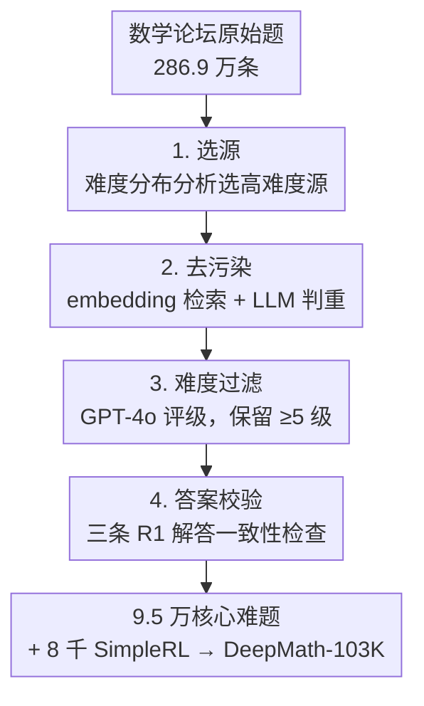

# DeepMath-103K: A Large-Scale, Challenging, Decontaminated, and Verifiable Mathematical Dataset for Advancing Reasoning

**会议**: ICLR2026  
**OpenReview**: [https://openreview.net/forum?id=kHB5Te5IWm](https://openreview.net/forum?id=kHB5Te5IWm)  
**代码**: https://github.com/zwhe99/DeepMath ｜ 数据集: https://hf.co/datasets/zwhe99/DeepMath-103K  
**领域**: LLM推理 / 数学推理 / 训练数据集 / RLVR  
**关键词**: 数学推理数据集、可验证奖励、去污染、难度过滤、强化学习

## 一句话总结
DeepMath-103K 是一份专为 RLVR（可验证奖励强化学习）打造的大规模数学推理训练集：从 286.9 万条数学论坛原始问题出发，经严格去污染、难度过滤（主体为 5–9 级）和答案可验证性校验，得到 10.3 万道高难度、与主流评测基准几乎无重叠、每题都带可机器校验答案和三条 R1 解答的题目；用它做 RL 训练的模型在 AIME、MATH500 等数学基准上全面领先，并能泛化到生物/物理/化学等非数学推理任务。

## 研究背景与动机
**领域现状**：用强化学习（RL）训练大模型做复杂数学推理（以 DeepSeek-R1 为代表的 RLVR 路线）已被证明很有潜力——给模型一个**可被规则验证的最终答案**，答对给 +1、答错给 −1，就能直接优化推理能力，无需训练奖励模型，也更难被 reward hacking 钻空子。

**现有痛点**：但这条路线被训练数据卡住了脖子。作者把现有公开数学数据集逐一拆开看，发现它们在四个对 RLVR 至关重要的维度上至少缺一块：(1) **难度不够**——大量题目集中在 1–5 级，喂给已经很强的模型根本激不起涨幅；(2) **污染严重**——很多数据其实和 AIME、AMC、MATH500 等评测基准高度重叠，用它训出来的模型在这些基准上的"高分"不可信；(3) **答案不可验证**——开放式或答案过于复杂的题无法用规则自动判分，直接不能用于 RLVR；(4) 即便单项达标，也很难在**规模上同时满足**以上几条。

**核心矛盾**：更深一层的问题是数据**同质化**。现有公开集大多是对 AIME、GSM8K、MATH 这类**已经格式规整的公共题库**做重新组合与筛选，本质是"换个包装重新收集"，导致不同数据集之间大面积重叠、缺少真正新颖多样的题目。常用资源正在被反复榨取、趋于枯竭。

**本文目标**：造一份同时满足"高难度 + 去污染 + 可验证 + 大规模 + 高多样性"的数学 RLVR 训练集，并证明它能训出更强、泛化更广的推理模型。

**切入角度**：与其继续在格式规整但同质化的公共题库里打转，作者转向**更原始、更杂乱但也更多样**的数据源——主要是 Math StackExchange 这类数学论坛的非正式讨论帖。这些内容格式混乱、需要大量清洗，但恰恰因为没被反复收割，才藏着大量新颖且偏难的题目。

**核心 idea**：用一条"难度分析选源 → 严格去污 → 难度过滤 → 答案一致性校验"的四阶段流水线，把论坛上杂乱的数学讨论提炼成 10.3 万道结构化、可验证、高难度的题目。

## 方法详解

### 整体框架
DeepMath-103K 不是一个"方法/模型"，而是一份**数据集**及其构造流水线，因此这里的"方法"就是数据是怎么造出来的、每条样本长什么样。

**数据样本结构**：每道题是一个综合性样本，包含五个字段——**Question**（题面）、**Final Answer**（可被规则提取与校验的最终答案，RLVR 奖励的依据）、**Difficulty**（数值难度分，可用于课程学习 / 难度感知训练 / 自适应算力分配）、**Topic**（层级化主题标签，覆盖微积分、代数、几何、数论、离散数学等大类下的细分主题）、**R1 Solutions**（用 DeepSeek-R1 生成的三条不同推理路径，适配 SFT 等多种训练范式）。

**构造流水线**：从一个 286.9 万条原始问题的大池子出发，依次经过四个阶段——去污染、难度过滤（保留 ≥5 级）、答案可验证性过滤——筛出 9.5 万道核心难题，再补入来自 SimpleRL 的 8 千道（3–5 级）以拓宽难度覆盖，最终合成 10.3 万道。

### 关键设计

**1. 反直觉地从"杂乱论坛"而非公共题库选源**

针对"现有数据集同质化、难度不够"的痛点，作者第一步不是去拿现成的 AIME/MATH，而是先**分析候选源的难度分布**再决定取舍。他们按 Gao et al.(2024) 的方法估计了一批公开源的难度分布，发现一个清晰规律：从 GSM8K/MATH 增广而来的数据集（MetaMathQA、dart-math-hard、OpenMathInstruct-2）以及 NuminaMath-CoT，难度严重偏向低档（1–5 级）；而广泛爬取网络内容的 MMIQC、WebInstructSub 则分布更平、在中高难度（5–9 级）占比明显更大。据此，作者选定 MMIQC 与 WebInstructSub 中的 **Math StackExchange 子集**作为主源（因其高难度题密度高），再加入 NuminaMath-CoT 提升主题多样性，基础过滤后得到 286.9 万条原始题。这个选源决策直接奠定了数据集"既难又多样"的底色——后文用 t-SNE 和去重分析显示，DeepMath-103K 有 **82.81K** 道题在其他数据集里找不到，嵌入分布也与众不同，而其余几个数据集彼此高度重叠。

**2. 语义级去污染：先承认源数据"重灾区"，再逐题判重**

针对"污染严重导致评测不可信"的痛点，作者先把问题暴露出来：对原始题池做污染分析，发现源数据与常用基准的重叠率高得吓人——AIME24 与 AMC23 达 **90%**、MATH500 达 76.6%、Minerva Math 35.7%、OlympiadBench 33.6%。这意味着不做去污，训出来的模型在这些基准上的分数基本是"背过题"。去污采用 Toshniwal et al.(2024) 的方法、且是**语义级**而非字面匹配：对每道候选题，用 `paraphrase-multilingual-MiniLM-L12-v2` 做嵌入相似度检索，从所有目标基准的测试集里取 top-$k$（$k=5$）最相似样本；再用 LLM-Judge（Llama-3.3-70B-Instruct）逐一比对候选题与这 5 条，判断是否为同题或改写，只要命中一条疑似 paraphrase/duplicate 就丢弃。这样不仅能抓精确重复，还能抓"换了数字/换了说法"的近似题——论文 Table 1 给的例子里，"20×20 网格路径数"和一道用 $\binom{40}{20}$ 求解的论坛题被判为概念重复，正是字面匹配抓不到的。去污基准覆盖 MATH、AIME、AMC、Minerva、OlympiadBench、Omni-MATH、GAOKAO、JEEBench、MMLU-STEM、GSM8K、GPQA 等十余个数学/STEM 基准。

**3. 用 GPT-4o 多次打分做难度过滤，只留"够难的"**

针对"难度不够压不出涨幅"的痛点，作者引用 Zeng et al.(2025) 的结论——RL 训练数据难度要与目标模型能力对齐，强模型尤其受益于难题——因此把难度过滤作为独立一关。难度评级沿用 Gao et al.(2024) 的做法：按 AoPS 的标注准则提示 **GPT-4o** 为每道题打分，且为稳健起见对**每题查询 6 次取平均**作为最终难度，并在附录用人工评估验证了与 GPT-4o 评分的一致性。随后施加**硬门槛**：只保留难度 ≥5 级的题。最终数据集主体即这 9.5 万道 5–9 级核心难题，再补 8 千道 3–5 级（来自 SimpleRL）以保证难度覆盖不断档。

**4. 两段式答案校验：保证每题都"可被规则判分"**

针对"答案不可验证就不能做 RLVR"的痛点，这是让数据集真正能用于规则奖励的关键一关。难点有二：有些开放式题天然没有易验证的最终答案；有些答案过于复杂（冗长表达式、繁琐记号）导致规则自动校验不可行。作者用两段式应对：(1) **问题筛选与标准化**——用 GPT-4o 处理原始题，丢弃天然不适合验证的题型，把口语化、对话式的提问改写成"求单一数值/符号答案"的标准格式；(2) **一致性校验**——对通过上一步的题，用 DeepSeek-R1 生成**三条不同解答路径**，再用规则验证器从这三条解答（以及原始来源解答，若有）中各自抽取最终答案，**只有全部抽取答案完全一致**的题才被保留。三条独立解答都收敛到同一答案，既过滤掉了规则抽不出答案的题，也大幅降低了答案本身出错的概率，从而保证最终每题的答案都能被自动规则稳健校验。

## 实验关键数据

作者基于 DeepMath-103K 训练了一系列 **DeepMath** 模型，用两种 RL 范式：**Zero RL**（从未指令微调的 base 模型起步，用带 DAPO 修正的 GRPO，规则奖励 +1/−1）和 **RL**（从已具数学能力的指令模型起步）。评测用 pass@1（16 次采样平均），解码温度 0.6、top-p 0.95、max tokens 32K，并在统一脚本下重测所有 baseline 以保证公平。

### 主实验（数学推理，pass@1）

| 模型（训练数据 = DeepMath-103K） | MATH500 | AMC23 | Olympiad | Minerva | AIME24 | AIME25 |
|------|------|------|------|------|------|------|
| Qwen-2.5-7B（base） | 54.8 | 35.3 | 27.8 | 16.2 | 7.7 | 5.4 |
| └ **DeepMath-Zero-7B** | **85.5** | **64.7** | **51.0** | **45.3** | **20.4** | **17.5** |
| Qwen-2.5-Math-7B（base） | 46.9 | 31.9 | 15.8 | 15.5 | 11.2 | 4.4 |
| └ **DeepMath-Zero-Math-7B** | **86.9** | **74.7** | **52.3** | **49.5** | **34.2** | **23.5** |
| OpenMath-Nemotron-1.5B | 91.8 | 90.5 | 70.3 | 26.3 | 61.3 | 50.6 |
| └ **DeepMath-Omn-1.5B** | **93.2** | **94.2** | **73.4** | **28.3** | **64.0** | **57.3** |

- Zero RL 下，从 Qwen-2.5-Math-7B 出发的 DeepMath-Zero-Math-7B 在 AIME24 上 +23.0、AIME25 上 +19.1，全面超过 ORZ-7B、Oat-Zero-7B、Eurus-2-PRIME 等同期 baseline。
- DeepMath-Omn-1.5B 在 AIME24 上达 64.0、AIME25 达 57.3，**超过 o1-mini（AIME24 63.6）和低算力 o3-mini（60.0）**——一个 1.5B 模型打过闭源推理模型。

### 消融实验（均值准确率，Table 3）

| 配置 | Mean Acc. | 说明 |
|------|------|------|
| Base（Qwen-2.5-Math-7B） | 21.2 | 起点 |
| + ORZ-129K | 50.7 | 代表性开源集 |
| + DeepMath-103K | 52.5 | 单用本数据集即超过 ORZ-129K |
| − Difficulty Filtering | 49.1 | 去掉难度过滤，从 52.5 掉到 49.1 |
| + Both（ORZ + DeepMath） | 53.0 | 两者互补，最高 |

### 关键发现
- **难度过滤确有必要**：移除难度过滤这一关，均值准确率从 52.5% 掉到 49.1%，验证了"只留 ≥5 级难题"的设计价值。
- **DeepMath-103K 是补充而非替代**：单用它就超过 ORZ-129K，而两者合用最高（53.0），结合 t-SNE 分布差异说明本数据集填补了现有资源覆盖不到的题目空间。
- **跨学科泛化**：在 GPQA-Diamond（生物/物理/化学）、MMLU-STEM、BBH 上，DeepMath 系列模型相比 baseline 取得最佳分数——例如 DeepMath-Zero-7B 的 GPQA-Diamond Overall 41.7（base 仅 25.3）、MMLU-STEM 72.7（base 10.8）、BBH 84.8——表明纯数学 RL 训练能把推理能力迁移到非数学领域。

## 亮点与洞察
- **"先承认污染、再量化、再去污"的诚实做法**：作者没回避源数据 90% 污染率这个尴尬事实，而是把它作为去污必要性的论据摆出来，这种透明度本身就是数据集可信度的背书。
- **语义级去污 + 三解一致性校验是可复用的范式**：embedding top-k 检索 + LLM-Judge 判重抓近似题、用多条独立解答收敛验证答案正确性——这两套机制可直接迁移到任何想做 RLVR 的领域（代码、科学问答等）。
- **"换源头"比"换算法"更解决问题**：当公共题库被反复榨取、彼此高度重叠时，转向论坛这类杂乱但新颖的数据源，用清洗流水线把它结构化，是打破数据同质化的有效思路。
- **纯数学 RL 能泛化到非数学**：一个让人"啊哈"的结果——只在数学题上做 RLVR，却能显著提升生物/物理/化学推理，说明 RLVR 训出的是更通用的"多步推理能力"而非死记数学。

## 局限与展望
- **难度评级依赖 GPT-4o**：难度分由 GPT-4o 打分（虽多次平均并有人工验证），评级本身带模型偏差，不同时期/版本的打分模型可能给出不一致的难度标定。
- **去污染只针对"已知"基准**：去污是对一个固定的基准清单做的，对清单之外或未来新出的评测基准无法保证无重叠，"零污染"是相对的。
- **答案校验偏向客观题**：两段式校验把开放式、答案过于复杂的题筛掉了，因此数据集天然偏向有单一数值/符号答案的题，对证明题、开放探索类数学推理覆盖有限。
- **改进方向**：可引入更可靠的难度标定（如基于多模型作答正确率的经验难度），以及把可验证范围扩展到形式化证明（配合 Lean 等证明器）。

## 相关工作与启发
- **vs ORZ-129K / DAPO-17K / Open-R1 等现有 RLVR 数据集**：它们多是对公共题库的重组筛选，彼此嵌入分布高度重叠、难度偏低；DeepMath-103K 转向论坛源、做严格去污与难度过滤，拥有 82.81K 独有题且分布迥异，消融显示单用即超 ORZ-129K，两者互补最佳。
- **vs DeepSeek-R1（RLVR 范式）**：本文沿用 R1 的规则奖励思路（答对 +1），并直接用 R1 生成三条解答做答案一致性校验；区别在于本文聚焦"喂什么数据"，证明数据质量是 RLVR 能否压出涨幅的关键瓶颈。
- **vs SimpleRL（Zeng et al.）**：本文采纳其"训练难度应与模型能力对齐"的洞察作为难度过滤的理论依据，并直接复用其 8 千道 3–5 级题补充难度覆盖。

## 评分
- 新颖性: ⭐⭐⭐⭐ 数据集类工作，创新在选源策略与去污/校验流水线的系统组合，而非全新技术
- 实验充分度: ⭐⭐⭐⭐⭐ 多 base/多规模模型、数学+跨学科双重验证、含难度过滤消融与污染率/独有题量化分析
- 写作质量: ⭐⭐⭐⭐⭐ 流水线四阶段叙述清晰，把"为什么这么造"讲得很透
- 价值: ⭐⭐⭐⭐⭐ 开源数据+代码+权重，1.5B 打过 o1-mini，对 RLVR 社区是高价值基础资源

<!-- RELATED:START -->

## 相关论文

- [\[ICLR 2026\] HardcoreLogic: Challenging Large Reasoning Models with Long-tail Logic Puzzle Games](hardcorelogic_challenging_large_reasoning_models_with_long-tail_logic_puzzle_gam.md)
- [\[ICLR 2026\] AgentMath: Empowering Mathematical Reasoning for Large Language Models via Tool-Augmented Agent](agentmath_empowering_mathematical_reasoning_for_large_language_models_via_tool-a.md)
- [\[ICLR 2026\] Pruning Long Chain-of-Thought of Large Reasoning Models via Small-Scale Preference Optimization](pruning_long_chain-of-thought_of_large_reasoning_models_via_small-scale_preferen.md)
- [\[ICLR 2026\] Random Policy Valuation is Enough for LLM Reasoning with Verifiable Rewards](random_policy_valuation_is_enough_for_llm_reasoning_with_verifiable_rewards.md)
- [\[ICLR 2026\] AceReason-Nemotron 1.1: Advancing Math and Code Reasoning through SFT and RL Synergy](acereason-nemotron_11_advancing_math_and_code_reasoning_through_sft_and_rl_syner.md)

<!-- RELATED:END -->
