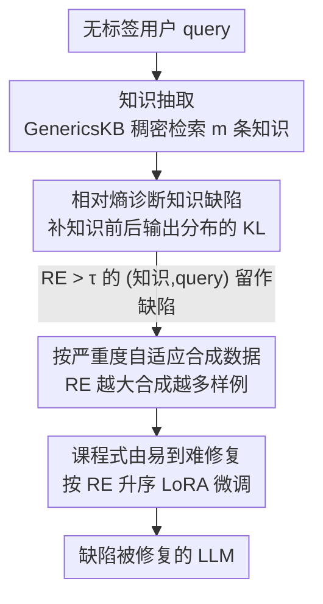

# Diagnosing and Remedying Knowledge Deficiencies in LLMs via Label-free Curricular Meaningful Learning

**会议**: ICLR2026  
**OpenReview**: [https://openreview.net/forum?id=qVadFFSfrI](https://openreview.net/forum?id=qVadFFSfrI)  
**代码**: https://github.com/Waste-Wood/LaMer  
**领域**: LLM推理 / 知识缺陷诊断 / 数据合成 / 课程学习  
**关键词**: 相对熵, 无标签诊断, 课程学习, 有意义学习, 知识增强

## 一句话总结
LaMer 用"加入外部知识前后模型输出分布的相对熵"在**无标签**条件下定位并量化 LLM 的知识缺陷，再按缺陷严重度自适应合成数据、由易到难地课程式微调来修复它们，只用 40% 训练数据就能追平甚至超过依赖标签的诊断方法。

## 研究背景与动机
**领域现状**：要让一个已经预训练好的 LLM 变得更可靠，主流是两条路——无监督语言建模（继续灌大量无标签语料）和有监督微调 SFT（用标注好的任务数据训练）。前者让模型隐式吸收知识，后者针对具体任务对齐。

**现有痛点**：两条路都"盲打"。无监督建模和 SFT 都倾向于**不加区分地**塞数据，模型早就会的知识被反复喂、真正的薄弱点却没被覆盖，既低效又难触及长尾问题；而要靠标注用户 query 来暴露模型错误，标注成本高，且"用有限标注样本去全面评估一个泛化能力很强的模型"本身就很难。

**核心矛盾**：LLM 的知识获取是**隐式**的，外界看不清它到底"哪块强、哪块弱"——这种不透明让"有针对性地改进"变得不可能。同时，模型的推理错误往往不是不会推理，而是**根子上缺知识或不会用知识**（lack / ineffective application of knowledge）。

**本文目标**：在**完全不依赖标注**的前提下，(1) 把每个 LLM 的知识缺陷诊断出来并量化严重度；(2) 据此高效、有针对性地修复这些缺陷。

**切入角度**：作者借信息论里的相对熵（KL 散度）——它度量"从一个分布变到另一个分布所需的额外信息量"。如果给模型补一条外部知识后，它对答案的预测分布**剧烈变化**，说明这条知识给模型带来了大量新信息，也就暴露出模型在这块的缺陷。这个信号天然不需要标签。

**核心 idea**：用"补知识前后输出分布的相对熵"当作无标签的缺陷探针，再用"按严重度配额合成 + 由易到难课程训练"把诊断出的缺陷逐个补上——把"评估"和"修复"拧成一条不需要人标注的闭环（论文称其为 indirect supervision，间接监督）。

## 方法详解

### 整体框架
LaMer 接收一批**无标签**用户 query，输出一个知识缺陷被修复过的 LLM。整条流水线分三步串行：先给每条 query 从外部知识库检索若干相关知识；再用相对熵逐条判断"这条知识对当前模型 $L$ 是不是新信息"，把高相对熵的（知识, query）对挑出来当作一个知识缺陷并记下严重度；最后按严重度给每个缺陷自适应合成不同数量的训练样例，并按由易到难的课程顺序喂给 $L$ 做 LoRA 微调。

其中第一步"知识抽取"是通用脚手架（稠密检索），真正的三个贡献点是**相对熵诊断**、**按严重度自适应合成**、**课程式由易到难修复**。

### 关键设计

**1. 相对熵诊断知识缺陷：用"补知识前后分布的剧变"当无标签探针**

这是全文的支点，针对的痛点是"没有标签就无从知道模型哪块弱"。做法是把外部知识作为干预变量去观测模型输出分布的变化：给定一条 query $d$（输入 $I$），先让模型 $L$ 生成 $n$ 条候选回答 $O=\{o_1,\dots,o_n\}$，取每条回答在仅有 $I$ 时的负对数似然，softmax 归一化得到**先验分布** $P$；再把检索到的某条知识 $k$ 拼进上下文，重新算各回答的 NLL，得到**知识后验分布** $Q$：

$$p_i = L(o_i\mid I),\quad P=\mathrm{Softmax}([p_1,\dots,p_n]);\qquad q_i = L(o_i\mid k, I),\quad Q=\mathrm{Softmax}([q_1,\dots,q_n]).$$

然后算两者的相对熵来量化模型在 $k$ 上的缺陷：

$$\mathrm{RE} = -\sum_{i} P_i\,(\log Q_i - \log P_i).$$

RE 越大，说明这条知识给模型带来的"额外信息"越多——模型要么本就不掌握它、要么掌握了却不会用。把 RE 超过阈值 $\tau$ 的（知识, query）对留下来，每对就是一个知识缺陷，而 RE 本身就是该缺陷的**严重度量化值**。值得注意的是作者刻意保留两类都算缺陷：知识让模型**更有把握答对**（helpful，说明原来不会用）和让模型**更有把握答错**（misleading，说明模型懂这知识但易被它带偏）——后续分析显示这两类都贡献了独立且可观的修复样例。和依赖标签的做法相比，这里完全没用到任何 ground-truth 答案，纯靠分布变化做信号。

**2. 按严重度自适应合成数据：缺得越狠，喂得越多**

诊断完只是知道"哪里弱、多弱"，还得造训练数据来补。这里针对的痛点是"无差别灌数据低效"——既然已经有了 RE 这个严重度标尺，就应该把合成预算花在刀刃上。作者借鉴人类"有意义学习"（meaningful learning：通过在多样情境中应用新知识来真正内化它）以及"模型对越陌生的知识需要越多 token/样例才学得会"的观察，按 RE 把缺陷分成 4 档，每档给一个固定的合成样例数配额：Easy（$0.1\le\mathrm{RE}<0.4$）合成 1 条、Normal（$0.4\le\mathrm{RE}<0.7$）2 条、Hard（$0.7\le\mathrm{RE}<1.0$）3 条、Unfair（$\mathrm{RE}\ge1.0$）4 条。然后用 ChatGPT，以"该缺陷的知识+query"为引导，为每档生成相应数量、覆盖不同应用场景的 $\langle X, Y\rangle$ 样例。这样越严重的缺陷拿到越多样、越多量的训练样例，越轻的缺陷不浪费预算——把数据合成从"按数据库随机采"变成"按模型短板按需配额"。

**3. 课程式由易到难修复：先补轻缺陷，再啃硬骨头**

有了样例还要决定**喂的顺序**，针对的是"一股脑混训练，难样本学不透"。作者借课程学习思想，把所有合成样例按其对应缺陷的 RE **升序排列**，从最轻的缺陷开始、逐步过渡到最严重的缺陷，依次自回归微调 $L$，目标是标准的条件语言建模损失：

$$\mathcal{L}(X, Y, \theta) = -\sum_{t} \log p_\theta(Y_t\mid X, Y_{<t}).$$

直觉是修复轻缺陷会为修复重缺陷打底（"learn easy first helps remedy severe ones"）。消融显示这个顺序确实有用：把同样的合成数据随机打乱（LaMer$^*$）后各模型平均分都会小幅下降——但下降不大，说明 LaMer 的主要增益其实来自前面的缺陷诊断，课程顺序是锦上添花、稳定性增强。实现上用 LoRA（rank 128、$\alpha=8$）做参数高效微调，3 epoch、学习率 5e-5。

## 实验关键数据

### 主实验
在 4 个开源 LLM（Mistral-7B、LLaMA-3-8B、Qwen2-7B、Gemma-1.1-2B）上、跨 7 个 OOD 推理/理解 benchmark（Comm.、AGIEval、ARC、MMLU、BBH、CRASS、GSM-Plus）评测，报告平均分：

| LLM | Base | AugGPT | Naive | Single (40%数据) | LaMer |
|-----|------|--------|-------|--------|-------|
| Mistral-7B | 50.62 | 52.33 | 52.52 | 52.74 | **56.09** |
| LLaMA-3-8B | 62.82 | 55.63 | 61.90 | 61.26 | **64.70** |
| Qwen2-7B | 63.34 | 60.04 | 65.31 | 63.81 | **66.13** |
| Gemma-1.1-2B | 33.07 | 32.50 | 32.58 | 31.51 | **34.08** |

LaMer 在 4 个模型上平均分均居首；而无差别增强的 AugGPT / Naive 在知识本就稠密的 LLaMA-3、Gemma-1.1 上反而**掉点**（补冗余知识导致遗忘更多有用知识）。Single（每个缺陷只合成 1 条样例、训练数据量仅为 LaMer 的 40%）就已能追平甚至略超 Naive，说明"按缺陷定向"本身比"灌更多数据"更高效。

### 消融实验

| 配置 | 关键指标（4 模型平均趋势） | 说明 |
|------|------|------|
| LaMer（完整） | Mistral 56.09 / LLaMA-3 64.70 / Qwen2 66.13 / Gemma 34.08 | 完整方法 |
| LaMer$^*$（打乱课程顺序） | Mistral 55.64 / LLaMA-3 64.47 / Qwen2 65.50 / Gemma 33.80 | 每个模型都小幅低于 LaMer，但仍高于表 2 的所有 baseline |
| 诊断子模块（e-CARE，P/R/F1） | Relative Entropy 40.34 / 64.30 / **49.58** vs Perplexity 40.10 / Random 35.23 | 相对熵召回更多缺陷，F1 显著高于困惑度与随机 |

### 关键发现
- **诊断信号是主增益来源**：打乱课程顺序的 LaMer$^*$ 仅小幅掉分，却仍稳超所有 baseline——证明"用相对熵把缺陷诊断准"比"训练顺序"更关键。
- **无标签竟超有标签**：相比依赖标注定位错误样本的 LLM2LLM，LaMer 在各模型上互有优势；LLM2LLM 虽能精确找出错误，但缺陷被限制在初始标注数据内，LaMer 诊断出的缺陷**覆盖面更广**。
- **helpful 与 misleading 知识同等重要**：两类缺陷修复的样例量相当且各自独立，misleading（懂却被带偏）的缺陷略更显著，因为它影响更大、更难纠。
- **任务相性**：AugGPT 在 GSM-Plus 这类需多步推理的数学题上最差（直接给答案、学不到计算过程），但在"一步即可答"的题（如 Qwen2 上的 ARC）能拿高分。

## 亮点与洞察
- **把"评估"变成可微分的训练信号**：用相对熵这一信息论量直接读出"模型对某知识的陌生程度"，绕开了标注，把诊断和修复拧成无标签闭环——这个"分布扰动当探针"的思路可迁移到幻觉检测、知识边界探测等任务。
- **严重度→数据配额的映射很务实**：用 RE 分 4 档、给不同合成数量，把"该给哪块知识多花预算"量化了，避免了 SFT 常见的"灌得多但灌错地方"。
- **misleading 知识也算缺陷**：通常做检索增强会把"补知识反而答错"当噪声丢掉，本文反而把它识别为"模型懂却易被带偏"的一类独立缺陷并专门修复，视角新颖。
- **可当诊断工具用**：LaMer 不只是涨点，它产出的"缺陷清单 + 严重度"本身就是一份对 LLM 短板的可读画像，对 LLM 开发的迭代有直接价值。

## 局限与展望
- 诊断依赖外部知识库 GenericsKB（过滤后约 200K 通用事实）和稠密检索质量；query 与知识库分布差太远时（如 GSM8K 数学题）只能改用 ChatGPT 现生成知识，引入额外噪声与成本。
- 严重度的 4 档区间与每档配额（1/2/3/4 条）是启发式手设的，阈值 $\tau=0.1$、各区间边界都缺乏自适应或敏感性分析，换数据/换模型未必最优。
- 合成数据全靠 gpt-3.5-turbo，质量与偏见受教师模型限制，且"用更强模型蒸馏"这条路对已经很强的模型（如更大规模 LLM）能否成立未验证。
- 评测仅在 ≤8B 的开源模型上，且诊断时每条 query 只生成 $n=2$ 个候选回答，分布估计较粗；更大候选数 / 更大模型上的稳定性未知。

## 相关工作与启发
- **vs 无监督持续训练 / SFT（AugGPT、Naive）**：它们无差别灌数据，模型已会的反复学、缺的没补到，还会挤掉有用知识；LaMer 先诊断再定向修复，40% 数据即可追平，并避免稠密模型的负迁移。
- **vs Single（同框架但每缺陷只合 1 条）**：证明了"按严重度自适应配额合成"的价值——严重缺陷需要更多更多样的样例才能修透，统一 1 条会修不够。
- **vs LLM2LLM（依赖标签定位错误）**：LLM2LLM 精确但受限于初始标注集，缺陷覆盖窄；LaMer 无标签却能诊断出更广的缺陷面，甚至整体反超。
- **vs 困惑度诊断**：在 e-CARE 上相对熵 F1（49.58）显著高于困惑度（40.10），因为它度量的是"知识带来的信息增量"而非单纯的输出不确定性，对"缺知识"更敏感。

## 评分
- 新颖性: ⭐⭐⭐⭐ 用相对熵做无标签缺陷探针、把 helpful/misleading 都视作缺陷的视角较新，但各组件（检索、课程学习、蒸馏合成）本身较成熟。
- 实验充分度: ⭐⭐⭐⭐ 4 模型 × 7 benchmark + 与有标签法对比 + 诊断子模块单独评测 + 课程顺序消融，较全面；但模型规模偏小、阈值缺敏感性分析。
- 写作质量: ⭐⭐⭐⭐ 动机—方法—分析逻辑顺畅，图 2/图 3 案例清晰；个别公式记号（如 RE 求和上界写成 $m$）略有瑕疵，⚠️ 以原文为准。
- 价值: ⭐⭐⭐⭐ 提供了一套低成本、可复用的 LLM 缺陷诊断+修复工具，对持续改进开源模型有实用意义。

<!-- RELATED:START -->

## 相关论文

- [\[ACL 2026\] Learning to Edit Knowledge via Instruction-based Chain-of-Thought Prompting](../../ACL2026/llm_reasoning/learning_to_edit_knowledge_via_instruction-based_chain-of-thought_prompting.md)
- [\[ICLR 2026\] Emergent Hierarchical Reasoning in LLMs through Reinforcement Learning](emergent_hierarchical_reasoning_in_llms_through_reinforcement_learning.md)
- [\[ICLR 2026\] Is In-Context Learning Learning?](is_in-context_learning_learning.md)
- [\[ICLR 2026\] Beyond English-Centric Training: How Reinforcement Learning Improves Cross-Lingual Reasoning in LLMs](beyond_english-centric_training_how_reinforcement_learning_improves_cross-lingua.md)
- [\[ICLR 2026\] Fixing the Broken Compass: Diagnosing and Improving Inference-Time Reward Modeling](fixing_the_broken_compass_diagnosing_and_improving_inference-time_reward_modelin.md)

<!-- RELATED:END -->
