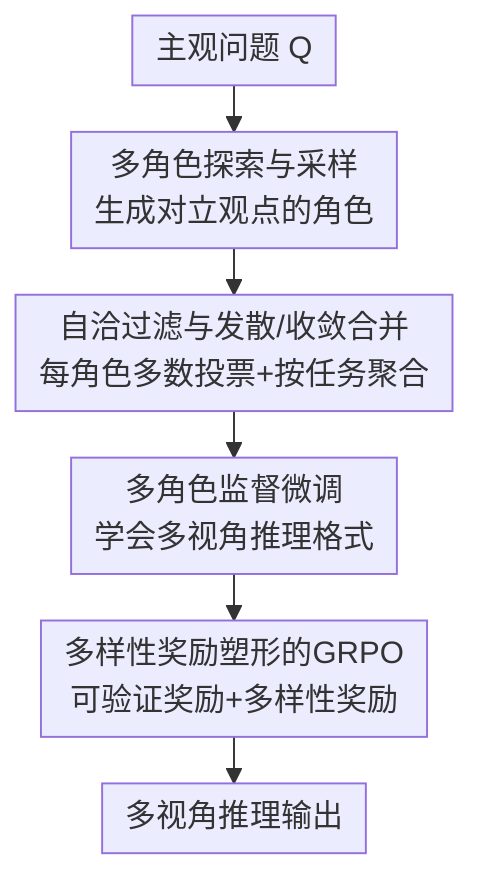

# Diversity-Enhanced Reasoning for Subjective Questions

**会议**: ICLR 2026  
**OpenReview**: [https://openreview.net/forum?id=1Bf0tToGT1](https://openreview.net/forum?id=1Bf0tToGT1)  
**代码**: https://github.com/yumeng-10/multirole-r1 (有)  
**领域**: LLM推理  
**关键词**: 主观推理, 多样性增强, 角色视角, GRPO, 奖励塑形

## 一句话总结
本文提出 MultiRole-R1，通过"角色视角多样性 + token 级多样性"两条线，把多个真实利益相关者立场的推理链合成进一份长 CoT 做无监督 SFT，再用带多样性奖励塑形的 GRPO 强化，让大推理模型在没有唯一正确答案的主观问题上同时提升准确率和多样性，平均涨 10.6% 准确率，还能泛化到 AIME 2024 等客观数学题。

## 研究背景与动机
**领域现状**：DeepSeek-R1、o1 这类大推理模型（LRM）靠长链思维 + 可验证奖励强化（RLVR）在数学、代码这类有唯一标准答案的客观任务上表现出色。

**现有痛点**：RLVR 有一个公认的副作用——它会**压缩生成多样性**，把模型逼向"收敛到唯一正确答案"的单一模式。但很多现实问题是**主观的**：答案随提问者的角色、立场、利益相关方而变，根本不存在唯一对错。客观领域的多样性增强方法都建立在"有一个 ground truth"的优化框架上，天然学的是"找那个对的答案"，没法生成"面向不同角色都成立的多种答案"。

**核心矛盾**：主观推理需要的是**语义层面的、锚定到真实人群立场的多样性**，而不是随机扰动出来的杂乱变化；但 RLVR 既压多样性，现有的客观多样性方法又对不上主观任务的"多答案"本质。已有针对主观问题的工作只有多智能体辩论和提示工程两类，**没有任何专门的训练方法**。

**本文目标**：设计一个能直接训练 LRM 做主观推理的框架，让它学会"该从哪些视角想"，并在推理时维持足够的多样性。

**切入角度**：作者把多样性拆成两层——(1) **视角/语义多样性**：用一组真实利益相关者角色提供"连贯的脚手架"，保证多样的输出语义相关、锚定到真实人群；(2) **token 级多样性**：拓宽推理链的搜索空间。作者还在 pilot 分析里发现，对主观任务来说更长的思考更好，但收益在约 3 个 "Wait"、3 个角色处饱和，于是定下"3 角色 + more-think"的配置。

**核心 idea**：用"多角色推理路径合成 + 多样性奖励塑形的 GRPO"把多样性同时注入数据和强化阶段，把多样性本身当成优化信号，而不是副产物。

## 方法详解

### 整体框架
给定一个主观问题 $Q$ 和推理模型 $M$，目标是产出一条**多元化的推理路径** $T$。MultiRole-R1 分两个阶段串行：**阶段 1** 增强视角多样性——让模型自己合成融合多个角色立场的推理链并做 SFT，教会它"不只是更深地想，还要从哪个视角想"；**阶段 2** 增强 token 级多样性——在 SFT 模型之上跑带多样性奖励塑形的 GRPO，把多样性当作可验证奖励之外的额外信号。整个流程**只用主观问题训练**，但最终能泛化到客观任务。

### 关键设计

**1. 多角色探索与采样：用相互对立的角色撑开视角空间**

主观问题的答案随立场而变，所以第一步是凑齐一组"会吵架的"角色。作者用 few-shot 提示让模型生成 $n$ 个与问题相关、且**观点互相冲突**的角色 $R=\{R_1,...,R_n\}$（领域专家、利益相关者、人设等），角色选择概率为 $P(R_i|Q)=\mathrm{softmax}(E[M(R_i|Q)]+\alpha E_{R_i}[1-\mathrm{sim}(R_i,R_j)])$，其中 $\mathrm{sim}(R_i,R_j)=\cos(h_{R_i},h_{R_j}|Q)$ 用 LLM embedding 余弦相似度衡量。这个式子的意图很直接：既要角色答案**和问题相关**（前一项），又要**和已有观点对立**（后一项的 $1-\mathrm{sim}$ 越大越优先）。这样合成的多样性不是随机噪声，而是锚定到真实人群、语义连贯的"视角脚手架"。pilot 分析显示角色数取 $n=3$ 是拐点，再加角色信息增益骤减。

**2. 自洽过滤与发散/收敛合并：先让每个角色站稳，再按任务类型聚合**

光采样会引入噪声，所以对每个角色 $R_i$ 用温度 $\tau=1$ 采 $k$ 条路径，再做**自洽过滤**——多数投票只保留最一致的那个答案：$\hat T_{R_i}=\arg\max_{T}\sum_{j=1}^{k}\mathbb{1}(T\equiv T^{(j)}_{R_i})$，$\equiv$ 表示语义等价。这一步把"同一角色内部"的抖动消掉，让不同角色的对立观点**各自独立又自洽**。拿到 $m$ 个过滤后的角色视角后，随机打乱角色顺序 $\Pi$ 拼成训练数据（消除位置偏置），并按任务分两种合并：**发散合并**（角色应给不同答案的任务，如 CALI、GLOQA，最终预测是各视角的加权聚合）和**收敛合并**（角色应趋于一致的任务，如 BBQ、ETHICS，链内多数投票取共识）。准确率评测也对应这两种 merging：发散 $\mathrm{Acc}_{div}=\frac1n\sum_i\mathbb{1}[a_i=g_i]$，收敛先聚合 $\hat a=\arg\max\sum_i\mathbb{1}(a_i=\hat a)$ 再比对 GT。

**3. 多角色监督微调：把"从哪个视角想"写进模型行为**

把合并后的多角色推理链拿来 SFT，让模型学会**自动按多角色格式推理**，而不是每次都从单一视角硬想。数据上还做了质量过滤：去掉长度处于头尾 10% 分位的回答（抑制冗长偏置和推理捷径），剔除格式错误样本，最终留 2700 条。作者特意对比了"自洽过滤"和"用 ground-truth 监督过滤"两种造数据方式——前者无监督、不依赖标注角色池，实验证明这种自蒸馏式的视角合成是主要性能来源。

**4. 多样性奖励塑形的 GRPO：把多样性当奖励信号注入强化**

第二阶段在 SFT 模型上跑 GRPO，奖励由两部分组成：**多角色感知的可验证奖励** $R_{acc}$（按角色检查答案正确性）和从文本算出的**多样性奖励** $R_{div}$，总奖励 $R=\delta R_{acc}+(1-\delta)R_{div}$。$R_{div}$ 是一个复合指标 $D_{final}=\sum_i\omega_i D_i$，加权融合了词汇、token 熵、句长、句式、相邻句、Yule's K、distinct N-gram、功能词共 8 个语言多样性信号。这遵循奖励塑形范式——辅助的 $R_{div}$ 引导学习但不改变最优策略。更关键的是一个机制性洞察：GRPO 算的是组内优势 $A_i=(R_{i,t}-\mu)/\sigma$，若一组采样奖励全 0 或全 1，优势归零、梯度消失、训练停滞；**加多样性项能保证组内奖励有方差**，让梯度始终信息丰富、优化得以持续。实验里还观察到准确率与多样性目标的**协同效应**，并缓解了 SFT 阶段的冗长和重复推理问题。

### 损失函数 / 训练策略
两阶段串行：阶段 1 在自洽过滤数据（2700 条）上做多角色 SFT（用 Llama-Factory）；阶段 2 用 GRPO 以 $R=\delta R_{acc}+(1-\delta)R_{div}$ 为奖励继续训练。骨干覆盖 R1-Distill-Qwen-7B/14B、R1-Distill-Llama-8B 和 Qwen3-8B（推理模式），全程只用 BBQ、GLOQA、ETHICS 三个主观任务训练。

## 实验关键数据

### 主实验
准确率（Acc，pass@1 %）与多样性（Div，长度归一化 %），以 R1-Distill-Qwen-7B 为例，ID = 训练域主观任务，OOD = 仅测试：

| 方法 | BBQ Acc | GLOQA Acc | ETHICS Acc | CALI(OOD) Acc | GSM8K(OOD) Acc |
|------|------|------|------|------|------|
| Zero-shot CoT | 62.45 | 32.62 | 51.82 | 50.30 | 80.48 |
| More think | 80.76 | 36.42 | 64.44 | 60.45 | 82.05 |
| SelfConsis SFT | 85.88 | 43.13 | 67.45 | 67.35 | 80.62 |
| SelfConsis SFT+DPO | 86.41 | 44.20 | 67.28 | 68.19 | 81.51 |
| SelfConsis SFT+GRPO | 94.30 | 47.22 | 69.50 | 70.83 | 85.58 |
| **MultiRole-R1 (SFT+GRPO-RS)** | **94.50** | **49.10** | 66.83 | **70.85** | **87.36** |

整体上 MultiRole-R1 较 zero-shot CoT 平均涨 **10.6% 准确率、18.3% 多样性**；ID 任务 +14.1%，OOD +7.64%，甚至在没训过的 AIME 2024 上 +5.78%。

### 消融实验

| 配置 | 作用 | 贡献 |
|------|------|------|
| 完整 MultiRole-R1 | SFT(自洽过滤) + GRPO(奖励塑形) | 平均 +10.6% |
| 仅多角色 SFT | 注入视角多样性 | 贡献 7.5%（主力） |
| GRPO 多样性奖励塑形 | 注入 token 级多样性 | 贡献 3.1% |
| 换 DPO（off-policy） | 对比 on-policy | 仅 +2.44%，远逊 GRPO 的 +19.73% |

### 关键发现
- **视角多样性是主驱动力**：10.6% 增益里 7.5% 来自 SFT 阶段的视角多样性，3.1% 来自 GRPO 的 token 级多样性——说明"该从哪些角度想"比单纯拓宽 token 搜索空间更重要。
- **on-policy 更适合多样性增强**：GRPO 比 DPO 又准又多样，作者归因于 DPO 的正负样本对格式无法建模主观问题"多个同等有效答案"的本质。
- **涨点来自多样性而非啰嗦**：SFT、SFT+GRPO、MultiRole-R1 的平均回答长度分别是 1572.9 / 849.5 / 657.8 词——准确率最高的反而最短，与"思考越长越好"的 test-time scaling 直觉相反。
- **多样性比长度更能预测准确率**：per-task 上 Acc-Div 相关系数 $r=0.74$，明显高于 Acc-Len 的 $r=0.55$。

## 亮点与洞察
- **把多样性从"副作用"翻成"奖励信号"**：RLVR 一直被诟病压多样性，本文反过来把多样性塞进奖励，既解决主观任务又顺带修了 GRPO 全对/全错组优势归零的训练停滞问题——一个设计治两个病。
- **角色 = 连贯脚手架**：用相互对立的真实角色来撑开多样性，比随机采样高明在"语义相关且锚定真实人群"，这个思路可迁移到任何需要"可控多样性"的生成任务（如多元化推荐、多立场摘要）。
- **更短反而更准**：颠覆了"长思考更强"的流行叙事，提示在主观/开放任务上，多样性可能是比推理长度更靠谱的优化目标。
- **纯主观训练泛化到客观数学**：只用主观题训却涨了 AIME，暗示视角多样性带来的探索能力是某种通用的推理增益。

## 局限与展望
- **角色与合并依赖人为先验**：角色数固定为 3、merging 策略要按任务类型预先指定（哪些数据集用发散/收敛是人工划的），换到没有清晰"角色依赖性"标注的新任务时如何自动判定尚不明确。
- **多样性指标偏语言表层**：8 个信号都是词汇/句式/熵这类语言学多样性，未必等同于"观点/语义多样性"，复合权重 $\omega_i$ 的选择也需调。
- **可验证奖励仍需答案信号**：$R_{acc}$ 依赖角色级别的答案正确性判定，对完全开放、连"角色内多数答案"都难界定的任务可能失效。
- **改进方向**：让角色数和 merging 策略随问题自适应；用更语义化的多样性度量替代表层语言指标；探索完全无可验证奖励的纯多样性主观任务。

## 相关工作与启发
- **vs 客观领域的多样性增强训练**（如 Song 2025a、Yan 2025）：他们在"有唯一 ground truth"的框架下增强多样性，本质仍是找一个对的答案；本文针对"多答案"的主观任务，是首个专门为主观推理设计的训练范式。
- **vs 多智能体辩论 / 提示工程**（主观问题的现有两类方法）：它们是推理时的临时手段、不训练模型；本文把多视角能力**训进权重**，无需推理时多模型协作。
- **vs budget-forcing / test-time scaling**（Muennighoff 2025）：他们靠拉长思考链涨点，本文证明在主观任务上多样性比长度更关键，且更短的链反而更准。
- **vs DPO 类 SFT+RL 管线**：DPO 的正负对格式对主观"多个等价正确答案"水土不服，on-policy 的 GRPO + 多样性奖励更契合。

## 评分
- 新颖性: ⭐⭐⭐⭐⭐ 首个针对主观推理的多样性增强训练范式，把多样性当奖励信号的视角很新
- 实验充分度: ⭐⭐⭐⭐ 4 个骨干 × 7 任务 + 充分消融与相关性分析，但角色/merging 的自动化未验证
- 写作质量: ⭐⭐⭐⭐ 两阶段动机清晰、pilot 分析铺垫到位，公式与指标定义完整
- 价值: ⭐⭐⭐⭐ 主观推理是被忽视的重要方向，方法可迁移到可控多样性生成

<!-- RELATED:START -->

## 相关论文

- [\[ICLR 2026\] Learning What Reinforcement Learning Can't: Interleaved Online Fine-Tuning for Hardest Questions](learning_what_reinforcement_learning_cant_interleaved_online_fine-tuning_for_har.md)
- [\[ICLR 2026\] Whatever Remains Must Be True: Filtering Drives Reasoning in LLMs, Shaping Diversity](whatever_remains_must_be_true_filtering_drives_reasoning_in_llms_shaping_diversi.md)
- [\[ACL 2026\] N-GRPO: Embedding-Level Neighbor Mixing for Enhanced Policy Optimization](../../ACL2026/llm_reasoning/n-grpo_embedding-level_neighbor_mixing_for_enhanced_policy_optimization.md)
- [\[CVPR 2026\] Agile Deliberation: Concept Deliberation for Subjective Visual Classification](../../CVPR2026/llm_reasoning/agile_deliberation_concept_deliberation_for_subjective_visual_classification.md)
- [\[CVPR 2026\] Rationale-Enhanced Decoding for Multi-modal Chain-of-Thought](../../CVPR2026/llm_reasoning/rationale-enhanced_decoding_for_multi-modal_chain-of-thought.md)

<!-- RELATED:END -->
