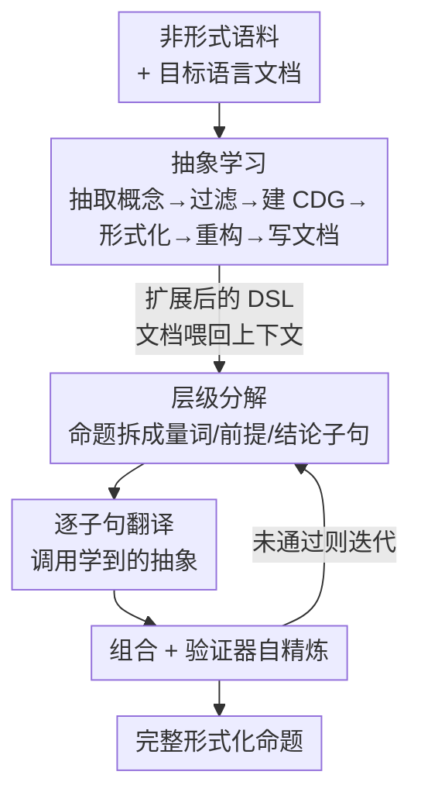

# Divide and Abstract: Autoformalization via Decomposition and Abstraction Learning

**会议**: ICLR2026  
**OpenReview**: [https://openreview.net/forum?id=NjgaeXNit3](https://openreview.net/forum?id=NjgaeXNit3)  
**代码**: https://github.com/marcusm117/DNA  
**领域**: LLM推理 / 自动形式化 / 神经符号  
**关键词**: 自动形式化, 抽象学习, 层级分解, 零训练, 定理证明

## 一句话总结
DNA 是一个无需训练的自动形式化框架，先从整个语料里抽取共性数学概念并把它们形式化成可复用的抽象、扩展目标形式语言，再把每条新命题层级分解成"量词+前提+结论"的子句逐条翻译再组合，在 LeanEuclidPlus 和 ProofNet-Hard 上相对基线最高取得 8.60× 的成功率提升。

## 研究背景与动机

**领域现状**：自动形式化（autoformalization）要把自然语言写的数学命题翻译成 Lean、Z3 这类定理证明器能机械验证的形式语言。主流做法是直接让 LLM 一步生成完整形式化，辅以检索（在推理前检索相关库定义）、微调专用 autoformalizer，或推理后用多数投票/语义一致性重排。

**现有痛点**：作者指出这些方法都受困于**泛化性**的三个根本挑战。其一，**受限于已有抽象**——形式化质量被目标语言库里现成抽象的丰富程度卡死。例如目标语言只有集合和实数的基础定义时，"拓扑空间是流形"几乎无法翻译；但若库里已有 `isManifold`，翻译就退化成一对一映射。现有方法重度依赖 Mathlib、Isabelle HOL 这类预定义库，覆盖不到的高层抽象就抓瞎。其二，**难以处理复杂命题**——即使抽象齐全，"从紧流形到 Banach 空间的连续函数空间在上确界范数下构成完备度量空间"这类嵌套命题需要正确组合多层抽象，而现有方法都让 LLM 在推理时一步吐出最终形式化，对嵌套量词、高阶对象、复合关系泛化很差。其三，**跨形式语言迁移弱**——微调过的 autoformalizer 重度训练在 Lean Mathlib 上，一旦目标是训练数据外的领域专用语言（DSL），甚至只是 Mathlib 升级了语法，性能就崩。

**核心矛盾**：根本原因是"直接生成"这一范式把"丰富抽象库"和"复杂命题翻译"两件难事压在一次 LLM 调用里，既无法补足库里缺的抽象，也无法拆解嵌套结构，于是被库的覆盖度和命题的复杂度同时卡死。

**本文目标**：让自动形式化在三个维度上都泛化——能自己补抽象、能拆解复杂命题、不依赖目标语言的训练数据。

**切入角度**：作者观察到两个被忽视的结构性事实——同一语料里的不同命题**共享大量数学概念**（对象、关系、函数的定义），且数学命题本身是**半结构化数据**（量词 + 体，体可拆成前提列表和结论列表，嵌套子句还能递归拆）。这两点分别对应"补抽象"和"拆命题"两条可行路径。

**核心 idea**：用"先抽象学习扩展语言、再层级分解逐句翻译"的两阶段流程，替代"一步直接生成"，且全程零训练（只靠把语言文档喂进上下文）。

## 方法详解

### 整体框架
DNA（Divide and Abstract）是一个零训练、即插即用的框架，分两个阶段。**阶段一（语言扩展）**：给定一份非形式语料和当前目标语言文档，DNA 从整个语料抽取共性数学概念，过滤掉目标语言已有的，构建概念依赖图（CDG），按拓扑序逐层把概念形式化成新定义，再做重构去冗余、生成文档，从而把目标 DSL 的抽象库"撑大"。**阶段二（命题形式化）**：对每条命题，先把它层级分解成带显式量词、前提、结论的半形式化结构，用阶段一学到的抽象逐子句翻译，再组合回完整形式化，最后用符号验证器反馈做自精炼。两个阶段的耦合点是文档——阶段一学到的新定义会被写回语言文档，作为阶段二 LLM 的上下文，于是 LLM 同时看到原始语言规范和一批可直接调用的高层定义。

### 关键设计

**1. 抽象学习：从语料挖共性概念，把目标语言"撑大"**

针对"受限于已有抽象"这个痛点。以往方法把每条命题独立形式化，DNA 反过来利用"同语料命题共享概念"的洞察：在语言扩展阶段，先从整个语料抽取共性的对象、关系、函数定义，形式化成一批可复用的抽象，等于给目标语言新增一批高层定义。这一阶段被拆成六个协同步骤：**Step 1 概念抽取**抽出非歧义、良定义、抽象（不绑定具体变量名或实例）的数学概念，分对象/关系/函数三类，并强制标注参数类型与个数；**Step 2 概念过滤**去重并剔除目标语言里已有的概念，作者刻意只看精确率（precision）而非召回——宁可多留下可能有用的抽象，也只删绝对明显的重复；**Step 3 CDG 构建**为每个概念分析它能否用现有定义直接表达、依赖哪些前置概念，节点分"叶节点（可直接形式化或在此语言内无法形式化）"和"依赖其他概念的父节点"，按拓扑序从叶往上逐层处理（Algorithm 1：用队列广度扩展依赖、已分析集合去重）；**Step 4 概念形式化**按 CDG 把概念翻成真正的形式定义，含必要的 helper 定义，迭代精炼保证语法正确；**Step 5 重构**消冗余、抽公共 helper，作者用压缩比（重构前定义数 / 重构后定义数，约 1.59）衡量复用效果，压缩比高意味着认知负担低、人和模型都更好用；**Step 6 文档更新**为学到的抽象生成简洁自然语言文档、隐去底层 helper 细节，因为文档里塞太多定义反而会随上下文增长把模型和人都搞晕。作者特别强调 CDG 构建本身就内蕴了概念分解，说明"抽象"和"分解"是互补的，单用任一个都达不到最优。

**2. 层级分解：把命题当半结构化数据递归拆开逐句翻译**

针对"难以处理复杂命题"这个痛点。命题不是无结构文本，而是"量词 + 体"，体又能拆成前提列表和结论列表，嵌套的量化子句还能同样递归拆。DNA 因此把一条命题层级分解成一棵非形式子句结构，逐个子句翻成形式对应物，再组合回完整形式化。由于阶段一已经学到了丰富的可复用抽象，单个子句的翻译比一次性翻整条复杂命题要 tractable 得多。这也是"组合多层抽象"的复杂度被拆散的关键：原本需要 LLM 在一次生成里同时管好嵌套量词、高阶对象、复合关系，现在变成对每个清晰子句做局部翻译。

**3. 四步精炼流水线：按错误类型对症下药**

针对阶段二的具体翻译错误。作者先对 200 个失败样例（Qwen3-235B 与 GPT-5 各 100）做错误分析，归出四类：验证错误（语法/逻辑一致性导致编译失败）、强/弱翻译（形式化比英文命题过强或过弱的语义偏移）、错误翻译（关系的形式对应物或参数错）、不忠实变量名。对应地，阶段二的四步逐一治理：**Step 1** 把命题分解成带显式量词、前提、结论的半形式化结构，让逻辑作用域精确匹配原文，治"强/弱翻译"；**Step 2** 用阶段一的抽象逐子句翻译，让模型专注于单个子句的正确形式对应物和参数（例如 LeanEuclidPlus 里 `formTriangle` 要求点 $a,b$ 在线 $l_1$、$b,c$ 在 $l_2$、$a,c$ 在 $l_3$ 的特定参数顺序，逐句翻译能避免参数次序错导致的逻辑矛盾），治"错误翻译"；**Step 3** 把形式化子句系统组合回完整命题，保证量词作用域和逻辑一致性，靠结构化组合降"验证错误"；**Step 4** 用符号验证器做自精炼，验证器同时查三件事——语法正确性、形式与自然语言间变量名的忠实性、逻辑一致性（前提非矛盾、结论非平凡），不像以往只靠编译器反馈，它给出有针对性的语义反馈引导 LLM 迭代修正，直到满足全部质量标准，同治"验证错误"和"不忠实变量名"。

**4. 零训练即插即用：只靠文档上下文条件化**

针对"跨语言迁移弱"这个痛点。DNA 全程不在目标形式语言上做任何训练，实现方式就是把目标语言文档放进 LLM 上下文；抽象学习阶段结束后，文档被更新进新学到的形式定义，再喂给命题形式化阶段，于是 LLM 同时被原始语言规范和一批可直接用的高层定义条件化。因为不依赖训练数据，DNA 对低资源 DSL 尤其有效——这正是微调过的专用 autoformalizer 完全失效的场景（ProofNet-Hard 上专用模型与 GPT-5 基线都是 0）。

### 一个完整示例
以 LeanEuclidPlus 里一条带嵌套量化的几何命题为例：阶段二先把它分解为"量词层（对所有点/线）→ 前提子句（若干点共线、若干三角形成立）→ 结论子句"。逐子句翻译时，"三点构成三角形"直接调用阶段一学到的 `formTriangle` 抽象，并按学到的参数约定（$a,b\in l_1$、$b,c\in l_2$、$a,c\in l_3$）填参；各形式子句再按原命题逻辑结构组合回完整命题。组合结果送入增强版 E3 符号验证器，若报"结论平凡"或"变量名不忠实"，反馈回 LLM 重新精炼对应子句，迭代至通过 pass@1 验证。整条链路无需任何针对 Lean 几何 DSL 的训练。

### 损失函数 / 训练策略
DNA 是零训练框架，无任何参数更新。阶段一中，LeanEuclidPlus 用 Qwen3-235B-Instruct 做概念抽取/过滤/CDG 构建，ProofNet-Hard 用高推理强度的 GPT-5；概念形式化、重构、文档生成两个 benchmark 都用高推理强度 GPT-5。推理超参：非推理模型温度 0.2、推理模型温度 1.0，每题采样 5 次；专用 autoformalizer 给 1024 token，普通模型 6144 token，推理模型 12288 token；所有模型都给标准化 1-shot 示例演示完整流水线。

## 实验关键数据

### 主实验
评测基准为 **LeanEuclidPlus**（改自 LeanEuclid 的欧氏几何 DSL，100 核心题 + 40 道更复杂的手工题）和 **ProofNet-Hard**（19 道需要标准 Mathlib 之外辅助定义的硬题）。用符号等价检查器严格评测（ProofNet-Hard 用 BEq+，LeanEuclidPlus 用增强三段预检的 E3），报 pass@1。

| 模型 | 基准 | Baseline | DNA | 提升 |
|------|------|----------|-----|------|
| Qwen3-14B | LeanEuclidPlus | 1.0 | 9.6 | ↑8.60× |
| GPT-4.1-mini | LeanEuclidPlus | 4.8 | 42.4 | ↑7.83× |
| Qwen3-32B | LeanEuclidPlus | 4.6 | 20.6 | ↑3.48× |
| Claude-4-Sonnet | LeanEuclidPlus | 34.2 | 58.2 | ↑70.2% |
| 非推理模型平均 | LeanEuclidPlus | 18.7 | 40.6 | ↑1.17× |
| 推理模型平均 | LeanEuclidPlus | 31.5 | 51.1 | ↑62.2% |
| 各模型 | ProofNet-Hard | 0.0 | >0 | 从全 0 到可解 |

在 ProofNet-Hard 上所有基线（含微调专用模型和 GPT-5 高推理）成功率都是 0，DNA 让它们首次能成功形式化，凸显其对低资源 DSL 的价值。小模型增益尤其显著：Qwen3-14B 仅 1.0 → 9.6，GPT-4.1-mini 逼近 GPT-4.1，说明 DNA 让小模型匹敌大得多的基线模型。

### 消融实验
DNA 天然可拆成两阶段，作者系统消融：`Divide` 只开阶段二（分解+自精炼，用原始文档无新抽象），`Abstract` 只开阶段一（扩抽象库但直接生成无分解），`DNA` 两者全开；另设 `OracleA`（人工专家写的抽象）和 `DNOracleA`（oracle 抽象 + 四步流水线）作上界。

| 配置（非推理平均，LeanEuclidPlus） | pass@1 | 说明 |
|------|---------|------|
| Baseline | 18.7 | 直接生成 |
| Abstract（仅阶段一） | 20.9 | 只扩抽象库 |
| Divide（仅阶段二） | 28.9 | 只做分解 |
| DNA（完整） | 40.6 | 两阶段协同 |
| DNOracleA（oracle 抽象 + 分解） | 46.9 | 理论上界 |

### 关键发现
- **抽象与分解互补、协同 > 各自单用**：Divide（28.9）和 Abstract（20.9）单独都远不如 DNA（40.6），且 DNA 常常超过只给 oracle 抽象的 OracleA，说明四步分解流水线本身贡献很大，CDG 构建中内蕴的分解与抽象学习相辅相成。
- **对小模型/低资源 DSL 增益最大**：Qwen3-14B 取得 8.60× 的最大相对提升；ProofNet-Hard 上从全 0 变为可解，正是微调模型完全失效之处。
- **错误分析驱动设计**：四步流水线精确对应四类错误中的三类（强/弱翻译、错误翻译、验证错误、不忠实变量名），是"先诊断再开方"的范例。
- **阶段一各步质量高且稳**：概念抽取召回 94.44%、各步正确率 97–100%，重构压缩比约 1.59，文档质量经下游编译率验证（Qwen3-235B 均值 97.4%、GPT-5 均值 99.8%，方差极低）。

## 亮点与洞察
- **把"补抽象"提到与"翻译"同等地位**：以往都假设库是给定的，DNA 让系统先自己从语料里学一批可复用抽象再翻译，直接打破"受限于已有抽象"的天花板——这套"先扩展语言再使用语言"的思路可迁移到任何受限于固定 API/库的代码生成任务。
- **用命题的半结构化先验做分解**：把"量词+前提+结论"当成可递归拆的语法树，而不是当无结构文本硬翻，让 LLM 每次只处理一个清晰子句，巧妙地把"组合多层抽象"的复杂度摊薄。
- **语义级验证器反馈替代纯编译器反馈**：验证器查语法+变量名忠实+逻辑一致（前提非矛盾、结论非平凡），给的是定向语义反馈而非"编译过/不过"，这种自精炼信号设计可复用到任何带形式检查的生成-修正循环。
- **零训练带来的迁移性**：全靠文档上下文条件化，换 DSL 只换文档，省掉重训，对低资源形式语言是务实的工程优势。

## 局限与展望
- **重度依赖大模型与多次 LLM 调用**：阶段一六步、阶段二四步，且形式化/重构/文档用高推理强度 GPT-5，整体成本和延迟较高，论文未报推理开销。
- **人工评测占比高**：概念抽取/过滤/CDG/形式化的正确率都靠人工判定（因无可靠自动语义等价检查器），难以大规模复现与扩展。
- **评测规模有限**：ProofNet-Hard 仅 19 题、LeanEuclidPlus 100+40 题，且集中在几何/数学命题；跨更广领域 DSL 的泛化尚待验证。
- **改进方向**：把抽象学习做成增量式（随语料持续扩库）、用更轻量模型替换 GPT-5 降本、引入更可靠的自动语义等价检查以减少人工评测依赖。

## 相关工作与启发
- **vs 直接生成 / 微调 autoformalizer（Kimina、Mathesis）**：它们让 LLM 一步生成或重度训练在 Mathlib 上，DNA 改成"先学抽象再分解翻译"且零训练；在训练分布内（Lean Mathlib）微调模型仍强，但一旦目标是分布外 DSL，微调模型在 ProofNet-Hard 上几乎全 0，DNA 反而能解。
- **vs 检索增强 / 推理后处理（多数投票、语义重排）**：它们在固定库内检索或对多次采样做后处理，不改变库本身的抽象覆盖；DNA 直接扩展库的抽象，从源头解决"库不够丰富"。
- **vs 朴素链式分解**：单纯让模型"分步推理"不等于把命题按语法结构分解；DNA 的分解锚定在"量词/前提/结论"的半结构化先验上，并配合学到的抽象逐句翻译，比泛泛的 step-by-step 提示更结构化。

## 评分
- 新颖性: ⭐⭐⭐⭐⭐ "抽象学习 + 层级分解 + 零训练"三位一体直击自动形式化泛化性的三个根本挑战，思路清晰且有结构。
- 实验充分度: ⭐⭐⭐⭐ 跨三大模型族、两基准、含 Divide/Abstract/Oracle 的系统消融与错误分析，但基准题量偏小、缺成本分析。
- 写作质量: ⭐⭐⭐⭐⭐ 挑战—设计一一对应，阶段/步骤拆解清楚，错误分析驱动设计的叙事很有说服力。
- 价值: ⭐⭐⭐⭐⭐ 对低资源 DSL 从"全 0"到"可解"，且让小模型匹敌大模型，对定理证明数据合成与形式化验证有实际意义。

<!-- RELATED:START -->

## 相关论文

- [\[ICLR 2026\] LoC-Decomp: LLM Autoformalization via Logical Concept Decomposition and Iterative Feedback Correction](loc-decomp_llm_autoformalization_via_logical_concept_decomposition_and_iterative.md)
- [\[ICLR 2026\] ProofFlow: A Dependency Graph Approach to Faithful Proof Autoformalization](proofflow_a_dependency_graph_approach_to_faithful_proof_autoformalization.md)
- [\[ICLR 2026\] ReForm: Reflective Autoformalization with Prospective Bounded Sequence Optimization](reform_reflective_autoformalization_with_prospective_bounded_sequence_optimizati.md)
- [\[ICLR 2026\] Is In-Context Learning Learning?](is_in-context_learning_learning.md)
- [\[ICLR 2026\] From Abstract to Contextual: What LLMs Still Cannot Do in Mathematics](from_abstract_to_contextual_what_llms_still_cannot_do_in_math_word_problem_solvi.md)

<!-- RELATED:END -->
