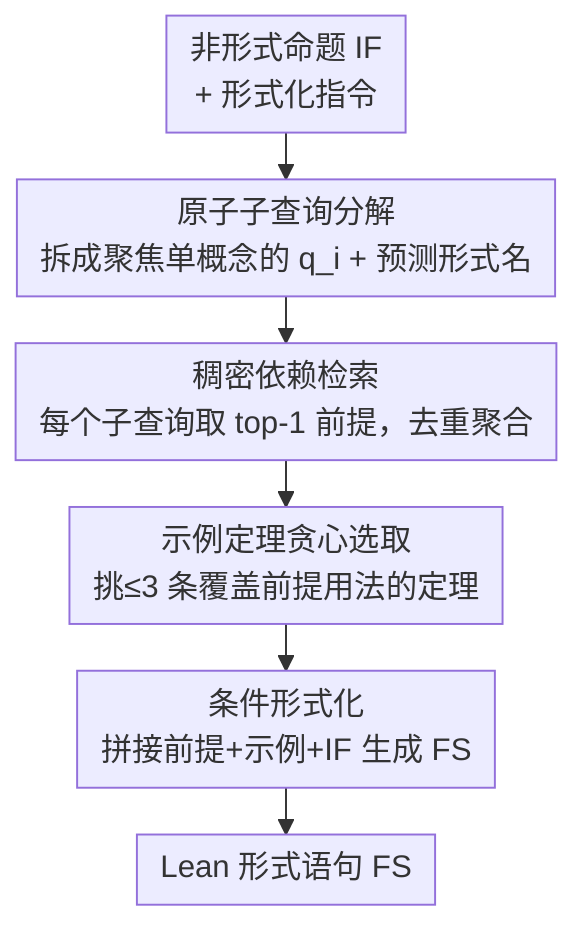

# DRIFT: Decompose, Retrieve, Illustrate, then Formalize Theorems

**会议**: ICLR2026  
**OpenReview**: [https://openreview.net/forum?id=IGEs577RFz](https://openreview.net/forum?id=IGEs577RFz)  
**代码**: https://github.com/Formal-Math-Reasoning/DRIFT  
**领域**: LLM推理 / 自动形式化 / 定理证明  
**关键词**: 自动形式化, 依赖检索, 查询分解, Lean, Mathlib

## 一句话总结
DRIFT 把"把自然语言数学命题翻译成 Lean 形式语句"这件事拆成"分解→检索→举例→形式化"四步：先让 LLM 把信息密集的非形式命题拆成一个个聚焦单一概念的原子子查询，逐个检索 Mathlib 里精确的形式定义，再用贪心算法挑几条真正用到这些定义的示例定理把"用法"补上，最后喂给 formalizer 生成形式语句，在 ProofNet 上把依赖检索 F1 几乎翻倍、在 OOD 的 ConNF 上 BEq+@10 暴涨 55 个点甚至反超 oracle。

## 研究背景与动机

**领域现状**：自动形式化（autoformalization）是把自然语言写的数学命题翻译成 Lean / Isabelle / Rocq 这类机器可验证的形式语句，是迈向自动定理证明的关键一步。直接用 LLM 离线做这件事效果很差，因为形式语言语法极严、非形式概念与形式定义之间要精确对齐；而靠合成数据微调又会撞上 Mathlib 这类形式库不断更新带来的"知识截断"——微调模型会幻觉出已被重命名 / 重组 / 弃用的形式对象。于是检索增强（retrieval-augmented）成了主流：测试时动态从外部库检索相关定理/定义喂给模型。

**现有痛点**：现有检索增强方法把**整条非形式命题当成一个单体查询（monolithic query）**直接去检索。Liu et al. (2025) 的 RAutoformalizer 提出了"依赖检索（dependency retrieval）"范式——专门检索形式化所需的精确底层定义（如 `IsPrimitiveRoot`、`ZMod`），比检索相似定理更对症。但它仍有两个根本缺陷：其一，非形式命题往往信息密集、含多个数学概念，把整句压成一个稠密向量会造成"表示瓶颈"，只能捕到最显著的概念，丢掉细节；其二，就算检索到了正确定义，模型也不知道这个定义在语法上**怎么用**（比如检索到 `def ZMod : ℕ → Type`，但不知道怎么声明 `a : ZMod p`），这是 LLM 生成语句出语法/结构错误的主要来源。

**核心矛盾**：依赖检索为了精确，把目标缩到"单个原子定义"，却**丢掉了完整定理语句提供的上下文用法**；而单体查询的粒度又跟"原子定义"这种被索引文档的粒度对不上。精确性和用法上下文成了一对 trade-off。

**本文目标**：(1) 让查询粒度匹配被检索的原子定义粒度；(2) 在检索到定义之外，把"这个定义在真实定理里怎么用"也补给模型。

**切入角度**：作者借鉴信息检索里的查询增强思路——多跳问答里"查询分解（query decomposition）"能把复杂问题拆成子查询、让粒度匹配索引文档。这套思路在自动形式化的依赖检索上还没人系统用过；而且通用查询增强不懂定理内部的严格依赖结构，需要专门适配。

**核心 idea**：用"原子分解 + 用法举例"改造检索增强自动形式化——先把非形式命题分解成聚焦单一概念的原子子查询去做精确依赖检索，再用基于已检索前提的示例定理（而非泛泛的相似定理）补上语法用法。

## 方法详解

### 整体框架
DRIFT 是一条四阶段串行流水线，输入是一条非形式命题 IF（自然语言数学陈述 + 形式化指令），输出是 Lean 形式语句 FS。四步顺序为：① **Decompose**——LLM 把 IF 拆成 $n$ 个原子子查询 $Q=\{(q_i,\hat l_i)\}$，每个聚焦一个数学概念；② **Retrieve**——对每个子查询用稠密检索器从形式库（Mathlib / con-nf）取 top-1 前提，去重后聚合成前提集 $R_{\text{DRIFT}}$；③ **Illustrate**——用贪心覆盖算法从库里挑至多 $m=3$ 条真正用到这些前提的示例定理 $T$，给模型演示用法；④ **Formalize Theorems**——把指令、前提、示例定理、原始命题拼成上下文 $C$，让 formalizer 生成 FS。整个框架与具体模型解耦：decomposer 和 formalizer 都可以换成前沿通用 LLM（GPT-4.1、DeepSeek-V3.1、Claude-Opus-4）或专用形式化模型（Goedel-V2-8B），检索器是固定的微调 DPR。

### 关键设计

**1. 原子子查询分解：把信息密集的命题拆成单概念查询，匹配定义粒度**

针对"整句当单体查询、表示瓶颈丢细节"的痛点，Decompose 模块让 LLM 把非形式命题 IF 拆成一组结构化子查询 $\text{Decomposer}(IF)\to Q=\{(q_i,\hat l_i)\}_{i=1}^n$，子查询数 $n$ 不固定、由 decomposer 动态决定（实测平均 5.21~6.42 个）。每个子查询 $(q_i,\hat l_i)$ 只隔离一个数学概念：$q_i$ 是描述概念的自然语言短语（如"形如 $4t+3$ 的素数 $p$ 是除以 4 余 3 的素数"），$\hat l_i$ 是 decomposer 用自身参数知识**预测的形式表示**（如 `p : ℕ` 满足 `Nat.Prime p` 且 `p % 4 = 3`）。追加这个预测形式名是一石二鸟：一来探测了 LLM 对该概念的参数知识、给检索一个语法"锚点"；二来让检索器能**同时利用 $q_i$ 的语义和 $\hat l_i$ 的语法线索**去定位正确前提——即使预测的形式名有小错也无妨。作者用 Putnam 基准里 5 个人工验证的少样本例子做 prompt，跨所有前沿模型用同一模板（不做模型特化），保证通用性。

**2. 子查询级稠密依赖检索：一对一映射到精确形式前提**

每个原子子查询要找到库里对应的"依赖前提"。检索器是一个 BGE-M3 编码器 $E_\theta$ 实现的稠密段落检索器（DPR），在 Liu et al. (2025) 的依赖检索任务上微调过——这个训练目标把非形式命题对齐到它的形式依赖，使语义相似度成为逻辑依赖的强代理。所有形式对象 $p\in D$ 的向量 $\mathbf p=E_\theta(p)$ 离线预计算并建索引；推理时把子查询编码成 $\mathbf q_i=E_\theta(Q_i)$，取与之余弦相似度最大的前提：

$$p_i=\arg\max_{p\in D}\ \phi(\mathbf q_i,\mathbf p),\qquad \phi(\mathbf q_i,\mathbf p)=\frac{\mathbf q_i\cdot\mathbf p}{\|\mathbf q_i\|\,\|\mathbf p\|}$$

最终前提集是各子查询 top-1 去重的并集 $R_{\text{DRIFT}}=\bigcup_{i=1}^n\{p_i\}$。和固定取 top-5 的 DPR baseline 不同，DRIFT 的检索数量是**动态**的、上限为子查询数 $n$。这一步把"一条复杂查询 → 多个精确原子定义"的难题，转成了"$n$ 条简单查询各取一个定义"的聚焦检索。

**3. 贪心覆盖式示例定理选取：用"真实用法"补上定义与语法之间的鸿沟**

光有定义不够——`def ZMod : ℕ → Type` 告诉你概念是什么，却没教你怎么声明 `a : ZMod p`，这道"定义↔用法"的鸿沟正是语法错误的源头。Illustrate 模块输入检索到的前提集 $R_{\text{DRIFT}}$ 和预算 $m$，输出一小组示例定理 $T$（$|T|\le m$），用贪心算法**最大化对前提的覆盖**。先把库里所有"至少用到一个 $R_{\text{DRIFT}}$ 前提"的定理编成候选集 $T_{\text{cand}}$，并按其非形式语句与原命题的语义相似度 $s(t)=\phi(E_\theta(IF_t),E_\theta(IF))$ 降序预排（兼作确定性打破平局）。然后从空集迭代，每步选边际增益最大（即新覆盖前提最多）的定理：

$$t_j=\arg\max_{t\in T_{\text{cand}}\setminus T_{j-1}}\ \big|\,P(t)\cap(R_{\text{DRIFT}}\setminus P_{\text{cov},j-1})\,\big|$$

其中 $P(t)$ 是定理 $t$ 用到的前提集；选中后更新 $T_j=T_{j-1}\cup\{t_j\}$、$P_{\text{cov},j}=P_{\text{cov},j-1}\cup(P(t_j)\cap R_{\text{DRIFT}})$。直到选满 $m$ 条或没有候选还能带来新覆盖（边际增益为 0）就停。和"按相似度选相似定理"的旧做法本质不同：DRIFT 的选取是**以已检索前提为条件**的，保证选出的定理真正演示了那些定义所需的语法用法。实测 $m=3$ 时就能覆盖 74.59% 的前提（这个值正是看边际收益递减选的）。

**4. 条件形式化：把前提与示例拼成上下文驱动生成**

最后一步把所有检索到的上下文按固定顺序拼接 $C=I\oplus R_{\text{DRIFT}}\oplus T\oplus IF$（$I$ 是形式化指令、$\oplus$ 是拼接），交给 formalizer 生成 $FS=\text{Formalizer}(C)$。每个前提附上完整名称、形式声明和源码；每条示例定理以"非形式语句 + 形式语句"成对给出——既演示了非形式到形式的对齐，又演示了前提在一个完整定理实例里的具体用法。这个模块同样灵活：可以用微调模型也可以用通用 LLM。

### 一个完整示例
以 Ireland-Rosen 习题 4.5 为例（"设 $p$ 是形如 $4t+3$ 的素数，证明 $a$ 是模 $p$ 的原根当且仅当 $-a$ 的阶为 $(p-1)/2$"）：① Decompose 把它拆成 6 个子查询——Q1"素数 $p$"、Q2"模 $p$ 原根"、Q3"模算术里的取负 $-a$"、Q4"$-a$ 的阶为 $(p-1)/2$"、Q5"双条件命题"、Q6"乘法阶 `orderOf`"，每个都带预测形式名。② Retrieve 逐个映射到精确前提 `PNat.Prime`、`IsPrimitiveRoot`、`ZMod`、`orderOf`、`primitiveRoots` 等。③ Illustrate 贪心选出 3 条真正用到这些前提的定理（如"Theorem 2 ... `orderOf a ∣ p-1`"演示 `orderOf` 用法）。④ Formalize 把这些前提+示例+原句拼起来，让 LLM 生成最终带 `IsPrimitiveRoot a p ↔ orderOf (-a : (ZMod p)ˣ) = ...` 的 Lean 语句。整条链把原本一句模糊检索做不准的命题，拆成了可逐个命中的精确检索 + 用法演示。

## 实验关键数据

### 主实验
在三个基准上评测：ProofNet（in-distribution，374 题，平均 3.39 依赖）、MiniF2F-test（self-contained，224 题，平均仅 0.43 依赖）、ConNF（OOD，961 题研究级定理，平均 3.92 依赖，基于 con-nf 库且不与 Mathlib 集成）。检索质量用 Precision/Recall/F1 衡量，形式化用 Typecheck（语法正确率）和 BEq+（符号化双向等价、与人类判断 Pearson 0.974）衡量，pass@1 / pass@10。

依赖检索（vs 无分解单体查询 baseline，F1 %）：

| 基准 | Decomposer | 无分解 F1 | DRIFT F1 | 提升 |
|------|-----------|-----------|----------|------|
| ProofNet | DeepSeek-V3.1 | 13.77 | 27.01 | +13.24（近翻倍） |
| ProofNet | Claude-Opus-4 | 13.77 | 27.68 | +13.91 |
| ConNF | DeepSeek-V3.1 | 28.17 | 36.88 | +8.71 |
| MiniF2F-test | Claude-Opus-4 | 0.66 | 3.83 | +3.17 |

跨所有 decomposer 平均，DRIFT 在 ProofNet / MiniF2F / ConNF 上 F1 分别绝对提升 13.34 / 2.08 / 7.74 点。前沿模型作为 decomposer 基本可互换（最优模型间任一基准上 F1 差距≤2.05%）。

形式化（BEq+@10 %，对比 zero-shot / DPR(RAuto) / oracle*）：

| 基准 | Formalizer | Zero-shot | DPR(RAuto) | DRIFT | oracle* |
|------|-----------|-----------|-----------|-------|---------|
| ProofNet | GPT-4.1 | 13.37 | 19.25 | **21.93** | 27.54 |
| ConNF | GPT-4.1 | 6.76 | 20.08 | **62.33** | 58.90 |
| ConNF | DeepSeek-V3.1 | 11.03 | 17.07 | **54.21** | 55.15 |

最亮眼的是 OOD 的 ConNF：GPT-4.1 用 DRIFT 把 BEq+@10 从 zero-shot 的 6.76% 拉到 62.33%（+55.57），**反超 oracle* 3.43 个点**——因为 oracle* 只给参考语句所需的"必要前提"，而 DRIFT 的示例定理额外提供了关键的用法演示。

### 消融实验

| 配置（GPT-4.1, ConNF, BEq+@1） | 数值 | 相对 DRIFT |
|------|------|-----------|
| DRIFT（完整） | 54.84 | — |
| w/o Illustrate | 35.90 | −18.94 |
| w/o Decompose | 46.72 | −8.12 |
| w/o Retrieval | 4.47 | −50.37 |

### 关键发现
- **检索本身贡献最大**：去掉检索（w/o Retrieval = zero-shot）在 ConNF 上 BEq+@1 暴跌 50.37，说明 OOD 场景模型严重缺知识、检索是命门。
- **Illustrate 在 OOD 上极关键**：去掉示例定理在 ConNF 掉 18.94（GPT-4.1）/17.38（DeepSeek），但在 in-distribution 的 MiniF2F 上反而几乎无损甚至略升——印证"用法演示"主要在模型不熟的领域才救命。
- **检索效用取决于"模型知识边界 vs 命题复杂度"的差距**：MiniF2F 平均仅 0.43 依赖，zero-shot 与 oracle* 差距极小，此时检索上下文反而可能成为干扰（force-fitting、过度复杂化）；专用模型 Goedel-V2-8B 在 MiniF2F 上被 DPR(RAuto) 严重干扰（BEq+@10 从 93.33 崩到 26.67），而 DRIFT 保持 93.33 不掉。
- **分解能力与形式化能力是两种不同能力**：前沿模型作为 decomposer 可互换，但 formalizer 阶段差异明显——GPT-4.1 更擅长 in-context 综合检索信息，DeepSeek-V3.1 zero-shot 参数知识更强但引入检索后在 OOD 上被 GPT-4.1 反超。

## 亮点与洞察
- **把信息检索的"查询分解"第一次系统搬进自动形式化的依赖检索**：核心洞察是"非形式命题的粒度 ≠ 原子形式定义的粒度"，分解后让两者对齐，检索 F1 直接近翻倍——这个粒度匹配视角可迁移到任何"复杂查询 vs 细粒度文档"的检索场景。
- **"以检索结果为条件选示例"而非"选相似示例"**：贪心覆盖算法保证挑出的定理真的演示了所需前提的用法，补上了"定义↔语法用法"的鸿沟，这是 DRIFT 在 OOD 反超 oracle 的关键——oracle 只给"对的前提"，DRIFT 给"对的前提 + 怎么用"。
- **预测形式名 $\hat l_i$ 当语法锚点**：分解时让 LLM 顺手预测形式表示，既探测参数知识又给检索器语法线索，即便预测有小错也能靠语义+语法双信号纠回来——一个很巧的"软锚点"设计。
- **揭示自适应检索的必要性**：检索不是越多越好，低依赖任务里上下文会变干扰，应按"模型知识边界与命题复杂度的差距"动态决定要不要检索、检索多少。

## 局限与展望
- **检索可能成为干扰**：在低依赖的 MiniF2F 上，检索上下文反而拉低性能（force-fitting / over-complication），DRIFT 虽比 DPR 鲁棒但也没能在该基准稳定超越 zero-shot，说明"何时该检索"还没解决——作者也明确指出需要自适应检索策略。
- **依赖前沿 LLM 做分解**：分解质量直接决定下游检索，整条链要靠 GPT-4.1 / Claude 这类强模型；专用模型 Goedel-V2-8B 甚至无法遵循分解指令，只能当 formalizer。
- **检索器仍是固定微调 DPR**：检索器在 Mathlib 上微调，ConNF 对它也是 OOD；虽然结果不错，但检索器本身的 OOD 泛化能力没有专门优化。
- **ConNF 污染无法完全排除**：作者只能说 zero-shot 结果无污染迹象，但拿不到训练数据无法彻底验证。
- 改进思路：把"是否检索 / 检索预算 $m$"做成可学习的自适应策略；让 decomposer 也能轻量微调；把 Illustrate 的贪心覆盖换成考虑"难度/多样性"的更优选择。

## 相关工作与启发
- **vs RAutoformalizer (RAuto / DPR, Liu et al. 2025)**：RAuto 首提依赖检索范式、用固定 top-5 单体查询，DRIFT 沿用它的检索器但改成原子子查询分解 + 动态数量 + 示例定理增强；本文在 ProofNet/ConNF 全面超过 DPR baseline，尤其 ConNF 上拉开 40+ 点。
- **vs 相似定理检索（ProofNet k-NN / MS-RAG / LeanSearch）**：它们返回语义相似定理当 few-shot 例子，但只评相似检索不评下游形式化；DRIFT 的依赖检索直接targ 底层精确定义，且示例定理是以前提为条件选的而非纯相似。
- **vs 通用查询增强（Query2Doc / HyDE / 多跳 QA 的查询分解）**：这些方法不懂定理内部严格的依赖结构，DRIFT 用原子分解把数学概念直接映射到形式定义，是首个把分解用到非形式数学命题自动形式化的工作。
- **vs CRAMF (Lu et al. 2025)**：CRAMF 尝试在抽象层次间做概念映射，但仍把复杂命题当单体查询、不拆分其中的不同数学概念。

## 评分
- 新颖性: ⭐⭐⭐⭐⭐ 首次把查询分解+条件式用法举例系统引入自动形式化依赖检索，视角清晰
- 实验充分度: ⭐⭐⭐⭐⭐ 三基准×多模型×in/OOD×内在/外在指标，消融彻底，还分析了检索的"干扰"边界
- 写作质量: ⭐⭐⭐⭐ 框架与分析都讲得透，OOD 反超 oracle 的解释有说服力
- 价值: ⭐⭐⭐⭐⭐ 直接刷新依赖检索与自动形式化 SOTA，方法即插即用、模型无关，对定理证明流水线有实用价值

<!-- RELATED:START -->

## 相关论文

- [\[ICLR 2026\] Characterizing and Mitigating Reasoning Drift in Large Language Models](characterizing_and_mitigating_reasoning_drift_in_large_language_models.md)
- [\[ACL 2025\] Aristotle: Mastering Logical Reasoning with A Logic-Complete Decompose-Search-Resolve Framework](../../ACL2025/llm_reasoning/aristotle_logical_reasoning.md)
- [\[ICLR 2026\] FATE: A Formal Benchmark Series for Frontier Algebra of Multiple Difficulty Levels](fate_a_formal_benchmark_series_for_frontier_algebra_of_multiple_difficulty_level.md)
- [\[ICLR 2026\] Divide and Abstract: Autoformalization via Decomposition and Abstraction Learning](divide_and_abstract_autoformalization_via_decomposition_and_abstraction_learning.md)
- [\[ICLR 2026\] LogicReward: Incentivizing LLM Reasoning via Step-Wise Logical Supervision](logicreward_incentivizing_llm_reasoning_via_step-wise_logical_supervision.md)

<!-- RELATED:END -->
