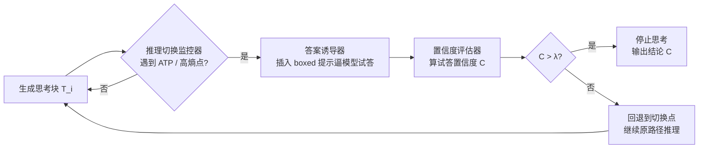

# Dynamic Early Exit in Reasoning Models

**会议**: ICLR 2026  
**arXiv**: [https://openreview.net/forum?id=NpU7ZXafRi](https://openreview.net/forum?id=NpU7ZXafRi)  
**代码**: [https://github.com/iie-ycx/DEER](https://github.com/iie-ycx/DEER)  
**领域**: LLM 推理 / 高效推理  
**关键词**: 大推理模型, 长链思维, 过度思考, 动态早停, 训练无关, 测试时计算  

## 一句话总结
DEER 让大推理模型在思维链的"思路切换点"试着提前作答，用试探答案的置信度判断是否已经"想够了"，从而无需训练即可动态早停，在 11 个模型、10 个基准上把 CoT 长度平均压缩 19.1%~80.1% 的同时还提升了 0.3%~5.0% 的准确率。

## 研究背景与动机
**领域现状**：以 DeepSeek-R1、GPT-o1 为代表的大推理模型（LRM）靠测试时扩展（test-time scaling），通过生成更长的链式思维（CoT）来攻克复杂任务，长思考几乎成了"系统 2"推理的标配。

**现有痛点**：但超长 CoT 带来两个问题。一是效率，冗长的推理显著增加计算开销和延迟，难以部署在算力敏感场景；二是准确率，模型存在内在的"过度思考"（overthinking），持续生成啰嗦、重复甚至无关的推理步骤，反而从正确路径上"想偏"到错误结论。论文在 AIME24 上的统计（图 1）显示，约 **75%** 的样本存在所谓"珍珠推理"（Pearl Reasoning）——即在某个中间点就提前作答能得到正确答案，其中 36.7% 的样本只需不到一半的推理路径就够了；甚至有一批题（如第 11、19、26 题）只有提前退出才能答对，继续想下去反而答错。

**核心矛盾**：既然每道题都存在一个"信息恰好充分"的临界点，那固定启发式（比如砍到固定 token 预算、固定比例退出）注定是次优的——MATH 上最佳退出点在 40% 处、GPQA 在 50% 处，且因题而异、与题目难度强相关。**需要一个能逐题动态决定何时停的机制，而不是一刀切。**

**本文目标**：在不额外训练、不改模型权重的前提下，让 LRM 自己在生成过程中识别"珍珠推理"临界点并主动截断，同时兼顾准确率和效率。

**核心 idea**：**[置信度即信号]** 作者观察到——当推理不完整或有缺陷时，逼模型此刻作答，它给出的试探答案置信度会明显偏低；而当推理已经充分自洽时，试探答案的置信度会很高。也就是说，模型其实"隐式地知道"自己想没想够，只是推理时缺一个把这种自我感知转成显式早停决策的机制。DEER 就是来补这个缺口：在思路切换处插入一次"试答 → 测置信度 → 决定停不停"的循环。

## 方法详解

### 整体框架
DEER（Dynamic Early Exit in Reasoning）是一个训练无关、即插即用的推理时干预流程，由三个串联模块组成：**推理切换监控器**找到候选退出点 → **答案诱导器**在该点逼模型生成试探答案 → **置信度评估器**算出试答置信度并与阈值 $\lambda$ 比较，高于阈值就收束输出结论、低于则回退（traceback）继续沿原路径思考。其设计前提是 LRM 的"系统 2"生成范式：输出被 `<think>`/`</think>` 分成慢思考与结论两段，慢思考内部又由 "Wait"、"Alternatively" 这类动作切换点（ATP）划分成一个个思考块。

### 关键设计

**1. 推理切换监控器：在"思路要拐弯"的地方抓退出机会**。DEER 不是在任意 token 处都尝试早停，而是只盯着思维链里思路发生切换的关键时刻，因为这些点才是"一个思考块已经走完、下一个还没开始"的自然边界。论文给了两条可选路线：一是**语言标记法**，直接把模型自己爱写的 ATP（如 "Wait"、"Alternatively"）当作候选退出点，简单到几乎零成本；二是**基于熵的方法**，以 "\n\n" 划分推理步，对每步首 token 算熵 $H(p(\cdot|x_{<t}))$，低熵说明模型在稳定地"按部就班执行"，高熵则说明它在权衡下一步往哪走、多条路径被同时激活——这些高熵位置正是候选退出点。两者效果相当，作者按奥卡姆剃刀推荐英文场景用语言标记法，非英文场景则可用熵法兜底，保证通用性。

**2. 答案诱导器：用 boxed 提示把"隐式想法"逼成显式答案**。当监控器在某个切换点暂停时，诱导器拼接一段提示让模型基于当前已生成的思考内容立刻给出中间答案：$A = \mathrm{LRM}(P, T, I)$，其中 $P$ 是原始 prompt、$T$ 是已生成的思考、$I$ 是诱导提示。关键细节是提示里嵌入 `\boxed{}` 答案分隔符，让试探答案被精确地框出来，便于后续切词算置信度，避免把解释性文字也算进去。

**3. 置信度评估器：用几何平均量化"想够了没有"**。评估器取试答每个 token 的最大预测概率，多 token 答案则求它们的几何平均作为整体置信度：

$$C = \left(\prod_{i=1}^{n} \max_{a_t \in V} p(a_t)\right)^{1/n}, \quad p(a_t) = \mathrm{softmax}(M(P, T, I, a_{<t}))$$

用几何平均而非算术平均，是因为它更贴合联合概率的乘性本质，且对低概率 token 更敏感、更鲁棒。最终拿 $C$ 与经验阈值 $\lambda$ 比：$C > \lambda$ 就认定已到珍珠推理、停止思考直接出结论，否则回退到上一个切换点继续生成下一块思考。实验中 $\lambda$ 取 0.95，且在 0.9~0.97 区间内都很稳，基本不用调参。

**4. DEER-Pro：并行多次诱导 + MAD 校准，治"提示敏感"**。小模型对答案诱导提示比较敏感，单次诱导算出的置信度可能因为提示里的"正向噪声"被高估，导致误退出。DEER-Pro 用 $N$ 个不同诱导提示并行试答，对得到的多个置信度算均值与平均绝对偏差（MAD），得到一个保守校准的置信度：

$$C_{\text{cali}} = C_{\text{avg}} - \alpha \cdot C_{\text{MAD}}, \quad C_{\text{avg}} = \frac{1}{N}\sum_{i=1}^{N} C_i, \quad C_{\text{MAD}} = \frac{1}{N}\sum_{i=1}^{N} |C_i - C_{\text{avg}}|$$

减去 $C_{\text{MAD}}$ 引入了一个保守偏置：多个提示给出的置信度越不一致，越说明这次"想够了"的判断不可靠，就越该压低置信度、推迟退出，从而有效消除提示敏感性带来的误退出（论文设 $N=4$、$\alpha=1$）。此外，针对试答/评估带来的额外延迟（尤其代码任务试答很长），作者还配了**分支并行解码加速**：把多个分支线性化进单序列、用专用因果注意力掩码并行生成，并基于置信度做 KV cache 动态剪枝，让试答评估与后续推理链生成在时间上重叠。

## 实验关键数据

### 主实验表格（5 个基准 × 3 个代表模型，Acc=准确率↑ / CR=压缩率↓）

| 模型 | 方法 | GSM8K Acc/CR | MATH-500 Acc/CR | AMC23 Acc/CR | AIME24 Acc/CR | GPQA-D Acc/CR | Overall Acc/CR |
|------|------|------|------|------|------|------|------|
| **R1-Distill-Qwen-7B** | Vanilla | 89.6 / 100% | 87.4 / 100% | 78.8 / 100% | 41.7 / 100% | 23.7 / 100% | 64.2 / 100% |
| | **DEER** | 90.6 / 61.8% | 89.8 / 55.5% | 85.0 / 65.5% | 49.2 / 71.5% | 31.3 / 53.4% | **69.2 / 61.5%** |
| | **DEER-Pro** | 91.0 / 66.7% | 90.2 / 62.0% | 87.5 / 71.8% | 49.2 / 73.0% | 30.6 / 55.5% | **69.7 / 65.8%** |
| **Qwen3-14B** | Vanilla | 95.1 / 100% | 93.8 / 100% | 95.0 / 100% | 70.0 / 100% | 60.1 / 100% | 82.8 / 100% |
| | **DEER** | 95.3 / 41.0% | 94.0 / 68.2% | 95.0 / 66.7% | 76.7 / 70.2% | 57.6 / 39.5% | **83.7 / 57.1%** |
| **QwQ-32B** | Vanilla | 96.7 / 100% | 93.8 / 100% | 92.5 / 100% | 66.7 / 100% | 63.1 / 100% | 82.6 / 100% |
| | **DEER** | 96.3 / 68.5% | 94.6 / 73.6% | 95.0 / 85.1% | 70.0 / 93.3% | 64.1 / 84.2% | **84.0 / 80.9%** |

总体看，DEER 相比 vanilla 准确率提升 0.9~4.8 分、序列长度压缩 19.1%~42.9%；DEER-Pro 以仅 2.8%~6.2% 的长度增量换来更高准确率，尤其在小模型上增益更显著。

### 消融实验表格

| 消融维度 | 设置 | 关键结论 |
|----------|------|----------|
| 切换监控信号 | "Wait" / "Alternatively" / 熵法 | 熵法退出机会最多、"Alternatively" 最少；语言标记法与熵法性能相当，推荐前者（实现简单） |
| 阈值 $\lambda$ | 0.85~1.0 | 太低→过度压缩、准确率骤降；太高→退出太晚、长度回升；0.9~0.97 区间稳健，无需调参 |
| DEER vs DEER-Pro（小模型） | N=4, α=1 | DEER-Pro 在小模型上准确率增益更明显，有效缓解提示敏感 |
| 任务域 | 数学/科学 vs 编程 | 编程任务压缩更狠（平均 CR 19.9% vs 61.5%），因代码步骤含大量冗余 token |

### 关键发现
- **越小的模型过度思考越严重**：1.5B 模型因推理能力有限、更难找对路径，会生成更长的冗余序列，因此 DEER 对小模型的长度压缩收益最大。
- **难易两端各取所需**：DEER 在简单题（MATH-500）上压缩率更猛、在难题（AIME24）上准确率增益更大，恰好对上了"简单场景要效率、难题场景要精度"两类需求。
- **对 baseline 全面碾压且更鲁棒**：TCC 在难题上模型干脆无视长度约束、反而更长；NoThinking/CoD 砍得狠但严重损伤推理能力；Dynasor-CoT 退出条件太保守、压缩有限。在 QwQ-32B 上几乎所有 baseline 因 `</think>` 分隔符偶发失效而崩溃，DEER 仍稳定拿到 19.1% 压缩。

## 亮点与洞察
- **"模型隐式知道自己想没想够"这个观察很漂亮**：把"过度思考"问题重新框定为"模型缺少把自我置信度转成早停动作的显式机制"，DEER 只是把这种隐式感知接出来，理论上优雅、实现上极轻。
- **训练无关、即插即用**：不动权重、不要数据，11 个不同架构/规模（1.5B~671B）模型直接套用，工程落地门槛极低。
- **几何平均 + MAD 校准的细节考究**：用几何平均贴合联合概率的乘性、对低概率敏感；用 MAD 把"多提示不一致"翻译成"该保守一点"，是很扎实的不确定性工程。
- **罕见地同时改善效率与准确率**：多数高效推理方法是拿准确率换速度，DEER 反而两头都涨，因为它顺带规避了"想偏"的过度思考。

## 局限与展望
- **依赖切换点的存在与可识别性**：语言标记法吃 ATP（"Wait" 等）出现频率，模型若不爱写这些词、或 `</think>` 偶发失效就会受影响；熵法虽能兜底但引入额外超参（熵阈 0.672）。
- **阈值 $\lambda$ 仍是经验值**：虽然 0.9~0.97 较稳，但不同模型/任务的最佳点未必一致，仍属于一刀切的全局阈值，未做逐题自适应。
- **试答带来额外延迟**：诱导+评估本身有开销，代码任务试答很长，需靠分支并行解码弥补；该加速策略的工程复杂度并不低。
- **置信度 ≠ 正确性**：高置信度的试答未必真对（模型可能自信地错），DEER-Pro 缓解但未根除这一根本风险。

## 相关工作与启发
DEER 属于**高效推理 / 过度思考缓解**这条线，与几类方法形成对照：基于提示的 TCC（塞 token 预算）、CoD（限制每步字数）、NoThinking（直接跳过思考）多以损准确率换效率；输出侧的 Dynasor-CoT 周期性试答、连续三次一致才退出，但条件过于保守；SEAL 则需训练 steering vector 来校准 CoT。DEER 的差异化在于"训练无关 + 逐题动态 + 置信度驱动"。其启发在于：把 LRM 的内部信号（试答置信度、token 熵）当作推理控制的反馈量，是一条比"外部固定启发式"更有前景的路；后续可往逐题自适应阈值、把置信度与正确性更好对齐、以及与投机解码/KV 管理深度融合等方向延伸。

## 评分
- **新颖性**: ⭐⭐⭐⭐ 「珍珠推理 + 置信度即早停信号」的视角清新，把过度思考问题重构得很巧；不过早停/高效推理本身是热门赛道，组件（试答、置信度、熵）多为已知技术的组合。
- **实验充分度**: ⭐⭐⭐⭐⭐ 11 个模型（1.5B~671B）× 10 个基准（数学/科学/编程）× 6 个 baseline，外加阈值/信号/并行变体的系统消融，覆盖面和说服力都很强。
- **写作质量**: ⭐⭐⭐⭐ 动机由图 1/图 2 的 pilot 实验层层递进，方法三模块叙述清晰；公式与图示到位，可读性好。
- **价值**: ⭐⭐⭐⭐⭐ 训练无关、即插即用、同时提效又提准，对 LRM 实际部署有直接落地价值，是一篇"拿来就能用"的高效推理工作。

<!-- RELATED:START -->

## 相关论文

- [\[ACL 2026\] Step-GRPO: Internalizing Dynamic Early Exit for Efficient Reasoning](../../ACL2026/llm_reasoning/step-grpo_internalizing_dynamic_early_exit_for_efficient_reasoning.md)
- [\[ICLR 2026\] Exposing Weaknesses of Large Reasoning Models through Graph Algorithm Problems](exposing_weaknesses_of_large_reasoning_models_through_graph_algorithm_problems.md)
- [\[ACL 2026\] When Is Thinking Enough? Early Exit via Sufficiency Assessment for Efficient Reasoning](../../ACL2026/llm_reasoning/when_is_thinking_enough_early_exit_via_sufficiency_assessment_for_efficient_reas.md)
- [\[ICLR 2026\] WavefrontDiffusion: Dynamic Decoding Schedule for Improved Reasoning](wavefrontdiffusion_dynamic_decoding_schedule_for_improved_reasoning.md)
- [\[ICML 2026\] Stop When Further Reasoning Won't Help: Attention-State Adaptive Generation in Reasoning Models](../../ICML2026/llm_reasoning/stop_when_further_reasoning_wont_help_attention-state_adaptive_generation_in_rea.md)

<!-- RELATED:END -->
