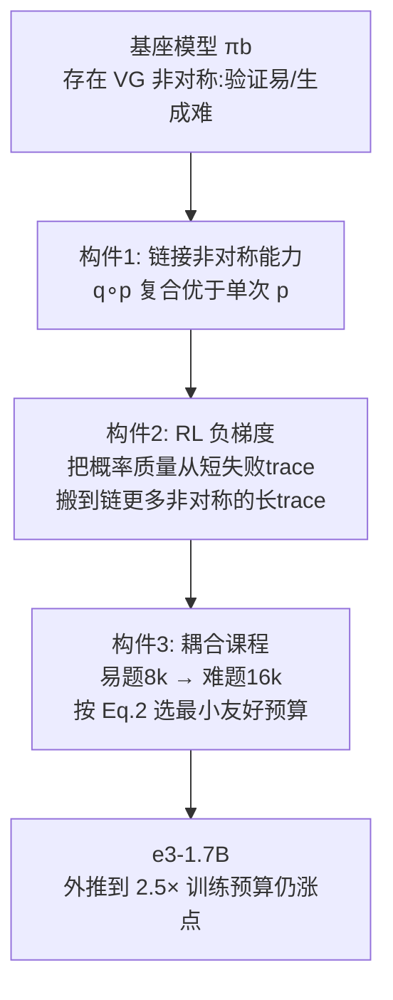

# e3: Learning to Explore Enables Extrapolation of Test-Time Compute for LLMs

**会议**: ICLR 2026  
**OpenReview**: [https://openreview.net/forum?id=aID0dZmMmM](https://openreview.net/forum?id=aID0dZmMmM)  
**代码**: [https://matthewyryang.github.io/e3/](https://matthewyryang.github.io/e3/)  
**领域**: LLM 推理 / 测试时计算扩展 / 强化学习后训练  
**关键词**: test-time scaling, extrapolation, in-context exploration, verification-generation asymmetry, negative gradient, RL curriculum  

## 一句话总结
本文指出绝大多数开源推理模型无法把测试时计算"外推"到训练预算之外，并提出 e3 配方——靠**链接基座模型的非对称能力 + RL 负梯度 + 耦合课程**让模型学会 in-context exploration，使一个 1.7B 模型在 AIME/HMMT'25 上外推到 2.5× 训练预算仍持续涨点，超越所有 ≤2B 模型。

## 研究背景与动机

**领域现状**：测试时扩展（test-time scaling）被寄望于"想得越久越聪明"——模型在部署时多花推理算力就能解出更难的题。当前主流做法是用 RL（DeepSeek-R1、DAPO）或 SFT（s1、LIMO）在长上下文窗口下后训练，希望模型在链式思维里实现"生成-验证-修正""best-of-N"等算法过程。

**现有痛点**：作者实测发现一个尴尬事实——把测试预算从 16k 推到 32k（约 1.5-2× 训练预算），R1-1.5B、DeepScaleR、OpenThinker-7B、STILL-3 等开源模型几乎不再涨点（Fig. 2）。也就是说这些模型把算力消耗在训练预算之内就饱和了，**根本不会外推**。真正的测试时扩展承诺——超出训练预算后继续变强——基本落空。

**核心矛盾**：长 CoT 想要外推，机制上需要模型把算力花在"在上下文里探索多条推理路径"（in-context exploration）上；但单纯靠现有 RL/SFT 配方，模型学不会这种探索，反而倾向于学到直奔答案的短解，一旦超出训练长度就崩（重复 token、提前终止）。

**本文目标**：搞清楚到底"什么"让模型学会 in-context exploration，从而具备外推能力，并据此设计一套可复现的后训练配方。

**核心 idea**：**「探索使能外推（exploration enables extrapolation）」**——作者论证 in-context exploration 的三个必要构件：(1) 基座模型本身要存在**能力非对称**（如"验证比生成更准"的 VG gap），探索才有反馈信号；(2) RL 的**负梯度**才是把这些非对称能力"链接"起来、拉长 trace 的真正引擎；(3) 必须用**数据难度与训练预算耦合的课程**来结构化这种探索。三者合起来即 e3。

## 方法详解

### 整体框架

e3 把"让模型学会探索"拆成三个层层递进的构件：先确认基座模型在某任务上存在 verification-generation 非对称（验证比生成容易），这是探索的前提；再用带负梯度的 RL（GRPO）把"验证→再生成→再验证"这类非对称技能链接成越来越长的 trace；最后用一个耦合课程（先易题短预算、再难题长预算）把这种探索结构化，避免长程 RL 的优化崩溃。最终在 Qwen3-1.7B 上训练到 16k 预算，测试时能外推到 32k 仍持续涨点。

### 关键设计

**1. 链接非对称能力（chaining asymmetries）：为什么探索能外推？** 作者把"长 trace 更准"形式化为：当基座模型在不同技能上能力不对称时，RL 后训练会偏好那些把弱技能 $p$（生成）和强技能 $q$（验证）链接起来的解。形式上，若复合调用 $q(p(\cdot))$ 比单次 $p(\cdot)$ 期望奖励更高——$\mathbb{E}_{\tau\sim\pi}[r(\tau)\mid \text{detect}(q(p(\cdot)),\tau)>0] > \mathbb{E}_{\tau\sim\pi}[r(\tau)\mid \text{detect}(p,\tau)>0]$——即便存在一个从不调用 $q$ 的最优策略，模型仍会因为链接而受益。关键特例是 **VG gap**：模型验证自己答案的准确率高于一次性生成正确答案。作者在 Countdown（凑数等式，验证易）和 n 位乘法（MULT，验证弱）两个 didactic 任务上验证：有 VG gap 时 trace 越长、链接越多、奖励越高，且 RL 会进一步放大这个趋势（Fig. 3-4）；没有 VG gap 时（MULT）长度和外推性能都被压制，而人工微调出验证能力（MULT-V）后又恢复了 Countdown 那样的上升趋势——说明非对称是探索的**先决条件**而非可有可无。

**2. pk 模型：非对称为何驱动探索的理论刻画。** 作者用一个 didactic 的 $p_k$ 模型解释机制：把 LLM 看作在完美验证下做 $k$ 次猜测 $a_1,\dots,a_k$，每次以概率 $p$ 失败，则总失败概率为 $p^k$，随 $k$ 指数衰减。于是性能可以同时靠**降低 $p$**（更好的首猜）和**增大 $k$**（更多次尝试）来提升。但若验证很弱，多猜没用，增益只能来自降 $p$——这正对应 MULT 不外推、CDOWN 外推的实验差异。这个模型把"外推 = 增大 in-context 尝试次数 $k$"讲得很干净：SFT 只能降 $p$（在固定 $k$ 下最大化正确 trace 似然），而 RL 负梯度能把 $k$ 顶上去。

**3. 负梯度（negative gradient）：把非对称真正链接起来的引擎。** 通用策略梯度形式为 $\mathbb{E}_{y\sim\tilde\pi(\cdot|x)}[A(x,y)\cdot\nabla_\pi\log\pi(y|x)]$，其中正梯度抬升正确 trace，负梯度（负 advantage）压低错误 trace。SFT 只有正梯度。作者论证负梯度才是 in-context exploration 的核心机制：当在一条错误 trace $y_1,y_2,\dots,\text{EOS}$ 上施加负梯度时，它压低每个 token 尤其是 $p(\text{EOS}|y)$ 的概率；由于概率守恒，这部分质量会被搬到"接着写"——比如把 EOS 换成"Wait, ..."再链一段验证。这同时带来两个层面的探索：(i) rollout 内更长、链更多非对称（Fig. 5b-c，验证次数上升）；(ii) rollout 间更多样（熵不塌缩，独立 attempt 更多，Fig. 6）。对比实验 GRPO（保留负梯度）vs GRPOMask（屏蔽负梯度、退化成 online STaR/RFT）：屏蔽后长度和验证次数 plateau 或下降，外推增益消失。换句话说 SFT/正梯度方法只会"锐化"基座分布，负梯度才会"链接出新解"。

**4. 耦合课程（coupled curriculum）：结构化长程 RL 的探索。** 光有负梯度还不够——训练预算 $B_{tr}$ 太小则探索被扼杀（长 trace 超预算只有短解被奖励），太大则长程 RL 方差爆炸、收敛差。作者发现：在难题上用短预算训练会逼模型过早 commit、产出无法泛化的极短解（Fig. 7c-d）；naive 地混合全难度数据也不是 OOD 外推最优。解法是设计一个数据×预算**耦合**课程：固定每阶段数据集 $D_i$，按下式贪心选最小"RL 友好"预算——$B^\star_{tr,i}(D_i)=\arg\min_{B\ge B_0} B \;\text{ s.t. } J(\pi_i;D_i,2B)\le\kappa\cdot J(\pi_i;D_i,B),\ \kappa>1$，即选一个尽量小、但模型在 $2B$ 下相对 $B$ 已不再大幅涨点（已能在 $B$ 内完成大多数解）的预算。实践中在 {4k,8k,16k} 里搜索，$\kappa=1.2$ 时易题选 8k。e3 的最终课程是：先在 DMATH 易题上以 $B_{tr}=8k$ 训练，再在中/难题上以 $B_{tr}=16k$ 续训。第一阶段产物本身已能外推到 16k（≥10% 增益），为第二阶段提供好的初始化。

## 实验关键数据

### 主实验表格（pass@k on AIME/HMMT 2025）

| Model | AIME'25 k=1 | k=8 | k=32 | HMMT'25 k=1 | k=8 | k=32 |
|---|---|---|---|---|---|---|
| Qwen3-1.7B（base） | 35.5 | 52.4 | 65.2 | 22.2 | 39.5 | 54.9 |
| R1-distill-Qwen-1.5B | 23.1 | 40.1 | 52.5 | 12.5 | 27.9 | 42.8 |
| Nemotron-Reasoning-1.5B | 33.6 | 48.9 | 58.0 | 17.4 | 35.2 | 45.0 |
| **e3-1.7B（Ours）** | **43.8** | **60.8** | **67.2** | **24.7** | **44.1** | **56.1** |

e3-1.7B 在 pass@1 上把基座 Qwen3-1.7B 从 35.5 提到 43.8，且 pass@32 也涨（65.2→67.2）——不同于"RL 提 pass@1 却牺牲高 k pass@k"的常见趋势，说明 e3 是真在**发现新解**而非单纯锐化分布。

### 消融实验表格

| 消融维度 | 设置 | 结论 |
|---|---|---|
| 非对称是否存在 | CDOWN(有VG) vs MULT(无VG) | 无 VG gap 时 16× 测试算力仅涨 ≤2%，几乎不外推 |
| 负梯度 | GRPO vs GRPOMask | 屏蔽负梯度后长度/验证次数 plateau，熵塌缩、外推增益消失 |
| 训练预算 | $B_{tr}$=4k/8k/16k（易题） | 4k 杀探索、16k 优化难收敛；8k 外推最佳 |
| 数据混合 | easy vs easy+med vs all（8k） | 只训易题在 OOD AIME'25 外推到 32k 反而最好 |
| 课程类型 | 仅变预算 / 仅变数据 / 耦合 | 耦合课程外推性能最优（Fig. 8d） |

### 关键发现
- 多数开源推理模型在 16k→32k 区间几乎不涨点（Fig. 2），外推能力是稀缺品。
- e3-1.7B 在 AIME'25 上训练到 16k、外推到 24k 仍持续涨，约 2.5× 训练预算。
- 反直觉：只在**易题**上训练，反而在难的 OOD AIME'25 上外推最好——因为难题+短预算会扼杀探索。
- VG gap 越大的模型相对基座的 KL 越小，意味着泛化更好。

## 亮点与洞察
- **把"外推"作为测试时扩展的真正目标**，并用一张图（Fig. 2）戳破"开源模型其实不外推"的现状，立意清晰。
- **机制归因到负梯度**：从"概率质量守恒→EOS 概率被搬走→链接新非对称"这条链路，把 RL 为何拉长 trace 讲得有理有据，且有 $p_k$ 模型和 bi-gram 理论分析支撑。
- **非对称（VG gap）作为探索前提**这一视角很有解释力——它说明了为什么同样的 RL 在不同任务/基座上效果天差地别。
- **耦合课程的预算选择公式（Eq. 2）** 把"选多大训练预算"从玄学变成可操作的贪心准则。
- 用 1.7B 小模型打过 32B 的 s1/s1.1，凸显配方而非规模的价值。

## 局限与展望
- 非对称主要聚焦 **VG gap**（验证-生成），其他类型的能力非对称（如规划-执行）只在附录略提，普适性待验证。
- 实验集中在数学推理（AIME/HMMT/Countdown/乘法），虽附录 K 称非数学也有提升，但跨域外推证据偏少。
- 外推上限仍受架构/上下文长度等因素制约，2.5× 之后增益也开始衰减，并非无限外推。
- 耦合课程的难度分级依赖 QwQ-32B/R1-32B 等强模型来判定题目难度，引入了对外部模型的依赖。
- 主结果在 1.7B 规模，配方在更大模型上是否同样有效（负梯度与课程的超参敏感性）未充分探讨。

## 相关工作与启发
- **长 CoT 测试时扩展**：DeepSeek-R1、s1、LIMO 等通过长链验证/搜索/自纠达到 SOTA；本文区别在于强调"会探索的模型才外推得好"，而非简单续写 token（对比 s1 的 budget forcing）。
- **RL 中的探索**：相比通过 advantage normalization 或 PPO clipping 提升探索的并发工作，本文首次把焦点放到**负梯度**作为链接非对称的机制，并给出理论。
- **课程学习**：以往按难度（易→难）或预算（短→长）做课程多为效率动机；本文核心是**耦合**二者以使能 in-context exploration，超越单纯算力效率。
- **启发**：对小模型后训练而言，"先确认基座是否存在可利用的非对称、再用负梯度放大、最后耦合课程结构化"是一条可迁移的配方思路；同时提醒评估推理模型时应专门测**外推区间**而非只看训练预算内的分数。

## 评分
- **新颖性**: ⭐⭐⭐⭐⭐ 把外推失败归因到"缺少 in-context exploration"，并用非对称+负梯度+耦合课程三件套系统解释，视角和机制分析都很新。
- **实验充分度**: ⭐⭐⭐⭐ didactic 任务（CDOWN/MULT）+ 真实 benchmark（AIME/HMMT）+ 多维消融扎实，但跨域和更大规模证据偏少。
- **写作质量**: ⭐⭐⭐⭐ 三构件层层递进、图文配合好，理论（$p_k$ 模型）与实证结合；部分机制论证密度较高需细读。
- **价值**: ⭐⭐⭐⭐⭐ 给出可复现配方让 1.7B 模型外推到 2.5× 预算并超越 ≤2B 全部模型，对资源受限的推理后训练有直接指导意义。

<!-- RELATED:START -->

## 相关论文

- [\[ICLR 2026\] Strategic Scaling of Test-Time Compute: A Bandit Learning Approach](strategic_scaling_of_test-time_compute_a_bandit_learning_approach.md)
- [\[ICLR 2026\] Zero-Overhead Introspection for Adaptive Test-Time Compute](zero-overhead_introspection_for_adaptive_test-time_compute.md)
- [\[ICLR 2026\] Mode-conditioning unlocks superior test-time compute scaling](mode-conditioning_unlocks_superior_test-time_compute_scaling.md)
- [\[ICLR 2026\] T1: Tool-Integrated Verification for Test-Time Compute Scaling in Small Language Models](t1_tool-integrated_verification_for_test-time_compute_scaling_in_small_language_.md)
- [\[ICLR 2026\] Test-Time Scaling in Diffusion LLMs via Hidden Semi-Autoregressive Experts](test-time_scaling_in_diffusion_llms_via_hidden_semi-autoregressive_experts.md)

<!-- RELATED:END -->
