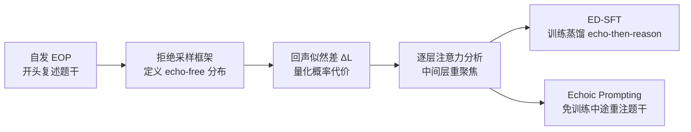

# Echoes as Anchors: Probabilistic Costs and Attention Refocusing in LLM Reasoning

**会议**: ICLR 2026  
**OpenReview**: [https://openreview.net/forum?id=vndn1Wrult](https://openreview.net/forum?id=vndn1Wrult)  
**代码**: [https://github.com/hhh2210/echoes-as-anchors](https://github.com/hhh2210/echoes-as-anchors)  
**领域**: LLM 推理 / 测试时计算  
**关键词**: Echo of Prompt, 测试时计算, 注意力重聚焦, 拒绝采样, 思维链  

## 一句话总结
本文把大推理模型在思维链开头"复述题干"的自发现象（Echo of Prompt, EOP）从训练副产物重新解读为一种内在的注意力重聚焦机制，用拒绝采样框架定义"回声似然差 $\Delta L$"量化其概率代价，并据此提出训练版 ED-SFT 与免训练版 Echoic Prompting 两种方法，在多个数学推理基准上稳定提升。

## 研究背景与动机
**领域现状**：大推理模型（LRM）普遍通过分配更多测试时计算来"先想后答"，主流增益手段是放大 self-consistency、并行思考，或在 prompt 里塞入通用"thinking tokens"、要求模型先重读题目。

**现有痛点**：这些方法要么注入与任务无关的占位 token，要么用启发式规则强行让模型重读，既没有解释、也常常忽视一个真实存在的现象——许多 LRM 在内部思维链开头会**自发**地把用户问题复述一遍。学界把不受控的重复视作"重复诅咒"的失败模式，而对这种开篇自发复述几乎没有分析。

**核心矛盾**：开篇的自发复述到底是训练遗留的多余产物，还是在推理中扮演功能性角色？没有理论能把"早期重复"与"似然增益、最终准确率"连起来，也就无从判断该抑制它还是利用它。

**本文目标**：系统地隔离、分析并利用 EOP 这一涌现行为，既给出概率层面的代价度量，又给出机制层面的解释，并把洞见转化为可落地的方法。

**核心 idea**：**[重新定义]** 把 EOP 视为"前置的、塑造计算的"机制而非缺陷——它用一小段初始概率代价，换取下游推理对题干关键细节的稳定锚定（即中间层的注意力重聚焦）。**[可量化]** 用拒绝采样把"去回声"形式化为条件化事件，定义可计算代理指标 $\Delta L$ 把回声与准确率挂钩。

## 方法详解

### 整体框架
全文沿"理论度量 → 机制解释 → 落地方法"三条线推进：先用拒绝采样框架把回声的概率代价形式化为回声似然差 $\Delta L$，并在 GSM8K 上验证其与正确率正相关；再用逐层注意力分析揭示回声的作用是把中间层注意力重新锚定到题干答案前缀；最后把这一洞见落成两套方法——训练版 ED-SFT 把"先回声后推理"蒸馏进模型，免训练版 Echoic Prompting 在推理中途重新注入题干。

### 关键设计

**1. 拒绝采样视角下的回声似然差 $\Delta L$：把"去回声"变成可度量的概率事件。** 设基础模型 $\pi_\theta(y\mid x)$ 定义在输出序列上，用一个单独训练的 MLP 探针把输出空间划成"含回声" $\mathcal Y_{echo}$ 与"去回声" $\mathcal Y_{trim}$ 两个互斥集合。理想中那个"只产生去回声轨迹"的目标分布是 $\tau_\theta(y\mid x)=\pi_\theta(y\mid x)\,\mathbb 1_{y\in\mathcal Y_{trim}}/Z_x$，但配分函数 $Z_x=\sum_{y\in\mathcal Y_{trim}}\pi_\theta(y\mid x)$ 需要对所有去回声序列求和、不可计算。作者绕开它，改用基于样本的代理：对一条原始轨迹 $y_{raw}$ 及其去回声版 $y_{trim}$，比较长度归一化的平均对数似然 $L(y)=\frac{1}{|y|}\sum_t\log\pi_\theta(y_t\mid x,y_{<t})$，定义 $\Delta L=L(y_{raw})-L(y_{trim})$（nats/token）。$\Delta L>0$ 表示模型本身就更偏好含回声的轨迹，从而把"回声的价格"具体量化到每条样本上。

**2. 后缀隔离的似然差 $\Delta L_{suffix}$：分离回声对后续推理的影响。** 仅看整体 $\Delta L$ 无法判断回声是只让自己变得更"像样"、还是真的让后面的推理更顺。作者把原始轨迹拆成回声前缀 $e$ 与推理后缀 $s$（$y_{raw}=[e,s]$），定义 $\Delta L_{suffix}=L(s\mid x,e)-L(s\mid x)$，即比较"有/无回声前缀作条件"时后缀的平均对数似然。正值说明回声前缀让后续推理在模型看来更可能。这一指标暴露出一个微妙现象：错误轨迹的 $\Delta L_{suffix}$ 反而略大，提示回声可能带来"确认偏误"——强化局部连贯但实则跑偏的推理，因此真正决定正确性的是整体 $\Delta L$ 而非后缀单项。

**3. 注意力重聚焦机制：用 answer→answer-prefix 注意力定位作用层。** 为解释回声为何有效，作者在层级注意力矩阵 $A^{(l)}$ 上定义从查询 token 集 $S_Q$ 到键 token 集 $S_K$ 的平均注意力 $\text{Attn}^{(l)}(S_Q\to S_K)=\frac{1}{|S_Q|}\sum_{i\in S_Q}\sum_{j\in S_K}A^{(l)}_{ij}$。其中 answer→answer-prefix（后续推理回看自己开头那段回声）用探针估计的逐样本回声长度动态设定前缀，而 answer→question 作为负对照。逐层分析发现：正确轨迹在中间层（7–18 层）对答案前缀的注意力显著更高（峰值差 $\approx$ 3%），而对原始题干的注意力差异 $<$ 1%，说明回声起的不是简单"重读题目"的作用，而是作为**工作记忆锚点**把推理钉在题干表示上；Cohen's $d$ 在中层组达 0.832，定位出推理聚合的"瓶颈层"。

**4. ED-SFT 与 Echoic Prompting：把机制落成训练与免训练两条路。** ED-SFT 先用 teacher 模型（gpt-oss-120B）在 GSM8K 上造一批经答案校验的高质量 CoT，再用 MLP 探针检测缺失 EOP 的轨迹、让 teacher 极小化地在开头插入一句复述式开场（如"Okay, let me see. The problem is asking..."），编辑后重新校验答案，得到与 normal-SFT 几乎逐 token 一致、仅差初始回声段的成对语料，从而把"先回声后推理"作为可学习行为蒸馏进模型。Echoic Prompting 则完全免训练：模型产出初始推理链后，在中途追加一句"look back at the question again"并附上原题，用任务相关的真实题干（而非通用 thinking token）把模型重新锚定到问题上下文。

## 实验关键数据

### 主实验表格
ED-SFT 在两族模型、多个数学基准上稳定优于 normal-SFT（仅差初始回声段）：

| 模型 | GSM-8K | MathQA | Hendrycks-MATH | Strict EM |
|------|--------|--------|----------------|-----------|
| Qwen3-8B-Base | 79.4 | 80.5 | 31.0 | 0.76 |
| + ED-SFT | **94.2 (+3.4)** | **94.2** | **58.8 (+11.8)** | **10.0 (+8.2)** |
| + normal-SFT | 90.8 | 90.8 | 47.0 | 1.8 |
| Qwen3-8B (Instruct) | 87.49 | 88.1 | 49.2 | 0.8 |
| + ED-SFT | **93.1 (+2.8)** | **93.4** | **53.7** | **6.1** |
| + normal-SFT | 90.3 | 90.1 | 51.8 | 5.0 |
| DeepSeek-Distill-Llama-8B + ED-SFT | 78.2 | **79.7** | **34.8 (+3.4)** | **3.0** |

### 消融实验表格
回声重插入作为因果干预（从 GSM8K 失败轨迹的 50% 前缀续写，仅插入一句复述模板）：

| 模型 | Echo-free EM (%) | Echo 重插入 EM (%) |
|------|------------------|--------------------|
| DeepSeek-R1-Distill-Llama-8B | 15.85 | **26.22 (+10.4)** |
| Qwen3-8B | 21.34 | **29.27 (+7.9)** |
| Qwen3-8B-Base (无 CoT) | 10.56 | 10.56 (+0) |

逐层注意力（DeepSeek-8B，GSM8K，正确−错误）：末层 answer→answer-prefix 差 +3.28%，answer→question 仅 +0.23%；7–18 层 answer→answer-prefix 差 +2.87%，Cohen's $d=0.832$（mid 组最强）。

### 关键发现
- **$\Delta L$ 正相关正确率**：正确组 $\Delta L=2.5231$ vs 错误组 $2.4421$（+0.0811 nats/token），控制轨迹长度后 logistic 回归仍显著为正。
- **因果验证**：对有推理能力的模型强行插入回声带来 +10.4 / +7.9 EM，而无 CoT 的 base 模型零增益——说明利用回声需要 RL 获得的推理/指令遵循先验。
- **机制可被蒸馏**：ED-SFT 在中层（7–18）的 answer→answer-prefix 注意力差最大（+3.20 pp，> normal-SFT 的 +2.40 pp、base 的 +1.90 pp），直接印证它把重聚焦机制学了进去。
- **免训练也有效**：Echoic Prompting 在 AIME24、MATH-500 上一致且大幅优于注入通用 thinking token 的 TTTS 基线（相同解码与预算）。

## 亮点与洞察
- **现象重定义**：把"开头复述题干"从被嫌弃的"重复诅咒"翻案为有功能价值的认知原语，视角新颖且有解释力。
- **理论—机制—方法闭环**：拒绝采样给出可计算的 $\Delta L$（理论），逐层注意力定位中层重聚焦（机制），ED-SFT/EP 落地（方法），且三者互相印证（ED-SFT 增强的正是分析出的中层注意力）。
- **负对照设计扎实**：用 answer→question 作为负对照、用无 CoT base 模型作为因果零增益对照、用逐 token 几乎相同的成对 SFT 语料，干净地隔离了回声本身的贡献。

## 局限与展望
- 分析与机制验证主要集中在 GSM8K + DeepSeek-R1-Distill-Llama-8B，注意力结论的跨模型/跨任务普适性还需更广验证。
- EOP 的检测依赖单独训练的 MLP 探针（二分类而非 span 定位），span 选择委托给 teacher 模型，引入额外依赖与潜在误差。
- 发现"后缀似然差在错误组反而更大"提示回声可能放大确认偏误，何时有益、何时强化错误路径仍缺乏可控的判别手段。
- ED-SFT 依赖强 teacher（gpt-oss-120B）造数据并校验，免训练的 EP 仅在两个数学数据集上对比 TTTS，更大规模与非数学任务上的收益有待考察。

## 相关工作与启发
- **测试时计算的有效性 vs 效率**：与"早退/步骤压缩"减少冗余的效率路线互补，本文走"有效性"路线，但区别于"指令式重读"（Xu et al. 2024 等把重复当外加启发式），强调分析自发涌现的回声。
- **注意力重聚焦**：呼应 lost-in-the-middle 的位置偏置、视觉里的 attention drift，以及推理时重加权/重注证据的干预；不同点在于本文发现 EOP 自身就能起到类似锚定作用，无需外部修改。
- **启发**：模型自发产生的"冗余"行为可能隐含被低估的计算策略；与其用通用占位 token 充数，不如挖掘并蒸馏这类任务相关的内生机制——这对设计 test-time scaling 与 CoT 训练数据都有指导意义。

## 评分
- 新颖性: ⭐⭐⭐⭐ 把被视作缺陷的自发复述重新解读为功能机制，并用拒绝采样 + 注意力分析给出量化与机制双重支撑，切入角度新颖。
- 实验充分度: ⭐⭐⭐⭐ 覆盖相关性（$\Delta L$）、因果干预（回声重插入）、训练（ED-SFT 跨两族多基准）、免训练（EP vs TTTS）四类证据，互相印证；但分析主体集中于 GSM8K/8B 模型，规模与任务多样性有限。
- 写作质量: ⭐⭐⭐⭐ 理论—机制—方法叙事清晰，图表与负对照设计到位，公式与指标定义严谨。
- 价值: ⭐⭐⭐⭐ 既给 test-time scaling 提供了可落地的免训练/训练两条增益路径，又为"如何利用模型内生认知行为"提供了一个可复用的分析范式。

<!-- RELATED:START -->

## 相关论文

- [\[ICLR 2026\] FROST: Filtering Reasoning Outliers with Attention for Efficient Reasoning](frost_filtering_reasoning_outliers_with_attention_for_efficient_reasoning.md)
- [\[ICML 2026\] Attention Illuminates LLM Reasoning: The Preplan-and-Anchor Rhythm Enables Fine-Grained Policy Optimization](../../ICML2026/llm_reasoning/attention_illuminates_llm_reasoning_the_preplan-and-anchor_rhythm_enables_fine-g.md)
- [\[ICLR 2026\] Attention as a Compass: Efficient Exploration for Process-Supervised RL in Reasoning Models](attention_as_a_compass_efficient_exploration_for_process-supervised_rl_in_reason.md)
- [\[ICML 2026\] Stop When Further Reasoning Won't Help: Attention-State Adaptive Generation in Reasoning Models](../../ICML2026/llm_reasoning/stop_when_further_reasoning_wont_help_attention-state_adaptive_generation_in_rea.md)
- [\[CVPR 2026\] APPO: Attention-guided Perception Policy Optimization for Video Reasoning](../../CVPR2026/llm_reasoning/appo_attention-guided_perception_policy_optimization_for_video_reasoning.md)

<!-- RELATED:END -->
