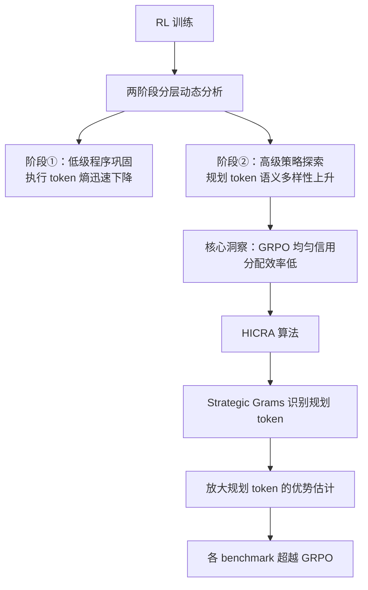

# Emergent Hierarchical Reasoning in LLMs through Reinforcement Learning

**会议**: ICLR 2026  
**代码**: https://tiger-ai-lab.github.io/Hierarchical-Reasoner/  
**领域**: LLM 推理  
**关键词**: 强化学习、分层推理、信用分配、策略规划、GRPO

## 一句话总结
通过分析 RL 训练动态发现 LLM 推理能力的提升由"低级程序巩固→高级策略探索"两阶段分层机制驱动，并据此提出 HICRA 算法将优化信号集中于高影响的规划 token，在多个数学推理基准上显著超越 GRPO 基线。

## 研究背景与动机

**领域现状**：RL（尤其 GRPO）已成为提升 LLM 复杂推理能力的核心方法，在数学、代码等任务上取得显著进展，但其内部学习机制几乎完全不透明。

**现有痛点**：训练中出现的"aha moment"、"长度扩展"和 token 熵动态等现象被单独记录，缺乏统一解释；更严重的是，GRPO 等算法对所有 token 施加相同的优化压力，无法区分对推理真正关键的 token，造成学习信号稀释。

**核心矛盾**：RL 究竟是如何解锁 LLM 推理能力的？当前算法没有利用推理过程本身的内在结构，仅将序列视为均质的 token 流。

**本文目标**：揭示 RL 提升推理的底层机制，并将该机制转化为更高效的 RL 算法。

**核心 idea**：LLM 的 RL 训练通过重新发现"高层策略规划 vs. 低层程序执行"的分层推理结构来解锁更强推理能力，据此可设计出专注于规划 token 的分层信用分配算法 HICRA。

## 方法详解

### 整体框架

论文分两个递进部分：首先构建分析框架，在八个 LLM/VLM 上实证揭示 RL 训练中涌现的两阶段分层推理动态；然后以该发现为设计依据，提出 HICRA 算法，将 GRPO 的均匀信用分配改造为向规划 token 倾斜的层次化信用分配，从而加速策略探索与强化。

### 关键设计

**1. Strategic Grams：规划 token 的函数代理**

核心挑战是如何在无人工标注的情况下识别哪些 token 承担"高层规划"功能。论文定义 **Strategic Grams（SGs）** 为 n-gram 级别的短语单元，其功能是引导推理流——包括演绎（"we can use the fact that"）、分支（"let's try a different approach"）和回溯（"but the problem mentions that"）。由于同一种策略意图会以多种措辞表达，论文设计了数据驱动的自动化流水线：先按语义将 n-gram 聚类合并等价表达，再依据统计特征筛选 SG——真正的规划短语应在大量不同解题方案中普遍出现（高跨解频率），但在单条解题链内使用稀疏（低自身频率）。人工标注研究验证了 86% 的识别结果确实具有"引导流程或提出计划"的功能，且随机删去 30% 的 SG 后分析结果定性不变，说明这一代理指标具有鲁棒性。

**2. 两阶段分层动态的实证发现**

在 Qwen2.5-7B、Qwen3-4B、Llama-3.1-8B 等八个模型上，论文追踪了 RL 训练全程的四项指标：执行 token 的相对困惑度、执行 token 的 token 级熵、规划 token 的语义熵（SG 频率分布的香农熵）以及整体验证准确率。结果呈现高度一致的两阶段模式：**阶段①**，执行 token 困惑度和熵迅速下降，模型快速巩固算术、公式代入等低层程序技能；**阶段②**，执行 token 熵趋于平稳，但规划 token 的语义熵持续上升，即模型不断扩充高层策略库，并与准确率持续提升和推理链长度增加高度相关。这一发现同时解释了"aha moment"（发现并强化新策略的行为特征）和"长度扩展"（更丰富的策略自然产生更长的推理链）两类现象，并指出聚合 token 熵会被大量低层 token 主导而误导从业者判断探索状态。

**3. HICRA：层次化信用分配**

基于上述发现，HICRA 在 GRPO 框架上做了最小化但精准的修改。GRPO 计算组归一化优势 $\hat{A}_{i,t} = R(q, o_i) - \frac{1}{G}\sum_j R(q, o_j)$，对所有 token 一视同仁。HICRA 将规划 token 的优势进行非对称放大：

$$\hat{A}^{\text{HICRA}}_{i,t} = \begin{cases} \hat{A}_{i,t} + \alpha \cdot |\hat{A}_{i,t}| & \text{if } t \in S_i \\ \hat{A}_{i,t} & \text{otherwise} \end{cases}$$

其中 $\alpha=0.2$，$S_i$ 为轨迹 $o_i$ 中属于 SG 的 token 下标集合。该设计的非对称性至关重要：对成功轨迹（$\hat{A}>0$）放大规划 token 的正向信用，对失败轨迹（$\hat{A}<0$）则同样收紧规划 token 的负向惩罚，从而在策略层面制造各向异性的优化压力，驱使策略分布向高价值策略空间倾斜，形成"探索新策略→高奖励→放大强化→进一步探索"的正向反馈循环。

## 实验关键数据

### 主实验（数学推理基准，部分模型节选）

| 模型 | 方法 | AIME24 | AIME25 | Math500 | AMC23 |
|------|------|--------|--------|---------|-------|
| Qwen3-4B-Instruct | Base | 63.4 | 47.7 | 94.6 | 86.7 |
| Qwen3-4B-Instruct | GRPO | 68.5 | 60.0 | 96.2 | 88.5 |
| Qwen3-4B-Instruct | **HICRA** | **73.1** | **65.1** | **97.2** | **90.2** |
| Qwen3-4B-Base | GRPO | 24.9 | 23.8 | 83.0 | 51.2 |
| Qwen3-4B-Base | **HICRA** | **31.0** | **27.6** | **89.0** | **54.0** |
| Qwen2.5-7B-Base | GRPO | 16.3 | 11.4 | 77.6 | 46.7 |
| Qwen2.5-7B-Base | **HICRA** | **18.8** | **14.8** | **80.2** | **55.1** |

### 消融实验（Qwen2.5-7B-Base 对照）

| 配置 | AIME24 | AIME25 | 说明 |
|------|--------|--------|------|
| High-Entropy Advantage | 15.8 | 11.4 | 按 token 熵放大，非规划语义 |
| Placebo HICRA | 14.6 | 9.3 | 随机 n-gram 替代 SG |
| Entropy Regularization | 16.0 | 9.3 | 熵正则化，探索无针对性 |
| HICRA | **18.8** | **14.8** | 精准放大规划 token 信用 |

### 关键发现
- 错误类型追踪显示 RL 对"规划&策略类错误"的消除幅度显著大于"程序性错误"，直接印证策略层是关键瓶颈
- HICRA 在训练过程中持续维持更高的语义熵，说明其对策略空间的探索更充分
- 能力更强的模型（MiMO-VL-Instruct、Qwen3-4B-Instruct）的低级技能巩固阶段更短甚至缺失，进一步支持"策略探索是 RL 核心驱动力"的论断

## 亮点与洞察
- **分层动态统一解释了三大现象**："aha moment"是新策略被发现并强化的行为特征；"长度扩展"是策略多样化的自然产物；token 熵下降不代表探索减少，语义熵才是可靠的探索指标——这三点过去各自解释，现被一个框架统一
- **最小化改动最大化效果**：HICRA 仅修改 GRPO 的优势函数，引入单个超参 $\alpha=0.2$，工程代价极低，却带来跨模型、跨 benchmark 的一致提升，说明改动触达了真正的效率瓶颈
- **"熵"的粒度陷阱**：论文精辟指出聚合 token 熵被大量程序 token 主导，会随低层技能巩固而下降，造成"探索减少"的假象；必须在语义层级（SG 语义熵）度量才能捕获真实探索态势

## 局限与展望
- SG 识别流水线基于统计代理，对于风格高度多变的推理任务或领域（如代码推理）是否同样适用尚未验证
- HICRA 对 Llama-3.1-8B-Instruct 的提升幅度相对有限（AIME24 从 8.9→8.3），提示分层结构的涌现可能与模型基础能力阈值有关
- $\alpha$ 超参的最优值是否随训练任务和模型规模变化尚无系统性分析

## 相关工作与启发
- **vs GRPO / DAPO / SimpleRL**：这些方法均对所有 token 施加均匀优化压力，HICRA 以分层信用分配超越之；HICRA 可直接叠加于任意 GRPO 变体之上
- **vs 熵正则化 / High-Entropy Advantage**：两者以 token 熵代理探索价值，消融实验表明这与规划语义功能不等价，高熵 token 未必是高层规划 token
- **vs 人类认知分层模型**：Murray et al. 和 Zeraati et al. 关于大脑"高层审慎策略 vs. 低层快速程序"的神经科学框架为本文提供了实证假设的来源，并最终在 LLM 的 RL 训练中得到计算层面的验证

## 评分
- 新颖性: ⭐⭐⭐⭐⭐ 首次系统揭示 RL 训练中分层推理涌现机制，统一解释三大神秘现象，并将机制直接转化为算法
- 实验充分度: ⭐⭐⭐⭐ 覆盖 5 个模型、6 个数学 benchmark 以及 VLM，消融充分；VLM 部分结果在附录，主文略显拥挤
- 写作质量: ⭐⭐⭐⭐⭐ 从分析到算法逻辑严密，Takeaway 明确，图表直观，叙述层次清晰
- 价值: ⭐⭐⭐⭐⭐ 对理解 RL 提升 LLM 推理的机制有重大贡献，HICRA 简洁易复现，学术与工程价值双高

<!-- RELATED:START -->

## 相关论文

- [\[ICLR 2026\] NFT: Bridging Supervised Learning and Reinforcement Learning in Math Reasoning](nft_bridging_supervised_learning_and_reinforcement_learning_in_math_reasoning.md)
- [\[ICLR 2026\] Learning to Reason over Continuous Tokens with Reinforcement Learning (HyRea)](learning_to_reason_over_continuous_tokens_with_reinforcement_learning.md)
- [\[ICLR 2026\] Process-Verified Reinforcement Learning for Theorem Proving via Lean](process-verified_reinforcement_learning_for_theorem_proving_via_lean.md)
- [\[ICLR 2026\] Curriculum Reinforcement Learning from Easy to Hard Tasks Improves LLM Reasoning](curriculum_reinforcement_learning_from_easy_to_hard_tasks_improves_llm_reasoning.md)
- [\[ICLR 2026\] Executable Counterfactuals: Improving LLMs' Causal Reasoning Through Code](executable_counterfactuals_improving_llms_causal_reasoning_through_code.md)

<!-- RELATED:END -->
