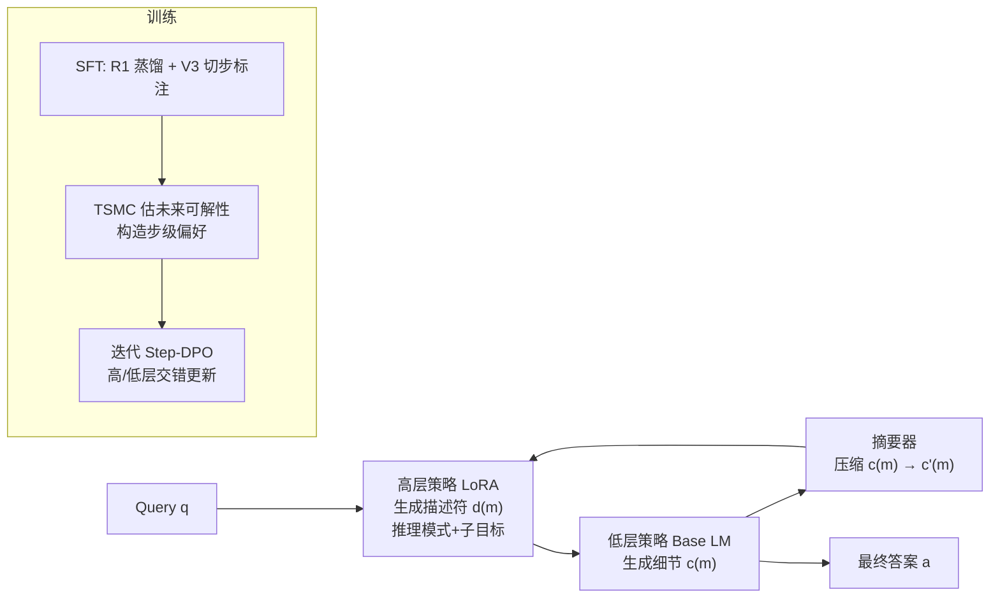

# Enhancing Language Model Reasoning with Structured Multi-Level Modeling

**会议**: ICLR 2026  
**OpenReview**: [https://openreview.net/forum?id=PlkzZhqBCd](https://openreview.net/forum?id=PlkzZhqBCd)  
**代码**: [https://github.com/xiongsiheng/MLR](https://github.com/xiongsiheng/MLR)  
**领域**: LLM 推理 / 推理时扩展 / 过程级偏好优化  
**关键词**: Multi-Level Reasoning, 长 CoT, 分层强化学习, Step-DPO, Twisted Sequential Monte Carlo  

## 一句话总结
把单策略的长 CoT 生成重构成"高层规划器出步骤描述符 + 低层执行器写细节"的两层随机过程（MLR），并用 Twisted SMC 构造过程级偏好喂给迭代 Step-DPO，让小模型在有限数据预算下也能稳定做长程推理。

## 研究背景与动机

**领域现状**：o1 / DeepSeek-R1 这类推理模型靠"推理时扩展"提升复杂任务表现——给推理过程分配更多算力，通常实现为生成更长的 Chain-of-Thought。主流做法是用单一策略 + 结果奖励 RL（如 GRPO）直接激励长 CoT 的生成。

**现有痛点**：单策略长 CoT 有两个结构性问题。其一是**长程规划失效（long-horizon plan failure）**：同一个策略既要规划又要执行，没有结构约束时误差会累积，隐式计划逐渐漂离任何有效策略，对容量有限的小模型尤其严重。其二是**稀疏结果奖励下的长程 RL**：一条 CoT 往往是几千个 token 级动作之后才拿到一个 0/1 奖励，信用分配极难；且论文实测首个错误的出现位置分布很宽（图 2），加上 PPO 单步延迟随生成长度急剧上升、显存吃紧（图 3），导致训练慢且不稳定，训练早期正确轨迹稀少时更糟。

**核心矛盾**：分层强化学习（HRL）本可用时间抽象缓解信用分配，但直接搬到 LM 上有两难——**可扩展性**（多策略若实现为多个独立 LM 会带来额外算力与多智能体协调开销）与**灵活性**（传统 plan-then-execute 结构僵硬，遇到新信息或执行失败无法中途纠偏）。如何既享受分层结构的好处，又不付出多模型的代价、还能动态调整计划，是关键张力。

**本文目标**：在统一基座模型上实现轻量、可动态调整的多层推理，并为长 CoT 提供可扩展的过程级监督。

**核心 idea**：**[结构重构]** 把长 CoT 拆成交替的高层步骤描述符与低层细节内容，用 base model 当低层策略、一个 LoRA 模块当高层策略；**[训练机制]** 用 TSMC 把"未来可解性"转成步级偏好信号，驱动迭代 Step-DPO，绕开独立的过程奖励模型（PRM）。

## 方法详解

### 整体框架

MLR（Multi-Level Reasoning）把推理过程组织成两层：高层描述符序列 $d=(d^{(1)},\dots,d^{(M)})$ 和低层细节序列 $c=(c^{(1)},\dots,c^{(M)})$，模型在"出一个描述符 → 写对应细节"之间交替，形成 plan–execute 循环。架构上低层策略复用 base LM，高层策略用轻量 LoRA 实现，再加一个共享的小 LLM 做摘要。训练分两步：先 SFT 把基座对齐到多层数据，再用基于 TSMC 偏好的迭代 Step-DPO 在线优化。

### 关键设计

**1. 两层随机过程重构：把长 CoT 拆成"描述符—细节"交替循环。** MLR 不再让单一策略一口气吐几千 token，而是把联合似然按层分解：高层 $p^H_\theta(d^{(m)}\mid d^{(1:m-1)}, c'^{(1:m-1)})$ 只看历史描述符和**压缩摘要** $c'$ 来产生下一个步骤描述符（含"推理模式 + 语义子目标"，如"Problem Understanding / Calculation / Verification"），低层 $p^L_\theta(c^{(m)}\mid d^{(1:m)}, c^{(1:m-1)})$ 在当前描述符指引下写详细推理。论文实测高层轨迹只有低层的 10–20% 长度，所以高层规划器始终紧凑。这种交替结构带来两个好处：描述符提供显式结构抽象，抑制隐式计划漂移；而且高层计划可以**基于低层执行进展动态调整**（保留了灵活性，区别于僵硬的 plan-then-execute）。

**2. 最小化双策略架构：base LM 当执行器，LoRA 当规划器。** 为避免多模型带来的算力和协调开销，低层策略直接用全量微调后的 base LM，高层策略只用一个轻量 LoRA 适配器——因为描述符远短于完整推理，这个模块天然紧凑。再额外微调一个独立的 Qwen-2.5-0.5B 当摘要器，跨基座共享、训练中冻结。这样整套系统本质还是"一个基座 + 一个 LoRA"，推理与单模型相比开销可控，却拿到了分层抽象的收益。消融显示"SFT(low)+LoRA(high)"明显优于"Base+LoRA(high)"和纯"SFT(high)"，说明低层先打好底再训高层的顺序很重要。

**3. TSMC 过程级偏好：把"未来可解性"转成步级 Step-DPO 信号。** 长 CoT 训练最难的是拿到可靠的过程级监督——人工标注步骤正确性太贵、LLM 自动标噪声大、独立 PRM 又易被 reward hacking 还要反复重训。MLR 改用 Twisted Sequential Monte Carlo 来估计每个前缀 $x^{(m)}$ 的"存活概率"（最终答对的期望）$g(x^{(m)})=\mathbb{E}_{\tau\sim p_{roll}}[R(x^{(m)},\tau)]$，并定义效用为对数存活率的增量 $U(y^{(m)})=\log\tilde g(x^{(m)},y^{(m)})-\log\tilde g(x^{(m)})$。当某步候选 $y_+$ 与 $y_-$ 的效用差超过 margin $\delta$ 时就构成一对步级偏好。取对数增量有两个妙处：把 TSMC 里乘性的重要性权重更新 $W^{(m)}_k=W^{(m-1)}_k\cdot\tilde w^{(m)}_k$ 变成加性、数值更稳；而且形式正好匹配 Step-DPO 的成对偏好目标。关键是这里只需候选步之间的**相对排序**而非绝对存活概率，所以可以用一个在同样低层 SFT 数据上微调的小 LM 当 rollout 策略 $p_{roll}$——既让 rollout 分布更接近 base、又大幅省 rollout 成本（图 6 显示 1.5B rollout 与 8B 给出的偏好质量相当但快得多），难题（AIME24/GPQA）上才退回用 base model rollout。

**4. 迭代 Step-DPO + 高低层交错更新：on-policy 刷新偏好数据。** 借鉴 RL 中 on-policy 采样的好处，训练做成迭代式：第 $t$ 轮用当前策略采样偏好对生成 $D^{(t)}_{pref}$，再最小化以当前策略为参考的 Step-DPO 损失。联合优化两个策略时采用**交错（interleaved）**策略——高层 mini-batch 与低层 mini-batch 交替：训低层对时禁用 LoRA、只更新 base LM 参数 $\big((d^{(1:m)},c^{(1:m-1)}),c^{(m)}_+,c^{(m)}_-\big)$；训高层对时冻结 base LM、只更新 LoRA $\big((d^{(1:m-1)},c'^{(1:m-1)}),d^{(m)}_+,d^{(m)}_-\big)$。这样规划器与执行器联合训练却保持模块化。每轮采样约 3K prompt、每 prompt 选 4 步各生成 2 个候选、K=8 个 rollout、margin $\delta=0.4$。

## 实验关键数据

### 主实验表格（Avg. Pass@1，跨 MATH500/AIME24/GPQA-Diamond/BoardGameQA-Hard）

| Method | Qwen-2.5-1.5B | Qwen-2.5-MATH-7B | Llama-3.1-8B |
|---|---|---|---|
| Instruct | 31.0 | 42.8 | 30.3 |
| DeepSeek-R1-Distill | 47.7 | 60.0 | 58.6 |
| SFT + DPO | 42.0 | 53.4 | 51.6 |
| SFT + Step-DPO | 47.8 | 60.3 | 59.1 |
| SFT + GRPO | 48.4 | 59.9 | 60.0 |
| MLR (SFT only) | 35.8 | 49.5 | 42.2 |
| **MLR** | **54.2** | **66.2** | **66.1** |

在仅用 10% SFT + 5% 偏好数据预算（相对 R1 蒸馏 setup）下，MLR 全面超过 SFT 蒸馏、DPO/Step-DPO 与 GRPO，且在三个不同基座上一致领先。单看 1.5B：MATH500 86.1、AIME24 31.2、GPQA 47.4，均显著高于 GRPO（82.1/25.2/36.0）。

### 消融实验表格

| 消融维度（Qwen-2.5-1.5B / LLaMA-3.1-8B） | MATH500 | AIME24 Pass@1 |
|---|---|---|
| SFT(low)+LoRA(high)（本文高层 SFT 策略） | 62.0 | 8.9 |
| Base+LoRA(high) | 56.4 | 4.1 |
| SFT(high) | 59.8 | 6.5 |
| High-level + Low-level（完整） | 86.1 | 31.2 |
| High-level only | 80.0 | 18.4 |
| Low-level only | 84.2 | 27.1 |
| Ours（8B 核心组件全开） | 91.5 | 53.2 |
| Low-level policy + Step-DPO | 82.4 | 42.6 |
| Low-level policy + DPO | 74.1 | 32.4 |
| DPO-only | 78.2 | 38.1 |

### 关键发现
- **分层两级缺一不可**：去掉高层（Low-level only）AIME24 从 31.2 掉到 27.1，去掉低层（High-level only）掉到 18.4，完整双层才达 31.2。
- **Step-DPO > DPO**：8B 上"Low-level + Step-DPO"(59.1) 明显优于"Low-level + DPO"(51.6)，过程级偏好比结果级偏好更有效；引入分层后再升到 66.1。
- **长程鲁棒性**：把多道题拼接模拟长 horizon 时（图 1），MLR 的 Pass@1 随题目链长增加衰减比 GRPO/R1-Distill 更慢，验证了抑制计划漂移的作用。
- **TSMC 偏好质量**：增大 rollout 数 K 降低估计方差，K=8 时 1.5B rollout 选出的偏好对与 8B/16-rollout 参考的方向一致率已较高（图 8）。

## 亮点与洞察
- **"分层"用极小代价落地**：不堆多个 agent，而是"一个 base + 一个 LoRA + 一个共享小摘要器"，把 HRL 的时间抽象塞进单基座，工程上很务实。
- **描述符 = 显式可读的计划**：高层输出"推理模式 + 子目标"这种人类可读标签，既给低层导航，又天然抑制隐式计划漂移，且只占 10–20% token。
- **把 TSMC 的乘性权重取对数增量**，一举同时解决数值稳定与"匹配 Step-DPO 成对目标"两件事，是很漂亮的形式对齐。
- **只要相对排序不要绝对概率**这一观察，让小模型 rollout 成为可能，大幅压低过程监督成本——这是整个 pipeline 能 scale 的关键。

## 局限与展望
- **依赖 R1 蒸馏 + V3 切步标注**构造多层 SFT 数据，描述符标注质量受教师模型上限约束，迁移到没有强教师的领域时数据构造成本未知。
- **多组件耦合**：base LM、LoRA、摘要器、rollout 策略、survivability critic $\phi_m$ 多个模块，超参（K、$\delta$、margin、易/难分流）较多，复现与调参负担偏重。
- 评测集中在数学/科学/逻辑这类有可验证答案（0/1 reward）的任务，TSMC 的 potential 函数依赖终止正确性；对开放式、无明确正误的推理任务如何定义 survivability 仍待探索。
- 摘要器引入信息压缩，长链下摘要丢信息是否会成为新的误差源，论文未深入分析。

## 相关工作与启发
- **分层强化学习（Sutton 1999；HRL in robotics）**：MLR 是把高/低层不同时间尺度的策略抽象搬到 LM 推理，但强调高层计划要能动态演化，区别于机器人里相对静态的 option。
- **过程奖励 / PRM（Lightman 2023；Math-Shepherd）**：本文用 TSMC 偏好替代独立 PRM，规避了 reward hacking 和反复重训。
- **Step-DPO（Lai 2024）/ DPO（Rafailov 2023）**：MLR 把 DPO 从结果级推进到过程级，并扩展成高低层双策略交错优化。
- **Twisted SMC（Doucet 2001 等）**：原用于序列推断的重要性采样，被巧妙 repurpose 成构造步级偏好的"未来可解性"估计器。
- **Plan-and-Solve（Wang 2023）**：纯 prompting 的规划-求解，MLR 指出其僵硬、无法中途纠偏，用可训练的双策略 + 摘要回灌实现动态适应。

## 评分
- **新颖性**: ⭐⭐⭐⭐ — "把长 CoT 重构成双层随机过程 + 用 TSMC 取对数增量构造步级偏好"两个点都不落俗套，TSMC↔Step-DPO 的形式对齐尤其巧妙。
- **实验充分度**: ⭐⭐⭐⭐ — 3 个基座 × 4 个数学/科学/逻辑 benchmark，对比覆盖 SFT/DPO/Step-DPO/GRPO/Plan-and-Solve，含分层、Step-DPO、rollout 数等多维消融与长程鲁棒性分析；不足是任务局限于可验证答案类。
- **写作质量**: ⭐⭐⭐⭐ — 动机（图 2/3 量化稀疏奖励的痛点）到方法到实验逻辑清晰，公式与架构图配合到位。
- **价值**: ⭐⭐⭐⭐ — 在 10% SFT/5% 偏好的低预算下让小模型稳定做长程推理并超过 GRPO，对算力受限场景的推理模型训练有实际参考价值。

<!-- RELATED:START -->

## 相关论文

- [\[ICLR 2026\] TSLM: Tree-Structured Language Modeling for Divergent Thinking](tslm_tree-structured_language_modeling_for_divergent_thinking.md)
- [\[ICLR 2026\] Plan-Answer-Refine-on-Graph: Structured Planning and Self-Refinement for Large Language Model Reasoning on Knowledge Graphs](plan-answer-refine-on-graph_structured_planning_and_self-refinement_for_large_la.md)
- [\[ICLR 2026\] On the Thinking-Language Modeling Gap in Large Language Models](on_the_thinking-language_modeling_gap_in_large_language_models.md)
- [\[ICLR 2026\] Why is Your Language Model a Poor Implicit Reward Model?](why_is_your_language_model_a_poor_implicit_reward_model.md)
- [\[ICLR 2026\] ChainGPT: Dual-Reasoning Model with Recurrent Depth and Multi-Rank State Updates](chaingpt_dual-reasoning_model_with_recurrent_depth_and_multi-rank_state_updates.md)

<!-- RELATED:END -->
