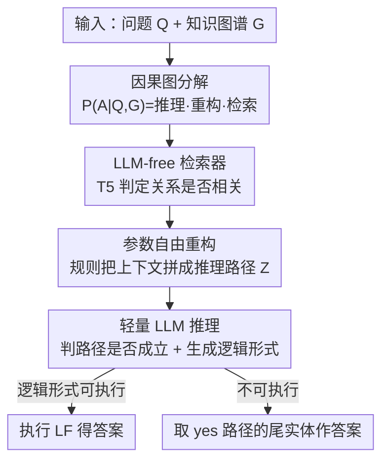

# Enhancing LLMs for Knowledge Base Question Answering by Chain-of-Decomposition

**会议**: ICLR 2026  
**OpenReview**: [https://openreview.net/forum?id=4vfEo07rmv](https://openreview.net/forum?id=4vfEo07rmv)  
**代码**: https://github.com/YonggangZhang9412/KBQA-CoD  
**领域**: LLM推理  
**关键词**: 知识库问答, 任务分解, 因果图分解, 检索增强, 推理路径

## 一句话总结
本文提出 Chain-of-Decomposition (CoD)，借助一张因果图把知识库问答（KBQA）的答案生成分布因式分解为「检索 → 重构 → 推理」三个子任务，其中检索用小模型、重构用规则（两者都不依赖 LLM），只把一个轻量的「推理路径是否成立」的二分类任务交给微调 LLM，结果用 Llama-2 7B 就在 WebQSP / CWQ 上超过了带检索知识的 GPT-4，刷到 SOTA。

## 研究背景与动机

**领域现状**：把 LLM 用到知识库问答（KBQA）上主要有两条路。一条是「prompting」——把检索到的知识图谱子图塞进 prompt 让 LLM 在上下文里推理（如 ToG、FiDeLis）；另一条是「fine-tuning」——用精心设计的数据和目标函数微调 LLM，让它直接或间接生成答案（如 RoG、DeCAF）。KBQA 的本质是：给定自然语言问题 $Q$，在大规模结构化知识图谱 $G$ 上做多跳推理，预测答案集合 $A(Q)$。

**现有痛点**：把整张大规模知识库塞进 in-context learning 的 prompt，计算开销高到无法承受；而微调路线虽然省 token，但「微调一个 LLM 去端到端解决一个复杂任务」本身极难——KBQA 需要多跳推理，用有限数据微调 LLM 去逼近 $P(A\mid Q,G)$ 这个高度复杂的目标分布，学起来很吃力，效果严重依赖数据和目标函数的设计。

**核心矛盾**：以往工作都在「**提升 LLM 的复杂推理能力**」上使劲——想办法让模型更会推理；却忽略了另一个方向——「**降低任务本身的复杂度**」。如果能把一个难任务拆成几个简单子任务，其中大部分甚至不需要 LLM，那 LLM 要学的东西就少了，微调自然更高效。

**本文目标**：在不增大模型、不堆 prompt 的前提下，把 KBQA 这个复杂任务系统性地「简化」，让一个 7B 的开源 LLM 只专注学一件最简单的事。

**切入角度**：作者从因果推断里的「因式分解（factorization）」拿灵感——既然答案生成过程可以画成一张因果图（问题 $Q$ 和知识库 $G$ 是上下文 $C$ 的因，$C$ 生成推理路径 $Z$，$Q$ 和 $Z$ 共同推出答案 $A$），那就能借助变量间的条件独立性，把 $P(A\mid Q,G)$ 这个难分布**分解成几个边缘可处理的子机制**的乘积。

**核心 idea**：用「因果图分解」把 KBQA 拆成检索、重构、推理三个模块化子任务；惊喜地发现其中两个（检索、重构）根本不需要 LLM，从而把计算最重的检索和基于规则的重构从 LLM 推理中**剥离**出去，最终只需微调 LLM 去做一个轻量的二分类——判断一条推理路径是否在逻辑上成立。

## 方法详解

### 整体框架

CoD 的出发点是一个数学观察。直接生成答案的目标是最小化 $\mathrm{KL}(P(A\mid Q,G),\ f_\theta(A\mid Q,G))$，但 $P(A\mid Q,G)$ 这个分布太复杂。作者根据图 2 的因果图，把所有变量的联合分布写成 $P(Q,G,C,Z,A)=P(Q)P(G)P(C\mid Q,G)P(Z\mid C)P(A\mid Q,Z)$，再用链式法则把答案分布重写为三段乘积：

$$P(A\mid Q,G)=\underbrace{\sum_{Z}P(A\mid Q,Z)}_{\text{reason 推理}}\ \underbrace{\sum_{C}P(Z\mid C)}_{\text{reformulate 重构}}\ \underbrace{P(C\mid Q,G)}_{\text{retrieve 检索}}.$$

这条公式就是整个方法的「总纲」：与其去逼近整个 $P(A\mid Q,G)$，不如分别对齐三个子机制。语义解析（生成逻辑形式 $M$）的路线也能做完全相同的分解（把 $A$ 换成 $M$），而且检索、重构两个子目标在「直接生成答案」和「生成逻辑形式」两条路上**完全一样**，所以可以共享。

整体 pipeline 因此是一条清晰的串行链：输入 query $Q$ 和知识图谱 $G$ → **检索**模块（小模型 T5）筛出与问题相关的子图上下文 $C$ → **重构**步骤用手工规则把上下文翻译成结构化推理路径 $Z$ → **推理**模块（微调后的 LLM）对每条路径判定逻辑是否成立、并同时生成逻辑形式。最终预测写成算子复合 $\hat A,\hat M = f_{\theta_r}\circ h_\varnothing \circ \phi_{\theta_e}(q,G)$：每条推理路径生成一对「答案 + 逻辑形式」，优先用置信度最高的可执行逻辑形式执行得到答案；若逻辑形式不可执行，则退化为用所有判为 "yes" 的推理路径的尾实体作为答案。

### 关键设计

**1. 因果图分解：把难分布拆成三个可对齐的子机制**

这一步直击「微调 LLM 去端到端逼近 $P(A\mid Q,G)$ 太难」这个根本痛点。作者不去硬学整个分布，而是先把答案生成过程建模成一张因果图，识别出变量间的条件独立结构，再用链式法则把目标分布因式分解成检索 $P(C\mid Q,G)$、重构 $P(Z\mid C)$、推理 $P(A\mid Q,Z)$ 三段乘积（见上面的公式）。这样原本「对齐一个复杂分布」的问题，就变成了「分别对齐三个简单子机制」的问题——每一段都可以独立用最合适的工具去逼近。这个分解还顺带统一了「直接生成答案」和「语义解析生成逻辑形式」两条主流路线：二者只有最后的推理项不同（$P(A\mid Q,Z)$ vs $P(M\mid Q,Z)$），检索和重构完全共享。作者在讨论中进一步证明，RoG 在加上「答案与上下文独立」「推理路径与知识库独立」两条额外假设后，其实是 CoD 的一个特例，从理论上说明 CoD 是更一般的框架。

**2. LLM-free 检索器：把检索退化成关系的二分类**

直接遍历大规模知识图谱的所有子图代价高到不可行，所以先按跳数（路径长度）过滤掉离题实体，得到一个随问题变化的小规模子图 $G_s(Q)$。但即便如此，剩下的实体仍可能很多，且子图随 query 漂移，难以训一个稳定分类器。CoD 的巧思是把「检索子图」重新表述成「判断每条关系是否与答案相关」的传统二分类：把所有答案相关的关系并成一类、其余并成另一类，目标函数写成 $\min_{\theta_e}\mathrm{CE}(\phi_{\theta_e}(Q,G_s(q),O),\ Y_e(Q,O))$，其中 $Y_e\in\{0,1\}$ 标记关系 $O$ 是否答案相关。检索到的关系连同其主/客实体一起拼成答案相关的上下文。因为这只是个二分类任务，**完全不必动用 LLM**——作者用一个相对小的 T5 就能完成，实验（表 2）也证明这个检索器的 top-k 命中率远超 DPR、BM25、Sentence-BERT。

**3. 参数自由重构：用规则把上下文确定性地拼成推理路径**

重构这一项 $P(Z\mid C)$ 想把检索到的上下文（一堆三元组）翻译成结构化的推理路径。作者指出这件事可以用手工规则做到——设计一个确定性算法/模板，把三元组按连接关系串成有向的「实体—关系—实体」链 $z=e_0\xrightarrow{r_1}e_1\xrightarrow{r_2}\cdots\xrightarrow{r_k}e_k$。由于存在这样一个规则解，重构模型的参数 $w=\varnothing$ 就是最优解，使得 $\mathrm{KL}(P(Z\mid C),h_w(Z\mid C))=0$，所以这一步**零可学习参数、零训练**。它的价值不只是省事：对于稠密子图，重构会过滤掉结构上不合法的路径组合，把指数级的搜索空间压成线性的链式结构；对稀疏子图，强加连通性约束构造路径，也比直接把生三元组喂给 LLM 强得多（消融里 "Only RP" 变体带来 +14.33% 的提升）。

**4. 轻量 LLM 推理：把多分类答案预测改写成 yes/no 二分类**

最后只把推理这一项 $P(A\mid Q,Z)$ 交给微调 LLM。但答案候选数量庞大，直接当多分类学很难，所以 CoD 把它转成二分类：把候选答案/实体分成「正确」与「其余」两类，原答案 $A$ 映射成标签 $Y_a(Q,Z)\in\{0,1\}$——给定 $(Q,Z)$ 能否导出正确答案。由于 LLM 是生成模型而非分类器，作者把标签映射回 token 空间，$Y_a=1$ 标成 "yes"、$Y_a=0$ 标成 "no"，用交叉熵 $\mathcal L_a(\theta_r)=\mathrm{CE}(f_{\theta_r}(A\mid Q,Z),Y_a)$ 训练。同时受 DeCAF 启发，让 LLM 也用 next-token prediction 生成逻辑形式（$\mathcal L_m$），最终目标是两者之和 $\mathcal L_r(\theta_r)=\mathcal L_a(\theta_r)+\mathcal L_m(\theta_r)$。这样 LLM 只需学一件极简单的事——「判这条路径成不成立」并顺手吐出逻辑形式——任务复杂度被压到最低，7B 模型也能微调出色。

### 一个例子：从上下文到推理路径

给定一段检索到的上下文三元组：`(Penn State, contained by, State College)`、`(Penn State, contains, Beaver Stadium)`、`(State College, contained by, Pennsylvania)`、`(Beaver Stadium, contained by, University Park)` 等。重构规则会沿连接关系把它们确定性地串成两条推理路径：$z_1=\text{Penn State}\xrightarrow{\text{contained by}}\text{State College}\xrightarrow{\text{contained by}}\text{Pennsylvania}$；$z_2=\text{Penn State}\xrightarrow{\text{contains}}\text{Beaver Stadium}\xrightarrow{\text{contained by}}\text{University Park}$。注意并非每条路径都能导向正确答案——这正是交给最后那个轻量 LLM 去判 "yes/no" 的事，规则只负责把无序三元组整理成有结构、可判定的链。

### 损失函数 / 训练策略

检索器（T5）用关系二分类的交叉熵 $\mathrm{CE}(\phi_{\theta_e}(Q,G_s(q),O),Y_e)$ 训练；重构无参数、不训练；推理 LLM（Llama-2 7B）用 $\mathcal L_r=\mathcal L_a+\mathcal L_m$（答案 yes/no 二分类交叉熵 + 逻辑形式的 next-token 预测）微调，batch size 4、学习率 $5\times10^{-5}$。推理时用 beam search 生成多个候选，优先执行置信度最高的可执行逻辑形式。

## 实验关键数据

### 主实验

WebQSP（WQSP）和 CWQ 两个 KBQA benchmark 上，Llama-2 7B + CoD 全面超过包括带检索知识的 GPT-4 在内的所有 baseline：

| 数据集 | 指标 | CoD (Llama-2 7B) | 之前最优 | 提升 |
|--------|------|------|----------|------|
| WebQSP | Hits@1 (%) | 86.54 | 84.39 (FiDeLis+GPT-4) | +2.15 |
| WebQSP | F1 (%) | 81.24 | 78.32 (FiDeLis+GPT-4) | +2.92 |
| CWQ | Hits@1 (%) | 77.42 | 71.47 (FiDeLis+GPT-4) | +5.95 |
| CWQ | F1 (%) | 65.70 | 64.32 (FiDeLis+GPT-4) | +1.38 |

同为微调路线的 RoG（83.15 / 61.39 Hits@1）也被明显甩开，说明优势来自任务分解而非单纯堆模型。检索器单独比较（表 2，top-5/10/20 accuracy）中，CoD 检索器在 WebQSP 上达 91.04 / 95.00 / 96.77，CWQ 上 89.93 / 92.82 / 95.11，远超 DPR（最高 53.87 / 28.14）、BM25、Sentence-BERT，证明小模型检索器足够强。

### 消融实验

表 3 按 beam size 对比三种变体（Only LF 只用逻辑形式执行的答案、Only RP 只用推理路径、CoD 两者联合）的 F1：

| 配置 | WQSP F1 (bm=5) | CWQ F1 (bm=5) | 说明 |
|------|---------|---------|------|
| Only LF | 79.60 | 49.40 | 仅靠逻辑形式执行 |
| Only RP | 78.62 | 51.37 | 仅靠推理路径（相比直接喂三元组 +14.33%） |
| CoD（联合） | 81.24 | 65.70 | 答案 + 逻辑形式联合最优 |

### 关键发现
- **联合优于单路**：逻辑形式执行的答案与推理路径生成的答案联合使用，明显优于任一单独方案，且在更复杂的 CWQ 上增益尤为突出（65.70 vs 49.40/51.37），说明分解策略在硬问题上更鲁棒。
- **beam size 收益递减**：beam size 增大性能提升，但到 bm=3 后趋于稳定，说明正确答案通常落在 top 几个生成结果里。
- **重构本身有效**：仅 "Only RP" 变体（把上下文规则化成推理路径再喂 LLM）相比直接喂生三元组就带来 +14.33% 提升，验证了参数自由重构能压缩搜索空间。
- **跨分布泛化**：在 GrailQA 的 i.i.d. / compositional / zero-shot 设定上，CoD 总体 F1 达 78.2%，超过 DeCAF（76.0%）2.2 个点，组合泛化 +0.9%、zero-shot +1.3%，说明分解策略对分布漂移鲁棒。

## 亮点与洞察
- **「降低任务复杂度」而非「提升模型能力」的视角切换**：当大家都在卷怎么让 LLM 更会推理时，本文反过来问「能不能让任务本身变简单」，并用因果图分解给出了一个有理论支撑的答案——这种问题重构的思路本身就很值得借鉴。
- **用因式分解发现「两个子任务根本不需要 LLM」**：分解的副产品是把计算最重的检索和规则化的重构从 LLM 中剥离，LLM 只剩一个 yes/no 二分类要学，这是 7B 打过 GPT-4 的关键。
- **「重构=最优解为零参数」的论证很漂亮**：因为存在确定性规则使 KL 散度为 0，所以重构模型可以无参数、无训练，把一个看似要学的子机制直接外包给手工规则。
- **可迁移**：「把多分类答案预测改写成 yes/no 二分类、再映射到 token 空间」这套把生成式 LLM 当判别器用的技巧，可迁移到其他候选评估类任务（如检索重排、事实校验）。

## 局限与展望
- **作者承认的局限**：只用了 Llama-2 7B 作为基座 LLM，没有尝试 Llama-3、Qwen、DeepSeek-R1 等更先进模型，用更强基座能否进一步提升仍待验证。
- **依赖规则可覆盖性（自己发现）**：重构完全靠手工规则把上下文拼成推理路径，对于关系语义复杂、需要隐式推断连接的场景，模板可能覆盖不全；论文给的规则细节在附录，正文只给了简单示例。
- **闭集假设**：方法沿用了 close-set 设定（问题的主题实体和答案实体都在知识图谱内），对开放域或知识图谱不完整的场景适用性如何未充分讨论。
- **改进思路**：把重构从「固定规则」升级为「可学习但轻量」的小模型，在保持 LLM-free 的同时提升对复杂关系的覆盖；或在检索阶段引入语义召回与结构约束的联合优化。

## 相关工作与启发
- **vs RoG**：RoG 在 EM 框架下解 $\min_\theta \mathrm{KL}(P(A\mid Q,G),f_\theta)$ 并显式施加均匀分布假设；CoD 借助 (5)(7) 的重构，把目标拆成逐子项对齐（检索/重构/推理）。作者证明 RoG 在两条额外独立性假设下是 CoD 的特例，故 CoD 是更一般的框架。
- **vs FiDeLis / ToG（Prompting + KG）**：它们靠 prompt 让 GPT-4 在图上迭代探索推理路径，开销大且容易引入过多路径导致提升受限；CoD 走微调路线，用小检索器精准召回少量路径，再让轻量 LLM 判定，7B 即可超过它们的 GPT-4 版本。
- **vs DeCAF**：DeCAF 也联合逻辑形式与 LLM 推理生成答案；CoD 借鉴其「同时生成答案与逻辑形式」的做法，但额外用因果分解把检索/重构剥离出去，并在 GrailQA 跨分布上反超 DeCAF。

## 评分
- 新颖性: ⭐⭐⭐⭐ 用因果图分解重构 KBQA、并据此剥离出两个 LLM-free 子任务的视角清新且有理论支撑。
- 实验充分度: ⭐⭐⭐⭐ WebQSP/CWQ 主结果 + 检索器对比 + beam/变体消融 + GrailQA 跨分布泛化，较为完整，但基座仅 Llama-2 7B。
- 写作质量: ⭐⭐⭐⭐ 因式分解推导清晰、动机与方法对应紧密，附录承载了不少规则细节。
- 价值: ⭐⭐⭐⭐ 让 7B 开源模型在 KBQA 上超过带检索的 GPT-4，对低成本部署复杂推理很有实用价值。

<!-- RELATED:START -->

## 相关论文

- [\[ICLR 2026\] VoG: Enhancing LLM Reasoning through Stepwise Verification on Knowledge Graphs](vog_enhancing_llm_reasoning_through_stepwise_verification_on_knowledge_graphs.md)
- [\[ICLR 2026\] Reasoning with Sampling: Your Base Model is Smarter Than You Think](reasoning_with_sampling_your_base_model_is_smarter_than_you_think.md)
- [\[ICLR 2026\] Learning Global Hypothesis Space for Enhancing Synergistic Reasoning Chain](learning_global_hypothesis_space_for_enhancing_synergistic_reasoning_chain.md)
- [\[ICLR 2026\] LoC-Decomp: LLM Autoformalization via Logical Concept Decomposition and Iterative Feedback Correction](loc-decomp_llm_autoformalization_via_logical_concept_decomposition_and_iterative.md)
- [\[ICLR 2026\] Are Reasoning LLMs Robust to Interventions on Their Chain-of-Thought?](are_reasoning_llms_robust_to_interventions_on_their_chain-of-thought.md)

<!-- RELATED:END -->
