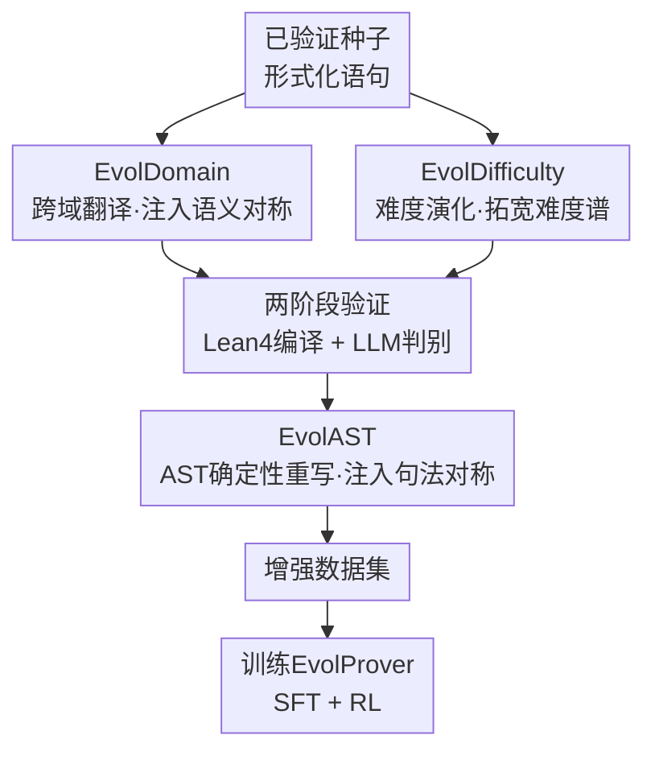

# EvolProver: Advancing Automated Theorem Proving by Evolving Formalized Problems via Symmetry and Difficulty

**会议**: ICLR2026  
**OpenReview**: [https://openreview.net/forum?id=cBoYkLG3EJ](https://openreview.net/forum?id=cBoYkLG3EJ)  
**代码**: 待确认  
**领域**: LLM推理 / 形式化定理证明 / 数据增强  
**关键词**: 形式化定理证明, 数据增强, 抽象语法树, 难度演化, 鲁棒性

## 一句话总结
EvolProver 提出一条"对称 + 难度"双视角的形式化语句数据增强流水线（EvolDomain 跨域翻译 + EvolDifficulty 难度演化 + EvolAST 基于 AST 的确定性句法重写），用增强数据训练出一个 7B 的非推理（non-CoT）定理证明器，在 FormalMATH-Lite 上以 53.8% pass@32 刷新同量级 SOTA，甚至超过推理模型。

## 研究背景与动机
**领域现状**：用 LLM 做 Lean / Coq / Isabelle 等形式化定理证明是当前热门方向。形式语言把数学证明写成需要编译器逐行校验的代码，保证了证明的绝对可靠，但也带来一个死结——高质量训练数据极度稀缺：写一条形式化证明需要深厚领域知识和大量时间，和 LLM 的"数据饥渴"范式天然冲突。为缓解数据稀缺，社区探索了多种合成方法：DeepSeek-Prover 把大量自然语言题目自动翻译成形式化语句再用模型打分筛选；Goedel-Prover-V2 用脚手架策略生成难度合适的题目；STP 让一个模型在"猜想者"和"证明者"两个角色间自博弈，迭代生成新题与证明。

**现有痛点**：即便用这些合成数据训练，模型仍然缺乏泛化性，对题目的微小变换异常脆弱。比如 Zhao et al. 发现，把不等式 $f(x) > g(x)$ 改写成 $f(x) + f(y) > g(x) + g(y)$ 这样一个等价但形式不同的变换，就能让 LLM 的表现断崖式下跌。这种脆弱性在非形式化数学里也存在（PutnamGAP、MATH-P-Hard 等基准都观察到 3%–25% 的掉点）。

**核心矛盾**：模型对微小变换敏感，本质上说明它没有学到数学问题底层的**对称结构**——数学里的"对称"恰恰就是"在某类变换下保持不变"。同时，已有合成数据往往集中在很窄的难度区间，使模型倾向于走捷径、靠记忆而非真正理解。

**本文目标**：从两个被前人忽略的维度直接增强形式化数据——句法对称、语义对称（合称"对称"视角）以及难度分布（"难度"视角），让模型学到不变性并覆盖更宽的难度谱。

**切入角度**：与"先演化自然语言题目、再形式化"的主流路线不同，作者主张**直接在形式化语句上做演化**。形式语言本身已携带逻辑结构，可以绕开自然语言中间层，既减少形式化环节引入的错误，又能用程序化手段（AST）做严格等价的重写。

**核心 idea**：用 EvolDomain（跨域翻译）注入语义对称、EvolDifficulty（难度演化）拓宽难度谱、EvolAST（AST 确定性重写）注入句法对称，三者组成流水线扩充数据，再训练出非推理证明器 EvolProver。

## 方法详解

### 整体框架
整条流水线要解决的是"如何从已验证的种子形式化语句，批量造出既多样又正确的新训练数据"。它分三个阶段串行：先用 LLM 驱动的 EvolDomain 与 EvolDifficulty **并行**演化种子语句，得到跨域 / 跨难度的新（自然语言 + 形式化）语句对；再经过一道两阶段验证（Lean 4 编译器查句法、LLM 判别查语义）过滤掉坏数据；最后用确定性的 EvolAST 在 AST 层面对验证通过的语句做等价句法变换，进一步扩充结构多样性。增强后的数据集用来微调 DeepSeek-Prover-V1.5-Base，经 SFT + RL 两阶段得到最终模型 EvolProver。

这里有一个被作者反复强调的**排序原则**：LLM 驱动的步骤像指数放大（$x \to \exp(x)$），因为基于 LLM 会引入显著且不可预测的变化，噪声会被指数式放大；而 EvolAST 是确定性句法变换，噪声放大更接近线性（$x \to 2x$）。因此把 LLM 阶段放前、确定性阶段放后（$x \to \exp(x) \to 2\exp(x)$），避免过早把噪声放大；若顺序颠倒会先线性、再指数地把误差炸开。把整体不稳定性控制在适中水平很关键——题目太不稳定就会变得无法证明，导致拿不到足够的有效训练实例。

### 关键设计

**1. EvolDomain：用跨域翻译注入语义对称**

针对"模型没学到题目可在不同数学域间重述这一语义对称"的痛点。EvolDomain 用 LLM 把一条形式化语句翻译进新的数学领域，核心是三步：① 抽取语句的抽象逻辑骨架（Deconstruction & Abstraction）；② 在目标域里找到结构类似的概念（Analogy & Transfer）；③ 基于该类比实例化出新命题（Instantiation & Packaging）。形式化地，给定源语句 $S^{formal}_i$ 和从预定义域列表 $L_D = \{D_1, \dots, D_M\}$ 中选出的目标域 $D_m$，函数 $F$ 引导 LLM 先抽逻辑骨架，再据此构造新命题，输出一个（自然语言描述 $\hat{P}_i$，新形式化语句 $\hat{S}^{formal}_i$）对，即 $F(S^{formal}_i, D_m) = (\hat{S}^{formal}_i, \hat{P}_i)$。为最大化跨域逻辑连接的探索，prompt 进一步要求 LLM 一次把同一逻辑骨架迁移并实例化到 3–5 个不同领域，因此单次调用产出一组覆盖多域的语句对。它有效是因为：直接在形式语句上做演化、绕开了"先写自然语言再形式化"的中间层，论文实验里这条直接路线产出的合格语句数明显高于各种 NL→形式化的基线。

**2. EvolDifficulty：用难度梯度演化打破捷径与记忆**

针对"训练数据难度区间太窄、模型靠记忆走捷径而难泛化"的痛点。EvolDifficulty 用 LLM 调整语句难度，造出难度谱很宽的数据集。记该过程为函数 $E$，由作者根据专家咨询设计的五条核心演化策略 $S = \{s_1, \dots, s_5\}$ 引导：(1) 调整逻辑结构、(2) 调整数学深度、(3) 调整抽象层次、(4) 调整约束条件、(5) 调整参数。给定形式化语句 $S^{formal}_i$，函数以策略 $s_k \in S$ 和演化方向 $\delta \in \{+1, -1\}$（分别表示升 / 降难度）指导 LLM 生成新的语句对，即 $E(S^{formal}_i, s_k, \delta) = (\hat{S}^{formal}_i, \hat{P}_i)$。通过系统化地遍历策略与方向，它能对数据难度做细粒度控制、生成平滑的难度梯度，从而丰富数据集的层级结构；难度被拉宽后，模型就难以再靠记忆某一窄难度段的捷径过关。

**3. 两阶段验证：编译器 + LLM 双过滤守住数据质量**

针对"LLM 演化不可避免会引入句法 / 语义错误"的痛点——这是整条流水线的质量闸门。第一阶段查句法：每条生成语句 $\hat{S}^{formal}_i$ 先送进 Lean 4 编译器校验句法完整性，失败的给一次 LLM 修复机会，仍不过则丢弃。第二阶段查语义：所有句法合法的语句对 $(\hat{S}^{formal}_i, \hat{P}_i)$ 再由 LLM 判别器评估三件事——形式化版本与自然语言版本是否一致、命题是否正确、难度是否合适。这种"确定性编译 + 语义判别"的双过滤机制，保证只有句法可靠且语义自洽的数据进入最终训练集。论文用 DeepSeek-V3.1 对 1,634 条 EvolDomain/EvolDifficulty 数据做语义评估，496 条未过，语义失败率 30.35%，正说明这道闸门不可或缺。

**4. EvolAST：用 AST 确定性重写补足句法对称**

针对"句法多样性不足、且 LLM 改写易出错"的痛点。EvolAST 把形式语句当作结构化代码解析成抽象语法树（AST），用一组基于既有公理与定理的**确定性**重写规则在树上做等价变换，从而绕开非确定性模型、保证语义严格等价。它实现了一套可扩展规则集（当前 7 条）$R = \{r_1, \dots, r_7\}$，每条对应一种逻辑等价：(1) 假设重排、(2) 交换律、(3) 结合律、(4) 分配律、(5) 德摩根律、(6) 对称关系的操作数互换、(7) 对偶关系转换。给定语句 $S^{formal}_i$，函数 $A$ 先解析成 AST，再递归遍历、在每个节点以预设概率 $p$ 施加可用规则 $r_k$，最后把修改后的 AST 重新编译成新语句，即 $A(S^{formal}_i, p) = \hat{S}^{formal}_i$。因为所有变换都基于严格逻辑等价，EvolAST 产出的语句句法多样却语义必然正确，**无需再走验证**；且高度可扩展——任何已知数学 / 逻辑等价都能编码成一条新规则。

**5. 先 LLM 后确定性的流水线排序：把噪声控制在适度区间**

针对"演化既要够多样、又不能把数据搞到无法证明"的张力。作者把不稳定性建模为放大效应：LLM 阶段（EvolDomain / EvolDifficulty）类似指数放大 $x \to \exp(x)$，确定性的 EvolAST 类似线性放大 $x \to 2x$。因此先跑 LLM 阶段、再跑 EvolAST（$x \to \exp(x) \to 2\exp(x)$），避免过早把噪声指数级炸开；若把句法变换放在前面，相当于先把基数抬高再做指数放大，误差会更大。把整体不稳定性压在适中水平很关键：太不稳定的题目会变得无法证明，进而拿不到足够多的有效训练实例来支撑增强策略。这条排序原则把"多样性"和"可证明性"这对矛盾调和到了一个可用的平衡点。

### 损失函数 / 训练策略
最终模型在增强数据上微调 DeepSeek-Prover-V1.5-Base（当前最强的、纯靠大规模形式化数据预训练且无 CoT 监督的模型，特别契合本文合成数据与"快速非推理证明器"的目标）。训练分两阶段：监督微调（SFT）+ 强化学习（RL）。对照与消融还训练了若干变体：EvolProver-Base 仅用原始未增强公开数据；EvolProver-Ablation-SFT / EvolProver-SFT 只走 SFT；EvolProver-Base / EvolProver-Ablation-RL / EvolProver 走 SFT+RL。

## 实验关键数据

### 主实验
EvolProver 是 7B 非推理模型，pass@32 评测。FormalMATH-Lite（425 题子集）上刷新同量级 SOTA，并超过推理模型：

| 数据集 | 指标 | EvolProver | 之前最佳 | 提升 / 说明 |
|--------|------|-----------|----------|------|
| FormalMATH-Lite | pass@32 | **53.86%** | 51.76%（DeepSeek-Prover-V2-CoT） | 超过推理模型 |
| FormalMATH-Lite | vs 自家 Base | 53.86% | 44.71%（EvolProver-Base） | +9.15 |
| MiniF2F-Test | pass@32 | **69.80%** | 非推理 SOTA | token 量近 1/10 于推理模型 |
| Ineq-Comp (Seed) | pass@32 | **52.20%** | 43.26%（Base） | +8.94 |
| Ineq-Comp (Transformed) | pass@32 | **34.02%** | 14.89%（Base） | +19.13 |
| Ineq-Comp (Ratio，鲁棒性) | 比值 | **65.17%** | 34.43%（Base） | +30.74 |

注：Ineq-Comp 用"变换题 pass / 种子题 pass"的比值衡量鲁棒性，比值越高越鲁棒；EvolProver 的鲁棒性比值比自家 Base 高 30.74 个百分点，直接验证了增强对鲁棒性的作用。非推理模型每条证明 < 700 token，而推理模型常需 > 6000 token。

### 消融实验
Table 4（FormalMATH-Lite / MiniF2F / Ineq-Comp，均 pass@32）按数据组成逐级叠加：上标 0 = 仅公开数据，0+1 = + EvolDomain&EvolDifficulty，0+1+2 = 全量（再加 EvolAST）。

| 配置 | FormalMATH | MiniF2F | Ineq-Comp(Seed) | Ineq-Comp(Trans) | Ineq-Comp(Ratio) |
|------|-----------|---------|-----------------|------------------|-------------------|
| EvolProver-Base⁰ | 44.71% | 52.05% | 43.26% | 14.89% | 34.43% |
| Ablation-SFT⁰⁺¹ | 50.35% | 65.16% | 49.79% | 29.19% | 58.62% |
| EvolProver-SFT⁰⁺¹⁺² | 51.53% | 66.39% | 49.82% | 30.35% | 60.19% |
| Ablation-RL⁰⁺¹ | 51.98% | 68.22% | 50.36% | 33.05% | 65.62% |
| EvolProver⁰⁺¹⁺² | **53.96%** | **69.80%** | **52.20%** | **34.02%** | 65.17% |

### 关键发现
- **每一级增强都带来一致增益**：从 0 → 0+1（加 LLM 语义/难度演化）跳幅最大（FormalMATH 44.71→50.35，MiniF2F 52→65），说明语义对称 + 难度拓宽贡献最重；再加 EvolAST（0+1→0+1+2）继续小幅稳涨，句法对称是有效补充。
- **直接演化形式语句优于先 NL 再形式化**：400 个种子下，四种方法通过验证的合格语句数为 EvolDomain&EvolDifficulty 661 > Formalization-Formalizer 570 > few-shot 492 > zero-shot 408，直接路线产量最高。
- **域多样性突破**：EvolDomain 把原本严重偏斜的域分布（Algebra 57.5% 一家独大、Calculus 仅 3.5%、多个域为 0）拉平（Algebra 降到 20.1%，并引入此前缺失的微分、多元微积分、积分等）；最显著的是 Calculus 从 Base 的 0 题突破到 3 题。
- **并非靠"刷相似题"取巧**：用 Qwen3-Embedding-8B 给每条测试样本检索训练集中 top-1 最相似样本、再由 DeepSeek-V3.1 打 1–10 分相似度，平均仅 3.48，说明增益不是来自训练集与测试集的高相似泄漏。

## 亮点与洞察
- **把"对称"这一数学第一性概念落到数据增强上**：句法对称（EvolAST）+ 语义对称（EvolDomain）双管齐下，直击"模型对等价变换脆弱 = 没学到不变性"的病根，比单纯堆数据量更对症。
- **指数 vs 线性的噪声放大模型决定流水线顺序**：把"LLM 改写不稳定、AST 改写稳定"量化为 $\exp$ 与线性放大，从而论证"先 LLM 后确定性"的排序，是个可迁移到其它"LLM 生成 + 规则后处理"流水线的思路——先做高方差生成、再做低方差确定性扩展。
- **AST 重写零验证成本**：EvolAST 因严格等价而无需再验证，相比 LLM 改写"边生成边过滤"的高损耗，是一条"几乎免费扩多样性"的路径，且只要新增等价规则就能扩展。
- **非推理却打平/超过推理模型**：用近 1/10 的 token 取得可比甚至更好的成绩，对推理成本敏感的落地场景很有吸引力。

## 局限与展望
- **作者明示的方向**：计划把合成的 CoT 数据并入训练，增强 EvolProver 的推理能力——即当前版本不带 CoT 是有意取舍，但也意味着它没吃到推理范式的红利。
- **LLM 阶段语义失败率不低**：EvolDomain/EvolDifficulty 的语义失败率约 30.35%，说明 LLM 演化仍会大量产坏数据，依赖那道两阶段验证闸门兜底；闸门本身用 LLM 判别，判别器的偏差未充分讨论。
- **规则与策略偏手工**：EvolAST 当前仅 7 条等价规则、EvolDifficulty 仅 5 条策略，覆盖面和扩展靠人工编码；规则之外的等价/难度变化无法触及。
- **域分布"拉平"的代价未深究**：把 Algebra 从 57.5% 压到 20.1% 是否对原本占多数的强项域有损失，正文只给了总体增益，缺少"拉平是否伤主域"的细看（Multivariable Calculus、Others 在 Table 3 中未涨）。

## 相关工作与启发
- **vs STP**：STP 用单个 LLM 在"猜想者 / 证明者"间自博弈生成新题与证明，本文则不造对抗循环，而是直接在已验证形式语句上做对称 / 难度演化；本文还把 STP-Lean 当作种子数据源之一，二者可叠加。
- **vs DeepSeek-Prover（V1/V2）**：DeepSeek-Prover 走"自然语言题→形式化→打分筛选"路线，本文实验直接对比表明"先 NL 再形式化"产量低于直接演化形式语句；EvolProver 本身也是在 DeepSeek-Prover-V1.5-Base 上微调。
- **vs WizardMath / Evol-Instruct**：Evol-Instruct 系在自然语言数学题上做难度演化，本文的 EvolDifficulty 把这一思路迁移到形式化语句，并明确设计了 5 条可控策略 + 方向因子。
- **vs Ineq-Comp**：Ineq-Comp 是评测鲁棒性的基准（系统性构造不等式扰动），本文不仅在其上取得非推理 SOTA，更把"对扰动鲁棒"作为增强目标，从造数据端正面解决它揭示的脆弱性。

## 评分
- 新颖性: ⭐⭐⭐⭐ 把数学"对称 / 难度"系统落到形式化数据增强，AST 确定性重写 + 指数/线性排序论证都较新颖。
- 实验充分度: ⭐⭐⭐⭐ 四个基准 + 逐级消融 + 演化方法对比 + 域分布 + 相似度泄漏检验，覆盖较全。
- 写作质量: ⭐⭐⭐⭐ 动机与方法链条清晰，图示到位；个别量化论证（exp/线性）偏直觉。
- 价值: ⭐⭐⭐⭐ 非推理小模型刷新多基准 SOTA 且鲁棒性大涨，对低成本形式化证明落地有实用价值。

<!-- RELATED:START -->

## 相关论文

- [\[ICLR 2026\] Process-Verified Reinforcement Learning for Theorem Proving via Lean](process-verified_reinforcement_learning_for_theorem_proving_via_lean.md)
- [\[ICLR 2026\] Mathesis: Towards Formal Theorem Proving from Natural Languages](mathesis_towards_formal_theorem_proving_from_natural_languages.md)
- [\[ICLR 2026\] Neural Theorem Proving for Verification Conditions: A Real-World Benchmark](neural_theorem_proving_for_verification_conditions_a_real-world_benchmark.md)
- [\[ACL 2025\] Local Look-Ahead Guidance via Verifier-in-the-Loop for Automated Theorem Proving](../../ACL2025/llm_reasoning/local_look-ahead_guidance_via_verifier-in-the-loop_for_automated_theorem_proving.md)
- [\[ICML 2026\] DyCon: Dynamic Reasoning Control via Evolving Difficulty Modeling](../../ICML2026/llm_reasoning/dycon_dynamic_reasoning_control_via_evolving_difficulty_modeling.md)

<!-- RELATED:END -->
