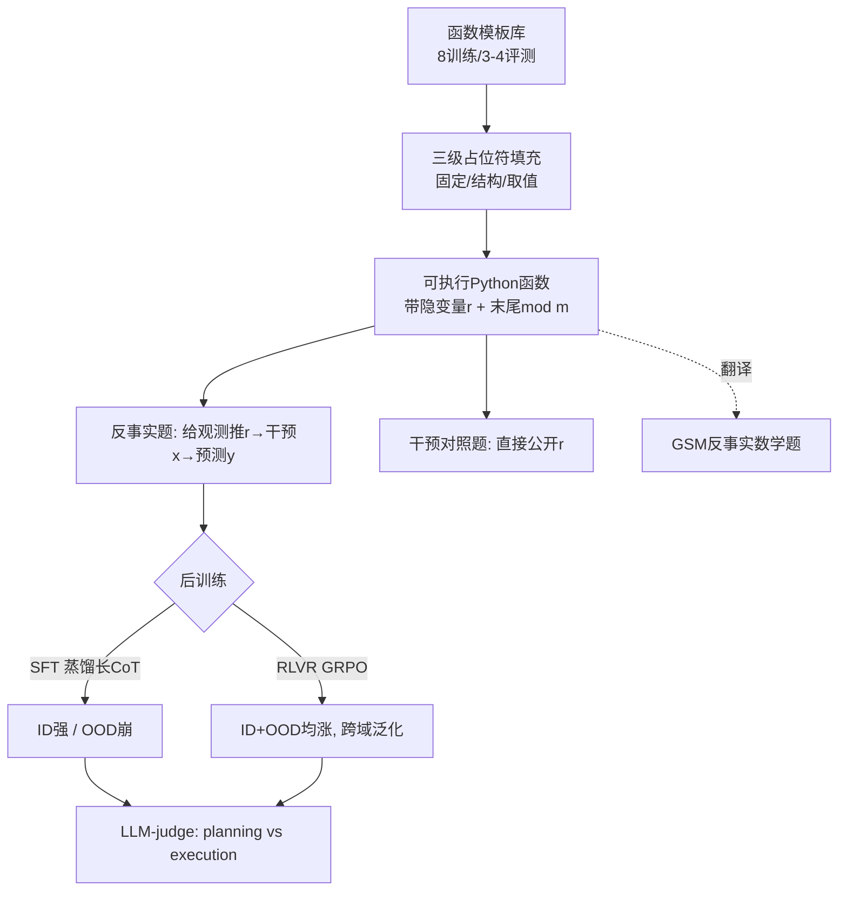

# Executable Counterfactuals: Improving LLMs' Causal Reasoning Through Code

**会议**: ICLR 2026  
**代码**: [AniketVashishtha/Executable_Counterfactuals](https://github.com/AniketVashishtha/Executable_Counterfactuals)  
**领域**: LLM 推理 / 因果推理 / 后训练  
**关键词**: 反事实推理, 溯因 (abduction), 可执行代码, RLVR, GRPO, 分布外泛化  

## 一句话总结
把"反事实推理"重新还原成"溯因→干预→预测"三步，用带隐变量的可执行 Python 函数（和等价的 GSM 数学题）构造必须做溯因才能答对的题目，发现 SOTA 模型从干预到反事实掉点 25–40%，而仅在代码上做 RLVR 能把这三步认知技能泛化到全新控制流和自然语言数学题，SFT 却只会记住浅层模式而无法泛化。

## 研究背景与动机
**领域现状**：反事实推理（"如果当初……会怎样"）是科学发现、医疗、政策等高风险领域的核心能力，按 Pearl 的因果阶梯属于最高的 Level 3。一个完整的反事实查询包含三步：从观测中溯因出系统的隐含状态（abduction）、构造替代情境（intervention）、预测替代情境下的结果（prediction）。

**现有痛点**：几乎所有评测 LLM 反事实能力的工作都**跳过了溯因这一步**。它们要么用"信息完全可观测、无隐变量噪声"的设定，要么是把已有推理题做扰动后改个"反事实"的说法。在这种设定下，反事实查询直接塌缩成 Level 2 的干预查询——因为没有隐变量要推断，只需把输入改成指定值再正向算一遍即可。

**核心矛盾**：这种简化导致**严重高估**了 LLM 的反事实能力，把真正的反事实推理与更简单的因果推理混为一谈，使得无法定位模型到底强在哪、弱在哪，也无法设计有针对性的改进算法。

**本文目标**：构造**必须同时用到溯因、干预、预测三步才能答对**的任务，从而干净地把反事实推理从干预推理中分离出来，并据此评测和改进 LLM。

**核心 idea**：**用代码理解作为反事实推理的载体（executable counterfactuals）**。给一个 Python 函数引入"latent 随机变量 r"，r 在整个推理过程中保持不变但不告诉模型，模型必须从给定的事实输入输出对反推出 r。例如因果结构 $X \to Y \leftarrow R$ 转成程序：$X$ 计算 $Y$、$R$ 决定条件分支。给定观测 $y=f(r, x{=}1)=-1$、$r$ 未知，问"若把 $x$ 改成 3、保持同一个 $r$，$y$ 会是多少"——这就强制模型先溯因 $r$、再干预 $x{=}3$、最后预测 $y_{cf}=f(r, x{=}3)$。代码天然是计算图、能映射到因果/数学形式、又能精确控制难度并生成可验证的 ground truth。

## 方法详解

### 整体框架
框架由两部分组成：(1) 一套基于**嵌套模板**的合成数据生成器，能产出结构多样、带隐变量、带可验证答案的可执行代码反事实题，并把代码题翻译成等价的 GSM 数学应用题以测跨域泛化；(2) 在此数据上对比 **SFT（蒸馏强模型的长 CoT）** 与 **RLVR（GRPO + 可验证奖励）** 两条后训练路线，并用 LLM-as-judge 把推理轨迹拆成"planning（是否按溯因-干预-预测三步走）"和"execution（中间计算是否正确）"两个维度做行为分析。

### 关键设计

**1. 三级占位符模板：从少量模板撑出大规模结构多样性**。直接换数字/换算符（如 CheckList 式扰动）只改取值不改控制流，无法测真正的结构泛化。本文用模板把"完整代码块按功能挖空"，再分三级填：**固定占位符**（函数名、用随机种子可复现地抽取 latent $r$、return 语句）、**结构占位符**（预处理步、主 if 条件、elif 分支、各分支代码块、return 形态等完整逻辑块）、**取值占位符**（具体算符和阈值如 +、\*、threshold）。Claude-4-Sonnet 起草模板和候选代码块、人工校验质量，训练集给 15 组模板×代码块组合，再做去重，从而用可控配方生成大量结构语义都不同的函数。

**2. 末尾取模制造多解，逼近真实世界的反事实歧义**。现实中常有多个隐变量配置都能解释同一观测。本文在训练函数 return 时插入取模 $\text{return } g(\cdot) \bmod m$，取模的周期性使 latent $r$ 到观测输出形成**多对一映射**——多个 $r$ 都与事实运行一致，于是存在多个合法的反事实答案。评测时按"对全部合法答案集合"打分：报 exact match（集合相等）和奖励部分覆盖的聚合 F1。对照的干预版本则保持代码不变、直接公开 $r$ 的真实取值，溯因步被移除，任务退化成"换个输入 $x$ 重新跑一遍"。

**3. 四类控制逻辑显式切分 ID/OOD，把"泛化"拆成可归因的几个轴**。`If_else`（≤1 层嵌套，用于训练和同分布评测）、`If_else-long`（更深嵌套，测更长代码这一**表层**特征的 OOD）、`While`（while 循环，测训练中从未见过的**控制逻辑** OOD）、`Multi_r`（每个函数三个隐变量 + 引入 for 循环，测**因果结构** OOD）。再加上 GSM 数学题测**问题域**（代码→自然语言）OOD。这样当模型在某个轴上掉点时，能精确归因是栽在表层长度、控制流、隐变量结构还是语言域上。

**4. RLVR (GRPO) 替代 SFT 蒸馏，用最弱的监督拿到最强的泛化**。SFT 用 DeepSeek-R1-Distill-Qwen-32B 当教师蒸馏长 CoT 到 Qwen2.5-1.5B/3B/7B-Instruct；RLVR 用 GRPO，只需 outcome-based 监督——把 exact match 当可验证奖励，prompt batch size 16、rollout size 24。关键对比：SFT 有强外部监督信号但只学到与表面任务特征绑定的浅层溯因模式，OOD 即崩；RLVR 只在 `If_else` 代码上训练却**诱导出溯因-干预-预测这套核心认知行为本身**，从而直接迁移到 while、multi_r 乃至自然语言数学题。

## 实验关键数据

### 主实验：当前 LLM 的反事实 vs 干预鸿沟（编码域，多答案 F1/EM）
即便是顶尖推理模型，从干预到反事实也会大幅掉点：

| 模型 | while-干预 | while-反事实 | multi_r-干预 | multi_r-反事实 |
|------|-----------|-------------|-------------|---------------|
| o4-mini | 99.4 | 74.4 | 89.8（≈42.3 EM）| 42.3 |
| Claude-4-Sonnet | 71.5 | 58.2 | — | 58.8 |
| QwQ-32B | 98.8 | 55.1 | — | 41.3 |
| GPT-4o | 58.2 | 4.4 | — | 41.7 |
| Llama-3.3-70B | 76.3 | 4.0 | — | 36.4 |

非推理模型在 while 反事实上普遍 <10%，但其干预对照能到 70%+；SOTA 模型整体掉点 **25–40%**。失败几乎全集中在溯因步。

### 后训练对比：SFT 只会 ID、RLVR 才能 OOD（Qwen2.5 系列，EM）

| 模型 | ID if_else | OOD multi_r | OOD while |
|------|-----------|-------------|-----------|
| 7B-Instruct (base) | 13.9 | 17.9 | 3.3 |
| 7B-Instruct-**SFT** | **59.0** | 23.3 | 2.1 |
| 7B-Instruct-**RL** | 67.8 | **36.3** | **8.1** |

SFT 在 ID 上把 EM 从 13.9 拉到 59.0（≈40% 提升），但 OOD while 反而从 3.3 掉到 2.1（伤害性能）；RLVR 在 ID/OOD 全线上涨。7B-RLVR 在编码域整体可比 72B-Instruct、稳超其 32B 变体。

### 跨域泛化：代码→GSM 反事实数学题（Accuracy）

| 模型 | Instruct | SFT | RLVR |
|------|---------|-----|------|
| Qwen2.5-1.5B | 9.0 | 1.5 | 11.0 |
| Qwen2.5-3B | 22.0 | 8.5 | 27.7 |
| Qwen2.5-7B | 39.0 | 12.9 | 46.3 |

只在代码上训练，RLVR 仍能迁移到自然语言数学题并随模型规模稳定 scale；SFT 一致地把性能拖到比 base 还低。

### 关键发现（行为分析，LLM-judge 1–5 分）
- **放大模型尺寸只提升 execution、不提升 planning**：7B 的溯因 planning 分在 3/4 任务上高于 32B，在 if_else-long 和 while 上甚至高于 72B——单纯堆参数无法解决溯因。
- **SFT 记住的是浅层溯因模式**：OOD 复杂度一上来，planning 分骤降，模型退回三种原型失败模式（穷举枚举隐变量、随便假设一个值、不必要的 case 拆分与循环论证）来逃避真正的溯因。
- **RLVR 学到的是策略本身**：planning 分在所有数据集最高；但其 multi_r/while 上 execution 分明显下降，说明 RLVR 的主要剩余错误是"策略对、算错了"——揭示了反事实推理技能与通用计算技能学习的不同步。

## 亮点与洞察
- **概念正本清源**：明确指出整整一长串"反事实"工作其实只在做干预推理，把溯因步当作区分 Level 2/Level 3 的试金石，这个 framing 本身就很有价值。
- **代码作为因果实验台**：程序即计算图，既能映射数学/图形式、又可验证、又能精细控制隐变量结构和难度，把"造可验证反事实数据"这个老大难变得可规模化。
- **取模制造多解**是个轻巧而巧妙的设计，用一行代码就模拟了现实反事实"多个隐配置解释同一观测"的本质歧义。
- **SFT vs RL 的泛化对比**给了干净证据：外部监督再强，蒸馏长 CoT 也只是记表层；RL 哪怕只有 outcome reward，却能诱导出可迁移的认知策略。这对"该用 SFT 还是 RL 做推理后训练"的争论是一个有说服力的数据点。

## 局限与展望
- **RLVR 被计算精度卡脖子**：multi_r/while 上 execution 分大跌，说明就算策略学对了，长程算术/代码模拟出错仍拉低准确率；未来需同时优化"反事实策略"和"通用计算"两种技能。
- **合成与受控**：模板生成的代码/数学题虽多样但仍是受控玩具环境，离真实科研/医疗场景的反事实还有距离，外部效度待验证。
- **规模有限**：后训练只在 Qwen2.5-1.5B/3B/7B 上做，更大模型上 RLVR 是否仍优于 SFT、能否突破计算瓶颈未知。
- **奖励单一**：RLVR 只用 exact-match outcome reward，未尝试过程奖励来直接监督溯因步，可能进一步缓解 planning/execution 不同步。

## 相关工作与启发
- **因果阶梯 benchmark**（Jin et al. 2024 等）：理论严谨但很多任务预设了 do-calculus、d-separation 等高级工具，难以定位错误来源；本文改用代码/数学这两个 LLM 进步最快的域来隔离因果能力。
- **"反事实"扰动类工作**（Wu et al. 2024、Chen et al. 2025 等）：被本文点名为"信息完全可观测、塌缩成干预"的典型，构成了主要的对照与批判对象。
- **RLVR / GRPO**（Shao et al. 2024、DeepSeek-R1）：本文把这套可验证奖励 RL 用到反事实推理上，提供了"RL 诱导可迁移认知行为"的又一证据。
- **启发**：把抽象认知技能（溯因）显式 operationalize 成"必须做才能答对"的可验证任务，是评测和训练高阶推理的一个通用范式——可推广到其他难以观测的因果/元认知技能。

## 评分
- **新颖性**: ⭐⭐⭐⭐⭐ — "用带隐变量的可执行代码强制溯因"这个 framing 既理论清晰又工程可行，正本清源地把反事实从干预里切出来。
- **实验充分度**: ⭐⭐⭐⭐ — 覆盖 1.5B–72B 开源模型 + 多个商用推理模型，ID/OOD 四轴 + 跨域数学 + 行为分析齐全；略欠更大规模 RL 验证。
- **写作质量**: ⭐⭐⭐⭐ — 三步定义、塌缩论证、模板设计讲得清楚，图表对比直观。
- **价值**: ⭐⭐⭐⭐⭐ — 既给了可规模化的反事实评测/训练框架，又对"SFT vs RL 泛化"贡献了有力证据，对因果推理与推理后训练两个社区都有参考价值。

<!-- RELATED:START -->

## 相关论文

- [\[ICLR 2026\] On Code-Induced Reasoning in LLMs](on_code-induced_reasoning_in_llms.md)
- [\[ICLR 2026\] Emergent Hierarchical Reasoning in LLMs through Reinforcement Learning](emergent_hierarchical_reasoning_in_llms_through_reinforcement_learning.md)
- [\[ICLR 2026\] AceReason-Nemotron 1.1: Advancing Math and Code Reasoning through SFT and RL Synergy](acereason-nemotron_11_advancing_math_and_code_reasoning_through_sft_and_rl_syner.md)
- [\[ICLR 2026\] Improving Reasoning for Diffusion Language Models via Group Diffusion Policy Optimization](improving_reasoning_for_diffusion_language_models_via_group_diffusion_policy_opt.md)
- [\[NeurIPS 2025\] CoRe: Benchmarking LLMs' Code Reasoning Capabilities through Static Analysis Tasks](../../NeurIPS2025/llm_reasoning/core_benchmarking_llms_code_reasoning_capabilities_through_static_analysis_tasks.md)

<!-- RELATED:END -->
