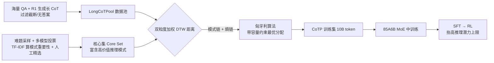

# Expanding Reasoning Potential in Foundation Model by Learning Diverse Chains of Thought Patterns

**会议**: ICLR 2026  
**OpenReview**: [https://openreview.net/forum?id=3FQV4JHPpY](https://openreview.net/forum?id=3FQV4JHPpY)  
**代码**: [rc314159-creator/CoTP](https://github.com/rc314159-creator/CoTP)  
**领域**: LLM 推理 / 中训练数据筛选  
**关键词**: Chain-of-Thought、推理潜力、中训练（mid-training）、数据筛选、推理模式、Dynamic Time Warping、强化学习  

## 一句话总结
本文首次把基座模型的"推理潜力"形式化为"答对一题所需独立尝试次数的倒数"，并提出 CoTP 框架——从 CoT 序列里抽象出原子级推理模式，用"推理模式链 + token 熵链"的双粒度加权 DTW 距离，从海量数据池中精选与高价值核心集对齐的长 CoT 数据，仅用 10B token 就让 85A6B MoE 模型在 AIME 上提升 9.58%、把下游 RL 上限抬高 7.81%。

## 研究背景与动机
**领域现状**：大推理模型（LRM）在数学推理上的进展主要由 RL 后训练驱动，而越来越多实证研究表明，RL 只是"显化"了基座模型参数空间里已有的隐式推理路径——基座模型本身的推理能力直接决定并限制了 RL 的性能上限。与此同时，在中训练（mid-training）阶段把 QA 数据与长 CoT 数据混合喂给模型，被证明能显著加深推理深度。

**现有痛点**：当前做法几乎都是"粗放地"使用 CoT 数据——要么无差别地把所有长 CoT 混进去（如本文的 LongCoTPool），要么单纯堆难题做蒸馏，缺乏对 CoT 序列内部"推理范式"本质的细究。**核心矛盾**：到底哪类数据最能提升模型推理能力？简单混合反而可能稀释价值——实验里混合池 LongCoTPool 的平均表现甚至略低于单一来源的 OpenR1-Math / AM-Distilled，说明"多"不等于"好"。

**本文目标**：在中训练阶段精准筛选出富含高价值推理模式的 CoT 数据，最大化扩展基座模型的推理潜力，从而抬高下游 RL 的天花板。

**核心 idea**：**①给推理潜力下定义**——把它形式化为答对所需独立尝试次数 $K$ 的倒数，扩展潜力 ≡ 降低平均尝试次数；**②用核心集逼近 oracle**——从 CoT 里抽象出有共性、可归纳的原子推理模式，构造一个富含高价值模式的核心参考集；**③双粒度对齐筛选**——用"推理模式链 + token 熵链"的加权 DTW 距离，从数据池里召回与核心集最相似的数据。

## 方法详解

### 整体框架
CoTP（Chains of Thought Patterns）把"什么数据最有价值"转化为一个可计算的检索问题：先理论定义推理潜力并指出理想的 oracle 训练集不可得，于是用一个人工精选、富含高价值推理模式的**核心集**去逼近 oracle；再把每条 CoT 同时表示为"推理模式链"（高度抽象的推理范式）和"token 熵链"（细粒度的高增益 token 特征）两个粒度，用加权 DTW 度量数据池样本与核心集的距离，最后以匈牙利算法求带容量约束的最优分配，召回与核心集对齐的训练子集 CoTP，喂给基座模型中训练。

### 关键设计

**1. 把"推理潜力"定义成可优化的量：尝试次数的倒数。** 不同于确定性评测，本文用采样模式多次推理来刻画模型表现的随机性，把模型潜力定义为采样时答对的概率 $\Phi(M, q_i) = P[f_M(q_i) = a_i^*]$，整体潜力是评测集上的期望 $\Phi(M, D_{eval}) = \frac{1}{N}\sum_i \Phi(M, q_i)$。关键的桥梁在于：若把每次独立尝试看成成功概率为 $\Phi$ 的伯努利试验，则首次答对所需尝试次数 $K_i \sim \text{Geom}(\Phi(M, q_i))$，于是 $\Phi(M, q_i) = 1/\mathbb{E}[K_i]$——潜力就是期望首达时间的倒数，$K$ 越小潜力越高。这把"扩展潜力"这件抽象的事，落成了"让模型平均更少尝试就能答对"的可度量目标，也直接解释了为什么它和 pass@k 曲线、RL 上限强相关。

**2. 用核心集逼近不可得的 oracle 训练集。** 理论上存在一个让潜力最大化的理想 oracle 集 $D^*_{oracle}$，目标是从数据池里选 $M$ 个样本使训练后潜力尽量逼近它（式 5）。但 oracle 不可知，于是本文退而构造一个**人工精选的核心参考集**作为代理：先从带难度/题型标注的源数据采样、用多个强推理模型生成答案并多数投票筛掉不可解题，得到题目集 $Q$；再对每题用强模型生成 $r$ 条 CoT，抽出模式链 $\xi(c)$，用 TF-IDF 给每个模式 $\rho_k$ 算重要性 $\omega(\rho_k|q_i, Q) = \text{TF}(\rho_k, q_i) \times \text{IDF}(\rho_k, Q)$；最后从答对的 CoT 里**人工挑选**那些展现出独特、高重要性模式的样本组成核心集，每条都附带其模式重要性权重。这一步用"人工 + 重要性加权"把价值判断注入了少量种子数据，后续筛选全靠它做锚点。

**3. 双粒度表示 + 加权 DTW 度量相似度。** 每条 CoT 被同时编码成两条链：**模式链** $C = [\rho_1, ..., \rho_n]$（原子推理操作的有序序列，由 DeepSeek-V3 标注，捕捉高度抽象的推理范式）和**熵链** $H = [h_1, ..., h_T]$，其中每个 token 的熵 $h_t = -\sum_{v \in V} p_t(v)\log p_t(v)$，捕捉高推理增益的 token 级特征。源样本 $j$ 与核心样本 $i$ 的距离是两者加权和：$D_{ij} = \lambda\, d_{pattern}(\xi(c_i^c), \xi(c_j^s)) + (1-\lambda)\, d_{entropy}(\eta(c_i^c), \eta(c_j^s))$。两个距离都用加权 DTW 计算 $d(x, y) = \text{WeightedDTW}(x, y, w, \delta)$：模式链上权重 $w$ 取核心样本的模式重要性 $\Omega_i$、基础距离 $\delta$ 用字符级 n-gram；熵链上权重为 1、$\delta$ 用绝对差。DTW 的好处是能容忍两条 CoT 在长度/对齐上的不一致，仍按推理"节奏"匹配；重要性加权则让关键模式在匹配时占更大话语权。

**4. 转成线性分配问题、用匈牙利算法求全局最优召回。** 想为每个核心样本召回 $o$ 个源样本（$T = t \cdot o$），本文把它写成带容量约束的 0-1 分配问题（式 7）：最小化 $\sum_{i}\sum_{j} D_{ij} S_{ij}$，约束每个核心样本恰好分到 $o$ 个、每个源样本至多被一个核心样本认领。直接解是组合优化，本文把每个核心实例复制 $o$ 份，构造 $t\cdot o \times N$ 的扩展代价矩阵，再用**匈牙利算法**求最优分配（附录证明复制不破坏最优性）。整套流程域无关，理论上适用于任何可分解为原子推理模式的场景。

### 训练策略
中训练用 85A6B MoE（14T token 预训练）做退火，把 30B token 专用推理数据与通用数据 KnowEdu 按 **1:2** 混合，推理数据格式为 `{question}\n{cot answer}`、答案用 `\boxed{}` 包裹；扩展实验放大到 60B token 保持同样配比。为公平对比，所有模型都用同一份 60k 长 CoT 做 SFT（避免低估那些本来不会生成长 CoT 的模型），再用 GSPO 算法做 RL，验证中训练扩展出的潜力能否平滑迁移到 RL。

## 实验关键数据

### 主实验（SFT 后 pass@1 平均准确率 %，85A6B MoE）

| 数据集 | General | AIME2025 | AIME2024 | HMMT2025 | BeyondAIME | MATH500 | AVG. |
|---|---|---|---|---|---|---|---|
| KnowEdu | 64.39 | 0.33 | 1.22 | 5.10 | 0.00 | 45.80 | 10.49 |
| OpenR1-Math | 66.58 | 23.96 | 29.69 | 16.04 | 9.10 | 87.80 | 33.32 |
| AM-Distilled | 67.97 | 23.12 | 25.52 | 18.02 | 8.30 | 87.20 | 32.43 |
| LongCoTPool | 65.95 | 21.89 | 24.90 | 15.63 | 7.90 | 85.40 | 31.14 |
| **CoTP (Ours)** | 66.08 | **28.02** | **37.92** | **20.73** | **10.20** | **90.80** | **37.53** |

仅 10B 精选数据，CoTP 平均超过 LongCoTPool **6.39%**、AIME 2024&2025 提升 **9.58%**；混合池 LongCoTPool 反而略低于单一来源，印证"简单混合不够、精选才有效"。

### 中训练 → RL 上限对比（SFT vs RL 平均准确率 %）

| 数据集 | AVG. SFT | AVG. RL |
|---|---|---|
| KnowEdu | 10.49 | 9.40 |
| LongCoTPool | 31.14 | 43.63 |
| **CoTP (Ours)** | **37.53** | **51.44** |

CoTP 的 RL 上限比 LongCoTPool 高 **7.81%**、比 KnowEdu 高 42.04%；pass@k 曲线随 k 增大持续领先，说明中训练扩展的潜力能切实迁移到 RL、而非提前"透支"。

### 消融实验（12B token QA blend，AVG. %）

| 配置 | AVG. |
|---|---|
| CoTP（n=1/2, λ=0.8） | **30.68** |
| w/o entropy（λ=1） | 29.93 |
| n-gram n=2 | 29.12 |
| w/o importance | 29.66 |

### 关键发现
- **熵链有用**：去掉熵（仅模式链）平均掉 0.75%，token 级熵能更细粒度地捕捉高增益推理。
- **n-gram 取 n=1 或 2 最佳**：兼顾上下文广度与细节，单用 n=2 反而最差。
- **重要性权重关键**：去掉模式重要性掉到 29.66%，区分"普通模式 vs 重要模式"对潜力贡献不同。
- **可扩展**：放宽相似度阈值扩到 60B token，AIME 仍较 30B 再涨 4.72%，且不损通用性能。

## 亮点与洞察
- **把"潜力"做成可计算量**：用几何分布把"推理潜力"严格定义为期望首达时间的倒数，给"哪类数据有价值"提供了理论锚点，也优雅解释了与 pass@k、RL 上限的强相关。
- **双粒度视角新颖**：同时用"抽象推理模式链"和"细粒度 token 熵链"刻画 CoT，比单看文本相似度或难度标签更贴近"推理本质"。
- **检索式数据筛选**：把数据选择写成带容量约束的最优分配、用匈牙利算法求全局最优，方法干净且域无关。
- **聚焦中训练而非后训练**：在 RL 火热的当下，本文把杠杆点放在更上游的中训练数据上，证明"基座潜力决定 RL 天花板"。

## 局限与展望
- **核心集依赖人工精选**：高价值模式的判定仍需人工挑选种子，规模化与主观性是隐忧；oracle 只能近似而非求得。
- **领域局限于数学**：实验集中在数学推理，虽声称域无关，STEM/代码等其他领域只在附录做了模式可视化，缺正式验证。
- **依赖强教师模型**：CoT 由 DeepSeek-R1 生成、模式由 DeepSeek-V3 标注、熵由参考模型算，整条管线成本不低且受教师能力上限约束。
- **超参敏感**：$\lambda$、n-gram 阶数等需调；中文做模式标注的结论是否迁移到纯英文管线待考。

## 相关工作与启发
- **中训练扩展推理**（OctoThinker、BoostQA 等）：本文延续"中训练混合长 CoT 能加深推理"的脉络，但从"混什么"推进到"精选什么"。
- **RL 显化隐式能力**（GSPO、GRPO 系）：呼应"RL 上限由基座决定"的实证观察，把优化焦点前移到中训练。
- **token 熵 / 高增益 token**：借鉴用熵刻画推理关键 token 的工作，把它作为筛选的细粒度信号。
- **启发**：当 RL 收益趋于饱和时，"上游数据质量"可能是更高杠杆的方向；"把价值判断形式化为可检索的距离"是一种可复用的数据工程范式，可迁移到代码、agent 轨迹等其他长序列数据的精选。

## 评分
- **新颖性**: ⭐⭐⭐⭐ 首次形式化"推理潜力"并提出双粒度模式链 + 熵链的检索式数据筛选，视角和方法都较新。
- **实验充分度**: ⭐⭐⭐⭐ 在真实 85A6B MoE 上做了主实验、RL 迁移、可扩展性与多项消融，benchmark 覆盖全；但仅限数学领域、缺跨域正式验证。
- **写作质量**: ⭐⭐⭐⭐ 理论定义清晰、框架图与算法完整，叙述从动机到方法层层递进。
- **价值**: ⭐⭐⭐⭐ 给"中训练用什么 CoT 数据"提供了可操作的筛选范式，且证明能切实抬高 RL 天花板，对工业级推理模型训练有实践意义。

<!-- RELATED:START -->

## 相关论文

- [\[ICLR 2026\] MathFimer: Enhancing Mathematical Reasoning by Expanding Reasoning Steps through Fill-in-the-Middle Task](mathfimer_enhancing_mathematical_reasoning_by_expanding_reasoning_steps_through_.md)
- [\[ICLR 2026\] String Seed of Thought: Prompting LLMs for Distribution-Faithful and Diverse Generation](string_seed_of_thought_prompting_llms_for_distribution-faithful_and_diverse_gene.md)
- [\[ICLR 2026\] GPG: A Simple and Strong Reinforcement Learning Baseline for Model Reasoning](gpg_a_simple_and_strong_reinforcement_learning_baseline_for_model_reasoning.md)
- [\[ICLR 2026\] Learning to Reason over Continuous Tokens with Reinforcement Learning (HyRea)](learning_to_reason_over_continuous_tokens_with_reinforcement_learning.md)
- [\[ACL 2025\] Fine-Tuning on Diverse Reasoning Chains Drives Within-Inference CoT Refinement in LLMs](../../ACL2025/llm_reasoning/dcot_diverse_cot_refinement.md)

<!-- RELATED:END -->
