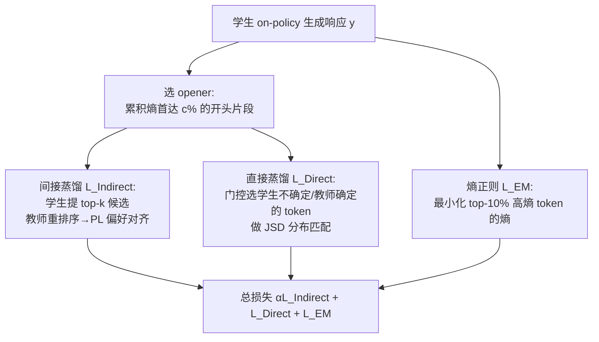

# Explain in Your Own Words: Improving Reasoning via Token-Selective Dual Knowledge Distillation

**会议**: ICLR 2026  
**代码**: [github.com/kmswin1/TSD-KD](https://github.com/kmswin1/TSD-KD)  
**领域**: LLM 推理 / 知识蒸馏  
**关键词**: 知识蒸馏, 推理蒸馏, on-policy KD, 偏好排序, token 熵, 链式思维  

## 一句话总结
TSD-KD 让小学生模型「用自己的话」推理：只在响应开头的高熵关键 token 上做蒸馏，结合「教师只对学生候选打分」的间接偏好蒸馏和「专挑学生不确定、教师却确定的 token」的直接蒸馏，再加熵正则，在 10 个推理基准上把 1.5B 学生推到 SOTA，部分任务甚至反超 14B 教师。

## 研究背景与动机
- **领域现状**：知识蒸馏把大模型的推理能力迁移到小模型，能大幅降低生成长链式思维（CoT）的推理成本。近期的 on-policy KD（如 MiniLLM、GKD）让学生在自己生成的输出上训练，缓解了 off-policy 的分布偏移问题。
- **现有痛点**：on-policy KD 本质仍是 **teacher-forcing**——强迫学生在每个 token 上都匹配教师分布。容量有限的小学生被这种「全程高密度监督」淹没，而教师和学生的推理水平本就差距巨大（论文比喻成「大四学生 vs 初中生」解题过程天然不同），强行逐 token 对齐 KL 反而引发分布失配。
- **核心矛盾**：蒸馏要「教得多」才能传递知识，但学生「学不动」过量监督，且过强约束会抹掉学生自我推理的空间。
- **关键观察**：作者测量推理轨迹的逐 token 熵，发现 **少数 token 熵远高于均值（峰值数倍），且高熵 token 集中在推理轨迹的开头**——这些是推理的关键「分叉点」。
- **本文目标**：设计一个 **以学生为中心（student-centric）** 的 KD 框架，只在重要 token 上做「有针对性且间接」的监督，把其余 token 交给学生自由发挥。
- **核心 idea**：**「targeted + indirect」蒸馏**——只蒸馏开头的高熵关键 token；教师不强加自己的整套分布，而是只对学生提出的候选做偏好排序，鼓励学生「用自己的话」解释推理。

## 方法详解

### 整体框架
TSD-KD 是一个 on-policy 蒸馏框架，由三个全部以「token 选择」方式运作的部件组成：**间接蒸馏**（教师对学生候选做偏好排序，提供弱反馈）、**直接蒸馏**（在学生不确定、教师确定的 token 上做 JSD 分布匹配）、**熵正则**（最小化最不确定 token 的熵以稳住学生信心）。三者通过一个「opener」概念被限制在响应开头的高熵区段，其余 token 让学生自由生成。

### 关键设计

**1. Opener：把监督锁在推理的「开局」**——既然高熵关键 token 集中在响应开头，作者定义 opener 为响应里「累积熵首次达到 c% 的连续起始片段」。给定位置 $t$ 的熵 $H_t(p)=-\sum_{v\in V}p(v|x,y_{<t})\log p(v|x,y_{<t})$，opener 取到满足 $\sum_{t=1}^{m}H_t(p_S)/\sum_{t=1}^{L}H_t(p_S)\ge c\%$ 的最小 $m$。论文用很小的 $c=10\%$ 就足够，并可按样本难度自适应放大。直觉是：开局正确地设定推理方向、建立分叉，比纠结后半段更关键——而把蒸馏限制在这一小段，正是「让学生自由用自己的话推理」的物理实现。

**2. 间接蒸馏：教师只当「裁判」不当「老师」**——这是最核心的创新。在 opener 的每个 token 位置，学生先用自己的 logits 选出 top-k 候选 token，教师不暴露自己的 top-k，只对学生这 k 个候选**重新排序**得到排列 $\pi_t$。作者用 Plackett-Luce 偏好模型让学生 logits 去拟合教师的排序，最小化负对数似然：
$$\mathcal{L}_{\text{Indirect}}=-\sum_t \log P_{\text{PL}}(\pi_t|x,y_{<t}),\quad P_{\text{PL}}(\pi_t|x,y_{<t})=\prod_{j=1}^{k}\frac{\exp(z_t[\pi_t(j)])}{\sum_{\ell=j}^{k}\exp(z_t[\pi_t(\ell)])}$$
关键洞察（Proposition 1）：在用对数模型概率作隐式 reward 的设定下，这个 **token 级**的偏好损失等价于对「子响应」$y_{\to t}$ 的 **句子级**偏好损失，既给学生留出自我改进空间、减小分布偏移，又把昂贵的句级比较降到逐词比较，计算高效。因为候选是学生自己提的、教师只给排序，这是一种「弱反馈」，避免了 teacher-forcing 的全分布压制。

**3. 直接蒸馏：只补「学生抓瞎、教师笃定」的 token**——间接蒸馏可能在很难的题上让学生候选整体偏离正确路径，于是用直接的 JSD 蒸馏兜底，但同样做 token 选择。通过一个 sigmoid 门控 $\sigma_\tau(H_t(p_S)-H_t(p_T))$ 调制每个 token 的蒸馏强度：
$$\mathcal{L}_{\text{Direct}}=\frac{1}{L}\sum_{t=1}^{L}\sigma_\tau\!\big(H_t(p_S)-H_t(p_T)\big)\cdot D_{\text{JSD}(\beta)}\big(p_T(\cdot|x,y_{<t})\,\|\,p_S^\theta(\cdot|x,y_{<t})\big)$$
当学生熵高（不确定）而教师熵低（确定）时门控接近 1、强化蒸馏；学生本就确定的 token 门控压低、放手让其自由生成。这种「按相对置信差软选择」还顺带起到缩放学生梯度、加速收敛的作用，与间接蒸馏形成互补——间接给序列级开局引导，直接给 token 级精准纠偏。

**4. 选择性熵正则：给关键 token「打气」**——近期发现最小化 token 熵（让高置信输出更高）能提升推理可靠性。作者同样只对最不确定的 token 下手：取熵最大的 top-10% token 集合 $I$，最小化 $\mathcal{L}_{\text{EM}}=\mathbb{E}_{x}\big[\frac{1}{|I|}\sum_{t\in I}H_t(p_S^\theta)\big]$，让学生在关键推理 token 上更果断而非犹豫，从而更有效地吸收困难知识。总损失为 $\min_\theta \mathbb{E}_x[\alpha\mathcal{L}_{\text{Indirect}}+\mathcal{L}_{\text{Direct}}+\mathcal{L}_{\text{EM}}]$。

## 实验关键数据
设置：教师 Qwen2.5-14B-Instruct → 学生 Qwen2.5-1.5B（另用 Gemma2 9B→2B 验证泛化）；on-policy 数据来自 UltraInteract 提示；间接蒸馏 $k=10$、直接蒸馏 $\beta=0.9$、$c=10\%$。

### 主实验表格（Qwen2.5 14B→1.5B，准确率）

| Method | GSM8K | GSM-Plus | MATH | MBPP | IFEval | MMLU-STEM |
|---|---|---|---|---|---|---|
| 14B 教师 | 80.3 | 59.7 | 21.7 | 78.9 | 85.9 | 70.5 |
| 1.5B 学生（起点） | 57.1 | 38.8 | 16.9 | 38.4 | 53.1 | 49.5 |
| Sequence-Level KD | 56.5 | 38.2 | 16.5 | 40.6 | 53.7 | 48.9 |
| DistiLLM | 57.2 | 38.7 | 18.6 | 42.1 | 52.5 | 47.8 |
| MiniLLM | 57.7 | 39.7 | 17.8 | 42.2 | 54.7 | 48.2 |
| GKD (β=0.9) | 57.9 | 39.9 | 18.1 | 41.8 | 52.3 | 47.7 |
| **TSD-KD** | **60.1** | **40.5** | **26.1\*** | 42.1 | **55.2** | **50.0** |

MATH 上 TSD-KD（26.1）比第二名高 40.3%，比起点学生高 54.4%，甚至反超 14B 教师（21.7）20.3%（`*` 表示超教师）。

更难基准（Qwen2.5 14B→1.5B）：TSD-KD 在 MMLU-Pro-Math(36.9)、SciQ(93.0\*，超教师 7.6%)、BBH(40.2)、MuSR(39.6) 全部最优，领先 runner-up 约 9.8%。

### 消融实验表格（Qwen2.5 14B→1.5B，baseline 为纯 GKD β=0.9）

| 门控 $\sigma_\tau$ | $\mathcal{L}_{\text{Indirect}}$ | $\mathcal{L}_{\text{EM}}$ | GSM8K | GSM-Plus | MATH | IFEval | MMLU-STEM |
|---|---|---|---|---|---|---|---|
| ✗ | ✗ | ✗ | 57.9 | 39.9 | 18.1 | 52.3 | 47.7 |
| ✔ | ✗ | ✗ | 58.3 | 40.3 | 18.2 | 54.2 | 48.1 |
| ✔ | ✔ | ✗ | 58.6 | 40.4 | 20.9 | 54.9 | 49.4 |
| ✔ | ✗ | ✔ | 59.0 | 39.8 | 22.3 | 54.1 | 49.3 |
| ✔ | ✔ | ✔ | **60.1** | **40.5** | **26.1** | **55.2** | **50.0** |

### 关键发现
- **门控直接蒸馏**带来约 3.6% 初始增益；**间接蒸馏**对通用推理（MMLU-STEM）提升最大（最高 15.5%）；**熵正则**对数学推理最有效（MATH 18.1→22.3）。三者叠加效果最佳。
- 学生**反超教师**在 Qwen2.5 上发生在 4 个任务（MATH、SciQ、MMLU-Pro-Math 等），最高超 20.3%，说明「自我推理 + 关键点引导」比单纯模仿教师分布更能泛化。
- Gemma2 9B→2B 同样验证了方法的跨模型族泛化性。

## 亮点与洞察
- **「间接蒸馏」是真正新颖的视角**：把蒸馏从「学生模仿教师分布」翻转为「学生提候选、教师当排序裁判」，用偏好对齐（PL/BT 模型）替代 KL 强约束，天然契合 RLHF 范式且给学生留了自主空间。
- **Proposition 1 的等价性很巧**：token 级偏好损失 = 句子级偏好损失，既理论自洽又把句级比较降到词级、大幅省算力。
- **熵作为「重要性度量」贯穿全文**：opener 选取、门控、熵正则三处都用 token 熵，统一了「哪些 token 值得管」的判据，且与近期 RL-for-reasoning「高熵 token 是关键分叉点」的发现呼应。
- **学生反超教师**是很有说服力的结果，印证 student-centric 思路对小模型推理的价值。

## 局限与展望
- **依赖教师在线打分**：间接蒸馏每步要教师对学生 top-k 候选重排序，训练时教师需在线推理，开销高于纯 off-policy。
- **opener 比例 $c$、门控温度 $\tau$、权重 $\alpha$ 等超参较多**，虽有自适应 $c$ 方案但整体调参负担不小。
- **只在 ≤14B 教师 / ≤1.5–2B 学生规模验证**，对更大教师或更大学生、更长 CoT 的可扩展性待考。
- **熵作为重要性代理**未必总成立——在某些任务上高熵可能源于噪声而非真正的推理分叉。

## 相关工作与启发
- **on-policy KD**：MiniLLM、GKD（JSD 插值前/反向 KL）、DistiLLM、Speculative KD——本文指出它们仍是 teacher-forcing，是主要对标对象。
- **off-policy KD**：Hinton 的 logit 匹配、Kim & Rush 的序列级 KD——分布偏移是其软肋。
- **偏好对齐**：Plackett-Luce / Bradley-Terry 模型、DPO/RLHF——本文把偏好建模搬进蒸馏，是跨范式融合的范例。
- **RL for reasoning**：高熵 token 作为关键分叉点的发现直接启发了 opener 与熵正则的 top-10% 设计。
- **启发**：「不要逼小模型全程模仿大模型，而是只在关键决策点给弱引导、其余放手」这一思路，可推广到 RL 蒸馏、多教师蒸馏乃至 agent 轨迹蒸馏。

## 评分
- **新颖性**: ⭐⭐⭐⭐ 「教师当排序裁判」的间接蒸馏 + token 选择 + 熵统一判据，组合视角新颖，Proposition 1 有理论味道。
- **实验充分度**: ⭐⭐⭐⭐ 10 个推理基准、两个模型族、完整消融，结论扎实；但教师/学生规模偏单一。
- **写作质量**: ⭐⭐⭐⭐ 动机—观察—方法逻辑清晰，图 2 把三个部件讲得直观，公式与命题交代到位。
- **价值**: ⭐⭐⭐⭐ 小模型推理蒸馏是高需求场景，学生反超教师的结果有实践吸引力，代码开源。

<!-- RELATED:START -->

## 相关论文

- [\[ICLR 2026\] CyclicReflex: Improving Reasoning Models via Cyclical Reflection Token Scheduling](cyclicreflex_improving_reasoning_models_via_cyclical_reflection_token_scheduling.md)
- [\[ICLR 2026\] Probing to Refine: Reinforcement Distillation of LLMs via Explanatory Inversion](probing_to_refine_reinforcement_distillation_of_llm_reasoners_via_explanatory_in.md)
- [\[ICLR 2026\] Where Did This Sentence Come From? Tracing Provenance in LLM Reasoning Distillation](where_did_this_sentence_come_from_tracing_provenance_in_llm_reasoning_distillati.md)
- [\[ICLR 2026\] KaVa: Latent Reasoning via Compressed KV-Cache Distillation](kava_latent_reasoning_via_compressed_kv-cache_distillation.md)
- [\[ICLR 2026\] SkillFactory: Self-Distillation for Learning Cognitive Behaviors](skillfactory_self-distillation_for_learning_cognitive_behaviors.md)

<!-- RELATED:END -->
