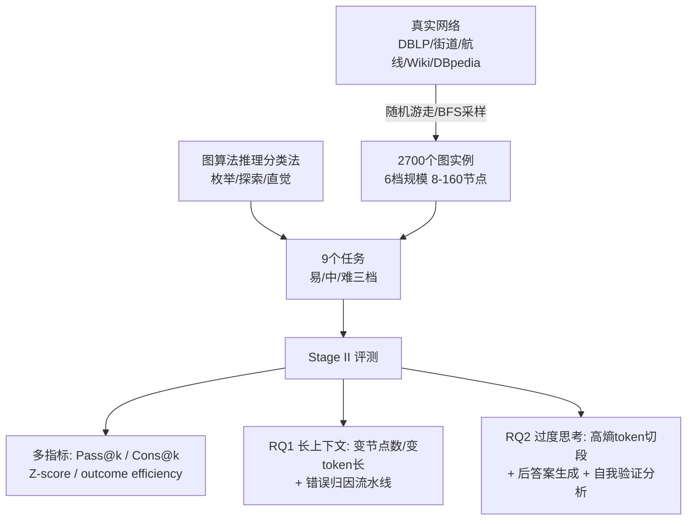

# Exposing Weaknesses of Large Reasoning Models through Graph Algorithm Problems

**会议**: ICLR 2026  
**代码**: [https://github.com/Bklight999/GrAlgoBench](https://github.com/Bklight999/GrAlgoBench)  
**领域**: LLM 推理 / 评测基准  
**关键词**: 大推理模型, 图算法, 长上下文推理, 过度思考, 自我验证  

## 一句话总结
提出 GRALGOBENCH——一个用图算法问题（8–160 节点、三类推理范式、九个任务）评测大推理模型（LRM）的基准，借助可程序化验证、可控难度和天然长上下文的特性，系统揭露 LRM 的两大软肋：上下文一长准确率断崖式下跌，以及由大量却低效的自我验证驱动的"过度思考"。

## 研究背景与动机
**领域现状**：以 OpenAI-o1、DeepSeek-R1 为代表的大推理模型用超长思维链（含自我验证、策略切换、回溯）在数学、代码、常识推理上刷出亮眼成绩，于是"评测 LRM 的推理能力、找出它们的破绽"成了热点。

**现有痛点**：当前主流基准集中在数学 / 代码 / 常识三大块，有三个结构性缺陷——(1) **缺长上下文评测**：题面普遍很短，难以可控地拉长来考察长程推理；(2) **难度不够**：对今天的 LRM 太简单（GPT-5 在 AIME-2025 上拿 94.3%），而手工造更难的题成本高；(3) **答案难以程序化验证**：数学一个答案能写成 $\frac{1}{3}$、$0.33\bar3$、$3^{-1}$ 多种形式，代码可能通过测试却藏着逻辑漏洞。

**核心矛盾**：研究者既想要一个**能任意拉长上下文、能精细调难度、又能机器自动判分**的统一测试场，又发现现有图基准（NLGraph、GraphArena 等）几乎只测非推理 LLM、图规模封顶 50 节点、任务划分靠"局部 vs 全局""P vs NP"这类临时标准而非算法设计原理。

**本文目标**：构造一个面向 LRM、可扩展到 160 节点、按算法范式系统分类、可程序化验证的图算法推理基准，并用它把 LRM 的真实弱点量化出来。

**核心 idea**：**图算法问题是天生的 LRM 试金石**——描述一张图要列出所有节点和边，输入天然冗长（长上下文）；难度随节点规模呈二次甚至指数增长（可控难度）；答案是整数或确定的图元素（节点/边/路径），没有等价表示（可程序化验证）；而且对图做微小结构扰动就能批量生成新实例，**抗数据污染**且贴近社交网络、交通、网页挖掘等真实应用。

## 方法详解

### 整体框架
GRALGOBENCH 分两阶段：**Stage I 数据集构造**——先按《算法导论》(CLRS) 的算法设计族把图问题归为枚举 / 探索 / 直觉三类，再为每类设计三档难度共 9 个任务，并从 5 个真实世界网络（DBLP、街道网、航线网、Wikipedia、DBpedia）采样出 2700 个 8–160 节点的图实例；**Stage II 评测**——对 20+ 个推理 / 非推理模型跑 Pass@k、Cons@k、Z-score、outcome efficiency 多指标，再用 LLM 流水线做错误归因与过度思考剖析，回答两个研究问题（RQ1 长上下文推理能力、RQ2 过度思考成因）。

### 关键设计

**1. 按算法设计范式的三类推理分类法（Enumeration / Exploration / Intuition）：让任务划分有理论根基**。以往图基准按难度或局部/全局这类临时标准切分，本文转而对齐《算法导论》的三大算法设计族——**枚举**对应暴力法，要求模型系统性遍历集合内所有候选解（如枚举子图/路径，代表任务 Maximum Degree、Triangle、Maximum Clique）；**探索**对应搜索法，要求在状态空间里遍历并能回溯、走出死胡同（如 DFS/BFS，代表任务 PathSum、Distance-k、Diameter）；**直觉**对应贪心法，要求抓住问题特有信号做局部最优决策（如 Dijkstra/Kruskal，代表任务 Maximum k-core、MST、Distance Threshold）。三类共同覆盖系统性覆盖、多路径搜索回溯、高效直觉决策三种互补能力，且所有图问题都顺带考察记忆（记住图结构）、逻辑推理与结构推理。

**2. LLM-as-judge 的任务归类，绕开"一题多解"难题**。同一个问题（如最短路）既能用暴力（枚举）、DFS（探索）也能用 Dijkstra（直觉）求解，且无法预知 LRM 实际会选哪条路，所以不能只看"最优算法"来贴标签。作者为每个候选问题生成 300 个 Erdős–Rényi 随机图替换原图描述、喂给 LRM 拿到回答，再用 Qwen-2.5-72B 作裁判判定其实际采用的推理类别；三名有竞赛经验的研究生人工复核子集，结论与裁判几乎一致。最终只保留 9 个"LRM 推理时所用算法相对明确"的任务，使分类干净可靠。

**3. 真实语义图采样 + 六档难度，兼顾抗污染与可控难度**。为考察语义理解并避免数据污染，节点/边都带真实世界语义——例如街道网里节点是街道、边是路口，PathSum 用 DBLP 学术合作网，Distance Threshold 用 OpenFlight 航线网。对每个任务用随机游走或 BFS 从大图里采子图，按节点数切成 6 档（Level-1 的 8–15 到 Level-6 的 121–160），每档 50 样本共 2700 个实例。这样既能精细调难度，也能靠结构扰动批量造新题。

**4. 长上下文双实验 + 自动错误归因流水线（RQ1）**。为把"题更难"和"文本更长"两个混杂因素拆开：一是直接变节点数（看 Table 3 跨规模趋势），二是**固定 80 节点 200 边的图结构、只通过加长节点名把同一题的 token 长度从 4k 拉到 64k**，看准确率怎么变。错误归因上，先把答错的回答按 `\n\n` 切段并编号，用 Qwen-2.5-72B 归并成带 (起止索引, 摘要) 的小节，再让 O3-mini 给每节打上错误类别标签（算法选择错 ASE、算法执行错 AEE、图记忆错 GME、冗余等），统计出错误分布，研究生复核保证一致性。

**5. 高熵 token 切段 + 双视角过度思考剖析（RQ2）**。基于 token 级生成熵切分回答——`wait`/`but`/`so` 这类高熵 token 常对应自我验证或策略切换，被当作分段标记，把回答序列 $T=(w_1,\dots,w_m)$ 在高熵位置 $i_1,\dots,i_n$ 切成 $n+1$ 段。然后从两个视角量化过度思考：**后答案生成**用 outcome efficiency $\zeta_O=\frac{1}{N}\sum_{i=1}^{N}\frac{\hat T_i}{T_i}$（首次答对前的 token 占全长比例，$\hat T_i$ 由 Qwen2.5-72B 定位首个正确片段）衡量答对后还啰嗦多少；**自我验证**则用 Qwen2.5-72B 把每段分类为自我验证 / 策略切换 / 其他，并进一步判断自我验证是否"有效"（真的揪出了前面的错），从而定位过度思考的真正来源。

## 实验关键数据

### 主实验表格（Cons@k / Pass@k，节选 Avg.）

| 模型 | Level-3 (31-50) c@k/p@k | Level-4 (51-80) c@k/p@k | Level-5 (81-120) c@k/p@k | Level-6 (121-160) c@k/p@k |
|---|---|---|---|---|
| Qwen3-32B | 0.63 / 0.87 | 0.43 / 0.78 | 0.27 / 0.59 | 0.20 / 0.47 |
| Qwen3-235B-A22B-Thinking | 0.97 / 1.00 | 0.86 / 0.96 | 0.58 / 0.76 | 0.45 / 0.50 |
| GPT-OSS-120B | 0.74 / 0.87 | 0.55 / 0.75 | 0.38 / 0.49 | 0.22 / 0.34 |
| DeepSeek-R1 | — | — | 0.55 / 0.55 | 0.45 / 0.45 |
| Gemini-2.5-pro | — | — | 0.45 / 0.61 | 0.36 / 0.50 |
| GPT5-mini | — | — | 0.40 / 0.46 | 0.41 / 0.50 |

准确率随规模断崖下跌：Qwen3-32B 的 Pass@k 从 31–50 节点的 87.0% 跌到 81–120 的 59.0%、121–160 的 47.0%；多数模型一旦图超过 120 节点 Avg. 准确率就掉到 50% 以下。

### 消融/解耦实验（固定结构、只变 token 长，Pass@k）

| 任务 | 模型 | 4k | 64k |
|---|---|---|---|
| Triangle Sum | DeepSeek-R1 | 100.0% | 22.0% |
| Triangle Sum | GPT-OSS-120B | 68.0% | 10.0% |

固定 80 节点图、仅靠加长节点名把 token 拉长，准确率依旧崩塌——证明退化不只来自结构变复杂，**长上下文本身**就是瓶颈。

工具增强对照（Level-5/6，Pass@k/Cons@k）：MST 任务上 Qwen3-32B 从 0/0 飙到 97.3/94.7，DistanceK 从 40/20 升到 98/96——写代码调用执行器能近乎满分，但等于把图记忆和逐步执行外包了，不再考察模型内在推理，故不作主协议。

### 关键发现
- **① 长上下文是真软肋**：变节点数和变 token 长两条独立实验都指向同一结论。
- **② 三大瓶颈**：算法执行错(AEE) 远多于算法选择错(ASE)——Qwen3-32B 在探索/直觉上 AEE 达 35.3%/48.6% 而 ASE 仅 5.5%/5.7%（最常见是状态更新错与遗漏），说明"会选对策略但栽在执行细节"；图记忆错(GME) 即便推理模型也 >21%；冗余推理（探索任务 37.7%）虚长轨迹却不提升正确率。
- **③ 难度排序**：枚举 > 探索 > 直觉，几乎所有模型一致——LRM 擅长系统性枚举，最不擅长直觉/贪心式推理。
- **④ 过度思考主因**：outcome efficiency 在图任务上始终 >0.88（高于数学任务），说明答对后并不怎么继续啰嗦；真正问题是**自我验证占比高但有效率 <30%**——大多只是复述前步或加无关内容，虚长轨迹。
- **泛化性**：GRALGOBENCH 与 GPQA 相关性 $\rho=0.77$、与 LongBench-v2 $\rho=0.60$（中到强关联）；四种图序列化格式（边表/邻接表/Markdown表/数字ID）表现相近，说明考的是内在推理而非表面编码。

## 亮点与洞察
- **用"老问题"测"新模型"很巧**：图算法是经典问题，但其"长输入 + 可控难度 + 可机判 + 抗污染"四性恰好补齐了现有 LRM 基准的全部短板，借力打力。
- **把过度思考拆成两半**：区分"后答案生成"和"自我验证"，并用数据证明前者不是主因、后者（频繁但低效）才是元凶，比笼统说"模型啰嗦"精确得多。
- **解耦实验有说服力**：固定图结构只加长文本仍崩塌，干净地把"长上下文"从"难度"里剥离出来。
- **对齐 CLRS 的分类法**有可迁移性：枚举/探索/直觉不止适用图问题，也对应数学排列枚举、数独回溯、Huffman 贪心等，分类框架有普适潜力。

## 局限与展望
- **任务局限于 9 个图算法问题**：虽对齐三大范式，但每类仅 3 个任务，覆盖面仍有限；更复杂的动态图、有向带权组合任务尚未纳入。
- **错误归因与过度思考分析重度依赖 LLM 裁判**（Qwen-2.5-72B / O3-mini），虽有研究生抽样复核，但标签噪声与裁判偏差难完全排除。
- **只诊断不开药**：论文系统揭露了执行错、弱记忆、低效自我验证，但未提出针对性的训练或推理改进方案，留给后续工作。
- 上限封在 160 节点，更大规模（千节点级）下的退化规律仍是开放问题。

## 相关工作与启发
- **图×LLM 基准谱系**：NLGraph、GPT4Graph、GraphQA、GraphInstruct、GraphArena、GraphOmni 等——本文相对它们的三点跃升是评测 LRM（而非仅非推理 LLM）、规模到 160 节点、按算法范式分类。
- **LRM 过度思考研究**：与 Chen et al. (2024d) 的 outcome efficiency、高熵 token 触发 over-thinking 等工作衔接，本文把这些工具迁到图推理场景并给出"自我验证低效"的新证据。
- **启发**：(1) 想造抗污染的难基准，可优先考虑"结构可扰动 + 答案唯一可机判"的组合数学/算法类问题；(2) 评测长上下文务必做"固定难度只变长度"的解耦实验，否则会把难度退化误记为长度退化；(3) 改进 LRM 效率应聚焦"减少无效自我验证"而非简单截断生成。

## 评分
- **新颖性**: ⭐⭐⭐⭐ 用图算法问题系统性补齐现有 LRM 基准的长上下文/难度/可验证三缺口，CLRS 三范式分类法与"自我验证低效=过度思考主因"的诊断都有新意；扣分在于核心组件（LLM-as-judge、outcome efficiency、高熵切段）多为已有工具的组合。
- **实验充分度**: ⭐⭐⭐⭐⭐ 20+ 模型、6 档规模、9 任务、4 指标，外加解耦实验、工具对照、跨基准相关性、序列化格式鲁棒性，证据链相当完整。
- **写作质量**: ⭐⭐⭐⭐ 动机—设计—发现逻辑清晰，四条编号发现凝练；图表密集但信息量大，部分细节需翻附录。
- **价值**: ⭐⭐⭐⭐ 提供了可扩展、可机判、抗污染的现成评测套件与代码，对诊断 LRM 长上下文与过度思考有直接实用价值；若能给出改进方案价值会更高。

<!-- RELATED:START -->

## 相关论文

- [\[ICLR 2026\] Towards Safe Reasoning in Large Reasoning Models via Corrective Intervention](towards_safe_reasoning_in_large_reasoning_models_via_corrective_intervention.md)
- [\[ICLR 2026\] Training Large Reasoning Models Efficiently via Progressive Thought Encoding](training_large_reasoning_models_efficiently_via_progressive_thought_encoding.md)
- [\[ICLR 2026\] Dynamic Early Exit in Reasoning Models](dynamic_early_exit_in_reasoning_models.md)
- [\[ICLR 2026\] MetaMuse: Algorithm Generation via Creative Ideation](metamuse_algorithm_generation_via_creative_ideation.md)
- [\[ICLR 2026\] Dynamics-Predictive Sampling for Active RL Finetuning of Large Reasoning Models](dynamics-predictive_sampling_for_active_rl_finetuning_of_large_reasoning_models.md)

<!-- RELATED:END -->
