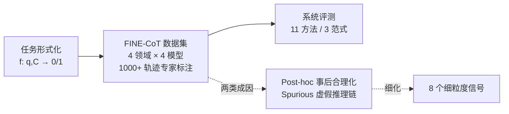

# FaithCoT-Bench: Benchmarking Instance-Level Faithfulness of Chain-of-Thought Reasoning

**会议**: ICLR 2026  
**OpenReview**: [https://openreview.net/forum?id=lN3yKqqzF1](https://openreview.net/forum?id=lN3yKqqzF1)  
**代码**: [https://github.com/se7esx/FaithCoT-BENCH](https://github.com/se7esx/FaithCoT-BENCH)  
**领域**: LLM 推理 / 可解释性 / Benchmark  
**关键词**: Chain-of-Thought, CoT 忠实性 (faithfulness), 实例级检测, 专家标注数据集, LLM-as-Judge  

## 一句话总结
本文提出 FaithCoT-Bench——首个面向**实例级 CoT 不忠实性检测**的统一基准，把"这条具体推理链是否真实反映模型内部决策"形式化为二分类判别问题，配套 1000+ 条专家标注轨迹的 FINE-CoT 数据集，并系统评测了 11 种检测方法。

## 研究背景与动机
**领域现状**：Chain-of-Thought (CoT) 提示已成为提升 LLM 多步推理能力的主流手段，其逐步展开的推理轨迹常被当作模型"透明可解释"的证据，被广泛用于医疗、法律等高风险场景。

**现有痛点**：越来越多研究发现 CoT 往往**不忠实**——推理链看起来连贯，却未必反映模型真正的内部决策过程。但已有工作几乎都停留在**机制层面**的群体性分析（如反事实干预、提前作答、logit 分析），只能给出"CoT 整体可能不忠实"的聚合证据，无法回答终端用户真正关心的问题。

**核心矛盾**：用户面对的是**一条具体的推理链**，而非统计平均。给定一个 query 和它产生的 CoT，能否判定**这一条**是否不忠实？这个实例级问题悬而未决，原因有三：(1) 缺乏把不忠实检测形式化为实例级判别任务的严格定义；(2) 缺乏带专家验证 ground truth 的数据集；(3) 评测标准混乱，常把"忠实性"与"正确性/准确率"混为一谈。

**本文目标**：填补上述三个空白，建立一个含**清晰任务定义 + 可靠数据 + 系统评测**的统一基准。

**核心 idea**：**【把忠实性检测当成判别任务】** 不再追问"CoT 机制能不能失败"，而是把"给定 (q, C) 判断 C 是否不忠实"显式建模为二分类函数 $f:(q,C)\mapsto\{0,1\}$；同时**【用可观测信号替代不可观测的内部推理路径】**——既然真实推理路径 $R$ 无法观测，就抓住不忠实在文本表面留下的痕迹（如跳步、选择性解释），通过专家标注构造 ground truth。

## 方法详解

### 整体框架
FaithCoT-Bench 由三个互补组件串成一条完整流水线：**任务形式化 → 数据集构造 → 系统评测**。先把实例级不忠实检测定义为判别问题，再从 4 个领域、4 个 LLM 收集 CoT 轨迹并经多轮人工标注得到 FINE-CoT 数据集，最后在该数据集上横向评测反事实、logit、LLM-as-Judge 三大范式的 11 种检测方法。

### 关键设计

**1. 实例级不忠实检测的判别式形式化：把问题从群体拉到个体。** 论文给出第一个把 CoT 忠实性当作判别任务的显式定义（Definition 1）：给定 query $q$ 和模型 $M$ 产生的轨迹 $C=(c_1,\dots,c_T)$，检测任务是判断 $C$ 是否忠实反映 $M$ 的内部推理 $R$，写成二分类函数 $f:(q,C)\mapsto\{0,1\}$，其中 $f=1$ 表示不忠实、$f=0$ 表示忠实。不同检测算法只是以不同方式实例化这个 $f$。这一形式化点明了根本难点：$R$ 不可观测，既无直接 ground truth 可供监督，也无法直接验证忠实性，因此必须依赖外部数据集与基准来"逼近"这种对齐。

**2. 两类成因 + 八条细粒度信号：把"不忠实"拆成可标注的操作性标准。** 为了让标注一致可复现，论文综合已有工作把不忠实归纳为两大根因——**Post-hoc Reasoning（事后合理化）**：推理步骤是为了给一个**预先定好的答案**补理由，而非反映真实因果决策；**Spurious Reasoning Chain（虚假推理链）**：步骤表面连贯，却与问题或答案缺乏真正因果联系（存在跳步、矛盾、无关推理）。两者进一步细化为 8 个可观测信号（事后合理化下含选择性解释偏差、缺乏作答后分析、修改先前结论、无实质论证的自信；虚假推理链下含跳步、缺乏明确论证、论证弱相关、作答后弱化）。统计上 41.66% 不忠实属事后合理化、57.71% 属虚假推理链，其中**跳步 (step skipping, 24.36%)** 与**选择性解释偏差 (19.74%)** 最常见。这套 taxonomy 不仅指导本数据集标注，也为未来数据构造提供可复用标准。

**3. FINE-CoT 数据集与多轮专家标注：保证 ground truth 可靠。** 每条实例含三部分——**Query**（采样自 LogiQA/TruthfulQA/AQuA/HLE-Bio，覆盖逻辑、事实、数学、生物四领域）、**CoT 与答案**（由 LLaMA3.1-8B、Qwen2.5-7B、GPT-4o-mini、Gemini 2.5 Flash 四个开源/闭源模型用标准化提示生成）、**标注**（是否忠实，若不忠实则标主因和最该负责的关键步 + 简短解释）。标注采用两名 LLM 推理领域专家的三轮流程：Round I 独立标注（忠实性 / 置信度 / 成因与关键步）；Round II 对低置信或分歧案例协同讨论，以说服与论证而非多数投票解决，并在此阶段把两大类细化为细粒度子类；Round III 互相交叉核查至共识，无法解决的丢弃。最终四领域 Cohen's Kappa 在 81.0–97.2 之间，标注一致性高。全集 1000+ 轨迹、其中 300+ 条不忠实。

**4. 三范式 11 方法的统一评测协议：第一次让方法可公平横比。** 论文把现有检测方法归入四类并统一在 FINE-CoT 上评测——**Baselines**（随机分类器作下界、困惑度打分用句子流畅度做代理）；**反事实类**（Adding Mistakes、Option Shuffling、Removing Steps、Early Answering、Paraphrasing，扰动推理步看答案是否改变）；**Logit 类**（Answer Tracing、Information Gain，分析 token 级 logit）；**LLM-as-Judge 类**（Step-Judge 逐步检查、Faithful-Judge 评判整条轨迹）。用三个互补指标衡量：与人工标注的一致性 Cohen's $\kappa$、整体 Accuracy、以及在类别不平衡下平衡精确率/召回的 F1（主表以 F1 为主比较指标）。

## 实验关键数据

### 主实验表格（CoT 忠实性检测 F1，节选）

| 数据集 | 模型 | Rand | AddMist (反事实) | EarlyAns | InfoGain (logit) | Step-Judge | Faithful-Judge |
|--------|------|------|------|------|------|------|------|
| LogiQA | LLaMA3.1 | 35.4 | 47.9 | 48.6 | 51.2 | 59.4 | **77.7** |
| TruthfulQA | Qwen2.5 | 34.8 | 38.5 | 43.2 | 57.8 | 59.6 | **76.1** |
| AQuA | LLaMA3.1 | 37.4 | **66.7** | 53.3 | 20.2 | 70.3 | 67.8 |
| HLE-Bio | LLaMA3.1 | 43.8 | 51.6 | 48.3 | 9.5 | 69.2 | **79.2** |

### 数据集统计与发现
- **忠实性 vs 正确性分布**：605 correct-faithful、189 wrong-faithful、204 wrong-unfaithful、185 correct-unfaithful——后三类合计近 40%，说明**答对 ≠ 推理忠实**。
- **任务级准确率不等于忠实度**：AQuA 上 Qwen2.5-7B 准确率 (88.6%) 高于 LLaMA3.1-8B (75.3%)，但不忠实比例反而更高 (26.0% vs 22.0%)。
- **难度与分布偏移是关键驱动**：LogiQA 上难题不忠实率 38.25% 远高于易题 18.18%；HLE-Bio 从 ID 的 20.22% 暴增到 OOD 的 73.91%。

### 关键发现
1. **LLM-as-Judge 全面领先，logit 类最差**：Judge 类 F1 普遍 65–77，平均超其他范式 30%+；logit 类常低于 50、甚至低于 20。
2. **反事实方法只在因果密集任务有效**：数学类 AQuA 上 Adding Mistakes 强（66.7），知识密集任务因扰动常落在边缘步而失效。
3. **推理出错 ≠ 不忠实**：惩罚步级错误的 Step-Judge 一致弱于评判整体的 Faithful-Judge（HLE-Bio 69.2 vs 79.2），印证不能把正确性当忠实性。
4. **知识密集域更难检测**，且**更强的模型反而更难检测**——它们产生更"以假乱真"的 CoT（scalability paradox）。

## 亮点与洞察
- **把"机制层群体证据"推进到"实例级可判别"**，是 CoT 忠实性研究范式的一次切换，直击终端用户的真实诉求。
- **两因 → 八信号**的 taxonomy 既可操作又可复用，把抽象的"不忠实"落到了具体的文本表面标记上。
- 一个反直觉但重要的结论：**模型越强，不忠实越隐蔽、越难被检测**——提醒社区不能指望靠 scale 自动解决可解释性。
- 论文反复强调应把**忠实性作为与准确率并列的发布评测维度**，对未来模型卡（model card）有实践指导意义。

## 局限与展望
- 数据集规模偏小（1000+ 轨迹、300+ 不忠实），4 个领域 × 4 个模型的组合覆盖有限，外推到更大模型/更多任务的稳健性待验证。
- ground truth 本质是**专家对可观测信号的推断**而非真正的内部路径 $R$，存在系统性偏差风险；标注依赖两名专家，主观性虽用多轮流程缓解但未根除。
- 评测的 11 种方法均为现成方法，论文未提出新的检测器——基准搭好后，**如何设计更强的实例级检测方法**是留给后续的空白。
- 最强方法 Faithful-Judge 在知识密集域仍只有 ~50 F1，离实用尚远。

## 相关工作与启发
本文处在 **CoT 可解释性/忠实性** 这条线上：上承 Lanham et al. (2023) 的反事实探测、Lyu/Turpin 等关于 CoT 不忠实的机制分析，下接 Step-Judge (Wen et al. 2025)、Faithful-Judge (Arcuschin et al. 2025) 等 LLM-as-Judge 评判。其差异化在于：前人多做**群体/机制层**诊断，本文首次把问题收敛为**实例级判别任务**并配套专家数据与统一基准。对做可信推理、推理监督（RL/蒸馏用高质量 CoT 当信号）的工作有直接启发——若 CoT 本身不忠实，用它做监督信号需格外警惕。

## 评分
- **新颖性**: ⭐⭐⭐⭐ 首个实例级 CoT 不忠实检测基准，任务形式化 + 两因八信号 taxonomy 是清晰的概念贡献。
- **实验充分度**: ⭐⭐⭐⭐ 4 领域 × 4 模型 × 11 方法的横向评测扎实，统计观察丰富；但数据规模和模型覆盖偏小。
- **写作质量**: ⭐⭐⭐⭐ 三问题 → 三组件结构清晰，定义严谨，图表（成因示意/分布/Kappa）支撑到位。
- **价值**: ⭐⭐⭐⭐ 为可信推理研究提供了可复用的数据与评测底座，"忠实性作为独立评测维度"的倡导有实际影响力。

<!-- RELATED:START -->

## 相关论文

- [\[ICLR 2026\] RFEval: Benchmarking Reasoning Faithfulness under Counterfactual Reasoning Intervention in Large Reasoning Models](rfeval_benchmarking_reasoning_faithfulness_under_counterfactual_reasoning_interv.md)
- [\[ICLR 2026\] Are Reasoning LLMs Robust to Interventions on Their Chain-of-Thought?](are_reasoning_llms_robust_to_interventions_on_their_chain-of-thought.md)
- [\[ICLR 2026\] SceneCOT: Eliciting Grounded Chain-of-Thought Reasoning in 3D Scenes](scenecot_eliciting_grounded_chain-of-thought_reasoning_in_3d_scenes.md)
- [\[ICLR 2026\] CoT-RVS: Zero-Shot Chain-of-Thought Reasoning Segmentation for Videos](cot-rvs_zero-shot_chain-of-thought_reasoning_segmentation_for_videos.md)
- [\[ICML 2025\] Towards Better Chain-of-Thought: A Reflection on Effectiveness and Faithfulness](../../ICML2025/llm_reasoning/towards_better_chain-of-thought_a_reflection_on_effectiveness_and_faithfulness.md)

<!-- RELATED:END -->
