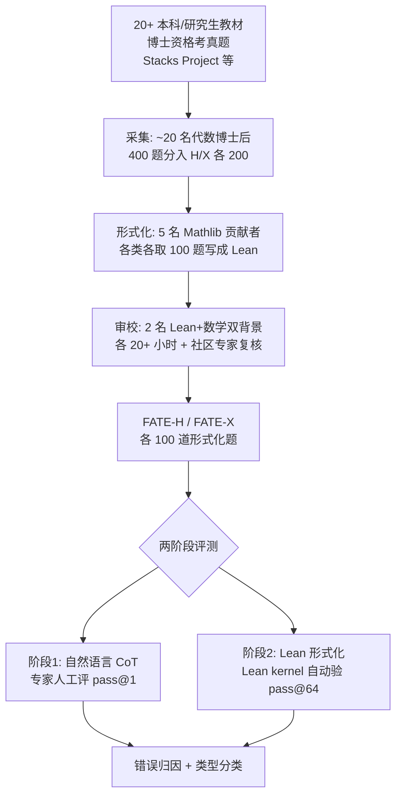

# FATE: A Formal Benchmark Series for Frontier Algebra of Multiple Difficulty Levels

**会议**: ICLR 2026  
**OpenReview**: [https://openreview.net/forum?id=3bD19r4jqh](https://openreview.net/forum?id=3bD19r4jqh)  
**代码**: [https://github.com/frenzymath/FATE](https://github.com/frenzymath/FATE)（评测代码 [FATE-Eval](https://github.com/frenzymath/FATE-Eval)）  
**领域**: 形式化定理证明 / 数学推理 Benchmark  
**关键词**: 形式化证明, Lean, Mathlib, 抽象代数, 交换代数, 难度分级, 自动形式化, LLM 推理  

## 一句话总结
FATE 是一套面向**研究级抽象与交换代数**的 Lean 形式化证明基准，用 FATE-M/H/X 三级难度（从本科习题到超越博士资格考）把当前顶尖证明模型逼到墙角——最好的模型在 FATE-H 仅 3%、FATE-X 为 0%，并通过"自然语言推理 + 形式化"两阶段拆解，指出真正的瓶颈不是数学能力而是**把正确的自然语言证明翻译成精确 Lean 代码**这一步。

## 研究背景与动机
**领域现状**：LLM 形式化定理证明在 miniF2F、IMO 这类竞赛基准上进步神速，顶尖证明器（DeepSeek-Prover-V2、Kimina、Goedel）在 miniF2F 上准确率已逼近 100%。形式化验证（Lean + Mathlib）相比人工审阅自然语言证明，提供了可自动、可扩展、可靠的"对错裁判"。

**现有痛点**：现有基准要么是**竞赛题**（重技巧轻理论框架），要么是**入门本科数学**（抽象层次低），都和真正的现代数学研究相去甚远。研究级数学是开放式的，要求理解并运用层层嵌套的抽象概念，甚至需要探索新洞见、构造新理论框架——没有基准能测这一层。

**核心矛盾**：竞赛成绩饱和 ≠ 模型具备研究级数学推理能力。当评测集天花板被刷穿，社区缺乏一个能区分"刷题强"和"真会做研究"的检查点。

**本文目标**：构建一套**渐进难度**的形式化代数基准，把评测难度推到博士资格考及以上，并系统刻画模型在研究级问题上到底卡在哪一环。

**核心 idea**：**(1) 难度阶梯** —— 在已有本科级 FATE-M 之上新增研究生级 FATE-H 和博士资格考级 FATE-X，FATE-X 是首个难度超过博士资格考、且形式化内容超出 Mathlib 现有覆盖的基准；**(2) 两阶段诊断** —— 不只报一个准确率，而是分别评测"自然语言 CoT 推理"和"形式化为 Lean 代码"两步，把失败归因到具体环节并分类错误类型。

## 方法详解

### 整体框架
FATE 不是一个新模型，而是一套**基准 + 两阶段评测协议**。基准侧用"采集→形式化→审校"的专家流水线，把 400 道候选代数题精炼成 FATE-H/X 各 100 道 Lean 形式化题；评测侧顺应模型"先写自然语言证明、再翻译成 Lean"的天然行为，把单一的形式化准确率拆成自然语言（人工评 pass@1）和形式语言（自动验 pass@64）两层来看，从而定位瓶颈所在。

### 关键设计

**1. 三级难度阶梯：从本科到超博士资格考的渐进式标尺**。FATE 刻意把难度做成连续谱而非单点：FATE-M 是教材级基础习题（解法是定理的线性直接应用），FATE-H 对应荣誉课程考试/研究生难度（需要把若干直接结果做综合分析的整合推理），FATE-X 对应博士资格考及以上（需要在综合之后探索分析新数学对象的递归式结构分析）。这种分级让评测不会被"简单题做得好"掩盖"难题做不动"的弱点。难度的客观性靠三方面背书：案例研究展示同主题题目随级别递增的推理结构变化；人类实验中代数博士生/博士后在 2.5 小时内 FATE-H 正确率 73%、FATE-X 仅 21%；十位顶尖代数教授问卷一致认为 FATE 在难度、覆盖、原创性上显著高于教材和 ProofNet，7/10 认为 FATE 题目适合或超过博士资格考标准。

**2. 超越 Mathlib 的形式化标准与新定义机制**。FATE-X 因难度与广度，用到了 Mathlib 尚未收录的数学定义——38% 的题目需要新定义（平均每题 2.4 个），如局部完全交（local complete intersection）、Gorenstein 环等交换代数高级概念，这些定义在题目陈述前先被形式化。这意味着模型不能只调库，而要在缺乏现成引理的情况下，自己**发现数学现象、抽象成有用引理、必要时自发构造新定义**——这正是研究级形式化的核心能力。所有题目遵循严格规范：每个 Lean 文件最终定理后只有一个 `sorry`、LaTeX 自然语言描述作注释、仅依赖 Mathlib 且自包含、固定 universe level 以避免范畴论问题。

**3. 两阶段评测协议：把"会不会做"和"会不会翻译"分开**。观察发现所有有可见推理过程的模型都会**先写完整自然语言证明、再形式化**（即便没有显式指令）。据此协议把评测拆成两层：自然语言层由数学专家人工判 pass@1 正确性，形式语言层用 Lean REPL 多进程并行、由 Lean kernel 严格验 pass@64（确认无 `sorry`、无编译错误，并用字符串匹配校验定理与定义被准确转录，模型生成的引理也全部编译验证）。错误归因分四类——Gap、Hallucination、Reasoning Problem、No Progression。关键发现是巨大落差：DeepSeek-R1 在 FATE-H 自然语言 71% 但形式化 0%，证明瓶颈在翻译而非数学本身。消融实验进一步显示，去掉"要生成形式证明"的负担后模型自然语言能力更高，而要求"math-before-lean"输出对 R1 准确率几乎无影响（说明它本就这么做）。

**4. 形式化错误的细粒度分类**。在自然语言正确但形式化失败的样本上，Lean 专家逐条统计错误，归为四类：**Mathlib 幻觉**（生成不存在或误用的 Lean 定理/定义）、**Lean 熟练度**（不懂 Lean 语法规则、复杂类型系统或惯用证明结构）、**通用能力**（改 header、留 `sorry`、重复输出、括号不匹配）、**Misalignment**（形式证明与前文数学推理不一致）。结果显示 Mathlib 幻觉和 Lean 熟练度问题几乎在每个证明尝试中都反复出现，而 Misalignment 极罕见——这指向一个直接启示：**RAG 系统**（检索 Mathlib 相关定理并提供准确类型信息）有望显著改善形式化表现。

## 实验关键数据

### 主实验表格
FATE-M/H/X 形式化准确率（pass@64，最大 64k tokens）：

| 模型 | FATE-M | FATE-H | FATE-X |
|------|--------|--------|--------|
| **推理模型** | | | |
| o3 | 51.3% | **3.0%** | 0.0% |
| Claude-Sonnet-4 | 45.3% | 0.0% | 0.0% |
| Gemini-2.5-Pro | 40.0% | 0.0% | 0.0% |
| DeepSeek-R1 | 34.7% | 0.0% | 0.0% |
| Qwen3-235B-A22B-Thinking | 16.0% | 0.0% | 0.0% |
| **定理证明器** | | | |
| DeepSeek-Prover-V2-671B | **62.7%** | **3.0%** | 0.0% |
| Goedel-Prover-V2-32B | 48.7% | 2.0% | 0.0% |
| Kimina-Prover-72B | 36.0% | 2.0% | 0.0% |

准确率沿难度阶梯断崖式下跌：FATE-M 上证明器尚有 60%+，到 FATE-H 最好仅 3%（100 题做对 3 题），FATE-X 上无任何模型产出有效 Lean 证明。

### 消融实验表格
自然语言（NL, pass@1）vs 形式语言（FL, pass@64）准确率对比：

| 模型 | FATE-H NL | FATE-H FL | FATE-X NL | FATE-X FL |
|------|-----------|-----------|-----------|-----------|
| DeepSeek-R1 | **71.0%** | 0.0% | **33.0%** | 0.0% |
| DeepSeek-Prover-V2 | 39.0% | 3.0% | 9.0% | 0.0% |
| Goedel-Prover-V2 | 48.0% | 2.0% | 8.0% | 0.0% |
| Kimina-Prover | 35.0% | 2.0% | 3.0% | 0.0% |

FATE-H 上形式化错误统计（分母为自然语言被判正确的证明数）：

| 错误类型 | DeepSeek-Prover-V2 | DeepSeek-R1 |
|----------|--------------------|--------------|
| Mathlib 幻觉 | 35/39 | 70/71 |
| Lean 熟练度 | 36/39 | 70/71 |
| 通用能力（header） | – | 63/71 |
| 通用能力（其他） | 19/39 | 18/71 |
| Misalignment | 3/39 | 0/71 |

### 关键发现
- **翻译是主瓶颈**：自然语言准确率（如 R1 在 FATE-H 71%）远高于形式化准确率（0%），瓶颈不在数学能力而在"正确证明→精确 Lean 代码"的翻译实现。
- **通用模型 > 专用证明器（在自然语言层）**：DeepSeek-R1 自然语言推理显著优于专用证明器，根因是 R1 具备**有效反思**（定位、诊断、修复缺陷）能力，而 DeepSeek-Prover-V2 只能做"重头再来/换说法但无逻辑改变"的形式化反思，甚至出现质疑题目正确性、有意作弊等非对齐行为。
- **专用训练的副作用**：DeepSeek-Prover-V2 自然语言准确率甚至低于其基座 DeepSeek-V3 水平的有效反思，暗示窄域形式化 RL 训练可能意外损害了元推理能力。
- **解耦方向**：两阶段高度解耦的现象提示，分别开发"自然语言证明器"和"自动形式化器"可能带来额外收益。

## 亮点与洞察
- **难度天花板的真实拔高**：FATE-X 是首个难度超博士资格考、内容超出 Mathlib 覆盖的形式化基准，把评测从"刷题"真正推进到"研究"层，0% 的结果给当前 SOTA 留足了爬坡空间。
- **两阶段诊断范式**：不满足于报一个准确率，而是把失败精确切到"数学错了"还是"翻译错了"，并用人工 + 自动双评测交叉验证，这种诊断比单一分数信息量大得多。
- **可操作的工程启示**：错误分布（Mathlib 幻觉 + Lean 熟练度占绝对多数，Misalignment 极少）直接指向 RAG 增强和解耦式 prover-autoformalizer 架构两条具体改进路径。
- **专家级人工背书**：人类实验（FATE-H 73% / FATE-X 21%）和十位教授问卷把"难度递进"从主观共识落到可量化证据。

## 局限与展望
- **形式化标注成本极高**：需要数学 + Lean 双重专家，5 场各 5+ 小时工作坊 + 20+ 小时审校，难以快速扩规模；每个基准仅 100 题，统计上 0%/3% 的分辨率有限。
- **覆盖单一领域**：聚焦抽象与交换代数（因其自包含、对外部领域依赖少），尚未覆盖分析、几何、拓扑等其他研究方向。
- **评测仍依赖人工**：自然语言阶段的 pass@1 正确性靠数学专家判定，难以完全自动化、规模化复现。
- **未给出解法**：论文定位是诊断而非求解，"如何同时利用形式化精确奖励信号又培养有效反思"被明确留为开放问题。
- **展望**：解耦式架构（NL prover + autoformalizer）、面向 Mathlib 的 RAG、以及能让模型自发构造新定义/引理的训练方法，是后续最直接的攻坚点。

## 相关工作与启发
- **自然语言数学基准**：GSM8K、MATH 已近饱和，竞赛级（如各类奥赛题）和研究级（FrontierMath、HLE 部分）代表当前前沿，但普遍依赖最终答案验证，无法可靠评估证明过程。
- **形式化基准**：miniF2F（竞赛）、ProofNet（本科）、组合数学专门基准，以及本系列前作 FATE-M（本科抽象代数）；FATE-H/X 把这条线推到研究生与博士资格考级。
- **形式化证明模型**：从 Polu & Sutskever 的搜索式生成，到 best-first search、MCTS，再到当前 DeepSeek-Prover-V2、Kimina、Goedel 的大规模 RL 单遍长 CoT 生成——FATE 正是给这批"刷穿 miniF2F"的模型提供新的检查点。
- **启发**：本文揭示的"自然语言强但形式化弱"现象，对所有 autoformalization 研究都是一记警钟——把数学能力和翻译能力解耦评测、解耦优化，可能比一味做端到端 RL 更有效。

## 评分
- **新颖性**: ⭐⭐⭐⭐⭐ 首个超越博士资格考难度、超出 Mathlib 覆盖的形式化代数基准，两阶段诊断范式新颖且信息密度高。
- **实验充分度**: ⭐⭐⭐⭐ 覆盖 8 个 SOTA 模型 + 人工评测 + 消融 + 错误分类 + 通用模型vs证明器对比，链条完整；唯每基准 100 题、0%/3% 分辨率偏低。
- **写作质量**: ⭐⭐⭐⭐ 逻辑清晰，从难度论证到两阶段诊断层层递进，图表支撑充分；部分附录内容信息量大但正文略密。
- **价值**: ⭐⭐⭐⭐⭐ 为形式化推理设立了真正的研究级检查点，错误分析直接指向 RAG 与解耦架构等可落地改进，对整个 ATP 社区有方向性价值。

<!-- RELATED:START -->

## 相关论文

- [\[ICLR 2026\] Mathesis: Towards Formal Theorem Proving from Natural Languages](mathesis_towards_formal_theorem_proving_from_natural_languages.md)
- [\[ICLR 2026\] Hilbert: Recursively Building Formal Proofs with Informal Reasoning](hilbert_recursively_building_formal_proofs_with_informal_reasoning.md)
- [\[ICLR 2026\] On The Fragility of Benchmark Contamination Detection in Reasoning Models](on_the_fragility_of_benchmark_contamination_detection_in_reasoning_models.md)
- [\[ICLR 2026\] Neural Theorem Proving for Verification Conditions: A Real-World Benchmark](neural_theorem_proving_for_verification_conditions_a_real-world_benchmark.md)
- [\[ICLR 2026\] Harder Is Better: Boosting Mathematical Reasoning via Difficulty-Aware GRPO and Multi-Aspect Question Reformulation](harder_is_better_boosting_mathematical_reasoning_via_difficulty-aware_grpo_and_m.md)

<!-- RELATED:END -->
