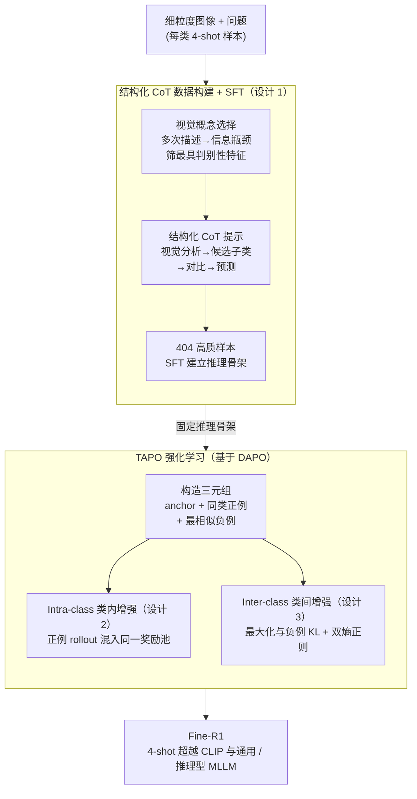

# Fine-R1: Make Multi-modal LLMs Excel in Fine-Grained Visual Recognition by Chain-of-Thought Reasoning

**会议**: ICLR 2026  
**arXiv**: [2602.07605](https://arxiv.org/abs/2602.07605)  
**代码**: [https://github.com/PKU-ICST-MIPL/FineR1_ICLR2026](https://github.com/PKU-ICST-MIPL/FineR1_ICLR2026)  
**领域**: LLM推理  
**关键词**: 细粒度识别, CoT推理, 三元组策略优化, Few-shot FGVR, DAPO

## 一句话总结
Fine-R1 通过 CoT 监督微调（"视觉分析→候选子类→对比→预测"结构化推理链）+ 三元组增强策略优化 TAPO（类内增强提升鲁棒性 + 类间增强提升判别力），仅用 4-shot 训练即在细粒度视觉识别上超越 CLIP 和通用/推理型 MLLM。

## 研究背景与动机

**领域现状**：MLLM 在粗粒度视觉任务上表现优异，但在细粒度视觉识别（FGVR，如区分不同鸟类品种）上显著落后于对比式 CLIP 模型。

**现有痛点**：
   - 将通用 MLLM 适配 FGVR 需要大量标注数据，采集成本高（如需领域专家标注数千鸟类品种）
   - MLLM 倾向于过拟合已见子类，对未见子类泛化差
   - 即使 GPT-4V 等前沿模型，在 FGVR 上也不如专门的 CLIP 模型

**核心矛盾**：FGVR 特有的"高类内方差 + 低类间方差"问题——同一鸟种不同角度差异大，不同鸟种可能极其相似

**切入角度**：MLLM 已经内化了大量细粒度知识，问题不在于缺乏知识，而在于无法有效**调用**这些知识。通过 CoT 推理引导知识调用 + RL 优化知识使用方式。

**核心 idea**：不是让模型"学更多知识"，而是教模型"更好地使用已有知识"——通过结构化 CoT 和三元组对比 RL 来激活 MLLM 内在的细粒度识别能力。

## 方法详解

### 整体框架
Fine-R1 想解决的是：MLLM 其实"认得"细粒度子类，却调不出这份知识，导致在区分鸟种这类任务上反被 CLIP 压过。它的思路是分两阶段把"会用知识"教出来。第一阶段用一小批高质量的链式推理样本做 SFT，把模型的输出格式固定成"视觉分析→候选子类→逐一对比→给出预测"，先建立起细粒度推理的骨架；第二阶段在这个骨架上做强化学习 TAPO（三元组增强策略优化），用类内、类间两路对比信号去打磨判别力，让模型不仅推理结构对、而且真的盯住了区分子类的关键线索。整套流程只在每类 4 张图（4-shot）的极少样本下完成。

### 关键设计

**1. 结构化 CoT 数据构建：把"先缩范围再精对比"的推理模式固化下来**

通用 CoT 的"分析一下再预测"对 FGVR 不够用，因为细粒度识别的难点是要先把搜索空间收窄到几个最易混淆的子类、再逐一精确排除。为此 Fine-R1 构造了一条四步推理链：视觉分析 → 列候选子类 → 对比 → 预测。构造时分两步走：先做图像级视觉概念选择——让 MLLM 对同一张图多次描述，把多份描述聚合后用信息瓶颈筛出最具判别性的特征，避免抓到无关细节；再用结构化提示引导模型先列出最容易混淆的候选子类、再逐一比对排除。最终只保留 404 个样本，但每个都经过多轮采样加人工验证，用少量高质数据把推理格式立稳。

**2. Intra-class Augmentation（类内增强）：用同类不同图的奖励差，逼模型盯住类别级线索**

FGVR 的一大麻烦是类内方差高——同一鸟种换个角度差别很大，模型容易过拟合到某张图的具体长相。类内增强针对的就是这点：对每个 anchor 图像 $x$，从同一子类再采一张正例 $x_{pos}$，旧做法是分别对 $(x,q)$ 和 $(x_{pos},q)$ 生成 rollout，这里把两者的 rollout 合并进同一个奖励池来计算 advantage，而策略更新仍只对 anchor 条件化。这样一来，当同类的两张图预测结果不一致时，奖励池里的差异就成了一个直接的训练信号，推动模型去聚焦"这个子类共有的特征"而不是某张图特有的细节，从而对类内变化更鲁棒。

**3. Inter-class Augmentation（类间增强）：用最相似负例的分布差，逼模型用上判别线索**

与类内相对的是类间方差低——不同子类长得太像，模型若换成相似类的图却给出同样预测，就说明它根本没用上细粒度判别线索。类间增强从与 anchor 最相似但不同的子类采一张负例 $x_{neg}$，定义判别比率

$$g^{inter}(\theta) = \frac{\pi_\theta(o\mid q,x_*)}{\pi_\theta(o\mid q,x_{neg})}$$

并通过最大化锚点策略与负例策略之间的 KL 散度 $D_{KL}[\pi_\theta \,\|\, \pi_\theta^{neg}]$，把"喂相似负例时应当给出不同输出分布"这件事变成显式优化目标。换言之，模型在相似类上预测越雷同就越被惩罚，迫使它真正利用区分两个子类的细节。为防止这种"推开"训练不稳，再加一层双熵正则化。

### 损失函数 / 训练策略
- **Stage 1**：标准 SFT，在 404 个 CoT 样本上微调，建立结构化推理骨架。
- **Stage 2**：TAPO = DAPO 基础 + Intra-class Aug（混合正例 rollout 进同一奖励池）+ Inter-class Aug（最大化与最相似负例的 KL 散度）+ 双熵正则化。
- 全程 4-shot per category（每类仅 4 个训练样本）。

## 实验关键数据

### 主实验（6 个 FGVR 数据集，Closed-world）

| 方法 | Seen Avg↑ | Unseen Avg↑ | 总 Avg↑ |
|------|----------|-----------|--------|
| SigLIP-L (CLIP) | 88.33 | 80.54 | 84.44 |
| Qwen2.5-VL-7B | ~84% | ~57% | ~70% |
| DeepPerception-7B | ~87% | ~50% | ~68% |
| **Fine-R1-3B** | **~93%** | **~81%** | **~87%** |

### 消融实验

| 配置 | Seen↑ | Unseen↑ |
|------|------|--------|
| SFT only | 基线 | 基线 |
| + 标准 RL (CLS-RL) | +5% | -2% (过拟合) |
| + TAPO (完整) | **+8%** | **+13%** |
| — w/o Intra-class Aug | -3% | -5% |
| — w/o Inter-class Aug | -2% | -4% |

### 关键发现
- **超越 CLIP 专用模型**：Fine-R1-3B 在 6 个数据集上平均超过 SigLIP-L 约 3%——生成式 MLLM 首次在 FGVR 上超越对比式模型
- **开放世界泛化突出**：未见类别上比 Qwen2.5-VL-7B 高 +23.75%，证明学到的是推理方法而非记忆类别
- **4-shot 足够**：仅每类 4 个样本即可激活强大的细粒度识别能力
- **知识和视觉特征未变**：训练前后模型的内部表示几乎不变——改善来自于"更好地使用知识"而非"学到新知识"
- **跨域迁移强**：在 ImageWikiQA 等需要对象识别的问答任务上也提升 +3.6%

## 亮点与洞察
- **"不是学更多知识，而是更好地使用知识"**这个发现非常深刻——MLLM 的 FGVR 瓶颈不在感知或知识，而在知识调用。结构化 CoT 本质上是一种"知识检索策略"，引导模型先缩小搜索空间再精准对比。
- **三元组对比式 RL 是 FGVR 的自然解**——将度量学习（triplet loss）的思想融入策略优化，类内增强=正例对齐，类间增强=负例推离。这比通用 GRPO 更适合 FGVR 的特殊结构。
- **404 个 CoT 样本的高效训练**令人印象深刻——通过质量控制（多轮采样+人工验证），少量高质数据 > 大量低质数据。

## 局限与展望
- 仅测试 3B/7B 模型，更大 MLLM 上效果待验证
- 负例选择依赖预定义的"最相似子类"——更动态的在线硬负例挖掘可能更有效
- CoT 数据构建依赖 Qwen2.5-VL-32B——存在对外部大模型的依赖
- 未在非分类任务（如细粒度检测/分割）上测试
- 6 个数据集都是经典 FGVR 数据集——更新的、更难的数据集（如 iNaturalist 全量）待探索

## 相关工作与启发
- **vs CLS-RL (Li et al.)**: 直接用分类奖励做 RL→过拟合见过的类别；Fine-R1 通过 CoT + TAPO 实现泛化
- **vs SigLIP/CLIP**: 对比式模型是 FGVR 的金标准，但 Fine-R1 证明生成式 MLLM 通过正确的训练也能超越
- **vs DeepPerception**: 专注视觉感知但缺乏细粒度知识调用机制

## 评分
- 新颖性: ⭐⭐⭐⭐⭐ 三元组增强策略优化 + 结构化 CoT for FGVR，首次让 MLLM 超越 CLIP
- 实验充分度: ⭐⭐⭐⭐⭐ 6 数据集、开放/封闭世界、消融、知识分析、跨域迁移
- 写作质量: ⭐⭐⭐⭐ 方法动机清晰，但公式稍密集
- 价值: ⭐⭐⭐⭐⭐ 4-shot FGVR 的新范式，对知识密集型领域有重要实用价值

<!-- RELATED:START -->

## 相关论文

- [\[CVPR 2026\] E-comIQ-ZH: A Human-Aligned Dataset and Benchmark for Fine-Grained Evaluation of E-commerce Posters with Chain-of-Thought](../../CVPR2026/llm_reasoning/e-comiq-zh_a_human-aligned_dataset_and_benchmark_for_fine-grained_evaluation_of_.md)
- [\[CVPR 2026\] Rationale-Enhanced Decoding for Multi-modal Chain-of-Thought](../../CVPR2026/llm_reasoning/rationale-enhanced_decoding_for_multi-modal_chain-of-thought.md)
- [\[ICLR 2026\] Are Reasoning LLMs Robust to Interventions on Their Chain-of-Thought?](are_reasoning_llms_robust_to_interventions_on_their_chain-of-thought.md)
- [\[ACL 2025\] RSVP: Reasoning Segmentation via Visual Prompting and Multi-modal Chain-of-Thought](../../ACL2025/llm_reasoning/rsvp_reasoning_segmentation_via_visual_prompting_and_multi-modal_chain-of-though.md)
- [\[ICLR 2026\] Learning What Reinforcement Learning Can't: Interleaved Online Fine-Tuning for Hardest Questions](learning_what_reinforcement_learning_cant_interleaved_online_fine-tuning_for_har.md)

<!-- RELATED:END -->
