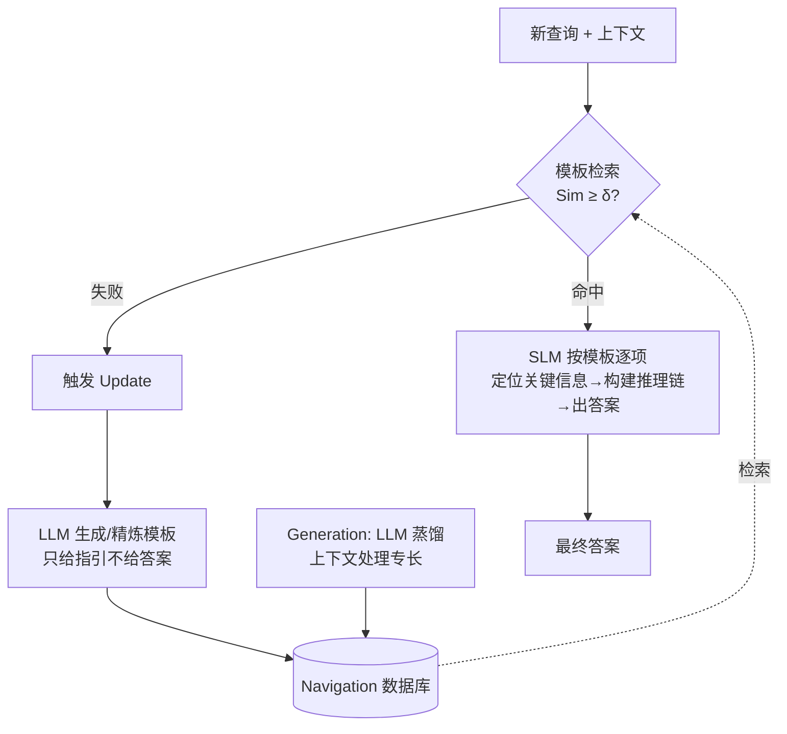

# Following the Navigation: Enhancing Small Language Models Contextual Reasoning with LLM Guidance

**会议**: ICLR 2026  
**OpenReview**: [https://openreview.net/forum?id=R8A12kykPG](https://openreview.net/forum?id=R8A12kykPG)  
**代码**: 待确认  
**领域**: LLM 推理 / 小模型增强  
**关键词**: 小语言模型, 上下文推理, 免训练, LLM 蒸馏, 模板检索, 知识库  

## 一句话总结
提出 **Navigation**——一个免训练框架，把大模型处理复杂上下文的"推理策略"蒸馏成可复用的导航模板存进数据库，用"生成—利用—更新"三阶段引导 3B 小模型定位关键信息，平均提升 10.7% 准确率并反超 GPT-3.5-Turbo。

## 研究背景与动机
**领域现状**：o1、DeepSeek-R1 这类大模型在上下文推理（需要世界知识、深度理解长文本、多步推断）上表现优异，但算力与部署成本高，难以落到边缘设备；3B 量级的小语言模型（SLM）算力友好，却因参数容量受限、难以建模复杂依赖而在上下文推理上频繁翻车。

**现有痛点**：把大模型能力迁移到小模型的主流路线都依赖额外训练——知识蒸馏（白盒用 logits/隐状态，黑盒用 teacher 生成的伪标签/推理轨迹微调 student）、数据合成（用 LLM 造训练数据）。这些方法不仅需要标注数据和训练开销，小模型在微调后还容易**灾难性遗忘**，在 MuSR 这类小数据集上 SFT 甚至会掉点。

**核心矛盾**：小模型在信息密集的长上下文里容易"迷失在中间"（lost in the middle），被无关细节淹没；但已有研究又表明 SLM 在 in-context learning 下对**提示质量**高度敏感、且具备一定鲁棒性——这说明**精心设计的引导**有机会在不训练、不扩参的前提下激活小模型的上下文处理能力。

**本文目标**：构造一个**免训练、低 LLM 调用成本**的引导机制，让小模型借用大模型的"上下文处理专长"，又不超出自身容量、不引入遗忘。

**核心 idea**：**把大模型的"怎么读这类题"抽象成结构化模板，而非把答案蒸馏给小模型。** 大模型只负责一次性产出"针对某类任务该关注哪些关键信息"的通用指引（如谋杀推理要查动机/凶器熟练度/不在场证明），存入可检索的 Navigation 数据库；小模型遇到新题时检索最相似的模板，按模板逐项定位证据、构建推理链，最终答案仍由小模型自己给出。

## 方法详解

### 整体框架
Navigation 围绕三个阶段闭环运转：**Generation**（大模型把上下文处理专长蒸馏成模板入库）、**Utilization**（小模型对新查询检索最相似模板并按指引一步到位地推理）、**Update**（检索失败时触发大模型补新模板，数据库动态扩张）。三者构成一个"先用小模型扛，扛不住才叫大模型补课，补完以后同类题继续归小模型"的实用工作流，把昂贵的 LLM 调用压到最低。

### 关键设计

**1. Navigation Generation：蒸馏"推理策略"而非"推理结果"，结构化成可检索模板。** 不同任务需要的关键信息类型迥异——谋杀推理要综合评估动机、手段、机会，团队分配要分析成员强弱项与人际动态。Navigation 让大模型走完一次完整推理循环（理解问题→解析文本→抽取信息→构建推理链→给答案），在此过程中**识别并抽象出与任务相关的关键信息类型、滤掉无关噪声**，把这份"该看哪些点"的经验组织成结构化模板。每个模板含三部分：`Task Category`（问题类型，如"谋杀推理"，用于精准检索）、`Task Scenarios`（归档历史查询与上下文，作为相似度匹配的锚点）、`Task Guidance`（枚举关键抽象信息类型并配简洁通用解释，如"不在场证明可信度：通过证人、数字记录或带时间戳的活动证实其案发时身处他处"）。关键在于模板写得**简洁、通用、适配小模型的理解力**，让 SLM 拿到的是量身定制的可操作指引，而不是泛泛而谈。

**2. Navigation Utilization：语义检索 + 端到端单步推理，避免信息过载。** 收到查询与上下文后，用一个**独立于 SLM/LLM 的嵌入模型**把当前任务场景 $x_d$ 向量化，与库中各模板归档场景 $\{D_{T_i}\}_{i=1}^{N}$ 计算余弦相似度并取最相似者：
$$j = \arg\max_{i} \mathrm{Sim}\big(f(x_d),\, f(D_{T_i})\big)$$
若最高相似度超过阈值 $\delta$ 则选中该模板引导推理，否则触发 Update。选中后小模型按模板指令**系统性扫描原文**，只抓取与各指令对应的证据（如模板说"查不在场证明可信度"，就只盯证人证词、数字记录、时间戳），过滤无关细节再整合成推理链。值得注意的是这是**端到端单步生成**——模板实例化与推断在一次生成里完成，既提效率又降幻觉，因为小模型聚焦于预先圈定的关键点、避免冗余处理。

**3. Navigation Update：检索失败即触发持续学习，数据库自演化。** 当 $\mathrm{Sim}(f(x_d), f(D_{T_i})) < \delta$（无合适模板）或现有模板引导不力时，判定出现 **Navigation gap**：小模型记录问题类型、任务特征与失败原因（如"缺少新任务类型的指引"）并上报大模型，大模型据此识别问题类型（作为后续管理的标签）并生成对应通用指引。**关键约束是大模型只给指引、不给最终答案**，任务执行权始终留在小模型手里。新模板入库（替换过时项或补充），同类新题之后即可由小模型用新模板自行处理。配合"先 SLM 扛、失败才路由 LLM、补完模板回归 SLM"的真实工作流，把 LLM 调用频率压到极低（实验中仅为 SLEICL 的 3%、每个数据集只需个位到二十几个模板）。

## 实验关键数据

### 主实验（MuSR / StrategyQA / HotpotQA，节选）
模板由 DeepSeek-R1 / GPT-5.1 生成，△ 为相对 Vanilla 的提升。

| Backbone / 方法 | MuSR-OP | MuSR-MM | MuSR-TA | StrategyQA-Acc | HotpotQA-EM |
|---|---|---|---|---|---|
| GPT-3.5-Turbo (175B) | 44.6 | 60.3 | 42.4 | 68.1 | 44.4 |
| DeepSeek-R1 (671B) | 55.3 | 73.5 | 84.5 | 82.0 | 52.8 |
| **Qwen2.5-3B** Vanilla | 41.0 | 55.6 | 34.5 | 59.6 | 34.9 |
| 　+ CoT | 45.2 | 57.7 | 40.1 | 62.5 | 39.6 |
| 　+ SLEICL | 51.2 | 58.7 | 40.5 | 60.9 | 37.1 |
| 　+ SFT (LoRA) | 34.6 | 58.7 | 48.0 | 60.9 | 37.7 |
| 　**+ Navigation (GPT-5.1)** | **52.7** | **64.5** | 45.0 | 65.9 | **51.8** |
| 　△ | +11.7 | +8.9 | +10.5 | +6.8 | +16.9 |
| **Llama-3.2-3B** + Navigation | 53.5 | 64.5 | 48.5 | 69.4 | 53.3 (△+17.5) |
| **Qwen2.5-7B** + Navigation | 60.8 | 66.1 | 47.8 | 74.6 | 52.3 (△+10.5) |

3B 模型加 Navigation 在 MuSR/HotpotQA 上**反超 175B 的 GPT-3.5-Turbo**；7B 模型则在所有数据集与指标上全面超越 GPT-3.5-Turbo。

### 成本分析（MuSR，Llama-3.2-3B 为 SLM）

| 方法 | Acc | Latency | Output Tokens | GFLOPs | LLM 调用频率 |
|---|---|---|---|---|---|
| Vanilla | 47.2 | 21.8 | 6 | 6441 | – |
| + CoT | 49.3 | 27.0 | 15 | 6587 | – |
| + SLEICL | 38.1 | 432.4 | 540 | 12477 | 502 |
| + SFT | 44.8 | 100.7 | 6 | 6460 | – (训练 6m55s) |
| **+ Navigation** | **54.3** | 175.5 | 934 | 14195 | **16** |

模板数占数据集比例极低：MuSR 756 样本仅 8 个模板（~1%）、StrategyQA 2061 样本 13 个（0.6%）、HotpotQA 1000 样本 21 个；而 SLEICL 的 LLM 生成示例占其数据集的 66.7%——Navigation 的 LLM 调用频率仅为 SLEICL 的 3%。

### 消融实验（Qwen2.5-3B）

| 配置 | MuSR-OP | MuSR-MM | StrategyQA-Acc | HotpotQA-EM |
|---|---|---|---|---|
| + Navigation | 52.6 | 60.5 | 66.4 | 51.1 |
| w/o Generation | 41.0 | 55.6 | 59.6 | 34.9 |
| w/o Update | 46.7 | 56.0 | 62.3 | 35.1 |

### 关键发现
- **模板（Generation）是命门**：去掉模板生成退化到 Vanilla 水平，证明"上下文引导"才是小模型成功的核心；去掉 Update（用固定通用模板）则全数据集掉点 50%+，说明细粒度自适应模板不可或缺。
- **更长输出 = 激活了上下文分析能力**：Navigation 让 SLM 输出 token 从 6 涨到 934，作者解读为有效激活了小模型的文本推理容量，而非冗余啰嗦。
- **阈值 $\delta$ 数据/模型相关**：StrategyQA、HotpotQA 等宽域数据集需更低阈值，更精细的嵌入模型（E5-7B）需更高阈值；阈值越高粒度越细但成本单调上升。
- **案例（物体放置）**：Vanilla 小模型过度采信"Emily 移动了日记"而答错；Navigation 引导小模型记录每次移动及责任主体，按人类行为逻辑判断 Zoe 会先找自己最后放置的抽屉，答对。

## 亮点与洞察
- **蒸"策略"而非蒸"答案/数据"**：把大模型的价值定位在"提炼该关注哪些关键信息"这一抽象层，模板可跨同类任务复用，从根上避开了微调带来的遗忘与数据依赖。
- **成本结构很漂亮**：模板量 ≤ 数据集 2.1%，LLM 调用仅为 few-shot 路线的 3%，且小模型始终保有答案生成权——这套"SLM 优先、LLM 偶尔补课"的工作流对真实部署友好。
- **检索器与推理器解耦**：嵌入模型独立于 SLM/LLM，可换 MPNet-v2 或 E5-7B，工程上灵活。

## 局限与展望
- **依赖嵌入检索质量与阈值**：最优 $\delta$ 因数据集/嵌入模型而异，需要人工或经验调参；阈值偏低会漏检触发更多 LLM 调用，偏高又增成本，缺乏自适应阈值机制。
- **评测域偏窄**：主要在叙事/常识多步推理（MuSR）与多跳 QA（StrategyQA/HotpotQA）上验证，对数学、代码、长文档检索等其他上下文推理形态的泛化未充分考察。
- **统计口径取巧**：触发 LLM 生成模板的样本被排除在准确率统计外——虽声称为公平起见，但实际系统中这部分查询的端到端表现（含 LLM 成本）未完整计入。
- **冷启动成本**：新领域初期模板覆盖不足会频繁触发 Update，首次部署的 LLM 调用可能高于稳态。

## 相关工作与启发
- **In-Context Learning**：ICL 的本质更像是利用数据中的统计规律/隐含规则而非死记示例，小模型对标签一致性敏感、大模型更抗噪；本文正是利用"SLM 在好提示下有鲁棒性"这一前提。
- **LLM 增强小模型**：相对白盒/黑盒知识蒸馏与数据合成（CoT distillation、Instruction-Following Distillation）都需训练，Navigation 走的是**外部知识库 + 非参数检索**路线，更接近 RAG 思想但检索的是"推理指引"而非"事实知识"。
- **启发**：这套"模板即可复用推理策略"的范式可迁移到 agent 工具调用、领域专家系统等场景——把昂贵模型的元认知（怎么拆解一类问题）显式化、可检索化，让廉价模型按图索骥。

## 评分
- 新颖性: ⭐⭐⭐⭐ —— "蒸馏推理策略成可检索模板"的角度新颖，区别于主流训练式蒸馏；不过 Generation/Utilization/Update 三件套与 RAG + 提示工程有相通之处。
- 实验充分度: ⭐⭐⭐⭐ —— 3 个基准 8 指标、多 backbone、成本/消融/案例齐全，但评测域偏推理类、排除触发样本的统计口径略有水分。
- 写作质量: ⭐⭐⭐⭐ —— 动机—方法—实验逻辑清晰，模板结构与工作流叙述具体可懂。
- 价值: ⭐⭐⭐⭐ —— 免训练让 3B 反超 GPT-3.5、LLM 调用降到 3%，对边缘部署与低成本上下文推理有实际吸引力。

<!-- RELATED:START -->

## 相关论文

- [\[ICLR 2026\] SLM-MUX: Orchestrating Small Language Models for Reasoning](slm-mux_orchestrating_small_language_models_for_reasoning.md)
- [\[ICLR 2026\] T1: Tool-Integrated Verification for Test-Time Compute Scaling in Small Language Models](t1_tool-integrated_verification_for_test-time_compute_scaling_in_small_language_.md)
- [\[ICLR 2026\] Efficient Test-Time Scaling for Small Vision-Language Models](efficient_test-time_scaling_for_small_vision-language_models.md)
- [\[ICLR 2026\] Predicting LLM Reasoning Performance with Small Proxy Model](predicting_llm_reasoning_performance_with_small_proxy_model.md)
- [\[ICLR 2026\] From Abstract to Contextual: What LLMs Still Cannot Do in Mathematics](from_abstract_to_contextual_what_llms_still_cannot_do_in_math_word_problem_solvi.md)

<!-- RELATED:END -->
