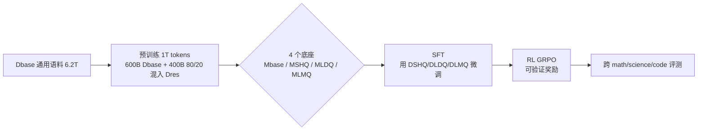

# Front-Loading Reasoning: The Synergy between Pretraining and Post-Training Data

**会议**: ICLR 2026  
**OpenReview**: [https://openreview.net/forum?id=VmEkhV2yCX](https://openreview.net/forum?id=VmEkhV2yCX)  
**代码**: 待确认  
**领域**: LLM 推理 / 训练数据配置  
**关键词**: 推理数据, 预训练, 监督微调, 数据配比, 强化学习  

## 一句话总结
在固定推理 token 预算下系统拆解"推理数据该放在预训练还是后训练"，发现把推理数据**前置到预训练**能建立 SFT 无法补偿的持久优势，并提出"预训练重多样性、SFT 重质量"的非对称数据分配原则。

## 研究背景与动机
- **领域现状**：当前提升 LLM 推理能力的主流范式是在**后训练**阶段（mid-training / SFT / RL）灌入高质量、长 CoT 的推理数据，把推理当作叠加在通用底座上的专门技能。
- **现有痛点**：推理数据在**预训练**阶段的作用几乎是空白——前沿模型预训练语料不透明、端到端预训练实验成本高昂，社区研究因此集中在更易触及的后训练阶段，缺乏对"什么时候喂推理数据"的系统对照。
- **核心矛盾**：在 token 预算受控的前提下，早期（预训练）注入推理数据究竟是更好、还是会让模型过拟合而损害泛化？后续 SFT 能否让一个"推理贫瘠"的底座"追上来"？这些问题彼此冲突且都没有定论。
- **本文目标**：第一次系统研究推理数据在**规模、多样性、质量**三个维度上、于**不同训练阶段**注入时对最终模型（经 RL 后）下游精度的影响，给出贯穿整条训练管线的数据分配指南。
- **核心 idea**：**【前置推理】** 把推理数据前置到预训练，在严格控制总推理 token 预算（80B）的全交叉实验设计下，量化预训练 ↔ SFT 的协同、冗余与权衡，得出"早投入复利回报"的结论。

## 方法详解

### 整体框架
作者把问题形式化为一个**带预算约束的数据分配优化**：在总推理数据预算 $B = |D^{PT}_{res}| + |D^{SFT}_{res}|$ 固定下，寻找预训练侧 $D^{PT}_{res}$ 与 SFT 侧 $D^{SFT}_{res}$ 的最优配置，使最终模型在下游推理任务集 $T$ 上的期望精度 $P(D^{PT}_{res}, D^{SFT}_{res}) = \mathbb{E}_{t\sim T}[\mathrm{Acc}(f_{\theta_{SFT}}(t))]$ 最大化。围绕这个目标，所有实验跑在同一条三阶段管线上——**预训练 → SFT → RL**，并通过精心设计的数据集变体做全交叉对照。

### 关键设计

**1. 全交叉数据矩阵：把"质量×多样性×规模"拆成可控变量。** 作者围绕推理数据 $D_{res}$ 精心策划四套数据集来解耦各维度——大规模多样的 $D_{LDQ}$（268M 样本，56% 数学/17% 代码/27% 科学与通用，质量参差，代表"量大于质"）、小规模高质量的 $D_{SHQ}$（1.2M 强教师长 CoT 样本，代表"质优但窄"）、二者直接并集的混合质量 $D_{LMQ}$，以及按答案长度 >4096 token 过滤出的"复杂度隔离"子集 $D_{ALF}$（7.1M）。预训练侧由此训出四个底座：无推理数据的基线 $M_{base}$，以及 $M_{LDQ}/M_{SHQ}/M_{LMQ}$，三者均值记作 $M_{res}$。这套矩阵让"早/晚、多样/高质"成为独立可拨的旋钮。

**2. 受控的 token 预算与配比：保证跨实验公平。** 所有底座都从零预训练 1T tokens——前 600B 纯用 $D_{base}$，后 400B 用 80% $D_{base}$ + 20% $D_{res}$ 的混合，由此**所有实验共享恒定的 80B 推理 token 预算**；小数据集（如 $D_{SHQ}$）通过重复采样补足同等推理 token 量，从而把"放多少推理数据"这一混淆因素彻底锁死，只剩下"放什么、放在哪个阶段"在变。底座采用 8B 的 Mamba2 + 自注意力 + FFN 混合 Transformer，在 512 张 H100 上训练。

**3. 三阶段协同 + RL 可持续性检验。** 预训练后，每个底座在不同 $D_{res}$ 上做 SFT（4.8M 样本，32k 上下文），形成 4×3 的全交叉，专门验证三个假设：**Catch-Up 假设**（$M_{base}$ 能否靠加倍 SFT 追上推理底座）、**多样性影响**（宽 vs 深的预训练谁更利于吸收 SFT）、**SFT 质量边际效用**。最后用 **GRPO + 可验证奖励**（基于 NEMOTRON-CROSSTHINK）做 RL，检验早期推理增益在最终模型里是否可持续、能否在 AIME 等专家级任务上转化为决定性优势。

## 实验关键数据

### 主实验表格

预训练后底座精度（Table 1）与三阶段演进（Table 2/3）：

| 阶段 | 模型 | 平均 | 数学 | 科学 | 代码 |
|------|------|------|------|------|------|
| 预训练后 | Mbase | 52.70 | 47.17 | 47.13 | 40.89 |
| 预训练后 | MLDQ | 64.09 | 75.56 | 54.38 | 49.94 |
| 预训练后 | Mres(均值) | 61.05 | 66.84 | 51.92 | 48.95 |
| SFT后 | Mbase+SFT | 26.62 | 34.48 | 20.92 | 7.09 |
| SFT后 | Mres+SFT | 35.92 | 40.61 | 34.77 | 16.75 |
| RL后 | Mbase+SFT_SHQ+RL | 37.92 | — | — | — |
| RL后 | MLMQ+SFT_SHQ+RL | 56.66 | — | — | — |

预训练即拉开 +8.35% 平均差距，SFT 后扩大到 +9.3%，RL 后 MLMQ 领先基线 **+18.57%**，其中 AIME 竞赛数学领先高达 **+39.32%**——印证"早投入、复利回报"。

### 消融实验表格

Catch-Up 失败 + 高质量数据的潜在价值（Table 4）：

| 模型 | 平均 | 数学 | 说明 |
|------|------|------|------|
| Mbase + SFT_SHQ | 29.92 | 42.79 | 基线 |
| Mbase + SFT_SHQ (2× epochs) | 34.01 | 48.05 | 加倍 SFT 仍追不上 |
| MSHQ + SFT_SHQ | 37.33 | 50.52 | 最弱推理底座也超过加倍基线 |
| MLDQ + SFT_SHQ | 46.70 | 60.79 | 多样预训练优势延续 |
| MLMQ + SFT_SHQ | 50.95 | 64.67 | 高质量潜在增益被 SFT 激活 |

预训练配比敏感性（Table 6，MLMQ）：把 $D_{base}{:}D_{res}$ 从 80/20 提到 60/40，整体从 64.07→67.28，数学/科学/代码同步上升且通用任务不退化。

### 关键发现
- **Catch-Up 假设被证伪**：$M_{base}$ 加倍 SFT 也追不上最弱的推理底座，说明 SFT 无法替代预训练奠定的推理底座。
- **非对称分配原则**：预训练偏好**多样性与规模**（MLDQ 比 MSHQ 多样化带来 +11% 量级增益），SFT 偏好**质量**（高质量 $D_{SHQ}$ 带来 +15% 量级增益）。
- **潜在效应**：高质量但窄的数据在预训练阶段几乎无即时收益，却在 SFT 后"解锁"出额外 +4.25% 增益（MLMQ vs MLDQ）。
- **盲目扩 SFT 有害**：用大规模混合质量数据扩 SFT 平均无增益、数学反降 ~5%；而仅增 0.4% 高质量数据即可持续提升。

## 亮点与洞察
- **把"何时喂推理数据"做成第一性系统研究**：在 token 预算严格受控、全交叉、跨预训练/SFT/RL 三阶段的设计下给出结论，方法论扎实，远超"more is better"的直觉。
- **非对称原则极具可操作性**：给出"预训练重多样性、SFT 重质量"的明确启发式，直接可指导数据采购与配比决策。
- **科学领域的反常增益**：与多数后训练工作只在数学上见效不同，本文发现推理预训练在**科学领域**差距最显著，暗示早期推理数据帮模型建立了跨域可迁移的抽象/逻辑内部表征，而非死记事实。
- **潜在效应的发现**：高质量数据的价值会"延迟兑现"到对齐阶段，揭示了预训练与后训练之间更深的协同机制。

## 局限与展望
- 仅在 8B 混合架构 + 1T token 上验证（另有 1.2B Transformer 佐证趋势），更大规模/更长训练下结论的尺度律仍待确认。
- 推理配比是经验性旋钮，最优比例随领域和数据集而变，提高比例虽强化推理却轻微损害指令跟随（breadth–alignment 权衡），需按部署域系统探索。
- 数据集质量/多样性靠现成语料的启发式定义（答案长度、来源混合），缺乏更细粒度的质量度量。
- RL 阶段只对比了两个极端底座，中间配置的 RL 行为尚未全面刻画。

## 相关工作与启发
- **后训练推理范式**（长 CoT SFT、Guha et al. 2025 等）：本文证明这些方法的天花板受预训练底座制约，是对该范式的补充与边界界定。
- **预训练/中训练注入推理**（Cheng et al. 2024 等）：本文把"中训练注入小量 CoT"扩展到"端到端预训练大规模注入"，并量化其与后训练的协同。
- **对实践的启发**：数据工程应从"分阶段独立优化"转向"全管线协同分配"——预训练阶段优先铺多样、规模化的推理语料以建立可迁移先验，SFT 阶段精打细算地用高质量长 CoT 做定向打磨，避免用噪声数据稀释信号。

## 评分
- 新颖性: ⭐⭐⭐⭐ 首个在受控预算下系统拆解"推理数据跨阶段分配"的研究，非对称原则与潜在效应是有价值的新发现。
- 实验充分度: ⭐⭐⭐⭐ 全交叉三阶段设计、多个消融与配比扫描、跨架构验证，证据链完整；但受限于 8B 单一规模。
- 写作质量: ⭐⭐⭐⭐ 研究问题清晰、结论可执行、表格组织得当。
- 价值: ⭐⭐⭐⭐ 为整条训练管线的数据策略提供了可直接落地的指南，对工业界数据配置有实际指导意义。

<!-- RELATED:START -->

## 相关论文

- [\[ICLR 2026\] Understanding the Role of Training Data in Test-Time Scaling](understanding_the_role_of_training_data_in_test-time_scaling.md)
- [\[ICLR 2026\] Native Reasoning Models: Training Language Models to Reason on Unverifiable Data](native_reasoning_models_training_language_models_to_reason_on_unverifiable_data.md)
- [\[ICLR 2026\] Your Models Have Thought Enough: Training Large Reasoning Models to Stop Overthinking](your_models_have_thought_enough_training_large_reasoning_models_to_stop_overthin.md)
- [\[ICLR 2026\] OpenThoughts: Data Recipes for Reasoning Models](openthoughts_data_recipes_for_reasoning_models.md)
- [\[ICLR 2026\] ProofOptimizer: Training Language Models to Simplify Proofs without Human Demonstrations](proofoptimizer_training_language_models_to_simplify_proofs_without_human_demonst.md)

<!-- RELATED:END -->
