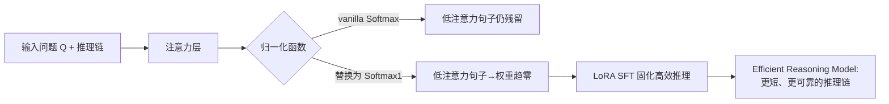

# FROST: Filtering Reasoning Outliers with Attention for Efficient Reasoning

**会议**: ICLR 2026  
**OpenReview**: [https://openreview.net/forum?id=a9dngZLqGS](https://openreview.net/forum?id=a9dngZLqGS)  
**代码**: 待确认  
**领域**: 大模型高效推理 / LLM Reasoning  
**关键词**: 高效推理, 推理离群点, 注意力剪枝, Softmax1, 注意力离群点, 过度思考  

## 一句话总结
把推理链里"低注意力、低贡献"的冗余句子定义为**推理离群点（reasoning outliers）**，用 Softmax₁ 替换 vanilla Softmax 并做轻量 SFT，让大推理模型在几乎不掉点甚至涨点的前提下把推理 token 砍掉约 70%。

## 研究背景与动机
**领域现状**：DeepSeek-R1、OpenAI o1 这类大推理模型（LRM）靠长链 CoT 在数学、代码上拿到强性能，但"想得越多越好"的训练取向让它们生成大量自我验证、重复回退的步骤——尤其小参数模型更爱"过度思考"。

**现有痛点**：现有高效推理方法各有结构性缺陷。token 级方法（TALE、R2R）按 token 截断，但推理天然以句子为单位，容易误删关键步骤；句子级方法（DRP、GRPO-S）做迭代精修，又带来额外算力与延迟；prompt 类方法靠手工 token budget，复杂题上不稳定；SFT/RL 类则要大量微调资源。

**核心矛盾**：怎样**不靠额外推理开销、不靠重训**就精准识别并删掉"无用步骤"，同时还能保住关键步骤？

**本文目标**：给"无用步骤"一个可度量的定义，并设计一个部署时几乎零额外成本的机制把它们抑制掉。

**核心 idea**：**【观察】** LRM 对关键步骤给高注意力、对无用步骤给低注意力，且无用步骤往往同时具备低注意力 + 低 entropy 的特征。**【定义】** 据此把这类句子命名为推理离群点，并发现它们与已知的"注意力离群点（attention outlier）"同源。**【手段】** 用专治注意力离群点的 Softmax₁ 替换 Softmax——它能把小权重压到接近 0、保留大权重，从而在句子层面把离群推理步骤"抹掉"，配合少量 LoRA SFT 即可固化这种高效推理行为。

## 方法详解

### 整体框架
FROST 是一个"换激活函数 + 轻量微调"的两件套：把 Transformer 注意力里的 vanilla Softmax 换成 Softmax₁（离群点去除函数），再在带详细推理步骤的数学题上用 LoRA 做少量 SFT，让模型参数适配新激活、把"只关注关键句子"的行为固化下来。整个改动只动注意力归一化这一处，部署时不引入额外推理流程。

### 关键设计

**1. 推理离群点：把"无用步骤"变成可度量的对象。** 论文先做归因分析为定义铺路：把推理过程切成问题 $Q$、推理步 $R_1,\dots,R_m$、最终答案 $A$ 三类，对每个句子统计它流向答案首 token（`</think>`）的注意力总和 $W_{\text{trace}}=\sum_{t_i\in T_{\text{trace}}} a_{iA}$。热力图与归因实验（Figure 2/3）显示：浅层注意力近乎均匀，但深层与靠后的 head 上只有少数推理句子强烈贡献，多数句子贡献微弱甚至几乎为零。于是论文把"低注意力权重 + 对最终答案贡献可忽略"的推理句子正式定义为推理离群点，并指出它们与神经网络里的注意力离群点共享同一类统计特征（高 infinity norm、高 kurtosis），从而可以用同一套工具去治。

**2. 用 Softmax₁ 做句子级离群点抑制。** 核心替换是把注意力归一化从 Softmax 换成 Softmax₁：

$$\text{Softmax}_1(x_i)=\frac{\exp(x_i)}{\sum_j \exp(x_j)+1}$$

分母里多出的常数 $1$ 给注意力一个"什么都不关注"的逃逸出口——当一组 logit 整体偏小时，权重会被这个 $1$ 拉向 0，而大权重几乎不受影响，于是实现了"压小留大"的非对称收缩。这正好对应离群点去除：把低注意力的离群句子权重驱到接近零，把关键句子的高权重保住。相比 Sparsemax、Entmax15 这类会同时削低权重和高权重的"双向锐化"激活，Softmax₁ 是**选择性尾部收缩**，不会误伤关键推理句。

**3. 理论保证：尾部收缩 + 部署时跳过。** 论文在句子层面给出形式化保证。设把 token 序列按句子 $\{S_i\}$ 切分，用单调池化算子 $\phi$（sum/mean/max 等）聚合得到句子分数 $s_i$，再经 Softmax₁ 映射 $\sigma_1$ 得到句子级注意力 $\alpha=\sigma_1(s)$。关键假设是 $\sigma_1$ 满足**尾部收缩（tail contraction）**：存在 $\kappa\in(0,1)$ 使

$$\frac{\|\sigma_1(x)\|_\infty}{\text{median}(\sigma_1(x))}\le \kappa\,\frac{\|x\|_\infty}{\text{median}(x)}$$

即离群点的相对主导度被压缩（Theorem 5.1）。进一步，对一个 $\alpha_i\le\varepsilon$ 的低注意力句子，它对输出 logit 的单层贡献被 $\|\Delta\ell_i\|\le B_o B_v\,\varepsilon$ 界住，堆叠 $L$ 层后整体影响仍为 $O(\varepsilon)$（Theorem 5.2），意味着低注意力句子在推理时被有效"跳过"。这把"去掉离群点不伤推理能力、甚至增强"这一经验现象（Figure 4）落到了可证明的层面。

**4. 轻量微调而非从头训练。** 以往用 Softmax₁ 去除注意力离群点要么从头预训练、要么多步持续学习，成本高。FROST 直接从现成预训练 checkpoint 出发，只换激活函数 + cross-entropy loss + LoRA，少量 fine-tuning step 即可适配，训练时间相比其他 SFT baseline 降 42.2%，让方法对没有大算力的用户也可用。

## 实验关键数据

### 主实验表格
三个 backbone（Phi-4-Reasoning / GPT-OSS-20B / Magistral-Small-1.1）× 四个数学 OOD benchmark（GSM8K / MATH500 / AIME24 / Minerva），报告 Pass@1 与 token 数 #Tk。下表摘 Phi-4-Reasoning 的 GSM8K 与 MATH500：

| 方法 | GSM8K Pass@1 | GSM8K #Tk | MATH500 Pass@1 | MATH500 #Tk |
|------|------|------|------|------|
| Base | 0.9242 | 1017.7 | 0.5480 | 1721.9 |
| TALE | **0.9500** | 1716.6 | 0.5800 | 1874.4 |
| DRP | 0.8340 | 721.0 | 0.6200 | 2122.0 |
| ThinkLess | 0.9279 | 1421.9 | 0.5414 | 1101.2 |
| **FROST** | 0.9311 | **154.3** | **0.5980** | **344.4** |

跨三模型平均：FROST 相比 base 提升准确率 26.70%、减少 token 用量 69.68%。TALE 偶尔靠堆 token 拿最高准确率，但响应长度大幅膨胀。

### 消融实验表格
**激活函数消融**（Phi-4-Reasoning，四数据集均值）：

| 激活函数 | 平均 Pass@1 | 平均 #Tk |
|------|------|------|
| Base (Softmax) | 0.4472 | 1414.1 |
| Sparsemax | 0.4406 | 535.3 |
| Entmax15 | 0.4751 | 471.7 |
| **Softmax₁ (FROST)** | **0.5169** | **449.9** |

**离群点指标**（AIME2024，Phi-4-Reasoning）：FROST 把最大 infinity norm $\|x\|_\infty$ 从 35.31 降到 29.67（−15.97%）、平均 kurtosis 从 241.72 降到 21.54（−91.09%）、平均句子 entropy 从 2.71 升到 3.07（+13.28%）。

### 关键发现
- **离群点指标与性能强相关**：infinity norm / kurtosis 越高，句子 entropy 越低、推理越低效——验证了"去离群点 = 更高效推理"的因果链。
- **选择性收缩优于双向锐化**：Sparsemax/Entmax15 因同时削高低权重会误删关键句，FROST 的单边尾部收缩避免了这一点（Minerva 上 Entmax15 略胜是唯一例外）。
- **泛化不掉点**：在 LeetCode / LiveCodeBench / UGPhysics 三个 OOD（代码 + 物理）任务上 FROST 仍保持甚至提升表现，因为只改激活 + LoRA 让参数偏移很小。
- **效率收益**：推理时间至少降 28.6%，训练时间相比其他 SFT baseline 降 42.2%。

## 亮点与洞察
- **概念迁移很巧**：把 NLP/量化领域熟知的"注意力离群点"概念平移到"推理冗余步骤"上，发现两者同源，于是直接复用成熟工具 Softmax₁，逻辑自洽且省力。
- **一处改动，全链受益**：不新增推理 pipeline、不做迭代精修，只换归一化函数，部署成本几乎为零，却拿到 token 砍 70% 的收益。
- **经验—理论双闭环**：从注意力热力图 → 归因实验 → 离群点定义 → 尾部收缩定理 → 部署时跳过界，把"去冗余不伤性能"做成了可证明的故事。
- **句子级而非 token 级**：抓住了"推理天然以句子为单位"这个被 token 级方法忽视的结构性事实。

## 局限与展望
- **会误删关键低注意力步骤**：论文自己承认 FROST 偶尔会剪掉低注意力但实际重要的句子，导致准确率不总是最优——"低注意力"不完全等价于"无用"。
- **理论假设较强**：尾部收缩假设、单调池化、各层算子范数近似常数等条件在真实深层网络里只是近似成立，$O(\varepsilon)$ 界的实际紧度未深究。
- **个别数据集反例无解释**：Minerva 上 Entmax15 反超 FROST，论文坦言"现阶段难以解释"。
- **任务范围偏窄**：训练与主评测集中在数学题，虽测了代码/物理泛化，但更开放的长文本/agentic 推理尚未覆盖。

## 相关工作与启发
- **高效推理三大范式**：prompt 类（TALE 设 token budget）、SFT 类（DRP 蒸馏剪枝）、RL 类（SelfBudgeter、ThinkLess 用奖励惩罚长链），FROST 提出第四条路——基于注意力的离群点去除，部署期零额外开销是其差异点。
- **注意力离群点研究**：继承 Hu et al.、Luo et al. 关于 Softmax₁ 抑制激活离群点的工作，但把目标从"量化友好"换成"推理高效"。
- **与 KV-cache 压缩方法的区别**：Think Clearly、R-KV 也分析句子级注意力，但目的是检测冗余压缩 KV cache；FROST 做的是细粒度"每个推理句对最终答案贡献多少"的归因，落点不同。
- **启发**：把"模型内部统计离群（infinity norm / kurtosis）"当作可优化的代理信号去间接控制"输出层面的冗余"，是个可复用的范式——值得思考还有哪些"内部离群"能映射到"外部低效"。

## 评分
- **新颖性**: ⭐⭐⭐⭐ — "推理离群点"概念 + Softmax₁ 迁移到高效推理的角度新颖，把成熟工具用在新问题上且有理论支撑。
- **实验充分度**: ⭐⭐⭐⭐ — 3 backbone × 4 数学集 + 3 OOD 泛化集 + 激活函数消融 + 离群点指标，覆盖较全；但任务以数学为主，反例缺解释。
- **写作质量**: ⭐⭐⭐⭐ — 从观察到定义到理论层层递进，图表清晰；部分定理依赖附录、个别结论"难以解释"略显仓促。
- **价值**: ⭐⭐⭐⭐ — 部署期零额外成本砍 70% token 且基本不掉点，对实际推理部署很实用，方法可直接迁移到其他 LRM。

<!-- RELATED:START -->

## 相关论文

- [\[ICLR 2026\] Attention as a Compass: Efficient Exploration for Process-Supervised RL in Reasoning Models](attention_as_a_compass_efficient_exploration_for_process-supervised_rl_in_reason.md)
- [\[ICLR 2026\] Whatever Remains Must Be True: Filtering Drives Reasoning in LLMs, Shaping Diversity](whatever_remains_must_be_true_filtering_drives_reasoning_in_llms_shaping_diversi.md)
- [\[ICLR 2026\] Echoes as Anchors: Probabilistic Costs and Attention Refocusing in LLM Reasoning](echoes_as_anchors_probabilistic_costs_and_attention_refocusing_in_llm_reasoning.md)
- [\[ICLR 2026\] Retrieval-of-Thought: Efficient Reasoning via Reusing Thoughts](retrieval-of-thought_efficient_reasoning_via_reusing_thoughts.md)
- [\[ACL 2026\] DELTA: Dynamic Layer-Aware Token Attention for Efficient Long-Context Reasoning](../../ACL2026/llm_reasoning/delta_dynamic_layer-aware_token_attention_for_efficient_long-context_reasoning.md)

<!-- RELATED:END -->
