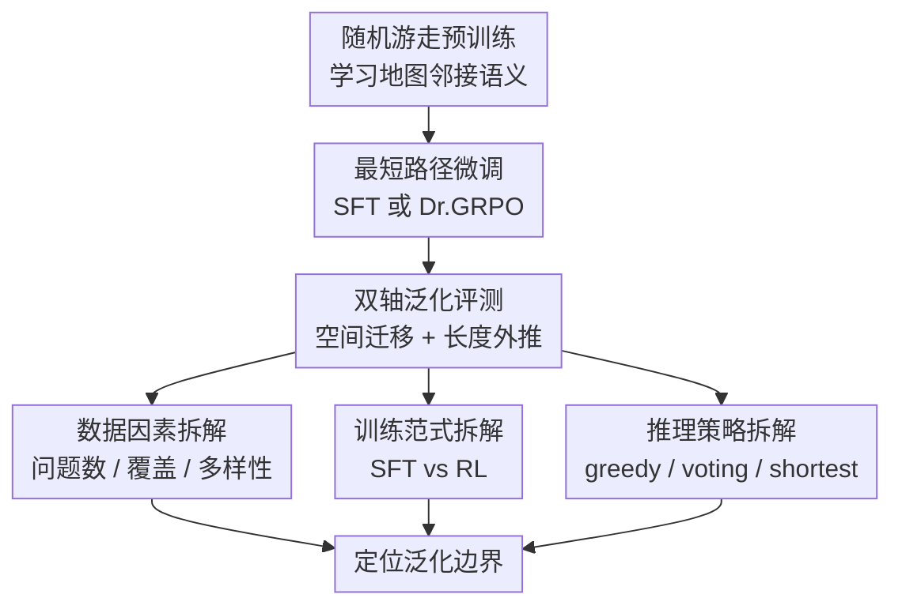

# Generalization in LLM Problem Solving: The Case of the Shortest Path

**会议**: ICLR2026  
**OpenReview**: [https://openreview.net/forum?id=RnRHNEeqvI](https://openreview.net/forum?id=RnRHNEeqvI)  
**代码**: https://github.com/privacytrustlab/PathGeneralization  
**领域**: LLM推理 / 系统泛化 / 长度外推  
**关键词**: 最短路径, 系统泛化, 长度外推, 数据覆盖率, 强化学习  

## 一句话总结

这篇论文用可控的最短路径合成环境拆解 LLM 问题求解中的泛化来源，发现模型可以把学到的局部规则迁移到未见地图，却会在更长路径上因递归组合不稳定而失败；数据覆盖率决定能力上限，RL 主要稳定训练而不是扩展上限，测试时采样只能抬高曲线但救不了长度外推。

## 研究背景与动机

**领域现状**：LLM 的推理能力通常在数学、代码、问答、规划等自然任务上评测，也常通过 SFT、RLVR、test-time scaling 等后训练或推理策略提升表现。问题在于，这些 benchmark 里的训练数据、任务分布、推理提示、采样策略往往缠在一起，模型分数高到底是学会了可复用规则，还是记住了分布模式，很难单独判断。

**现有痛点**：如果一个模型在数学题或图推理任务上失败，失败原因可能来自很多层：训练题型覆盖不够、训练方式没有诱导出正确算法、RL 没有提供新能力、推理时搜索预算不够，甚至测试集本身和训练集并没有真正解耦。自然语言任务尤其麻烦，因为“未见题”常常仍包含训练中见过的语义邻近模式，导致系统泛化被高估。

**核心矛盾**：LLM 问题求解的关键矛盾是“会做局部小题”不等于“能稳定组合成更长的解”。许多顺序优化问题都满足可组合性：从 $i$ 到 $j$ 的最优解可以拆成从 $i$ 到 $k$ 与从 $k$ 到 $j$ 的子解。但 Transformer 生成长序列时是否真的能递归复用这种规则，不能只看同长度或同分布测试来回答。

**本文目标**：作者希望构造一个足够简单、可验证、又有组合结构的实验场，分别回答三个问题：模型是否能在未见空间结构上泛化；若能解短路径，是否能组合出更长路径；数据选择、训练范式和推理时策略分别对这两类泛化起什么作用。

**切入角度**：论文选择最短路径作为代表性 composable sequential optimization problem。它的好处是答案可精确验证，路径长度可控，地图可完全换掉，且输入输出可以做成类似 LLM 的序列生成任务：给定起点和终点，模型直接生成一串方向动作。

**核心 idea**：用“受控最短路径世界”把 LLM 推理泛化拆成空间迁移和长度外推两条轴，再逐一干预数据覆盖、SFT/RL 训练和测试时采样，定位到底是哪一层限制了系统性问题求解。

## 方法详解

### 整体框架

论文不是提出一个新的推理模型，而是提出一套可控诊断框架。作者先把地图节点当作“词汇世界”，用随机游走预训练让小型 LLaMA 风格 Transformer 学到节点邻接语义；随后在一个训练地图上用最短路径样本做 SFT 或 RL；最后在两类 OOD 条件下评测：一类是完全不同的未见地图但路径长度仍在训练范围内，另一类是路径长度超过训练上限的长程问题。

这个框架的核心是把一切都做成可控变量：训练数据可以改变“问题数 vs 答案数”“覆盖率 vs 多样性”“是否加入稍长路径”；训练范式可以比较 SFT 与 Dr.GRPO；推理阶段可以比较 greedy、majority-of-10 和 shortest-of-10。由于最短路径有明确答案，作者能用成功率和错误分解直接判断模型是不会走、走不到、还是能走但不是最短。

### 关键设计

**1. 双轴最短路径测试床：把“换地图”和“变长”分开测**

作者把顺序优化问题写成状态、动作、转移、目标和全局代价的形式，并强调可组合性：若 $k$ 位于 $i$ 到 $j$ 的最优轨迹上，则 $Opt(i,j)=Opt(i,k)\circ Opt(k,j)$。最短路径正好满足这个性质，因此它既能测试模型是否学到“朝目标沿邻接边移动”的结构规则，也能测试模型能否把这个规则递归用很多次。

评测被拆成两个正交轴。空间迁移要求测试图 $\hat{G}$ 的节点、边、稀疏度、大小都与训练图 $G$ 不同，且训练和测试起终点对完全不重合；如果模型在这里成功，说明它没有只记住训练图里的节点 n-gram。长度外推则要求 $\max l(D_{train}) \le \min l(D_{test})$，即测试路径严格长于所有训练路径；这里考察的是递归生成的稳定性，而不是换图能力。成功率定义为 $SR=Pr[\hat{f}_\theta(i,j\mid G)=f(i,j\mid G)]$，若存在多条等长最短路径，只要预测路径属于最短路径集合就算成功。

**2. 数据选择干预：把训练预算拆成问题覆盖、组合多样性和答案多样性**

为了回答“什么样的数据最能带来泛化”，论文没有只增加总样本数，而是把固定预算拆成三个维度。第一组比较更多 distinct questions 和更多 answers per question：同一个起终点对可能有多条最短路径，作者固定 $N_{questions}\times N_{answers}=B$，看预算应投给更多问题还是更多解法。结果很明确，更多不同起终点对比同一问题的多解更有价值。

第二组进一步把问题本身拆成 coverage 与 diversity。coverage 是训练问题覆盖了训练图中多少唯一节点，$c=|V_{train}|/|V|$；diversity 是每个已覆盖节点平均与多少不同终点配对，$d=|supp(D_{train})|/|V_{train}|$。这个定义很重要，因为它把“见过更多 primitive”与“对同一批 primitive 做更多组合”分开了。实验显示 coverage 决定空间迁移上限，diversity 只需要过一个较小阈值；在低 coverage 下盲目提高 diversity 甚至会鼓励模型记住少量节点之间的组合，而不是抽象规则。

**3. 长度失败分解：区分难度累积和递归不稳定**

长度外推失败可能有两种解释：一种是长路径天然包含更多困难子问题，所以错误概率乘起来；另一种是短段都能解，但模型无法稳定把它们连成完整长路径。作者用一个很干净的分解来区分两者：对每条超出训练长度的测试路径，把它切成两个都在训练长度范围内的子路径 $Sub1$ 和 $Sub2$，再考察长路径成功率

$$
Pr(Long)=Pr(Long\mid Sub1\wedge Sub2)Pr(Sub1\wedge Sub2)+Pr(Long,\neg(Sub1\wedge Sub2)).
$$

如果主要是难度累积，那么 $Pr(Sub1\wedge Sub2)$ 的下降会解释大部分失败；如果主要是递归不稳定，那么即使两个子路径都能单独解，$Pr(Long\mid Sub1\wedge Sub2)$ 也会明显下降。实验中后者掉得更厉害：从长度组 $(20,30]$ 到 $(30,40]$，$Pr(Sub1\wedge Sub2)$ 只从 $0.846$ 降到 $0.796$，但 $Pr(Long\mid Sub1\wedge Sub2)$ 从 $0.811$ 降到 $0.589$。这说明模型不是简单被更难样本拖垮，而是在递归使用已学规则时失稳。

**4. 训练与推理策略拆解：验证 RL 和 test-time scaling 是否真的扩展能力边界**

RL 部分使用 Dr.GRPO，并用二值奖励判断生成序列是否为有效最短路径。这样设置对 RL 非常友好，因为 verifier 很准确，不需要人工偏好或模糊 reward。作者从不同 SFT checkpoint warm-start RL，改变 rollout 数，并比较 one-pass 与 multi-pass；长度外推中还让 RL 跑到约 20 个 epoch，与延长 SFT 训练对照。

推理阶段则用 greedy、majority-of-10 和 shortest-of-10。majority-of-10 对应 self-consistency，shortest-of-10 利用任务目标，从 10 条采样轨迹里选最短的一条。这个设计能回答一个尖锐问题：长度失败是不是只是搜索不够，模型其实有能力但 greedy 没采出来？结果显示更强推理策略确实能整体抬高成功率，shortest-of-10 尤其有效，但曲线仍随长度持续下滑；RL 模型在同样推理策略下还低于 SFT，说明 RL 没有打开新的解空间，甚至可能压缩了可供采样选择的轨迹多样性。

### 损失函数 / 训练策略

模型是 8 层、8 头、LLaMA 风格 Transformer，带 RoPE。预训练阶段使用所有地图上的长随机游走轨迹，目的是让模型学到节点邻接语义，但不泄露最短路径能力；作者还用后续实验证明预训练模型可以生成有效路径，却无法生成最短路径。

SFT 样本格式类似 `<s> i j : i E S E ... j </s>`，其中 $i,j$ 是起终点，答案用方向 token $E,W,N,S$ 表示，而不是节点 ID 序列。这避免模型通过节点 n-gram 直接记忆路径。SFT 时 prompt 前缀 `<s> i j :` 不计入 loss，测试时只给起终点，让模型续写方向动作。

RL 使用 Dr.GRPO，奖励为二值：生成序列若构成从 $i$ 到 $j$ 的有效最短路径，则 reward 为 $1$，否则为 $0$。训练 prompt 与 SFT 相同，rollout 数设为 4、8、16 等不同配置。推理时除 greedy 外，还比较 10 次采样后的多数投票和最短路径选择。

## 实验关键数据

### 主实验

| 评测维度 | 关键设置 | 主要结果 | 结论 |
|--------|----------|----------|------|
| 空间迁移 | 训练图外的 30×30、40×40、50×50 等 disjoint maps，路径长度在训练范围内 | 强配置下成功率超过 90%；20% 预算且优先不同问题时平均 SR 可达 94% | 模型确实能把最短路径规则迁移到未见地图 |
| 长度外推 | 同图或异图中路径长度超过训练最大长度 | 超过训练长度后 SR 快速下降；无论是否换地图都失败 | 空间泛化成功不代表能递归扩展到更长 horizon |
| 数据预算分配 | 固定记录数，在更多问题和更多答案之间分配 | 低预算时，更多问题一解法 SR 为 94%，少问题 32 解法仅 82% | distinct questions 比同题多解更有价值 |
| MathQA 迁移验证 | Qwen2.5-7B-Instruct，约 1000 样本预算，比较更多问题/更多解法 | gain: 0.70→0.82；physics: 0.68→0.77；更多解法只到 0.72/0.70 | 合成环境的数据规律在真实数学任务上也成立 |

### 消融实验

| 配置 / 分析 | 关键指标 | 说明 |
|------|---------|------|
| 长度组 $(20,30]$ | $Pr(Long)=0.774$，$Pr(Sub)=0.920$，$Pr(Sub1\wedge Sub2)=0.846$，$Pr(Long\mid Sub1\wedge Sub2)=0.811$ | 长路径成功主要依赖子路径都可解后能否稳定组合 |
| 长度组 $(30,40]$ | $Pr(Long)=0.530$，$Pr(Sub)=0.893$，$Pr(Sub1\wedge Sub2)=0.796$，$Pr(Long\mid Sub1\wedge Sub2)=0.589$ | 子路径成功率只小幅下降，组合条件成功率大幅下降，支持递归不稳定解释 |
| 加入稍长路径 | 仅加入约 1% 的 $l=32,34$ 样本，目标长度 30 的 SR 接近 90% | 长度外推需要邻近更长样本提供 curriculum-like 信号 |
| 加入较短或过长路径 | $l=22,24$ 帮助很小；$l=80$ 反而降级 | 不是任意更多数据都有效，长度信号要贴近目标区间 |
| 延长 SFT | 前期提升，随后快速过拟合 | SFT 峰值高但长训不稳定 |
| 延长 RL | 曲线稳定但始终不超过 best SFT | RL 稳定训练，不扩展能力上限 |
| 推理时 shortest-of-10 | 成功率整体上移但仍随长度下降 | test-time scaling 只能释放部分已有能力，不能消除长度失败 |

### 关键发现

- 空间迁移和长度外推是两种不同能力。模型能在未见地图上达到 90% 以上成功率，但一旦路径长度超过训练区间，成功率仍明显下降。
- 长度外推失败主要来自递归不稳定，不是单纯因为长路径包含更多困难子段。即使两个子路径都能单独解，模型也越来越难一次性生成完整长路径。
- 训练数据中“问题覆盖率”比“答案多样性”更关键。对最短路径和 MathQA 都是如此：看到更多不同问题、覆盖更多 primitive/operation-set，比给同一题提供很多解法更有效。
- RL 的作用更像防过拟合和稳态优化。它在长训练中比 SFT 稳定，但没有超过 SFT 最佳点，也没有改变错误类型分布。
- 推理时采样不是银弹。majority-of-10 和 shortest-of-10 能提升绝对 SR，但无法改变长度越长越差的趋势。

## 亮点与洞察

- 论文最好的地方是把“LLM 泛化”这个很容易变成口水战的问题落到可控实验上。最短路径虽然合成，但它提供了自然任务很难做到的干净轴：地图可完全换掉，长度可严格超过训练，reward 可精确验证。
- 递归不稳定的分解很有启发。很多讨论会把长度外推失败归因于“长题更难”，但这里用子路径条件成功率说明：模型的问题不是不会做短段，而是不能稳定把短段能力连续调用很多次。
- 数据覆盖率结论对训练 reasoning model 很实用。若预算有限，与其给少量题堆很多 CoT，不如先扩大题型 primitive 覆盖，再给适度结构多样性；这与 MathQA case study 中 High Coverage 胜过 High Diversity 的结果一致。
- RL 结论很克制。论文没有说 RL 无用，而是指出在 verifier 清晰、数据足够、生成和验证 gap 很小的任务里，RL 更像稳定器而不是能力放大器；这能帮助解释为什么不同 RLVR 论文会得出相反结论。
- shortest-of-10 的对照很巧妙。因为最短路径任务有明确目标，作者能构造一个比普通 majority 更贴任务的推理选择器；它仍然救不了长度外推，说明问题不只是 decoding 没选好。

## 局限与展望

- 最大局限是实验主体仍是合成地图和较小 Transformer。它适合做机制归因，但不能直接等价到真实大模型在开放数学、代码或 agent 任务上的所有表现。
- 模型以 direct-answer 方式生成完整路径，没有显式中间推理或工具调用。真实 reasoning model 常常有 CoT、草稿、搜索、调用 verifier 等外部结构，长度失败的形态可能不同。
- 最短路径的 reward 几乎完美可验证，现实任务里的 reward 往往稀疏、噪声大或不可完全自动判定。在那些场景下，RL 可能比本文观察到的更有价值。
- 数据覆盖率被定义在地图节点和 MathQA operation-set 上，这些 primitive 很清楚；在开放任务中如何自动定义“概念覆盖率”仍是难题。
- 一个自然后续是把类似框架扩展到可显式分解的代码执行、定理证明、程序合成或多步工具使用任务，观察递归不稳定是否仍是长度外推的主要瓶颈。

## 相关工作与启发

- **vs compositional generalization / SCAN / COGS 类任务**: 传统组合泛化任务常测试已知 primitive 的新组合，本文进一步把组合深度用最短路径长度显式控制，从而能区分空间组合和递归长度扩展。
- **vs LLM 图推理 benchmark**: 许多图推理工作把小图结构放进 prompt，让模型在输入图上回答问题；本文把地图当作模型已学到的“词汇世界”，不在 prompt 中显式给图结构，研究的是训练分布如何塑造可复用规则。
- **vs RLVR / GRPO reasoning 论文**: 近期很多工作认为 RL 能扩展推理边界，本文在强 verifier 的最短路径场景中发现 RL 没有超过 best SFT，更接近“稳定已有能力”的解释。
- **vs test-time scaling / self-consistency**: Self-consistency、best-of-N 和 objective-guided selection 通常能提升推理准确率；本文显示它们能提高截距，却不能改变长度外推斜率，因此不能把采样提升误读成真正的系统泛化。
- **对数据构建的启发**: 对数学、代码、规划数据集，值得先建立可操作的 primitive/skill coverage 指标，再决定采样预算，而不是只追求更多答案、更多 CoT 或更高采样温度。

## 评分

- 新颖性: ⭐⭐⭐⭐☆ 用最短路径做受控泛化诊断并不复杂，但把空间迁移、长度外推、数据选择、RL 和推理时采样放在同一框架下拆解，问题定义很清楚。
- 实验充分度: ⭐⭐⭐⭐☆ 主实验、数据消融、RL 长训、推理策略和 MathQA 外部验证都比较完整；不足是模型规模和任务类型仍偏受控。
- 写作质量: ⭐⭐⭐⭐☆ 论文结构按研究问题推进，takeaway 清晰，公式和表格服务于论点；部分 appendix 信息量较大，需要读者来回对照。
- 价值: ⭐⭐⭐⭐⭐ 对理解 reasoning model 的“会短题不等于会长题”、以及训练数据应该优先覆盖什么，非常有启发。

<!-- RELATED:START -->

## 相关论文

- [\[ICLR 2026\] The Path of Least Resistance: Guiding LLM Reasoning Trajectories for Efficient Consistency](the_path_of_least_resistance_guiding_llm_reasoning_trajectories_for_efficient_co.md)
- [\[ICLR 2026\] The Path of Least Resistance: Guiding LLM Reasoning Trajectories with Prefix Consensus](the_path_of_least_resistance_guiding_llm_reasoning_trajectories_with_prefix_cons.md)
- [\[ICLR 2026\] $\textbf{Re}^{2}$: Unlocking LLM Reasoning via Reinforcement Learning with Re-solving](textbfre2_unlocking_llm_reasoning_via_reinforcement_learning_with_re-solving.md)
- [\[ACL 2025\] BPP-Search: Enhancing Tree of Thought Reasoning for Mathematical Modeling Problem Solving](../../ACL2025/llm_reasoning/bpp-search_enhancing_tree_of_thought_reasoning_for_mathematical_modeling_problem.md)
- [\[ICLR 2026\] OR-PRM: A Process Reward Model for Algorithmic Problem in Operations Research](or-prm_a_process_reward_model_for_algorithmic_problem_in_operations_research.md)

<!-- RELATED:END -->
