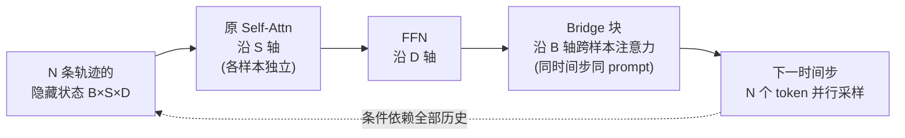

# Generalized Parallel Scaling with Interdependent Generations

**会议**: ICLR 2026  
**OpenReview**: [https://openreview.net/forum?id=suU6kAP6c2](https://openreview.net/forum?id=suU6kAP6c2)  
**代码**: 待确认  
**领域**: LLM 推理 / 测试时扩展  
**关键词**: 并行采样, 测试时扩展, RLVR, 跨样本注意力, 张量视角  

## 一句话总结
本文提出 **Bridge**：把一个 prompt 的 N 条并行采样轨迹看成一个整体 3-D 张量而非独立切片，在每个时间步沿 batch 轴做"跨样本注意力"，让 N 条生成互相交换信息，仅加 2.8%–5.1% 参数就把 RLVR 的相对增益最高提升 39%，且训练一次即可泛化到任意生成宽度。

## 研究背景与动机
- **领域现状**：LLM 推理时扩展有两条主轴——拉长生成长度（长 CoT），以及增加生成条数（best-of-N、多数投票、合成数据）。前者每个 token 都能利用全部历史计算，后者却是各采各的。
- **现有痛点**：并行采样的 N 条响应通常**相互独立**地生成，计算资源被切成 N 份互不相通，一条轨迹里有用的中间信息无法被其它轨迹利用，导致并行扩展的收益远不如长度扩展。
- **核心矛盾**：已有"中途交互"方法（Hogwild! Inference、Group Think、ParScale 等）是把 N 个并行进程的算力**汇聚成一条输出**，适合产出单条答案，却无法同时产出一个高质量的**响应集合**（best-of-N、合成数据等场景需要的正是后者）。
- **本文目标**：找到一种**完全并行**、用 N 个线程同时生成 N 条**相互依赖**的响应、且不需要大量后训练的方法。
- **核心 idea**：**张量视角**——LLM 每层前向的隐藏状态本是 `B×S×D` 的 3-D 张量，注意力沿 `S` 轴、FFN 沿 `D` 轴混合信息，唯独 `B`（batch）轴被刻意保持独立。但并行采样的 batch 是**同源同质**的（都来自同一 prompt），天然适合共享信息。于是只需补一个**沿 batch 轴**的注意力模块，让同一时间步、同一 prompt 的 token 互相 attend 即可。

## 方法详解

### 整体框架
Bridge（Batch Reasoning with Interdependent Generations）在每个 FFN 块后插入一个轻量"Bridge 块"+ 输入归一化层，结构上模仿原有 transformer 块（带残差）。常规自注意力对每个样本 `b` 独立地在 `S×S` 上做注意力；Bridge 块则把张量转置，对每个 token 位置 `s` 独立地在 `B×B` 上做注意力，从而让同一 prompt 的不同生成轨迹在每个时间步交换信息。整套训练分两步：先用 SFT 把新块"热身"，再用 GRPO 做 RLVR。

### 关键设计

**1. 跨样本注意力：把 batch 轴从"独立"变成"可交互"。** 这是全文最核心的一步。设隐藏状态 $X \in \mathbb{R}^{B\times S\times D}$，常规自注意力对每个样本切片 $[X]_{b,\cdot,\cdot}$ 在序列维做 $S\times S$ 的注意力。Bridge 块反过来，对每个 token 位置切片 $[X]_{\cdot,s,\cdot}$ 用独立的投影 $W_{B,Q},W_{B,K},W_{B,V},W_{B,O}$ 计算 $\text{Softmax}(\text{Mask}_B(Q_{B,s}K_{B,s}^\top))V_{B,s}W_{B,O}$，其中注意力矩阵是 $B\times B$。与自注意力相比有三处刻意的差异：用的是**屏蔽跨 prompt 与已完成轨迹**的 mask（而非因果 decoder mask）；**不加位置编码**以保证对样本排列不变；因为不 attend 历史 token，**不维护 KV cache**。这样的设计让信息在同源轨迹间横向流动，却不引入新的内存瓶颈。

**2. Markov 式交互保留并行可采样性。** 共享信息会带来一个隐患：如果当前 token 依赖了同时间步其它轨迹的当前 token，就无法并行采样了。Bridge 把交互限制成**马尔可夫式**——每个时间步只共享"当前已生成 token 的特征"来预测下一步。于是下一 token 分布从独立采样的 $p(o_{b,s+1}\mid q, o_{b,1:s})$ 变为 $p(o_{b,s+1}\mid q, \{o_{b',1:s}\}_{b'=1}^{B})$，但在给定全部历史的条件下，同一时间步不同轨迹的下一 token 仍**条件独立**：$(o_{b_1,s+1}\perp\!\!\!\perp o_{b_2,s+1})\mid\{o_{b',1:s}\}$，因此 N 个 token 依旧可以一次并行采出。这也呼应了图像里的**轴向注意力**（axial attention）——把 batch 张量当作图像，自回归地"生成新列"。

**3. SFT 热身 + RLVR：新参数零初始化，先暖再练。** Bridge 块初始化为零贡献，因此可以直接接 RLVR；但论文发现先做一轮 SFT 热身能让下游更好。热身数据这样造：用原模型对 GSM8K 题目各采 8 条，过滤掉错误轨迹、剔除正确数 ≤1 的题，把同一题的多条**正确**轨迹放进同一 batch，只更新新参数、冻结其余。之后用 GRPO（采 Yu et al. 2025 的 token 级归一化变体）做 RLVR，优势为 $\hat A_i = \frac{r_i-\text{mean}(r)}{\text{std}(r)}$。值得注意的是这里目标函数公式本身没改，但因为 Bridge 让同组样本的 logit 互相耦合，重要性比率 $R_{i,s}(\theta)$ 与 KL 项里都自然带上了**跨样本依赖**，打破了 GRPO"轨迹独立"的假设——一条轨迹的梯度会经 Bridge 块反传到同组其它轨迹，正负优势相互交织。

**4. 宽度无关：训练一次，任意并行宽度都能用。** 因为去掉了位置编码，Bridge 对参与交互的轨迹数 $w$（生成宽度）没有任何限制。模型在某个宽度（如 4）训练后，测试时换成更宽（8）或更窄（极端到 $w=1$ 退化为独立生成）都能直接跑，且 $w>1$ 时一致优于独立采样；$w=1$ 时性能落在 RLVR-only 与 P-Match 之间，说明 Bridge 块**不会损害独立推理**。这一性质使它能与任意后处理聚合（多数投票、best-of-N、合成）自由组合。

## 实验关键数据

### 主实验表格（7 个数学基准 Pass@1，节选）

| Model / 方法 | MATH | AIME24/25 | AMC | Avg | ↑∆ |
|---|---|---|---|---|---|
| DS-Qwen-7B 原模型 | 82.15 | 23.44 / 21.88 | 66.02 | 33.55 | 0.00 |
| RLVR only | 88.15 | 29.06 / 23.85 | 74.30 | 37.75 | 4.20 |
| P-Match（等参 MLP） | 86.80 | 28.85 / 25.73 | 70.47 | 36.68 | 3.13 |
| **Bridge** | 88.15 | **32.19 / 25.41** | **77.65** | **39.40** | **5.85** |
| DS-Qwen-1.5B Bridge | 81.30 | 20.11 / 20.00 | 60.55 | **31.25** | **5.32** |
| DS-Llama-8B Bridge | 80.15 | 24.76 / 18.18 | 66.36 | **32.47** | **5.83** |

Bridge 在三个模型上对原模型的相对提升，比"次优方法"分别再高 **26% / 39% / 34%**；且模型越大收益越大。

### 消融实验表格

| 维度 | 结果 |
|---|---|
| **生成宽度泛化**（DS-Qwen-7B 训练宽度=4） | 测试宽度 2/4/8/16 等 $w>1$ 全面优于 P-Match；$w=1$ 退化为独立生成，性能介于 RLVR-only 与 P-Match 之间（不伤独立推理） |
| **P-Match 对照** | 等参数量的 MLP 也能从纯 RLVR 略升，但极不稳定（DS-Qwen-7B 上反降），证明 Bridge 的增益**不是单纯加参数**带来的 |
| **集合质量 G-Pass@8τ** | 各 τ 下覆盖率与一致性几乎全面领先；DS-Qwen-7B 上"8 条对同一竞赛题全对"的比例从 15.0%→17.8% |
| **非数学任务**（仅在数学上训练） | XSum/CNN-DM 摘要、GPQA、ZebraLogic、Countdown 上无退化、多数有提升，说明能力可迁移 |

### 关键发现
- 仅加 **2.8%–5.1%** 参数即显著放大 RLVR 收益，成本极低。
- 跨样本信息共享同时提升**单条准确率**与**集合覆盖率/一致性**——既更可能出现正确答案，也让正确答案更频繁。
- 宽度鲁棒：训练宽度与测试宽度可不一致，仍稳定增益。

## 亮点与洞察
- **视角转换很优雅**：把"并行采样的 batch"重新理解为同质 3-D 张量，从而合理化"沿 batch 轴注意力"，这是长期被 LayerNorm 取代 BatchNorm 所"避开"的维度，本文恰恰利用了并行采样独有的同源同质性。
- **架构改动驱动目标改变**：GRPO 目标公式没动，但 Bridge 让同组轨迹的 logit/梯度天然耦合，等于"免费"打破了独立轨迹假设——这是很巧妙的"用结构换算法"。
- **即插即用**：聚焦生成阶段，对后处理聚合完全透明，可与多数投票/best-of-N/合成数据无缝结合。

## 局限与展望
- 评测**集中在数学推理**（外加少量非数学任务），更广领域（代码、agent、对话）尚未验证。
- 最大只到 8B 模型，作者也指出**更大模型**的收益放大有待验证。
- 训练用的是 GRPO + 单一正确性奖励，**RLHF / 偏好对齐**只是被列为未来方向。
- 跨样本注意力虽轻，但在极大宽度/超长序列下的实际显存与吞吐开销、与早停剪枝类方法的组合都留待后续工作。

## 相关工作与启发
- **中途交互类**：Hogwild! Inference、Group Think 共享 KV cache 协作；ParScale 从零训练把输入扇出多路再聚合——它们都把算力汇聚成一条输出，本文则坚持"N 进 N 出"的完全并行。
- **后处理合成类**：多数投票、加权投票、把多条响应拼接喂回 LLM 提炼——本文聚焦生成阶段，可与这些方法叠加。
- **高阶张量**：借鉴 CV 里的轴向注意力与张量分解思想，把信息在整个隐藏状态张量里扩散。
- **启发**：当 batch 内样本同源时，"batch 轴独立"这一默认假设值得重新审视；"用极少参数 + 架构改动放大 RL 收益"是一个高性价比的研究范式。

## 评分
- **新颖性**: ⭐⭐⭐⭐⭐ 把并行采样重构成 3-D 张量并沿 batch 轴做注意力，视角新颖且自洽，开辟了"带依赖的并行扩展"这一相对空白的方向。
- **实验充分度**: ⭐⭐⭐⭐ 3 个模型 ×12 基准，含等参 P-Match 对照、宽度泛化、长度外推、集合质量、非数学迁移，较完整；但局限在 ≤8B 与数学主场。
- **写作质量**: ⭐⭐⭐⭐ 动机—张量视角—方法递进清晰，图 1/2 把核心直觉讲透；公式与 mask 细节交代到位。
- **价值**: ⭐⭐⭐⭐ 低成本、可泛化宽度、与后处理正交，对 best-of-N / 合成数据 / RLVR 流水线都有直接实用价值。

<!-- RELATED:START -->

## 相关论文

- [\[ICLR 2026\] Continuous Chain of Thought Enables Parallel Exploration and Reasoning](continuous_chain_of_thought_enables_parallel_exploration_and_reasoning.md)
- [\[ICLR 2026\] Mode-conditioning unlocks superior test-time compute scaling](mode-conditioning_unlocks_superior_test-time_compute_scaling.md)
- [\[ACL 2026\] Parallel Test-Time Scaling for Latent Reasoning Models](../../ACL2026/llm_reasoning/parallel_test-time_scaling_for_latent_reasoning_models.md)
- [\[ICLR 2026\] Think in Parallel, Answer as One: Logit Averaging for Open-Ended Reasoning](think_in_parallel_answer_as_one_logit_averaging_for_open-ended_reasoning.md)
- [\[ICLR 2026\] Optimal Aggregation of LLM and PRM Signals for Efficient Test-Time Scaling](optimal_aggregation_of_llm_and_prm_signals_for_efficient_test-time_scaling.md)

<!-- RELATED:END -->
