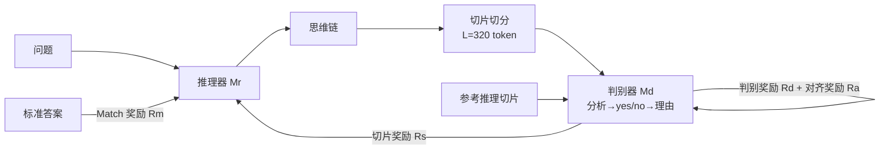

# Generative Adversarial Reasoner: Enhancing LLM Reasoning with Adversarial Reinforcement Learning

**会议**: ICLR 2026  
**OpenReview**: [https://openreview.net/forum?id=ihucMuRXcY](https://openreview.net/forum?id=ihucMuRXcY)  
**代码**: 待确认  
**领域**: LLM 推理 / 强化学习后训练  
**关键词**: 对抗强化学习, 过程奖励, 切片级评判, GRPO, 数学推理  

## 一句话总结
GAR 把一个 LLM 判别器和 LLM 推理器放进一个类 GAN 的在线对抗强化学习框架里联合训练，用"切片级"的稠密过程奖励补足稀疏的最终答案奖励，在多个数学推理基准上稳定提升 DeepSeek-R1-Distill 系列。

## 研究背景与动机
**领域现状**：带显式思维链的 LLM 在数学推理上已接近专家水平，但仍频繁犯过程性错误——算错数、逻辑跳步、看似合理实则无效的推导。为了给中间步骤打分，社区主要靠两条路：过程奖励模型（PRM）和 prompt 出来的 LLM-as-critic。

**现有痛点**：PRM 依赖昂贵的细粒度人工标注，标签主观且容易出现过/欠奖励的标定偏差；而 prompt-based 的 LLM 评判虽然便宜，判断却往往噪声大、前后不一致、区分度低。两条路都有一个共同的结构性问题——**评判器是静态的，会随着策略更新而漂移失配**，无法跟上推理器能力的演化。

**核心矛盾**：要么花大价钱买高质量的固定标注（贵且会过时），要么用便宜但不可靠的固定评判（噪声大）。两者都没法持续地、在线地给出与当前模型行为对齐的过程奖励。

**本文目标**：在不显著增加计算预算的前提下，提供稠密、标定良好、on-policy 的步级奖励，改善信用分配（credit assignment）与样本效率，同时避免奖励黑客（reward hacking）。

**核心 idea**：[对抗联合训练] 保留一个步级评判器（判别器），但让它和推理器通过类 GAN 的对抗 RL **共同进化**——推理器追求被判别器持续认可的逻辑自洽步骤，判别器则不断重新标定到推理器当前的步骤分布，从而让奖励信号始终与模型能力对齐。

## 方法详解

### 整体框架
GAR 由两个 LLM 组成：推理器 $M_r$（生成思维链与最终答案）和判别器 $M_d$（逐切片评估推理质量）。训练分两阶段——先用 SFT 把判别器适配到"分析-评分-理由"的输出格式，再用 GRPO 把推理器和判别器在对抗 RL 下联合优化；推理时只用推理器。

### 关键设计

**1. 计算高效的切片化评判：把长链拆成可核验的短切片**。整条思维链动辄上千 token，判别器对全局打分既慢又不可靠、还难以定位错误。GAR 按分隔符切分推理轨迹，再合并相邻片段直到出现明显的新语义起点或达到预设长度 $L=320$ token，得到长度可比、语义完整的切片。判别器对每个切片 $i$ 给出二元奖励 $r^s_i\in\{0,1\}$（1 表示逻辑自洽），整体过程奖励取均值 $R_s=\frac{1}{n}\sum_{i=1}^{n} r^s_i$。这样做一举两得：短切片更容易判对，且 $R_s$ 是连续值——即便所有最终答案都错，模型也能在 RL 中区分并强化更好的推理路径，缓解奖励稀疏。

**2. 类 GAN 的双奖励对抗联合训练**。推理器用 GRPO 优化，奖励线性组合精确匹配项与判别器过程项：$R_{rea}=\lambda_1 R_m+\lambda_2 R_s$。判别器则最大化两个互补信号：判别奖励沿用标准 GAN 目标 $R_d=\mathbb{E}_{x\sim p_{ref}}[\log M_d(x)]+\mathbb{E}_{x\sim p_{gen}}[\log(1-M_d(x))]$，逼它把模型生成切片和参考切片区分开；对齐奖励 $R_a$ 衡量切片级判断与最终答案正确性之间的平均一致性，基于"正确答案更可能由逻辑自洽的推理支撑"这一假设。判别器总奖励为 $R_{dis}=\lambda_3 R_d+\lambda_4 R_a$。每个 batch 里把生成切片和等量参考切片混成平衡集训练判别器，再用打分回灌推理器，两个模型交替更新——判别器的对抗动力学被内嵌进训练过程，提供 on-policy 的细粒度信用分配。

**3. 分析-评分-理由的截断式判别器，抑制开销与奖励黑客**。直接让判别器对每个切片生成完整思维链会带来几十倍的评审开销。GAR 把判别器工作流改成"先简短分析→给出 yes/no 评分 $r^s_i$→附一句简短理由"，并把最大生成长度限制在 $K=128$ token（理由主要用于可解释性，超出即截断）。实验表明截断到 128 token 几乎不掉点，却大幅加速训练。此外引入一个判别器 SFT 阶段：用 GPT-o4-mini 对 10% 训练数据的切片标注 yes/no 判断与简短理由，按 1:1 平衡正负类后微调判别器，使其适配新格式同时保留原模型能力。对齐奖励还充当正则——防止判别器漂向一味给正面评价、或推理器学出"看似合理实则空洞"的步骤。

## 实验关键数据

### 主实验表格
七个数学基准 Pass@1（每基准 30 次取平均）：

| 模型 | AIME24 | AIME25 | MATH500 | GSM8K | AMC23 | Olympiad | LiveMath-Hard |
|------|--------|--------|---------|-------|-------|----------|---------------|
| DS-R1-Distill-Qwen-7B | 54.0 | 38.0 | 94.3 | 90.6 | 90.3 | 52.5 | 18.4 |
| + GAR | **61.3** (+7.3) | **44.3** (+6.3) | 94.8 | 92.2 | 92.5 | 54.8 | **24.9** (+6.5) |
| DS-R1-Distill-Llama-8B | 43.7 | 30.3 | 88.1 | 82.9 | 84.5 | 48.2 | 18.5 |
| + GAR | **53.7** (+10.0) | 36.2 | 91.3 | 85.2 | 90.0 | 50.9 | 22.4 |

Qwen-7B 用 1.5B 判别器，Llama-8B 因无更小推理变体而用 8B 自身作判别器。

### 消融实验表格
逐组件叠加（基线 DS-R1-Distill-Qwen-7B）：

| 配置 | AIME24 | AIME25 |
|------|--------|--------|
| 1 基线 | 54.0 | 38.0 |
| 2 + 标准 RL（仅精确匹配） | 56.3 | 40.7 |
| 3 + 固定标准 critic | 56.7 | 40.4 |
| 4 + 固定 GAR 判别器（切片级） | 58.6 | 42.0 |
| 5 + 可训练判别器（含对齐奖励） | 59.4 | 42.8 |
| 6 + 可训练判别器（含判别奖励） | 60.2 | 43.3 |
| 7 + 完整 GAR（对齐+判别+联合） | **61.3** | **44.3** |

效率消融：截断版 GAR（19h）逼近无截断版（43h）的精度（61.3 vs 60.8），远快于后者；标准 RL 16h 仅 56.3。

### 关键发现
- **切片级评判是涨点主力**：从行 2→4 可见，把评判器从"整体打分"重构为"切片级自洽判断+简短理由"带来稳定增益，证明稠密过程奖励改善了信用分配。
- **两路判别器奖励互补**：对齐奖励和判别奖励单独都有效，组合最佳——前者锐化对错区分但依赖最终答案正确性而有噪声，后者把判别器拉向参考判断以稳定训练。
- **联合训练抬高天花板**：行 4（固定判别器）→行 7（在线联合）的增益说明，判别器随推理器变强而学会检测更微妙的错误。
- **无熵坍缩的选择性熵机制**：精度涨 +7.3 的同时整体平均熵几乎不变（5.20% vs 5.27%），在确定性切片上压低熵、在决策关键切片上保留探索。
- **可去掉最终答案奖励**：仅用判别器对前 3 个切片打分（无 final-answer 奖励）即可达到 57.7 且训练仅 6h（标准 RL 56.3/16h），解锁开放式证明等无可验证答案的任务。

## 亮点与洞察
- **把"奖励模型漂移"问题转成了特性**：传统做法怕评判器跟不上策略，GAR 直接让评判器和策略对抗共进化，漂移变成了"自动课程"——推理器越强，判别器越会挑刺。
- **切片是连接"长链可读性"和"稠密奖励"的巧妙粒度**：既不像 token 级那么碎、噪声大，也不像整链那样信号稀疏，$L=320$ 的长度阈值兼顾语义完整与评判可靠。
- **128 token 截断的工程洞察很实用**：理由对训练信号几乎无贡献（只用于可解释性），截掉它换来 2 倍多的加速，是个高性价比的设计选择。
- **模块化判别器带来的延展性**：判别器可换成 teacher 蒸馏、偏好对齐、证明式推理的奖励塑形器，框架的应用面比"提升数学推理"本身更宽。

## 局限与展望
- **判别器 SFT 依赖 GPT-o4-mini 标注**：冷启动的格式适配仍需要一个强外部模型生成 yes/no 标签，未完全摆脱对高质量监督的依赖。
- **对齐奖励的噪声来源**：$R_a$ 依赖该轨迹最终答案的正确性，当最终答案碰巧对但过程错（或反之）时会给出误导信号，论文靠判别奖励来缓解但未根治。
- **实验集中在数学领域**：虽然提到代码生成（附录）和证明式推理的潜力，正文主体仍是数学基准，跨领域泛化的充分性有待更多验证。
- **切片切分的启发式**：基于分隔符+长度阈值的切分是规则式的，对不同书写风格的鲁棒性、以及"语义起点"判定的稳定性值得进一步研究。

## 相关工作与启发
- **过程监督 / PRM**：相比 Lightman et al. 的人工 PRM 和 Math-Shepherd 的 MC 自动标注，GAR 用在线联合训练替代静态标注，规避了标注成本与漂移失配。
- **自博弈 / 多智能体 / 博弈论训练**：与 SPIN、SPAG、辩论式训练等"外部对手"路线不同，GAR 把对抗动力学内嵌进单条训练管线，由判别器与策略共进化提供 on-policy 信用分配。
- **GAN 思想迁移到 RL 后训练**：把 Goodfellow et al. 的判别器目标搬到推理切片的真/伪区分上，是"生成对抗"范式在 LLM reasoning 上的一次直接而有效的具体化。
- **启发**：在任何"奖励模型 vs 策略漂移"的后训练场景里，让奖励模型在线对抗共进化，可能比反复重训固定 RM 更经济也更稳。

## 评分
- **新颖性**: ⭐⭐⭐⭐ 把 GAN 式对抗联合训练落到切片级过程奖励上，思路清晰且把"评判器漂移"转为优势，组合新颖。
- **实验充分度**: ⭐⭐⭐⭐ 两个 backbone、七个基准、30 次取平均、组件/效率/熵多角度消融扎实；但主要局限在数学域，跨任务证据偏薄。
- **写作质量**: ⭐⭐⭐⭐ 动机-挑战-方法对应清楚，图表与消融逻辑链完整，易读。
- **价值**: ⭐⭐⭐⭐ 在强基线上稳定涨点且训练开销可比，模块化判别器延展性强，对 RL 后训练社区有实际参考价值。

<!-- RELATED:START -->

## 相关论文

- [\[ICLR 2026\] Temperature as a Meta-Policy: Adaptive Temperature in LLM Reinforcement Learning](temperature_as_a_meta-policy_adaptive_temperature_in_llm_reinforcement_learning.md)
- [\[ICLR 2026\] NFT: Bridging Supervised Learning and Reinforcement Learning in Math Reasoning](nft_bridging_supervised_learning_and_reinforcement_learning_in_math_reasoning.md)
- [\[ICLR 2026\] Process-Verified Reinforcement Learning for Theorem Proving via Lean](process-verified_reinforcement_learning_for_theorem_proving_via_lean.md)
- [\[ICLR 2026\] Stabilizing Policy Gradients for Sample-Efficient Reinforcement Learning in LLM Reasoning](stabilizing_policy_gradients_for_sample-efficient_reinforcement_learning_in_llm_.md)
- [\[ICLR 2026\] Learning What Reinforcement Learning Can't: Interleaved Online Fine-Tuning for Hardest Questions](learning_what_reinforcement_learning_cant_interleaved_online_fine-tuning_for_har.md)

<!-- RELATED:END -->
