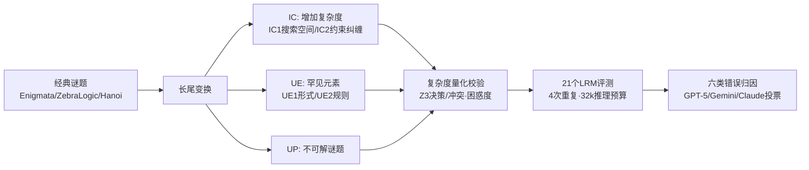

# HardcoreLogic: Challenging Large Reasoning Models with Long-tail Logic Puzzle Games

**会议**: ICLR 2026  
**OpenReview**: [https://openreview.net/forum?id=8USxc43D3I](https://openreview.net/forum?id=8USxc43D3I)  
**代码**: [https://github.com/ljcleo/hardcore-logic](https://github.com/ljcleo/hardcore-logic)  
**领域**: LLM 推理 / 逻辑推理评测基准  
**关键词**: 大推理模型, 逻辑谜题, 长尾变体, 推理鲁棒性, 记忆捷径, 不可解谜题  

## 一句话总结
HardcoreLogic 通过"增加复杂度 / 引入罕见元素 / 制造不可解"三类长尾变换，把 10 种逻辑谜题的非典型版本做成 5000+ 道题的基准，揭示出连 GPT-5 这样的顶尖大推理模型也严重依赖对经典题型的记忆套路，遇到变体便大幅掉分。

## 研究背景与动机
**领域现状**：逻辑谜题游戏（数独、斑马逻辑等）因规则明确、难度可控、评判客观，已成为衡量大推理模型（LRM）推理能力的主流测试床，Enigmata、ZebraLogic 等基准上 SOTA 模型屡屡刷出高分。

**现有痛点**：这些语料几乎只覆盖经典题型（如标准 9×9 数独），典型与非典型谜题严重失衡。模型很可能是在"记忆"经典格式的解题模式，而非真正理解规则。高分因此可能掩盖了两类缺陷：一是只认识谜题的经典形态，遇到变体规则就读不懂或直接忽略；二是养成了固定的解题策略，即便看懂了变体，也会套用不匹配的旧策略而出错。

**核心矛盾**：真正的逻辑推理要求"把恰当的规则灵活地用到当下条件上"，但现有基准无法区分"会推理"和"背过模板"——长尾分布上的非典型变体恰恰是检验这种灵活性的盲区。

**本文目标**：构造一个系统性偏离经典题型的基准，逼模型离开记忆舒适区，从而精确暴露 LRM 在新规则理解与策略适配上的真实短板。

**核心 idea**：**长尾变换（long-tail transformation）**——不发明新游戏，而是对常见谜题沿三个维度做系统化扰动（提高复杂度、替换罕见元素、制造不可解），让题目大概率没在训练语料里出现过，从而剥离"记忆增益"，只留下"推理增益"。

## 方法详解

### 整体框架
HardcoreLogic 的构造是一条"经典题 → 三维变换 → 复杂度量化校验 → 多模型评测 → 错误归因"的流水线。基础题来自 Enigmata（8 个子任务）、ZebraLogic（斑马逻辑）和作者自合成的汉诺塔，覆盖 6 大类共 10 种谜题（Zebralogic、Sudoku、Skyscraper、Kakurasu、Crypto、Navigation、Binario、Minesweeper、Hanoi、Hitori）。每种谜题被施加一到多种长尾变换，最终得到 5250 道题，并用符号求解器（Z3 / Dijkstra）和困惑度量化证明这些变体确实更难，再在 21 个开闭源 LRM 上评测、做六类错误归因。

### 关键设计

**1. 三维长尾变换分类法：把"变难"拆成可控的五种手术。** 作者把所有变换归为三个家族五种类型。**增加复杂度（IC）**走两条路：搜索空间扩张（IC1）通过减少初始给定或放大棋盘来膨胀候选状态——例如 Binario 中在保证唯一解前提下尽量挖空，$N$ 个空格直接对应 $|S|=2^N$ 的搜索空间；约束强化（IC2）则加密约束之间的纠缠以拉长推理链，例如斑马逻辑里把"宠物狗 = 运动足球 + 1"这种精确等式换成"宠物狗 > 运动足球"的松弛不等式，迫使模型展开更长的分支。**罕见元素（UE）**改的是表面而非难度：形式变体（UE1）换符号或棋盘形态，如数独用字母替换数字、把规整 3×3 宫改成不规则宫；规则变体（UE2）则改写或杂交底层规则，如给数独加上两条主对角线也必须各不相同的约束。**不可解谜题（UP）**故意构造无解题，专门检验模型能否识别"信息矛盾或不足"，而不是幻觉出一个貌似合理却错误的答案——这填补了主流基准几乎没有不可解任务的空白。

**2. 用符号求解器与困惑度把"更难"量化坐实。** 变体不能只是声称更难，作者为每个维度配了客观度量。对 CSP 类谜题（斑马逻辑、Binario 等），把实例编码进 Z3 SMT 求解器，统计**决策数**（显式分支步）和**冲突数**（回溯矛盾事件），数值越大说明约束交互越强、搜索越难；对图类谜题（Navigation）则用 Dijkstra 记录**生成节点**与**扩展节点**数。这套统计能直接证明 IC2 和 UE2 变体的求解器开销系统性高于原版。而 UE1 这种"换形式但不改逻辑难度"的扰动，符号求解器看不出区别，作者改用**困惑度**——预训练 LRM 赋予实例的逆概率——来度量"这道题看起来有多反常"，困惑度越高代表表征理解负担越重。一个有意思的反例是扫雷的"地雷簇"规则：加簇线索反而缩小了搜索空间、降低了决策数，但模型反而更差，因为它们得持续追踪簇的连通性而非简单计数，超出了模式匹配能力。

**3. 严格的评测协议与六类错误归因。** 评测覆盖 21 个从蒸馏小模型到 GPT-5 的 LRM，统一限定 32768 token 推理预算：先让模型完成推理段，再引导它按预定义 JSON schema 输出最终答案，唯有"在预算内完成推理且答案正确"才算对，每题重复 4 次、温度 0.6。为了超越单纯的准确率，作者对错误响应做系统归因，定义六类失败模式——谜题误解、解法框架误用、过度暴力枚举、事实性错误、过度验证、无限重复。每种代表性模型抽 50 个错例，用 GPT-5、Gemini-2.5-Pro、Claude-Sonnet-4.5 三个标注器投票定标签，三者全不一致时人工裁决，从而刻画出不同模型"怎么错"而非仅"错多少"。此外作者还用加权多元线性回归拟合各变换对准确率的边际影响，定量比较 IC1/IC2/UE1/UE2 谁更致命。

## 实验关键数据

### 主实验

| 维度 | 关键结果 |
|------|----------|
| 规模 | 10 种谜题、6 大类、**5250 道题**（原版 1389 道作对照） |
| 最强模型 | 开源 gpt-oss-120b 双榜最高；闭源 GPT-5 最佳；Minimax-M1 全场最差 |
| 最大跌幅 | Kimi-K2-Instruct 从 Original 到 HardcoreLogic 掉分最严重 |
| 普遍现象 | 包括 GPT-5 在内的所有 SOTA 模型在 HardcoreLogic 上都显著掉分 |
| 评测模型数 | 21 个开闭源 LRM，每题重复 4 次，32768 token 推理预算 |

### 变换影响（加权回归系数，越负越致命）

| 变换 | 现象 |
|------|------|
| IC1（搜索空间扩张） | 综合影响最大，直接考验记忆与推理容量（Binario 上系数低至 −74） |
| UE1（形式变体） | 数独上系数最高，模型难以识别不规则宫格 |
| UE2（规则变体） | 扫雷"地雷簇"规则冲击显著，即便强模型也掉分 |
| IC2（约束强化） | Skyscraper 等谜题上推理链显著拉长 |

### 关键发现
- **记忆套路是普遍病灶**：有大参数模型在原版上分数中等，却在 HardcoreLogic 上表现极差，暴露其分数来自题型刻板印象而非真推理；推理能力越强的模型相对跌幅越小。
- **错误模式分化**：事实性错误最普遍（推理中编造缺失步骤填空）；强模型（gpt-oss-120b、Qwen3-235B）更易陷入暴力枚举（28% 错误为 Brute-Force），生成能力反而诱导低效穷举；Kimi-K2 的误解+误用错误占近 50%，与其最大跌幅吻合。
- **不可解题暴露真伪推理**：在可解题上表现好的模型确实更能真正识别不可解；而 Minimax-M1 这类弱模型常常只是"找不到答案"就输出 unsolvable，并非真正识别逻辑不可满足。
- **复杂度抑制"花言巧语"**：HardcoreLogic 下 Over-Verification 错误反而减少——题目越复杂，模型越难编出连贯却错误的解释，转而在更早处就因误解或规则误用而崩。

## 亮点与洞察
- **"不发明新游戏，只做长尾变换"的设计很聪明**：保留经典规则的可评判性与难度可控性，又通过系统扰动剥离记忆增益，干净地把"会推理"和"会背模板"分离开。
- **变体难度被量化坐实**：用 Z3 决策/冲突、Dijkstra 节点数、LRM 困惑度多管齐下，证明"更难"不是主观声称，而 UE1 用困惑度补足符号求解器盲区是巧思。
- **不可解谜题（UP）是被忽视的金矿**：能区分"真识别无解"与"放弃式假宣称无解"，这是绝大多数推理基准缺失的诊断维度。
- **错误归因落到机制层面**：六类失败模式 + 三模型投票，把"掉分"翻译成"误解规则 / 暴力枚举 / 编造事实"等可操作的优化方向，而非停在准确率数字。
- **附带可扩展的数据构造协议**：自动化的长尾变换流水线本身可用于生成模型训练数据与 RL 环境。

## 局限与展望
- **闭源模型采样受限**：因预算限制，闭源模型仅抽 600 个案例评测，per-game 分析主要靠开源模型，闭源结论的统计强度偏弱。
- **变换维度仍有限**：当前五种变换聚焦逻辑谜题这一狭窄域，能否推广到数学证明、代码、规划等其他推理形态尚未验证。
- **困惑度度量依赖具体 LRM**：UE1 的"表征难度"用某个预训练模型的困惑度衡量，换模型可能给出不同排序，绝对可比性有限。
- **未给出改进方案**：论文止于诊断与归因，"如何让模型对长尾变体鲁棒"（结构化提示、符号求解器集成、事实性惩罚微调等）仅作展望，缺乏实证。
- **不可解判定的标注成本**：UP 题的"真识别 vs 假宣称"区分依赖人工与多模型裁决，规模化时成本与一致性是隐忧。

## 相关工作与启发
- **逻辑推理基准**：相比 Enigmata、ZebraLogic 等聚焦经典题型的工作，本文的贡献是系统性地把"长尾非典型变体"作为一等公民，专门攻击记忆捷径。
- **记忆 vs 泛化**：呼应"模型在标准格式上过拟合"的观察（Inger et al. 2025），用可控变换把过拟合显式量化为掉分幅度。
- **对评测设计的启发**：任何号称测"推理"的基准都该自问——高分是来自推理还是记忆？引入同源变体（保规则改形式/加约束/制造无解）是低成本的鉴别手段。
- **对模型训练的启发**：强模型的暴力枚举倾向提示，单纯堆生成能力不等于会推理，把 LRM 与符号/约束求解器结合、训练模型先识别题型再选策略，可能比单纯 scale 更有效。

## 评分
- **新颖性**: ⭐⭐⭐⭐ 长尾变换的视角和"保经典规则、只系统扰动"的构造方式新颖，UP 不可解维度与困惑度补足符号盲区都是亮点；但底层仍是"造更难基准"的成熟范式。
- **实验充分度**: ⭐⭐⭐⭐ 21 个模型、5250 道题、四次重复、符号求解器量化校验、六类错误三模型投票归因，证据链相当完整；闭源仅 600 例采样略有遗憾。
- **写作质量**: ⭐⭐⭐⭐ 三维分类法清晰，量化校验与错误归因层层递进，图表丰富；部分变换细节散落附录，主文需对照才完整。
- **价值**: ⭐⭐⭐⭐ 戳破了 LRM 逻辑推理高分的记忆水分，提供可诊断失败机制的基准与可扩展数据构造协议，对推理模型评测与训练都有实际指导意义。

<!-- RELATED:START -->

## 相关论文

- [\[ICLR 2026\] InftyThink: Breaking the Length Limits of Long-Context Reasoning in Large Language Models](inftythink_breaking_the_length_limits_of_long-context_reasoning_in_large_languag.md)
- [\[ICLR 2026\] Pruning Long Chain-of-Thought of Large Reasoning Models via Small-Scale Preference Optimization](pruning_long_chain-of-thought_of_large_reasoning_models_via_small-scale_preferen.md)
- [\[ICLR 2026\] DeepMath-103K: A Large-Scale, Challenging, Decontaminated, and Verifiable Mathematical Dataset for Advancing Reasoning](deepmath-103k_a_large-scale_challenging_decontaminated_and_verifiable_mathematic.md)
- [\[ICLR 2026\] Towards Safe Reasoning in Large Reasoning Models via Corrective Intervention](towards_safe_reasoning_in_large_reasoning_models_via_corrective_intervention.md)
- [\[ICLR 2026\] A Balanced Neuro-Symbolic Approach for Commonsense Abductive Logic](a_balanced_neuro-symbolic_approach_for_commonsense_abductive_logic.md)

<!-- RELATED:END -->
