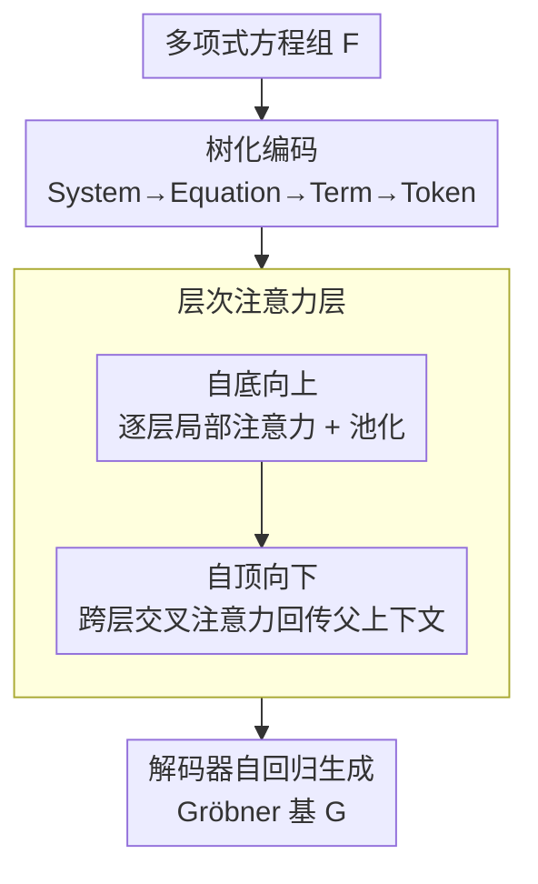

# HATSolver: Learning Gröbner Bases with Hierarchical Attention Transformers

**会议**: ICLR 2026  
**OpenReview**: [https://openreview.net/forum?id=5C3LljOEGC](https://openreview.net/forum?id=5C3LljOEGC)  
**代码**: 待确认  
**领域**: 神经符号数学 / Transformer 架构 / LLM推理  
**关键词**: Gröbner 基, 层次注意力, 多项式方程组求解, 课程学习, 计算代数

## 一句话总结
把 Transformer 编码器里最贵的 flat 自注意力换成「自底向上局部注意力 + 自顶向下跨层注意力」的层次注意力，利用多项式方程组天然的树状结构把注意力的 $O(L^2)$ 序列代价压成接近 $O(L^{1+1/n})$，从而把「用神经网络预测 Gröbner 基」的规模从此前的 5 变量推到 13 变量、稠密度 100%，并在难实例上反超经典符号计算工具 STD-FGLM 和 Msolve。

## 研究背景与动机

**领域现状**：求解多元非线性方程组（PoSSo 问题）是密码学、编码理论、计算机视觉等领域的底层算子，而 **Gröbner 基**是求解它的主力工具——它给出多项式理想的一组规范生成元，能把方程组化成可逐变量回代的三角形（shape position）结构。经典算法 Buchberger、F4/F5 已被 Maple、Magma、Msolve 等系统采用，但 Gröbner 基计算最坏情况是双指数复杂度，实践中仍然极慢。NeurIPS'24 的 Kera et al. 开了个新口子：把它重写成**监督学习**任务，用「随机方程组 $F$ → 其 Gröbner 基 $G$」的配对去训练一个 seq2seq Transformer，并解决了如何反向生成这类训练对的「backward Gröbner problem」。

**现有痛点**：Kera et al. (2024) 的方法卡在**规模**上——只能处理 $n\le 5$ 个变量，而且对 $n=3,4,5$ 还必须把多项式做得非常稀疏（密度 $\rho\ll 1$）才能跑。原因很直接：标准 Transformer 的注意力对序列长度是平方的内存/计算代价，而一个多项式方程组按 token 展开后序列爆炸——$n=5$、总次数 $d\le 10$ 时单项式就有 $\binom{d+n}{d}=3003$ 个，$n+2$ 个方程能轻松超过 14 万个 token，根本喂不进去。

**核心矛盾**：方程组是高度**结构化**的（系统→方程→单项式→符号，是一棵树），但 flat 注意力把它拍平成一维序列，让每个 token 无差别地 attend 到所有其它 token，既浪费算力又丢掉了层次先验。代价的平方项 $2L^2 d$ 就是这么来的。

**本文目标**：在不牺牲精度的前提下，把注意力代价从平方降下来，使模型能处理更多变量、更高密度的方程组。

**切入角度**：既然数据本身就是树，就让注意力也顺着树走——一个 token 主要 attend 它的兄弟（同父节点），跨层信息通过父节点间接传递。这正是文档分类里 Hierarchical Attention Network 的思路，作者把它迁移并改造到计算代数。

**核心 idea**：用**层次注意力层**替换 Transformer 编码器中的多头注意力，分「自底向上局部聚合」和「自顶向下上下文回传」两个阶段，再配合**课程学习**逐步加大难度，把神经 Gröbner 求解推到 13 变量。

## 方法详解

### 整体框架

HATSolver 整体仍是一个 encoder-decoder Transformer：编码器读入一个非 Gröbner 的多项式方程组 $F$，解码器自回归生成它对应的 reduced Gröbner 基 $G$（两者生成同一理想 $\langle F\rangle=\langle G\rangle$）。关键改动只在**编码器的注意力层**：把标准 flat 多头注意力换成层次注意力层。流程是先把方程组**树化编码**成「系统→方程→单项式→符号」的多层张量，再让层次注意力分两相走完——**自底向上**在每一层做局部注意力并池化到上一层，**自顶向下**用跨层交叉注意力把父节点的全局上下文回传给叶子节点；最后解码器照常生成 $G$。训练侧叠加**课程学习**，从小而简单的方程组逐步过渡到 13 变量的难实例。

### 关键设计

**1. 把多项式方程组编码成树：让结构先验进入 tokenization**

层次注意力之所以能省，前提是数据真的有层次。作者沿用 Kera et al. (2024) 的 tokenization：在有限域 $k=\mathbb{F}_q$（实验取 $q=7$）上，词表由系数 token $\{C_1,\dots,C_{q-1}\}$、幂次 token $\{E_0,\dots,E_d\}$ 和结构 token $\{\texttt{<bos>}, +, \texttt{<sep>}\}$ 组成。一个项 $a_u x_1^{u_1}\cdots x_n^{u_n}$ 编码成 $C_{a_u}E_{u_1}\cdots E_{u_n}$（含零次幂），项之间用 $+$ 连接，方程之间用 $\texttt{<sep>}$。这样得到的序列天然是四层树：**系统**包含若干**方程**，每个方程包含若干**项**，每个项包含 $n+2$ 个**符号 token**。比如 $p_1=x_0^2x_1^2+5x_0^2x_1,\ p_2=3x_0^3+2x_1$ 就被解析成两条方程、每条两项的树。位置编码也相应改造：给每个轴 $j$ 配一张可学习嵌入表 $E^{(j)}$，token $(i_{n-1},\dots,i_0)$ 的位置嵌入是各轴嵌入之和 $\mathrm{PE}=\sum_j E^{(j)}_{i_j}$，用参数高效的方式捕捉多轴的层次位置依赖。这一步是后面所有省算力的来源——它把「谁和谁是兄弟、谁是谁的父亲」显式写进了张量形状 $(\ell_{n-1},\dots,\ell_0,d)$。

**2. 层次注意力层：自底向上局部聚合 + 自顶向下上下文回传**

这是全文核心，要解决的就是 flat 注意力 $O(L^2)$ 的痛点。**自底向上相**：从叶子层（$\ell=0$，符号 token）开始，只在每个父节点内部做局部自注意力 $Y^{(0)}=\mathrm{Att}(X^{(0)}W_q^{(0)},X^{(0)}W_k^{(0)},X^{(0)}W_v^{(0)})$，然后用池化 $p(\cdot)$（如 mean pooling 或取首子节点）把每组子节点压成一个父节点表示 $X^{(i)}=p(Y^{(i-1)})$，逐层往上直到系统层。**自顶向下相**：信息再从顶往下回传，节点用跨层交叉注意力从「父节点 + 上层兄弟」里抽取全局上下文来精修自己的表示：

$$Z^{(i)}=Y^{(i)}+\mathrm{Att}\big(Y^{(i)},\,Z^{(i+1)}U_k^{(i)},\,Z^{(i+1)}U_v^{(i)}\big)$$

其中 query 是本层节点 $Y^{(i)}$，key/value 来自上一层已精修的 $Z^{(i+1)}$。和 Hi-Transformer 那种「把全局 token 拼接到局部序列再过 Transformer」不同，作者用**交叉注意力**把上下文重新分发下去，更精细。这样每个 token 仍能间接获得全局信息，但注意力的序列长度被限制在「同父兄弟」这个小范围内，平方项被打散。

**3. 任意深度泛化 + 代价分析：用层数和维度分配把代价压到 $L^{1+1/n}$**

作者把层次注意力推广到任意深度 $n$ 层，并给出完整代价分析。记 $L_i=\prod_{k\ge i}\ell_k$、$L=L_0$ 为展平后总长度，每层各级嵌入维 $(d_0,\dots,d_{n-1})$ 可以各异（越往上需要编码越多信息、但计算量越小，故常取递增序列）。总复杂度为

$$C=3L_0 d_{-1}d_0+\sum_{i=1}^{n-1}5L_i d_{i-1}d_i+\sum_{i=0}^{n-1}2L_i d_i(\ell_i+\ell_{i+1})$$

对比 flat 注意力的 $3Ld^2+2L^2 d$：当序列长度远大于嵌入维 $d$（正是放大输入时的情形），主导项从 $L^2 d$ 降到 $(\ell_0+\ell_1)Ld$；对一棵规则的 $\ell$-叉树（$\ell=L^{1/n}$），代价只有 $L^{1+1/n}d$——这就是规模能从 5 变量推到 13 变量的根因。通过选择 $(d_i)_i$，还能控制算力是被投影主导还是被注意力主导，以及把算力更多分到树的底层还是顶层。论文实例化出两个深度：HATSolver-2（2 层：符号 token → 全部项）和 HATSolver-3（3 层：token → 项 → 多项式集合）。HATSolver-3 虽然要 padding（强制所有多项式等长，$n=6,\rho=0.33$ 时项数从 12 到 238 不等、平均 63，padding 几乎让训练 token 翻倍），但仍比基线更快。

**4. 课程学习：从易到难逐步加大方程组规模与密度**

层次注意力给了「能装下 13 变量」的表征容量，但直接在最难分布上训会学不动——论文明确指出，同样的训练实验若用基线模型「完全学不出任何有意义的解」。课程学习是补足的训练策略：用难度和规模递增的数据集分阶段训练（schedule 用 $\sigma=2,\ v=\tfrac12$），让模型先在简单实例上建立基本能力再爬坡到 13 变量稠密系统。它的增益是实打实的：$n=13,\rho=0.9$ 上，去掉课程学习只能到 33.85%，加上课程学习冲到 61.2%。作者也诚实指出，这部分增益可能还混入了「课程模型见到的数据量更大」的因素。

### 一个完整示例

以 $p_1=x_0^2x_1^2+5x_0^2x_1,\ p_2=3x_0^3+2x_1$（$k=\mathbb{F}_7$，HATSolver-3）走一遍：tokenization 先得到 `<bos> C1 E2 E2 + C5 E2 E1 <sep> C3 E3 E0 + C2 E1 E0`，解析成 2 条方程、各 2 项、每项若干符号的三层树。自底向上时，level 0 在每个项内部对符号 token 做局部注意力并池化出「项向量」，level 1 在每条方程内部对项做注意力并池化出「方程向量」，level 2 在方程集合上做注意力得到「系统向量」。自顶向下时，系统层的全局上下文经跨层交叉注意力回传到方程层、再到项层，使每个 token 都带上「自己处在整个方程组的什么位置」的信息。最后解码器据此自回归吐出该理想的 reduced Gröbner 基（shape position 三角形式）。

## 实验关键数据

### 主实验

核心对比在 $n=13$ 变量、$\mathbb{F}_7$ 上，跨不同密度比较 HATSolver-3（含课程学习）与经典符号计算工具 STD-FGLM、Msolve。Success 指 exact match（生成的 Gröbner 基逐项完全正确的测试样本比例），经典算法以 2 小时为超时上限。

| 密度 | 指标 | HATSolver-3 | STD-FGLM | Msolve |
|------|------|------|----------|--------|
| 30% | Success / 运行时(s) | **52.5** / 224 | 33.5 / 652 | 32.8 / 787 |
| 70% | Success / 运行时(s) | **55.2** / 280 | 8.2 / 1068 | 7.1 / 1010 |
| 90% | Success / 运行时(s) | **61.2** / 292 | 6.1 / 1012 | 4.5 / 1232 |
| 100% | Success / 运行时(s) | **60.8** / 300 | 6.5 / 1129 | — |

模型在 90% 密度达到峰值 61.2%（Support Acc. 即只看单项式支撑集时高达 94%，Per-Token Acc. 约 99.8%），而经典算法在高密度下大面积超时（满密度超时率高达 93.5%），且运行时是模型的 3–5 倍。注意模型的运行时只是推理时间，训练是一次性离线完成的。

另外在 $n=6,\rho=0.33$ 的训练动态对比（8×V100、52 小时、100 万样本）中，HATSolver-2/-3 都比 Kera et al. (2024) 基线收敛更快、精度更高：相同时间内 HATSolver-2 跑了约 45 万步，基线不到 30 万步。把课程学习单独套到 Kera 的基线模型上，也能让它在 $n=7$ 满密度上求解，超过原文「最大 $n=5$、$\rho=0.2$」的纪录。

### 消融实验

为把「层次架构」和「课程学习」两份贡献拆开，在 $n=13$、$\rho_{\text{train}}=0.9$ 上训练一个**不用课程学习**的 HATSolver-3，跨测试密度评估（exact match）。

| 配置 | $\rho=0.4$ | $\rho=0.9$（训练密度） | 说明 |
|------|-----------|-----------|------|
| HATSolver-3 + 课程学习 | — | **61.2** | 完整方法 |
| HATSolver-3 无课程学习 | 14.72 | 33.85 | 仅靠层次架构 |
| 基线模型同设置 | — | 学不出 | 完全失败 |

### 关键发现
- **层次架构本身就够撑起 13 变量**：即便没有课程学习，HATSolver-3 在各测试密度上也有 14–34% 的准确率，说明层次注意力提供了捕捉多项式结构的表征容量；而同设置下基线模型直接学不出任何有意义的解——这是「能不能做」的分水岭。
- **课程学习是互补的强增益**：$\rho=0.9$ 上从 33.85% 跳到 61.2%，近乎翻倍；但作者诚实标注这部分可能也包含「课程模型见的数据更多」的混杂因素。
- **难度并非由密度单调决定**：exact match 随密度无简单单调趋势，峰值出现在 90% 而非最稀疏处，说明各稀疏度下都存在难实例。无课程模型则在偏离训练密度（尤其低密度 $\rho\le 0.4$）时明显退化，反映出分布外泛化的局限。
- **换一种数据生成也成立**：用 Kera et al. (2025) 的随机矩阵 backward 生成（原为 Border basis 设计，这里顺带验证可用于 Gröbner 基），在 $n=5$、跨 $\mathbb{F}_7/\mathbb{F}_{16}/\mathbb{F}_{17}$ 三个域上表现接近，低密度 43–52%、满密度 22–33%。

## 亮点与洞察
- **把数据的树结构同时写进 tokenization 和注意力**：很多「高效注意力」是纯算法层面的近似，这篇是先认清「多项式系统=树」这一领域结构，再让注意力顺着树走，省算力和保精度同时拿到——这是结构先验驱动的高效化范例。
- **代价分析给出可调旋钮**：$L^{1+1/n}$ 的复杂度配上「通过选 $(d_i)$ 控制算力分布在树的上层还是下层」的分析，让架构不是黑箱省算力，而是可以按问题特性配置，这套分析可迁移到任何天然有层次的序列数据。
- **神经网络在难实例上反超符号算法**：在高密度 13 变量上经典工具大面积 2 小时超时，模型几百秒给出正确基——虽然是离线训练换在线推理，但「学一个分布上的求解器」这条路在计算代数里被证明可行，对密码学等依赖方程组难度的领域有现实意味。
- **自顶向下用交叉注意力而非拼接**：相比 Hi-Transformer 把全局 token 拼到局部序列，用 cross-attention 回传上下文更精细，也是相对既有层次 Transformer 的明确结构改进（外加支持任意深度，而非固定两层）。

## 局限与展望
- **仍是受限设定**：只处理 0 维 radical 理想且 Gröbner 基处于 shape position 的情形，沿用了 Kera et al. 的限制；更一般的理想/排序尚未覆盖。
- **依赖反向数据生成**：训练对来自 backward generation，分布是人造的；Kera et al. (2025) 的随机矩阵法还是概率性的，正确性依赖域大小，小域上可能失效。
- **分布外泛化弱**：无课程模型一旦偏离训练密度就明显掉点，说明模型学到的更像「训练分布上的求解器」而非通用算法；exact match 在满密度仍只有约 60%，离「可靠求解」尚远。
- **推理未优化、精度天花板**：运行时未做 KV cache、推理引擎等优化；且作为黑箱预测器没有正确性保证，实用前需要验证输出确实是 Gröbner 基（验证本身可由经典算法快速完成）。

## 相关工作与启发
- **vs Kera et al. (2024)**：同样把 Gröbner 基计算当 seq2seq 监督学习，但对方用 flat 注意力、受平方代价拖累只能到 $n\le 5$ 且需大幅稀疏化；本文换成层次注意力把代价降到近线性，推到 $n=13$、满密度，并在难实例上反超经典工具。
- **vs Hi-Transformer / HAN 等层次 Transformer**：HAN、Hi-Transformer 等面向长文档（句子→词的两层结构），本文借用其层次思想但做了两点改造——用自顶向下**交叉注意力**取代「拼接全局 token」，并支持**任意树深**而非固定两层，以适配多元多项式这种可深可浅的代数结构。
- **vs 经典符号算法（F4/F5、STD-FGLM、Msolve）**：经典算法有正确性保证但最坏双指数、高密度大面积超时；本文是数据驱动的近似求解器，牺牲保证换速度与高密度成功率，二者互补（神经预测 + 经典验证是自然的组合）。

## 评分
- 新颖性: ⭐⭐⭐⭐ 把层次注意力迁移并改造到计算代数，结构先验用得巧，但底层 HAN 思想已有。
- 实验充分度: ⭐⭐⭐⭐ 覆盖多变量、多密度、多有限域，且单独消融了架构与课程学习两份贡献；但缺更一般理想/排序的验证。
- 写作质量: ⭐⭐⭐⭐ 动机—架构—代价分析—实验链条清晰，代价推导完整。
- 价值: ⭐⭐⭐⭐ 把神经 Gröbner 求解推到实用尺度并反超经典工具，对计算代数与密码学有现实意义。

<!-- RELATED:START -->

## 相关论文

- [\[ICLR 2026\] Emergent Hierarchical Reasoning in LLMs through Reinforcement Learning](emergent_hierarchical_reasoning_in_llms_through_reinforcement_learning.md)
- [\[ICLR 2026\] FROST: Filtering Reasoning Outliers with Attention for Efficient Reasoning](frost_filtering_reasoning_outliers_with_attention_for_efficient_reasoning.md)
- [\[ICLR 2026\] Echoes as Anchors: Probabilistic Costs and Attention Refocusing in LLM Reasoning](echoes_as_anchors_probabilistic_costs_and_attention_refocusing_in_llm_reasoning.md)
- [\[ICLR 2026\] THOR: Tool-Integrated Hierarchical Optimization via RL for Mathematical Reasoning](thor_tool-integrated_hierarchical_optimization_via_rl_for_mathematical_reasoning.md)
- [\[ICLR 2026\] MoDr: Mixture-of-Depth-Recurrent Transformers for Test-Time Reasoning](modr_mixture-of-depth-recurrent_transformers_for_test-time_reasoning.md)

<!-- RELATED:END -->
