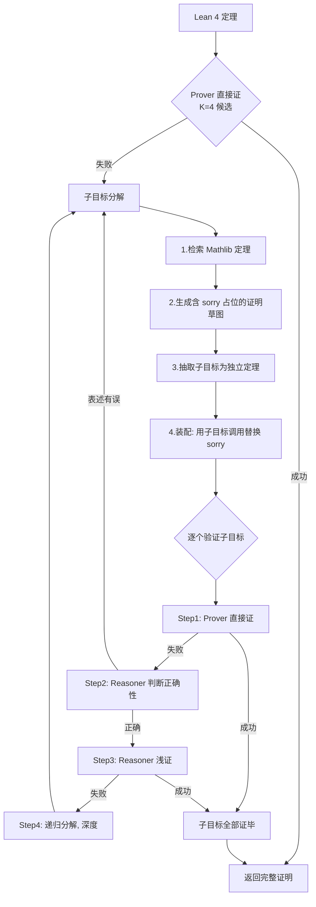

# Hilbert: Recursively Building Formal Proofs with Informal Reasoning

**会议**: ICLR 2026  
**OpenReview**: [https://openreview.net/forum?id=GN8OdkTo3B](https://openreview.net/forum?id=GN8OdkTo3B)  
**代码**: [https://github.com/Rose-STL-Lab/ml-hilbert](https://github.com/Rose-STL-Lab/ml-hilbert)  
**领域**: LLM 推理 / 形式化定理证明 / 智能体框架  
**关键词**: 形式化定理证明, Lean 4, 递归分解, 检索增强, 智能体, miniF2F, PutnamBench  

## 一句话总结
HILBERT 用"通用推理 LLM + 专用证明 LLM + 验证器 + 定理检索器"四件套搭成一个智能体，通过递归把难题拆成子目标、逐层证明再拼回去，把形式化证明的成功率从十几个百分点拉到 PutnamBench 70%、miniF2F 99.2%，第一次让公开模型在形式化证明上逼近通用 LLM 的非形式化水平。

## 研究背景与动机
- **领域现状**：Lean 4 这类形式化系统能对证明做 100% 自动验证，催生了一批专用 prover LLM（DeepSeek-Prover、Goedel-Prover、Kimina 等），它们在 miniF2F 上 pass 率已超 90%。
- **现有痛点**：专用 prover 擅长写语法正确的独立定理证明，但在"调用已有定理、纠错、长链推理"这类语言密集型任务上很脆弱；而通用推理 LLM（GPT-5、Gemini 2.5 Pro）非形式化推理极强，却不会做完整的形式化程序综合——两者各有短板。
- **核心矛盾**：实测发现通用 LLM 能非形式化解出约 83% 的 PutnamBench 题，但最好的公开 prover 只能形式化证出 13%，**形式化与非形式化之间存在巨大鸿沟**。
- **本文目标**：在不重训模型的前提下，靠一个推理时（inference-time）的编排框架把两种范式的长处缝合起来，闭合这道鸿沟。
- **核心 idea**：**【递归分解 + 角色分工】** 把通用 reasoner、专用 prover、verifier、retriever 编排成多智能体系统，难题先尝试直接证，证不出就用 reasoner 拆子目标，子目标再优先交给便宜的 prover、不行再让 reasoner "浅证"，还不行就**递归地继续往下拆**，全程用 verifier 反馈纠错。

## 方法详解

### 整体框架
HILBERT 是一个多轮智能体系统，编排四个组件：**Reasoner**（Gemini 2.5 Pro/Flash 或 gpt-oss-120b，负责非形式化推理、写证明草图）、**Prover**（DeepSeek-Prover-V2-7B / Goedel-Prover-V2-32B，负责生成 Lean 4 形式化证明）、**Verifier**（Kimina Lean Server，做正确性校验）、**Retriever**（基于 sentence-transformer + FAISS 从 Mathlib 检索相关定理）。给定一个 Lean 4 定理，系统先让 Prover 直接尝试（生成 $K_{\text{initial}}=4$ 个候选并验证），成功即返回；失败则进入"子目标分解 → 子目标验证 → 递归"的主循环。

### 关键设计

**1. 子目标分解：先想清楚再形式化，把难题切成 have 块**
直接证失败后，HILBERT 不是盲目重试，而是先让 Reasoner 检索 Mathlib（生成 $s=5$ 条查询、每条取 top $m=5$ 个相似定理，再让 Reasoner 筛掉无关项），然后写一份详细的**非形式化证明**作为思路铺垫。有了思路，Reasoner 再生成一份 Lean 4 **证明草图**——把原问题拆成若干 `have` 语句，每个子目标先用占位关键字 `sorry` 填充（Lean 会临时把它当作子目标的证明）。草图本身由 Verifier 校验、靠反馈纠错（最多 $K_{\text{sketch}}=4$ 次）。随后 Reasoner 把每个 `have` 抽取成带上下文的**独立定理语句**，并通过统计 `have` 数量来保证不漏抽；最后再把草图里的 `sorry` 替换成对这些子目标定理的调用，整体验证一遍。这样保证了"只要所有子目标都被证出，原定理就自动成立"的结构正确性。

**2. 子目标验证的三级漏斗：便宜的先上，贵的兜底**
拿到子目标列表后，每个子目标按成本递增的顺序处理。先让 **Prover 直接证**（$K_{\text{formal}}=4$ 个候选），因为 prover 计算便宜且一旦证出就自动确认了数学正确性——实测大量子目标在这一步就被解决，省下了昂贵的 reasoner 调用。Prover 证不出时，才让 **Reasoner 判断**这个子目标是否数学正确、表述是否可证；若发现表述有误（缺前提、Lean 类型系统的自然数截断等典型坑），就标记并回到第一步重新分解。确认正确后进入 **Reasoner "浅证"**（shallow solve）：检索定理后让 Reasoner 写短证明，依据 Verifier 反馈迭代最多 $K_{\text{proof}}=6$ 次纠错，并设 30 行的长度阈值——证明太长就说明该继续拆而非硬证。整套浅证最多重复 $K_{\text{informal}}=6$ 轮。这种"先 Prover 后 Reasoner"的排序把计算花在刀刃上。

**3. 递归分解：用层级结构突破上下文长度限制**
浅证仍失败的子目标，会被**递归地再次套用整个子目标分解流程**继续往下拆，直到证出或达到最大递归深度 $D$（实验取 $D=5$）。所有子目标证毕后，把各子目标的证明与第 4 步装配好的证明骨架拼接（concatenate）成完整证明；若仍有残留未解子目标，则触发失败、重启该定理的分解。正是这种层级递归让 HILBERT 能组合出极长的证明（最难的题消耗 22.8M tokens，远超任何单个 LLM 的上下文窗口），从而绕开困扰传统 LLM 的长上下文推理难题。

**4. 检索增强：既提精度又省算力**
Retriever 不只是锦上添花。它通过 query 嵌入与 `mathlib_informal` 数据集中定理非形式化描述的预计算嵌入做余弦相似度检索，把相关定理喂给 Reasoner。这一方面让证明草图能正确引用已有定理、避免编造定理名导致的编译失败，另一方面通过"少走弯路"显著降低推理时算力——消融显示开检索后 Goedel-Prover 变体的平均 reasoner 调用从 862 降到 548、token 从 4.0M 降到 2.3M，**精度和效率同时变好**。

## 实验关键数据

### 主实验：miniF2F-Test（244 题）

| 方法 | Pass Rate |
|------|-----------|
| Gemini 2.5 Pro (pass@16384) | 49.1% |
| Goedel-Prover-V2-32B (pass@4 baseline) | 74.6% |
| DeepSeek-Prover-V2-7B non-CoT (pass@4) | 61.3% |
| Delta Prover (专有, pass@16384) | 95.9% |
| Seed Prover (专有) | 99.6% |
| **HILBERT (Gemini 2.5 Pro) + Goedel-V2-32B** | **99.2% [+24.6%]** |
| **HILBERT (Gemini 2.5 Pro) + DS-Prover-V2-7B** | **98.4% [+37.1%]** |
| HILBERT (gpt-oss-120b 开源) + Goedel-V2-32B | 90.8% [+16.2%] |

最强配置仅在 2 道题上失败（AMC 12A 2020 P25、IMO Shortlist 2007 A6），比最好公开方法高 6.6 个百分点。

### 主实验：PutnamBench（660 题）

| 方法 | 解出 | Pass Rate |
|------|------|-----------|
| DeepSeek-Prover-V2 671B (pass@1024) | 47/657 | 7.1% |
| Goedel-Prover-V2-32B (自纠正) | 86/644 | 13.4% |
| SeedProver (专有) | 331/657 | 50.4% |
| **HILBERT (Gemini 2.5 Pro) + Goedel-V2-32B** | **462/660** | **70.0%** |
| HILBERT (gpt-oss-120b) + Goedel-V2-32B | 88/660 | 13.3% |

比专有 SeedProver 高近 20 个百分点，比最强公开基线（Goedel-V2-32B）多解 5 倍以上，对最好公开基线实现约 422% 提升。

### 消融实验

| 配置 | Pass Rate | Reasoner 调用 | Reasoner Tokens |
|------|-----------|--------------|-----------------|
| HILBERT + DS-Prover-V2-7B（有检索） | 98.4% | 420 | 1.9M |
| 同上（无检索） | 97.1% | 426 | 2.1M |
| HILBERT + Goedel-V2-32B（有检索） | 99.2% | 548 | 2.3M |
| 同上（无检索） | 97.9% | 862 | 4.0M |

**递归深度消融**：D=0（纯 Prover pass@4）仅 75%，full HILBERT 在 D=2 即达 98.36%、D=3 达 98.7%；关闭浅证的变体需要更深的递归才能追平，证明分层分解与浅证都有效。

### 关键发现
- **reasoner 的选择比 prover 强弱更关键**：Gemini 2.5 Pro 比 Flash 稳定高 3-4%，差距大于不同 prover 之间的差距。
- **算力分配是自适应的**：HILBERT 把算力铺在"分解→证子目标"多个互联阶段，最佳配置最多 11.3K 总调用，远少于 DeltaProver 的 16384 次。
- **突破上下文窗口**：最难的题用掉 22.8M / 27.0M tokens，远超任何 LLM 的上下文长度，说明智能体框架能让模型跨越自身上下文限制。

## 亮点与洞察
- **"分而治之"的递归是核心杠杆**：把单次长证明换成可验证的子目标树，既绕开长上下文难题，又能用便宜模型解掉大量简单子目标，把昂贵推理留给真正难的部分。
- **角色分工符合各自比较优势**：reasoner 做"想思路、拆问题、读错误信息"，prover 做"写形式化战术"，verifier 给硬反馈，retriever 防编造——每个组件只干它最擅长的事。
- **检索是少见的"既快又准"改进**：通常精度提升要付出算力代价，这里靠避免无效弯路反而省了算力。
- **完全用现成模型**：不训练、纯推理时编排就拿到 SOTA，复现门槛低、可即插即用地随基座模型升级而变强。

## 局限与展望
- **算力开销巨大**：最难的题需千万级 token，PutnamBench 因成本高只跑了最强配置，实用化的成本仍是问题。
- **强依赖闭源 reasoner**：最好结果靠 Gemini 2.5 Pro；换成开源 gpt-oss-120b 时 PutnamBench 骤降到 13.3%，开源生态下的天花板明显更低。
- **仍非 100%**：miniF2F 还差 2 题、PutnamBench 仍有 30% 未解，且作者承认存在 PutnamBench 上的特定失败模式（见原文附录）。
- **展望**：作者计划用 HILBERT 生成的证明与推理轨迹反过来训练更强的 prover/reasoner，形成"自举式"良性循环持续推进数学推理能力。

## 相关工作与启发
- **草图式方法（DSP / LEGO-Prover / DSP+）**：用通用 LLM 出证明草图、ATP 或 prover 填空，但只做单层分解，碰到仍然太难的子目标就卡住——HILBERT 的递归分解正是对这一局限的直接补强。
- **智能体式方法（COPRA / Prover-Agent / ProofCompass / DeltaProver）**：都用非形式化推理 + verifier 反馈迭代造证明，但性能仍落后通用 LLM；HILBERT 证明只要编排得当，专用 prover 会成为极强的工具。
- **启发**：在"强但不可验证"与"可验证但弱"两类系统之间，递归分解 + 分级漏斗 + 硬验证反馈，是一条无需重训就能逼近上界的通用缝合范式，可迁移到代码生成、形式化验证等其他需要可验证正确性的领域。

## 评分
- **新颖性**: ⭐⭐⭐⭐ 递归分解本身在 POETRY/ProD-RL 中有先例，但把"分级漏斗 + 检索 + 多智能体编排"组合成一个纯推理时框架并打到 SOTA，工程与系统层面的创新扎实。
- **实验充分度**: ⭐⭐⭐⭐⭐ 两大基准、多种 prover/reasoner 配置、深度消融、检索消融、推理算力 scaling 曲线齐全，PutnamBench 70% 的提升幅度极具说服力。
- **写作质量**: ⭐⭐⭐⭐ 算法流程、组件职责、每步超参都讲得清楚，图 1/图 2 把递归逻辑可视化到位。
- **价值**: ⭐⭐⭐⭐⭐ 第一次让公开模型在形式化证明上逼近非形式化水平，闭合了领域内被反复强调的核心鸿沟，且即插即用可随基座升级，实用与影响力都强。

<!-- RELATED:START -->

## 相关论文

- [\[ICLR 2026\] ProofBridge: Auto-Formalization of Natural Language Proofs in Lean via Joint Embeddings](proofbridge_auto-formalization_of_natural_language_proofs_in_lean_via_joint_embe.md)
- [\[ICLR 2026\] Mathesis: Towards Formal Theorem Proving from Natural Languages](mathesis_towards_formal_theorem_proving_from_natural_languages.md)
- [\[ICLR 2026\] ProofOptimizer: Training Language Models to Simplify Proofs without Human Demonstrations](proofoptimizer_training_language_models_to_simplify_proofs_without_human_demonst.md)
- [\[CVPR 2026\] Hilbert-Geo: Solving Solid Geometric Problems by Neural-Symbolic Reasoning](../../CVPR2026/llm_reasoning/hilbert-geo_solving_solid_geometric_problems_by_neural-symbolic_reasoning.md)
- [\[ICLR 2026\] FATE: A Formal Benchmark Series for Frontier Algebra of Multiple Difficulty Levels](fate_a_formal_benchmark_series_for_frontier_algebra_of_multiple_difficulty_level.md)

<!-- RELATED:END -->
