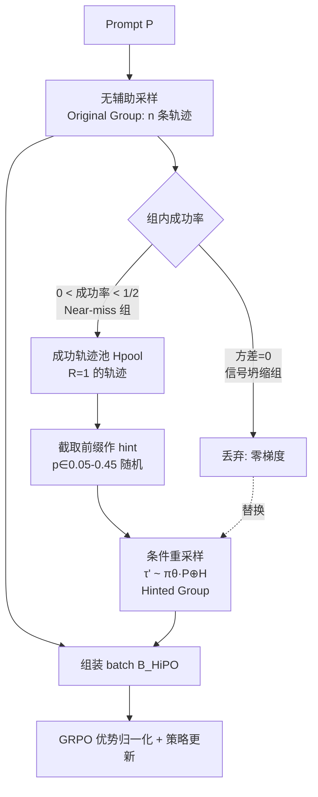

# HiPO: Self-Hint Policy Optimization for RLVR

**会议**: ICLR 2026  
**OpenReview**: [https://openreview.net/forum?id=rcb20pHmT1](https://openreview.net/forum?id=rcb20pHmT1)  
**代码**: 待确认  
**领域**: LLM 推理 / 可验证奖励强化学习 (RLVR)  
**关键词**: RLVR, GRPO, 稀疏奖励, 自提示 (self-hint), 探索停滞, 工具集成推理  

## 一句话总结
HiPO 把一个训练 batch 里偶然出现的成功轨迹的"前缀"截下来，当作模型给自己的 on-policy 提示（self-hint）去重采样，从而把稀疏的 0/1 奖励变成稠密的对比学习信号，专治 RLVR 中"差一点就对"的 near-miss 问题和探索停滞。

## 研究背景与动机
**领域现状**：RLVR（从可验证奖励中学强化学习）是当下提升 LLM 复杂推理能力的主流路线，尤其在数学竞赛题这类需要长程推理 + 工具调用（如调 Python 解释器）的任务上。代表算法 GRPO 去掉了 critic 网络，改用一组并发采样轨迹的组内奖励归一化来估计优势。

**现有痛点**：复杂数学题的正确解依赖一长串脆弱的推理步骤，一步错就满盘皆输，导致成功轨迹极其稀有。这暴露了 GRPO 两个致命缺陷——**near-miss 问题**：一条几乎全对、只差临门一脚的轨迹和彻底失败一样拿 0 奖励，组内归一化把这个负反馈均匀摊到所有 token 上，等于惩罚了那些其实正确的中间推理步骤；**信号坍缩**：当一组里所有轨迹奖励都相同（全失败最常见），优势分子分母同时归零，$\hat{A}=0$，策略梯度直接消失。

**核心矛盾**：模型不是"不会推理"，而是"找不到那条正确路径"。论文用一个动机实验说明：给 baseline 喂一段正确解的前缀作为提示，正确率从近乎必败飙升到高概率成功——瓶颈在于**发现**有效路径，而非内在推理能力。那么能不能让模型从自己罕见的成功里，给自己生成提示，自举式地学习？

**本文目标**：在不依赖外部 teacher 模型 / 专家数据的前提下，把稀疏奖励改造成稠密、自生成的学习信号。

**核心 idea**：**内生自提示（Endogenous Self-Hint）**——把一条偶然采到的成功轨迹的初始正确步骤截下来当 on-policy 提示，让策略在"无提示探索"和"有提示探索"之间形成对比，从而既奖励有效的推理前缀，又给探索提供可信路标。

## 方法详解

### 整体框架
HiPO 在标准 GRPO 训练循环里插入一个"提示机制"：对每个 prompt 先无辅助地采一组 $n$ 条轨迹（Original Group），识别出"差一点就对"的 Near-miss 组和"全军覆没"的信号坍缩组；对 near-miss 组，从其中罕见的成功轨迹里截前缀作为 hint，重新采一组高信号的 Hinted Group，并用它替换掉那些零梯度的坍缩组，再按 GRPO 目标更新策略。整个过程不引入任何外部数据，提示完全来自策略自身当下的成功。

### 关键设计

**1. On-policy 自提示生成：把成功轨迹的前缀变成路标。** HiPO 只在"Near-miss 组"上触发，即组内成功率大于 0 但低于一半——这正是模型"已摸到门道但还不稳"的临界时刻。它先把组内所有成功轨迹（$R(\tau)=1$）收集成提示池 $H_{pool,j}=\{\tau \in T_{near\text{-}miss,j} \mid R(\tau)=1\}$。生成每条 hinted 轨迹时做两段采样：先从池里均匀抽一条源轨迹 $\tau_{source}$，再从 $[0.05, 0.45]$ 以 0.05 为步长随机抽一个前缀比例 $p$，取长度 $k=\lfloor p\cdot|\tau_{source}|\rfloor$ 的前缀 $H_{j,i}=\text{Prefix}(\tau_{source}, k)$。新轨迹在原 prompt 后拼接这段提示再续写：$\tau'_i \sim \pi_\theta(\cdot \mid P_j \oplus H_{j,i})$。关键在于提示来自策略当下自己采出来的成功，所以是 on-policy 的，不会像外部专家数据那样带来 $\pi_\theta$ 与 $\pi_E$ 之间的分布失配，从而避免训练不稳定，也不需要任何人工标注或更强的 teacher。

**2. 对比信号：用 Hinted Group 与 Original Group 的反差消解 near-miss。** 提示不是为了直接抄答案，而是制造一组高成功率的 Hinted Group 去和原始的低成功率 Original Group 并置。这个反差产生了高度信息量的优势信号：当模型补全那些"萌芽但有希望"的推理路径时拿到正向优势，从而**奖励有效的推理前缀**——这恰好正面解决了 near-miss 问题（之前这些正确中间步被误罚）；而即便给了可信提示仍然失败的轨迹则拿负优势，**精准惩罚那些顽固的失败模式**。论文从理论上把它解读为一种 value-guided exploration：最优价值函数 $V^*$ 未知，但来自经验上成功轨迹的中间状态可作为高价值状态的有效代理，等于把"端到端从零发现解"的难题降维成"从高价值状态续写完成"的易题。

**3. 策略性 batch 替换：用高信号组顶掉零梯度组。** HiPO 不只是新增 Hinted Group，还做了一步替换以保证整个 batch 都有梯度。设 $B_{orig}$ 为无辅助采出的原始组集合，把其中信号坍缩、毫无梯度的 $T_{null\text{-}signal}$ 整组剔除，换上从 near-miss 成功轨迹生成的 $T_{hint}$：
$$B_{HiPO} \triangleq (B_{orig} \setminus T_{null\text{-}signal}) \cup T_{hint}$$
在这个增广 batch 上用标准 GRPO 的 clip 目标算梯度：
$$\hat{g}_{HiPO} = \mathbb{E}_{\tau \sim B_{HiPO}}\Big[\sum_t \nabla_\theta \min\big(r_t^{(\tau)}\hat{A}_\tau,\ \text{clip}(r_t^{(\tau)}, 1-\epsilon, 1+\epsilon)\hat{A}_\tau\big)\Big]$$
这样把学习目标解构成四类高价值信号：留在 $B_{orig}$ 的罕见成功轨迹给强正信号锚定策略；留在 $B_{orig}$ 的失败轨迹受罚；$T_{hint}$ 里成功的轨迹靠挽救 near-miss 构成核心学习信号；最关键的是 $T_{hint}$ 里仍失败的轨迹——它们偏离了一条已知可行的路径，因而提供了高质量的负信号。通过这样在 batch 内主动注入奖励多样性，HiPO 从根上避免了信号坍缩导致的梯度消失与探索停滞。

## 实验关键数据

### 主实验表格
基座 Qwen3-8B，在 DAPO 数据集（17K 整数答案数学题）上用 VeRL + ReTool（带 Python 解释器、最多 8 轮交互）训练；五个数学竞赛 benchmark 上的 avg@32：

| 模型 | AIME 2024 | AIME 2025 | BRUMO 2025 | HMMT 2025 | CMIMC 2025 | **平均 avg@32** |
|------|:---------:|:---------:|:----------:|:---------:|:----------:|:---------------:|
| Qwen3-8B (base) | 54.7 | 47.6 | 30.3 | 14.0 | 37.0 | 36.7 |
| GRPO | 72.1 | 63.0 | 41.7 | 28.6 | 43.5 | 49.8 |
| DAPO | 76.0 | 63.7 | **47.8** | **31.4** | 49.9 | 53.7 |
| **HiPO** | **76.7** | **66.1** | 46.6 | 30.8 | **53.8** | **54.8** |

HiPO 平均 avg@32 比 GRPO 高 **+5.0 pp**，且在全部五个 benchmark 上都超过 GRPO；最大增益在 CMIMC 2025（**+10.3 pp**）。值得注意的是 DAPO 靠动态采样取得相近成绩，但要消耗约 **4×** 的 prompt 计算量，而 HiPO 无此开销。

### 消融实验表格

| 消融维度 | 变体 | 现象 / 结论 |
|----------|------|-------------|
| 提示比例 | 固定 p=0.05（提示太短） | 熵高但工具调用轮数上不去：在探索却缺乏脚手架，发现不了复杂轨迹 |
| 提示比例 | 固定 p=0.80（提示太长） | 熵低、轮数少：过度引导把模型困在局部最优，只会简单补全 |
| 提示比例 | **HiPO 动态 [0.05,0.45]** | 工具调用频率最高且保持健康熵，平衡探索与利用 |
| 提示来源 | Off-Policy Hint（base 模型成功轨迹取前 20% 作静态提示） | 表现差于 HiPO 甚至差于 GRPO，工具调用轮数坍缩——证明效力来自 **on-policy** 而非提示内容本身 |

### 关键发现
- **训练动态**：HiPO 全程维持比 GRPO 更高的策略熵，证明它确实缓解了探索停滞；同时工具调用平均轮数显著上升，而 GRPO 几乎不增长——说明 GRPO 错误的信用分配让长推理链变得"高风险"，逼模型退化成简单策略，HiPO 则给探索搭了脚手架，敢于学更长更复杂的推理链。
- **样本效率**：pass@k 曲线显示 HiPO 在小 k 处就有更高通过率；在最难的 Apex 2025 上，HiPO 的 pass@32 接近 baseline 的两倍，说明在成功轨迹极稀有时其信号重塑机制收益最大。

## 亮点与洞察
- **"成功不是终点而是课程"**：HiPO 把一次偶然成功从"被奖励的端点"重新诠释为"可反复利用的高价值起点池"，这是把稀疏成功榨干价值的巧妙视角转换。
- **on-policy > off-policy 的实证**：消融把"提示内容"和"提示来源"解耦，干净地证明真正起作用的是提示与当前策略同分布，而非提示信息量本身——这点对后续 self-improvement 方法有方法论价值。
- **零外部依赖**：不需要 teacher 模型、不需要专家标注，纯自举，工程上比 QuestA / StepHint 这类需要外部数据的方案更可扩展。
- **触发条件设计精准**：只在"成功率 0~50%"的 near-miss 临界区触发，把算力花在模型"快突破却没突破"的刀刃上。

## 局限与展望
- **仅在数学推理 + 工具集成场景验证**：基座单一（Qwen3-8B），未在代码生成、定理证明等其他可验证奖励域上检验，泛化性待考。
- **依赖"至少有一条成功"**：若一个 prompt 在整个 batch 里成功率为 0（连 near-miss 都没有），HiPO 退化为无能为力——论文称在 Omni-Math 冷启动场景靠附录方法缓解，但根本性的"零成功"困境仍未根除。
- **前缀比例区间是超参**：动态区间 $[0.05,0.45]$ 与步长 0.05 似为经验设定，对不同难度分布的最优区间是否一致未充分探讨。
- **提示质量未过滤**：成功轨迹的前缀不一定都是"好路标"（可能成功是侥幸），未对源轨迹做质量筛选可能引入噪声路标。

## 相关工作与启发
- **GRPO**（Shao et al., 2024）：HiPO 的直接基座，去 critic、组内归一化优势；其稀疏奖励下的信号坍缩正是 HiPO 要修的病。
- **DAPO**（Yu et al., 2025）：用动态采样强行采到非零优势，但属"反应式"且算力昂贵（4× prompt），HiPO 用更省的提示机制达到相近或更好效果。
- **QuestA / StepHint**（Li et al., 2025a; Zhang et al., 2025）：同样用提示加密奖励信号，但依赖外部 teacher / 现成数据集（OpenR1-Math），是 off-policy 的；HiPO 的核心区别是提示**内生 + on-policy**。
- **启发**：这套"截自身成功前缀作 on-policy 课程"的思路可迁移到任何稀疏奖励 + 长程组合的 RL 场景（agent 工具链、多步检索、代码修复），核心是用经验上的成功状态代理高价值状态来做引导式探索。

## 评分
- **新颖性**: ⭐⭐⭐⭐ — "内生 on-policy 自提示"把成功轨迹前缀作为自生成课程是一个清爽且此前未被这样系统化使用的视角，消融对 on/off-policy 的解耦尤其有说服力；但本质仍是 GRPO + 经验回放/hint 思想的组合创新。
- **实验充分度**: ⭐⭐⭐⭐ — 五个竞赛 benchmark + pass@k + 训练动态 + 双重消融（提示比例、提示来源）较完整，且对比了 DAPO 的算力开销；但基座/任务单一，缺多模型多域验证。
- **写作质量**: ⭐⭐⭐⭐ — 问题刻画（near-miss / 信号坍缩 / 探索停滞）层层递进，动机实验直观，公式与 Algorithm 1 清晰；个别段落表述略重复。
- **价值**: ⭐⭐⭐⭐ — 直击 RLVR 稀疏奖励这一核心痛点，提供了一条无需外部数据、算力友好的自举路径，对做 LLM 推理 RL 的研究者有较强实用借鉴意义。

<!-- RELATED:START -->

## 相关论文

- [\[ICLR 2026\] Reference-guided Policy Optimization for Molecular Optimization via LLM Reasoning](reference-guided_policy_optimization_for_molecular_optimization_via_llm_reasonin.md)
- [\[ICLR 2026\] Inpainting-Guided Policy Optimization for Diffusion Large Language Models](inpainting-guided_policy_optimization_for_diffusion_large_language_models.md)
- [\[ICLR 2026\] DRPO: Efficient Reasoning via Decoupled Reward Policy Optimization](drpo_efficient_reasoning_via_decoupled_reward_policy_optimization.md)
- [\[ICLR 2026\] Slow-Fast Policy Optimization: Reposition-Before-Update for LLM Reasoning](slow-fast_policy_optimization_reposition-before-update_for_llm_reasoning.md)
- [\[ICLR 2026\] Asymmetric Proximal Policy Optimization: Mini-Critics Boost LLM Reasoning](asymmetric_proximal_policy_optimization_mini-critics_boost_llm_reasoning.md)

<!-- RELATED:END -->
