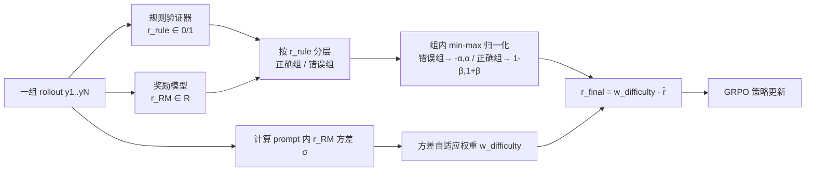

# Hybrid Reinforcement: When Reward Is Sparse, Better to Be Dense

**会议**: ICLR 2026  
**OpenReview**: [https://openreview.net/forum?id=0CajQNVKyB](https://openreview.net/forum?id=0CajQNVKyB)  
**代码**: 待确认  
**领域**: LLM 推理 / RLVR 强化学习后训练  
**关键词**: 可验证奖励, 奖励模型, 混合奖励, GRPO, 数学推理  

## 一句话总结
HERO 用规则验证器当"门"把奖励模型的连续分数分层归一化（正确组/错误组各自缩放），再用方差自适应加权放大困难 prompt，把稀疏二值验证奖励和稠密 RM 奖励融成一个既稳又细的混合奖励，在数学推理上同时打赢"只用验证器"和"只用 RM"两类基线。

## 研究背景与动机
**领域现状**：LLM 推理的 RL 后训练（RLVR）目前几乎全靠**可验证奖励**——用确定性 checker（精确匹配、符号等价、单元测试）给出 0/1 正确性信号，DeepSeek-R1 等系统把这套范式做到了规模化。

**现有痛点**：严格 0/1 验证既粗糙又脆弱。许多推理题允许部分正确、等价但格式不同、或开放式答案，符号验证器会**漏判正确解（false negative）**甚至给不出有用信号。本文在 HardVerify-Math 上的实证（Table 1）很扎心：`math_reward.py` 几乎不误报（FPR=0.3%）但召回只有 10.1%。更糟的是，当一个 prompt 的所有 rollout 拿到相同标签（全 0 或全 1），GRPO 的组内相对优势直接归零、梯度消失，训练停滞，优化被迫偏向容易验证的简单题。

**核心矛盾**：奖励模型（RM）能给连续打分、捕捉部分正确与推理质量差异，提供稠密监督；但**naive 地把 RM 连续分和验证器二值分混在一起会破坏训练稳定性**——RM 信号可能给错误答案高分、给正确答案低分，与"正确性"语义错位。于是问题变成：如何设计一个混合框架，既保住验证器的可靠性，又用上 RM 的细腻度？

**本文目标 / 核心 idea**：**让规则奖励主导整体推理动态、RM 只做补充信号**。HERO 通过两个机制实现：（1）**分层归一化**把 RM 分数约束在验证器划定的正确/错误组内；（2）**方差自适应加权**把训练算力分配给信号最丰富的困难 prompt。

## 方法详解

### 整体框架
HERO 在 GRPO 之上重塑"奖励"这一项。对每个 prompt 的一组 rollout，先用规则验证器把它们分成"正确组"和"错误组"，在每组内部用 min–max 把 RM 连续分压缩到一个受控小区间——这保证了"任何正确答案 ≥ 任何错误答案"的语义不被打破，同时在原本全 0 或全 1 的组里也注入了细微的组内梯度。随后，用每个 prompt 的 RM 分数方差衡量"信息量"，给高方差（困难、判别价值大）的 prompt 加权、给低方差（平凡）的 prompt 降权。两步组合出最终塑形奖励，再喂给标准 GRPO 更新。

### 关键设计

**1. 分层归一化：用验证器当"门"，把稠密信号锚定在正确性上。** 这是 HERO 区别于 naive 混合的核心。设一组 $N$ 个 rollout 的规则输出 $\{r_{\text{rule}}^{(i)}\}\subseteq\{0,1\}$ 与对应 RM 分 $\{r_{\text{RM}}^{(i)}\}$，先按 $r_{\text{rule}}$ 把响应切成两组，再在组内对 $r_{\text{RM}}$ 做 min–max 归一化：

$$
\hat r(x,y)=
\begin{cases}
-\alpha + 2\alpha\cdot\dfrac{r_{\text{RM}}-\min r_{\text{RM}}}{\max r_{\text{RM}}-\min r_{\text{RM}}+\epsilon}, & r_{\text{rule}}=0,\\[2ex]
(1-\beta) + 2\beta\cdot\dfrac{r_{\text{RM}}-\min r_{\text{RM}}}{\max r_{\text{RM}}-\min r_{\text{RM}}+\epsilon}, & r_{\text{rule}}=1.
\end{cases}
$$

其中 $\alpha,\beta\in(0,1]$ 控制错误组与正确组各自的浮动幅度，$\epsilon>0$ 防止除零。错误组被压在 $[-\alpha,\alpha]$、正确组被压在 $[1-\beta,1+\beta]$，因此**正确响应永远高于错误响应**（正确性语义被验证器保住），而组内仍按 RM 分排出高低（质量差异被 RM 刻画）。关键收益在于：当规则验证器对一组 rollout 全判 0 或全判 1 时，纯 RLVR 给不出任何相对优势，HERO 却能在这些"塌缩"区间里制造组内奖励差，让梯度重新流动——这正是它在 hard-to-verify 任务上翻盘的根因。作者把 $\epsilon$ 设得较小，使训练动态主要由规则奖励主导、RM 只是补充。

**2. 方差自适应优势加权：把算力投给最有信息量的困难 prompt。** 原版 GRPO 一视同仁地对待所有 prompt，导致简单题（rollout 几乎全对或全错）虽然几乎没新信息却主导优化，而真正能暴露模型弱点的难题被埋没。HERO 用每个 prompt 的 RM 分数标准差 $\sigma_u$ 衡量"分歧/不确定性"，以运行均值 $\bar\sigma$ 为基准，定义一个有界单调的 sigmoid 权重：

$$
w_{\text{difficulty}}(\sigma_u)=w_{\min}+(w_{\max}-w_{\min})\cdot\frac{1}{1+\exp\!\big(-k(\sigma_u-\bar\sigma)\big)}
$$

最终塑形奖励为 $r_{\text{final}}(x,y)=w_{\text{difficulty}}(\sigma_u)\cdot\hat r(x,y)$。默认 $w_{\min}=0.5,\ w_{\max}=2.0,\ k=5$，即困难 prompt 最多被放大 $2\times$、平凡 prompt 至少保留半权重。高方差 prompt 信息量大、被强调，低方差 prompt 被降权以免浪费容量；整个过程既锚定在 $\hat r$ 的可验证正确性上，又把学习重心移向最具判别价值的数据。

**3. 奖励区间的非对称选择：负样本范围比正样本更关键。** 消融（Figure 2）显示，给错误组（负样本）注入稠密区间比给正确组更重要——只对负组稠密化就能把可验证任务从 59.4 提到 61.4、hard-to-verify 从 62.2 提到 68.4。直觉是负样本能惩罚多样的推理错误、提供更宽的反馈面。区间大小 $\alpha$ 需按数据分布调：验证器准、全正/全负组少的数据用小区间（如 $\alpha=0.05$）更稳；全正/全负组多的混合数据用稍大区间（$\alpha=0.1\sim0.2$）注入更多组内变化。

## 实验关键数据

### 主实验表格（Qwen3-4B-Base，Table 2）
平均分越高越好；Easy 列为 4 个可验证测试集均值（pass@1, 8 seeds），Hard 列为 HVM/TBR 均值（LLM-as-judge）。

| 训练数据 | 方法 | Easy-to-verify Avg | Hard-to-verify Avg |
|---|---|---|---|
| 易验证 | AceMath-7B-RM (RM-only) | 56.4 | 54.6 |
| 易验证 | math verify (verifier-only) | 58.3 | 57.1 |
| 易验证 | **HERO** | **62.0** | **66.3** |
| 难验证 | RM-only | 55.1 | 53.7 |
| 难验证 | verifier-only | 47.4 | 54.2 |
| 难验证 | **HERO** | **56.8** | **56.5** |
| 混合 | RM-only | 55.1 | 54.0 |
| 混合 | verifier-only | 56.1 | 58.9 |
| 混合 | **HERO** | **58.8** | **64.1** |

最亮眼的一格：在易验证数据上训练、hard-to-verify 评测，HERO 66.3 比 RM-only +11.7、比 verifier-only +9.2。验证器单训在 hard-to-verify 上只有 47.4，甚至低于 SFT 冷启动（47.1），印证"全 0/全 1 标签导致 GRPO 零梯度"的失效。

### 弱模型验证（OctoThinker-8B-Hybrid-Base，Table 3）
从更弱的起点（可验证 16.9 / hard 23.6）出发，HERO 在三种训练regime下均领先 4–6 分，例如混合训练达 40.2 / 33.2，全面压过 RM-only 与 verifier-only。说明混合奖励对强模型保稳、对弱模型带来更大相对增益。

### 消融实验（Figure 2 / Table 4）
- **正负稠密区间（Pos/Neg）**：None→Pos+Neg 在 hard 任务上 62.2→73.2；其中仅负组稠密化即可达 68.4，**负组的贡献大于正组**。
- **区间大小 $\alpha$**：可验证任务偏好小区间（0.05 最优 73.2），混合任务偏好大区间（0.1 给 71.4）。
- **方差加权**：Table 4 确认方差自适应重加权对稳定性与效率均有正贡献。

### 关键发现
1. 把稠密 RM 信号**锚定**在验证器正确性组内，是稳定混合训练的前提；naive 混合会发散（Appendix A.3）。
2. hard-to-verify 任务上的大幅增益主要来自"打破全 0/全 1 组的零梯度"。
3. 增益幅度随训练数据的奖励质量自然变化（易验证数据增益大、难验证数据增益小），并非不稳定。

## 亮点与洞察
- **"验证器当门、RM 当尺"** 的分工极简却击中要害：用分组+组内归一化这一个操作，同时解决了 RM 错位和验证器零梯度两个老问题。
- 把"哪些 prompt 值得学"显式量化成 RM 分数方差，是对 GRPO"一视同仁"假设的务实修正。
- 实证地指出**负样本稠密化比正样本更重要**，对后续奖励设计有直接指导意义——错误里藏着更多可学的信号。
- 三种训练 regime × 两类测试集的交叉评测设计，清晰隔离了"可验证 vs 难验证"的泛化能力。

## 局限与展望
- 方法依赖一个**质量过得去的数学 RM**（AceMath-7B-RM），RM 本身在 hard-to-verify 上仍会漂移，HERO 只是约束而非消除其噪声；换到 RM 较弱的领域效果未知。
- $\alpha,\beta,k,w_{\min/\max}$ 等超参对区间敏感，需按数据分布（全正/全负组占比）调，缺乏自动选择机制。
- 实验集中在**数学推理**，是否迁移到代码、证明、开放式生成等其他可验证/难验证任务尚待检验。
- hard-to-verify 评测依赖 GPT-4o/GPT-4.1 当 judge，judge 偏差可能放大或掩盖真实差异。

## 相关工作与启发
- **RLVR / GRPO**（Shao et al. 2024；DeepSeek-R1）：HERO 直接补丁式地修了 GRPO 在标签塌缩时的零梯度问题。
- **奖励模型**（AceMath-RM、各类数学 RM）：本文把 RM 从"独立信号"降格为"验证器约束下的补充信号"，是混合奖励设计的一个干净范式。
- **难验证基准**（HardVerify-Math、TextBookReasoning）：提供了评估"超出严格可验证范围"推理能力的测试床。
- 启发：凡是奖励稀疏/二值塌缩的 RL 场景，"分组锚定 + 组内稠密化"这套思路或可迁移——只要能找到一个粗粒度但可信的硬约束（验证器）和一个细粒度但有噪的软信号（RM）。

## 评分
- 新颖性: ⭐⭐⭐⭐ 分层归一化 + 方差加权的组合简洁有效，切中 RLVR 标签塌缩与 RM 错位两大痛点，思路清晰但单个组件较直接。
- 实验充分度: ⭐⭐⭐⭐ 两个 backbone × 三种训练数据 × 两类测试集，配套正负区间/区间大小/方差加权消融，证据链完整。
- 写作质量: ⭐⭐⭐⭐ 动机—方法—实验逻辑顺畅，Table 1 的验证器分析和 Figure 1 的三类信号对比很有说服力。
- 价值: ⭐⭐⭐⭐ 给"如何在难验证任务上做 RL 后训练"提供了可复用的混合奖励范式，对推理模型训练实践直接有用。

<!-- RELATED:START -->

## 相关论文

- [\[ICLR 2026\] Temperature as a Meta-Policy: Adaptive Temperature in LLM Reinforcement Learning](temperature_as_a_meta-policy_adaptive_temperature_in_llm_reinforcement_learning.md)
- [\[ICLR 2026\] MAGO: Beyond Fixed Hyperparameters with Multi-Objective Pareto Optimization for Hybrid LLM Reasoning](mago_beyond_fixed_hyperparameters_with_multi-objective_pareto_optimization_for_h.md)
- [\[ICLR 2026\] Generative Adversarial Reasoner: Enhancing LLM Reasoning with Adversarial Reinforcement Learning](generative_adversarial_reasoner_enhancing_llm_reasoning_with_adversarial_reinfor.md)
- [\[ICML 2026\] When the Chain of Thought Knows Better: Failure Modes in Multi-Turn Reasoning Models](../../ICML2026/llm_reasoning/when_the_chain_of_thought_knows_better_failure_modes_in_multi-turn_reasoning_mod.md)
- [\[ICLR 2026\] NFT: Bridging Supervised Learning and Reinforcement Learning in Math Reasoning](nft_bridging_supervised_learning_and_reinforcement_learning_in_math_reasoning.md)

<!-- RELATED:END -->
