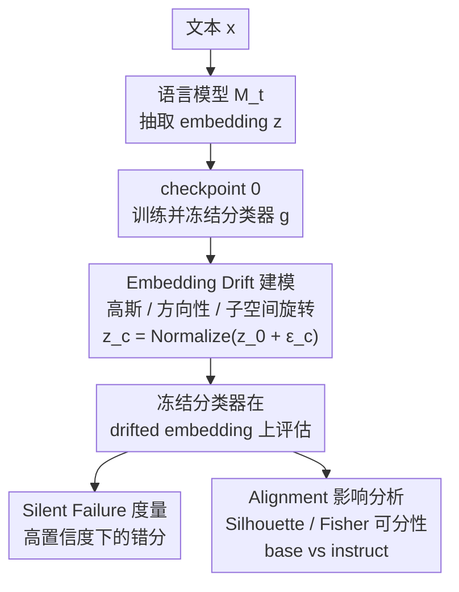

# I Can't Believe It's Not Robust: Catastrophic Collapse of Safety Classifiers under Embedding Drift

**会议**: ICLR 2026  
**arXiv**: [2603.01297](https://arxiv.org/abs/2603.01297)  
**代码**: [https://github.com/SubramanyamSahoo/Collapse-of-Safety-Classifiers-under-Embedding-Drift](https://github.com/SubramanyamSahoo/Collapse-of-Safety-Classifiers-under-Embedding-Drift)  
**领域**: LLM推理  
**关键词**: embedding drift, safety classifier, silent failure, RLHF alignment, toxicity detection

## 一句话总结
本文系统研究了基于 frozen embedding 的安全分类器在模型更新导致 embedding 漂移时的脆弱性，发现仅 2% 的 embedding 扰动即可将分类器性能从 85% ROC-AUC 降至随机水平（50%），且 72% 的误分类发生在高置信度下（silent failure），同时 instruction-tuned 模型反而比 base 模型更难分类。

## 研究背景与动机

**领域现状**：生产环境中的指令微调推理模型通常配备安全分类器（如毒性检测器），这些分类器在 frozen embedding 上训练，隐含假设 embedding 在模型更新后保持稳定。

**现有痛点**：基础模型会频繁更新（安全补丁、性能提升等），但安全分类器通常不会同步重训，形成了"模型更新但分类器固定"的生产模式。

**核心矛盾**：embedding 空间在模型更新后是否真的稳定？如果不稳定，现有的监控机制（基于平均置信度的监控）能否检测到这种失效？

**本文目标**（1）量化 embedding 漂移的精确失效阈值；（2）刻画 silent failure 现象——置信度仍高但分类已错；（3）揭示 alignment（RLHF）对分类器鲁棒性的反直觉影响。

**切入角度**：通过受控的 additive perturbation 模拟 embedding drift，系统测试不同漂移类型（高斯、方向性、子空间旋转）下分类器的退化行为。

**核心 idea**：Embedding stability 假设在实践中不成立，微小漂移即可导致安全分类器灾难性失效且标准监控无法察觉。

## 方法详解

### 整体框架
这篇论文不提新模型，而是设计一套受控实验去拷问一个被默认成立的假设：基于 frozen embedding 的安全分类器，在底层模型更新后还靠不靠得住。整条 pipeline 是：文本 $x$ 经语言模型 $\mathcal{M}_t$ 生成 embedding $z_t = f_{\theta_t}(x) \in \mathbb{R}^d$，安全分类器 $g_\phi$ 在 embedding 上做 toxic/safe 二分类。关键动作是把分类器**只在 checkpoint 0 上训练一次然后冻结**，再人为给后续 checkpoint 的 embedding 注入可控漂移、让冻结分类器去评估，从而精确复现生产里"模型更新、分类器不动"的场景。围绕这条主线，本文做了三件事：怎么建模漂移、怎么度量被均值监控漏掉的"无声失效"、以及对齐（RLHF）到底帮了还是害了分类。

### 关键设计

**1. Embedding Drift 建模：用可控扰动复现"模型更新"这件事**

真实的模型更新会怎样移动 embedding 很难直接观测，本文索性把漂移参数化，在 checkpoint 0 的原始 embedding 上叠加一个扰动项再归一化：$z_c = \text{Normalize}(z_0 + \varepsilon_c)$。扰动 $\varepsilon_c$ 故意取三种不同形态，对应三类典型的更新后果——高斯漂移 $\varepsilon_c \sim \mathcal{N}(0, \sigma_c^2 I)$ 模拟各维独立的随机抖动，方向性漂移 $\varepsilon_c = \sigma_c v$ 沿固定方向 $v$ 平移模拟系统性偏移，子空间旋转 $z_c = \text{Normalize}(Rz_0)$ 用旋转矩阵 $R$ 整体扭转表示空间。归一化把结果重新压回 embedding 球面，保证扰动只改变方向、不改变模长，这样退化才能干净地归因到漂移本身而非尺度变化。

**2. Silent Failure 度量：抓住"嘴上很确定、其实已经错了"的失效**

标准的线上监控盯的是平均置信度，可一旦分类器在高置信度下大面积出错，这种监控就形同虚设。本文把这种最危险的失效单独度量出来：当 $\max_y p(y|x) > 0.8$（模型自认为很笃定）但预测 $\hat{y} \neq y$（其实分错了）时，就记一次 silent failure。它和普通错误的区别在于"无声"——置信度没有同步塌掉，所以靠均值监控的运维系统看不到任何异常信号，毒性内容会带着高置信度的"安全"标签溜过去。

**3. Alignment 影响分析：检验 RLHF 是帮了还是害了安全分类**

直觉上 instruction-tuned 模型经过对齐应该更"懂"安全，但本文要验证的恰恰是反面——alignment 是否反而让 toxic/safe 在 embedding 空间里更难分开。做法是用两个几何量刻画类别可分性：Silhouette score 衡量样本离本类中心比离异类中心近多少，Fisher 判别比 $\frac{\text{类间方差}}{\text{类内方差}}$ 衡量两类的分离程度。把 base 模型和 instruction-tuned 模型的这两个指标摆在一起对比，就能看出 RLHF 到底是收紧还是模糊了安全分类所依赖的边界。

### 实验设置
- 数据集：Civil Comments（~1.8M 条人工标注评论），构建 10,000 样本的平衡子集（70/10/20 train/val/test）
- 模型：Qwen-0.6B（base）和 Qwen-4B-Instruct（instruction-tuned + RLHF）
- 分类器：$\ell_2$ 正则化逻辑回归（镜像生产环境中的轻量分类器实践）
- 漂移幅度：$\sigma \in [0, 0.15]$，生成 6-8 个 checkpoint

## 实验关键数据

### 主实验

| 指标 | Baseline (σ=0) | Checkpoint 1 (σ=0.028) | 相对变化 |
|------|----------------|-------------------------|----------|
| ROC-AUC | 85%-90% | 49.75% | -45% |
| 平均置信度 | 0.85 | 0.73 | -14% |
| Silent Failure Rate | - | 38.4%（高置信错误） | - |
| 高置信误分类占比 | - | 72% | - |
| ECE（校准误差） | 1.2% | 22.6% | +18.8x |

### 消融实验

| 配置 | ROC-AUC @max drift | Silent Failure Rate | 说明 |
|------|---------------------|---------------------|------|
| Base model (Qwen-0.6B) | -39.2% 降幅 | 35.2% | base 模型稍好 |
| Instruct model (Qwen-4B) | -41.2% 降幅 | 42.1% | RLHF 模型更脆弱 |
| Gaussian drift | -42.7% 降幅 | - | 标准高斯 |
| Directional drift | ~-45% 降幅 | - | 固定方向 |
| Subspace rotation | -48.9% 降幅 | - | 旋转变换最差 |

### 关键发现
- **阈值效应**：漂移存在 sharp cliff——$\sigma < 0.01$ 时几乎无影响（<5% AUC 下降），$\sigma > 0.02$ 时近随机，转变发生在极窄的 1% 窗口内
- **Silent failure 是最大威胁**：分类器报告 90% 置信度时，实际准确率仅 56%（比随机猜还没用）
- **Alignment 的反直觉效应**：instruction-tuned 模型的 Silhouette score 从 0.245 降至 0.198（-19%），Fisher ratio 从 4.23 降至 3.12（-26%），class overlap 从 12.3% 升至 18.7%——RLHF 让 embedding 空间中的类别边界更模糊
- **漂移机制无关性**：三种漂移类型差异不超过 6 个百分点，说明脆弱性是结构性的而非特定扰动的

## 亮点与洞察
- **高维脆弱性的数学解释很精炼**：在 896 维空间中，即使 $\sigma=0.02$，扰动项 $w^\top \varepsilon$ 的方差 $\|w\|^2 \sigma^2 \approx 0.5$，与信号强度 $w^\top z$ 相当，SNR ≈ 1 即不可用。高维度放大了每个维度的独立噪声贡献。
- **置信度失效的 sigmoid 解释**：sigmoid 函数将大幅值映射到接近 0 或 1 的置信度，即使漂移随机翻转了 $w^\top z + b$ 的符号（破坏准确率），也不会系统性降低 $|w^\top z + w^\top \varepsilon + b|$ 的幅度，所以置信度仍高但方向已错。
- **对生产系统的启示**：每次模型更新都必须强制重训安全分类器，不能依赖平均置信度监控来发现问题。

## 局限与展望
- **控制实验 vs 真实漂移**：additive perturbation 可能低估了实际模型更新带来的分布偏移（架构变化、数据更新等引起的漂移更复杂）
- **分类器过于简单**：只测了逻辑回归，更复杂的分类器（如 MLP、ensemble）在漂移下的表现未知
- **缓解措施不够深入**：论文提到 meta-learning、domain adaptation 作为可能的改进方向，但没有实验验证
- **模型规模有限**：只测了 0.6B 和 4B，更大模型（如 70B+）的 embedding 稳定性行为可能不同

## 相关工作与启发
- **vs Cunningham et al. (2026) Constitutional Classifiers++**: 他们做的是构建更好的安全分类器，本文揭示的问题更根本——再好的分类器如果不随模型更新也会失效
- **vs SHADE-Arena (Kutasov et al. 2025)**: 评估 LLM agent 的 sabotage 风险，本文从 embedding 层面说明安全机制的脆弱性
- 这篇论文对任何使用 frozen embedding + downstream classifier 的生产系统都有警示意义

## 评分
- 新颖性: ⭐⭐⭐⭐ 问题本身不新（embedding drift），但聚焦安全分类器的 silent failure 角度很新
- 实验充分度: ⭐⭐⭐ 实验设计清晰但模型和分类器种类偏少，缺乏缓解措施的实证
- 写作质量: ⭐⭐⭐⭐ 结构清晰，数学分析精炼
- 价值: ⭐⭐⭐⭐ 对 AI 安全生产部署有重要实践指导意义

<!-- RELATED:START -->

## 相关论文

- [\[ICLR 2026\] Are Reasoning LLMs Robust to Interventions on Their Chain-of-Thought?](are_reasoning_llms_robust_to_interventions_on_their_chain-of-thought.md)
- [\[ACL 2026\] Is Chain-of-Thought Really Not Explainability? Chain-of-Thought Can Be Faithful without Hint Verbalization](../../ACL2026/llm_reasoning/is_chain-of-thought_really_not_explainability_chain-of-thought_can_be_faithful_w.md)
- [\[ICLR 2026\] Is It Thinking or Cheating? Detecting Implicit Reward Hacking by Measuring Reasoning Effort](is_it_thinking_or_cheating_detecting_implicit_reward_hacking_by_measuring_reason.md)
- [\[ICLR 2026\] RFEval: Benchmarking Reasoning Faithfulness under Counterfactual Reasoning Intervention in Large Reasoning Models](rfeval_benchmarking_reasoning_faithfulness_under_counterfactual_reasoning_interv.md)
- [\[NeurIPS 2025\] Large Language Models Can Learn and Generalize Steganographic Chain-of-Thought under Process Supervision](../../NeurIPS2025/llm_reasoning/large_language_models_can_learn_and_generalize_steganographic_chain-of-thought_u.md)

<!-- RELATED:END -->
