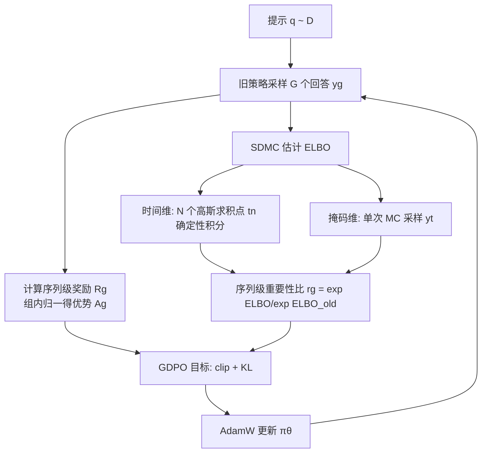

# Improving Reasoning for Diffusion Language Models via Group Diffusion Policy Optimization

**会议**: ICLR 2026  
**OpenReview**: [https://openreview.net/forum?id=JaqvespRBP](https://openreview.net/forum?id=JaqvespRBP)  
**代码**: 待确认  
**领域**: LLM 推理 / 强化学习后训练 / 扩散语言模型  
**关键词**: Diffusion Language Models, GRPO, ELBO, 方差缩减, Semi-deterministic Monte Carlo, 序列级似然  

## 一句话总结
本文提出 **GDPO**（Group Diffusion Policy Optimization），用一个低方差、低成本的「半确定性蒙特卡洛」方案高效估计扩散语言模型的序列级 ELBO，从而把 GRPO 风格的 RL 后训练真正落到扩散语言模型上，在数学、规划、代码三类推理任务上稳定超过此前的 diffu-GRPO。

## 研究背景与动机
扩散语言模型（DLM，如 LLaDA）以并行、顺序无关、迭代去噪的方式生成文本，相比自回归 LLM 提供了更灵活的生成范式。但要给 DLM 做 RL 后训练（GRPO/PPO 那一套）有个根本障碍：**DLM 的序列似然不可解析计算**，而 GRPO 的重要性采样比 $r_g$ 恰恰需要新旧策略下的似然比。

- **领域现状**：GRPO 通过组内多采样的相对优势替代 value network，已成为 LLM 推理后训练的主力；但它默认似然能逐 token 算出来。
- **现有痛点**：开创性工作 diffu-GRPO 为了绕开似然不可解，用「单步反掩码」的均场近似来估 **token 级**似然——计算上便宜，但**偏差严重**，且 token 级比值在顺序无关的扩散框架下语义本就站不住。
- **核心矛盾**：更有原则的做法是用**序列级** ELBO 作为 $\log\pi(y|q)$ 的代理（数学关系干净），但 ELBO 估计需要对「随机时间 $t$」和「随机掩码 $y_t$」做双重蒙特卡洛积分，**方差爆炸、评估成本高得没法用**——这就是「方差—成本两难」。
- **本文目标**：在极紧的评估预算（每次似然只算 2~3 次网络前向）下，给出既低方差又准的序列级 ELBO 估计，让序列级 RL 真正能跑。
- **核心 idea**：**先把方差拆开看**——作者发现 ELBO 方差的绝大部分来自「随机时间 $t$」而非「随机掩码」，且损失对 $t$ 的曲线又光滑又单调凸；于是**把时间维度从随机采样换成确定性数值积分（高斯求积），只保留掩码维度做单次蒙特卡洛**，得到「半确定性蒙特卡洛」（SDMC）估计器，可证明在紧预算下方差更低。

## 方法详解

### 整体框架
GDPO 把 GRPO 的训练循环原封不动地保留（组内采样 → 算奖励与相对优势 → 带 clip 与 KL 的策略梯度更新），唯一替换的是「如何算似然/重要性比」这一环：用 SDMC 估计的**序列级 ELBO** 代替 diffu-GRPO 的 token 级均场近似。整条管线是「采样 G 个回答 → 对每个回答用 N 个求积点估 ELBO → 拼成序列级重要性比与优势 → AdamW 更新」。

### 关键设计

**1. 方差解剖：找出真正的方差来源。** ELBO 的定义（式 2）里有两个随机源——采哪个掩码比例（随机时间 $t$）和给定比例后采哪些 token 被掩（随机掩码 $y_t$）。作者把损失方差按这两个源拆开度量，结论很反直觉但很关键：**方差几乎全来自随机时间** $t$，因为不同 $t$ 处损失量级差异极大；而损失关于 $t$ 的均值曲线却是**严格递增且凸**的光滑形状，跨不同 prompt 都长得差不多，且方差在大部分噪声水平上相对恒定。这一观察直接决定了后面的设计——「随机的那一维其实最该确定化，确定化掉它就能砍掉绝大部分方差」。

**2. 半确定性蒙特卡洛（SDMC）：把时间积分换成数值求积。** 既然时间是方差元凶且曲线光滑，就别把 ELBO 当成「双重蒙特卡洛」来采，而把它写成对时间的积分 $L_{\text{ELBO}}(y|q)=\int_0^1 \mathbb{E}_{y_t\sim\pi_t(\cdot|y)}\big[\tfrac{1}{t}\sum_i \mathbf{1}[y_t^i=M]\log\pi_\theta(y^i|y_t,q)\big]\,dt$，再用 $N$ 点高斯求积近似：

$$L_{\text{ELBO}}(y|q)\approx \sum_{n=1}^{N} w_n \underbrace{\frac{1}{K}\sum_{k=1}^{K}\frac{1}{t_n}\sum_{i=1}^{L}\mathbf{1}[(y_{t_n}^{[k]})^i=M]\log\pi_\theta(y^i|y_{t_n}^{[k]},q)}_{\ell(\pi_\theta;\,y,q,t_n)}.$$

「半确定」指的就是：**时间维 $\{t_n\}$ 是确定性求积点**（固定下来，消掉随机时间带来的大方差），**掩码维仍是随机采样**（且基于方差分析只需 $K=1$ 次）。这样每次似然的网络前向次数恰好等于求积点数 $N$，实测 $N=2\!\sim\!3$ 个点就拿到几乎全部收益——高斯求积的快收敛 + 单调凸的被积函数，使它在偏差和方差上都明显压过同等评估预算的双重蒙特卡洛（图 3）。

**3. GDPO 目标：把重要性比和优势都搬到序列级。** 有了便宜的序列级 ELBO，GRPO 的目标几乎照搬，只是似然量全部换成序列级：

$$\mathcal{L}_{\text{GDPO}}(\theta)=\mathbb{E}\Big[\frac{1}{G}\sum_{g=1}^{G}\frac{1}{|y_g|}\min\big(r_g A_g,\ \mathrm{clip}(r_g,1-\epsilon,1+\epsilon)A_g\big)-\beta\,\mathrm{KL}(\pi_\theta\|\pi_{\text{ref}})\Big],$$

其中序列级重要性比 $r_g=\exp(L_{\text{ELBO}}(y_g|x))/\exp(L_{\text{ELBO}}^{\text{old}}(y_g|x))$，优势 $A_g=R_g-\mathrm{mean}(R_1,\dots,R_G)$（用**未归一化**优势以避免 Liu et al. 指出的偏差）。把比值从 token 级提到序列级有两个好处：一是与「奖励本就只在序列级给」的事实对齐、保住了优势估计的语义；二是 ELBO 天然契合离散扩散框架，精神上与 GSPO 相通。

**4. 理论保证：MSE 的偏差—方差分解。** 经典双重蒙特卡洛的 MSE 以 $O(1/NK)$ 衰减；本文证明 SDMC 估计的 MSE 可分解为「蒙特卡洛方差 + 积分偏差平方」——方差项同为 $O(1/NK)$，而通用求积方案下积分偏差平方为 $O(1/N^2)$，对 log-likelihood 加额外光滑假设后还能更快。这从理论侧解释了为何在紧预算下 SDMC 比双重蒙特卡洛方差更低、收敛更稳。

## 实验关键数据

基座为 LLaDA-8B-Instruct，覆盖数学（GSM8K、MATH500）、规划（Countdown、Sudoku）、代码（HumanEval、MBPP）。下表为 best-of-128/256/512 生成下的准确率。

### 主实验表格（数学与规划，N=3 求积点）

| 模型 | GSM8K (512) | MATH500 (512) | Countdown (512) | Sudoku (128) |
|---|---|---|---|---|
| LLaDA-8B-Instruct | 78.2 | 36.2 | 16.0 | 11.7 |
| + diffu-GRPO | 81.9 | 39.2 | 37.1 | 18.4 |
| + SFT + diffu-GRPO | 82.1 | 40.2 | 42.2 | 22.1 |
| + wD1 | 82.3 | 39.0 | 46.1 | — |
| **+ SFT + GDPO** | **84.99** | **41.4** | **80.86** | **27.69** |

Countdown 上的提升最为夸张（16.0 → 80.86），Sudoku、GSM8K、MATH500 也全面领先 token 级基线。

### 消融实验表格（代码任务 + ELBO 估计器对比）

| 模型 | HumanEval (512) | MBPP (256) |
|---|---|---|
| LLaDA-8B-Instruct | 37.8 | 41.2 |
| + diffu-GRPO | 34.8 | 45.5 |
| + GDPO | **39.0** | **50.6** |

| ELBO 估计器（Countdown-256） | 相对表现 |
|---|---|
| Double-MC-4（4 次评估） | 较差 |
| SDMC-1 / SDMC-2 / SDMC-3 | 越准越好，SDMC-3 即便评估更省也胜过 Double-MC-4 |

### 关键发现
- **估计器的「准」比「评估次数多」更重要**：SDMC-3 用更少的函数评估也能稳压朴素双重蒙特卡洛，说明把方差砍对地方才是关键。
- **长度外推更好**：序列级似然让各 token 位置改进更均匀，在 512-token 长序列上 GDPO 全面领先，而 token 级方法仍带生成顺序偏置。
- **计算友好**：仅用 2 张 H100 即可训练，对算力受限的实践者友好。
- MBPP 上即便不做 SFT，纯 RL 也能比预训练基座涨约 10 个点。

## 亮点与洞察
- **「先解剖方差再设计估计器」的方法论很漂亮**：不是盲目加采样，而是定位到「随机时间」是方差元凶、损失对 $t$ 光滑单调凸，才决定确定化时间维——这是把数值积分思想（高斯求积）干净地嫁接进 RL 似然估计的范例。
- **半确定性是性价比最优的折中**：时间确定 + 掩码随机，既享受求积的快收敛，又不丢被积函数内部的随机性，$N=2\!\sim\!3$ 点就够用。
- **序列级而非 token 级**，从根上对齐了「奖励只在序列级」这一事实，也回避了扩散模型顺序无关导致 token 级比值不可靠的问题。

## 局限与展望
- 实验只在 LLaDA-8B 一个基座上验证，作者也承认更强的预训练检查点应有更大收益，但未覆盖。
- 高斯求积点与权重是固定/通用方案，作者展望用**数据驱动的自适应求积位置与权重**进一步压方差。
- 对极长序列、更复杂奖励（过程奖励、多步工具调用）下序列级 ELBO 估计的稳定性尚未探究。
- 理论上的更快收敛率依赖对 log-likelihood 的额外光滑假设，实际任务中是否始终满足值得进一步检验。

## 相关工作与启发
- **GRPO / GSPO**：GDPO 是 GRPO 在扩散语言模型上的「序列级」推广，重要性比的序列级化精神上与 GSPO 一致。
- **diffu-GRPO (Zhao et al., 2025)**：最直接的对比对象，用单步反掩码的 token 级均场近似；GDPO 指出其偏差并以序列级 ELBO 替代。
- **扩散语言模型（LLaDA 等）**：本文把「不可解似然」这一 DLM 做 RL 的核心障碍，转化为「ELBO 的高效低方差估计」问题，给后续 DLM 对齐研究提供了可复用的估计器工具。
- 对自回归 RL 研究的启发：当似然/比值估计本身带噪时，**与其加采样，不如先做方差分解、把方差最大的维度确定化**。

## 评分
- **新颖性**: ⭐⭐⭐⭐ — 方差分解 + 半确定性蒙特卡洛把数值积分思想引入 DLM 的 ELBO 估计，角度新颖且落地干净。
- **实验充分度**: ⭐⭐⭐⭐ — 覆盖数学/规划/代码六个基准、含估计器消融与长度外推分析；但仅单一基座、缺更大模型与更多扩散基座的验证。
- **写作质量**: ⭐⭐⭐⭐ — 动机—观察—方法—理论链条清晰，图 2/3/4 把方差直觉讲得透。
- **价值**: ⭐⭐⭐⭐ — 为扩散语言模型的 RL 后训练提供了一个理论有保证、计算可承受的实用范式，且仅需 2 张 H100，落地门槛低。

<!-- RELATED:START -->

## 相关论文

- [\[ICLR 2026\] Inpainting-Guided Policy Optimization for Diffusion Large Language Models](inpainting-guided_policy_optimization_for_diffusion_large_language_models.md)
- [\[ICLR 2026\] On the Reasoning Abilities of Masked Diffusion Language Models](on_the_reasoning_abilities_of_masked_diffusion_language_models.md)
- [\[ICLR 2026\] Scaf-GRPO: Scaffolded Group Relative Policy Optimization for Enhancing LLM Reasoning](scaf-grpo_scaffolded_group_relative_policy_optimization_for_enhancing_llm_reason.md)
- [\[ICLR 2026\] LaDiR: Latent Diffusion Enhances LLMs for Text Reasoning](ladir_latent_diffusion_enhances_llms_for_text_reasoning.md)
- [\[ICLR 2026\] Reference-guided Policy Optimization for Molecular Optimization via LLM Reasoning](reference-guided_policy_optimization_for_molecular_optimization_via_llm_reasonin.md)

<!-- RELATED:END -->
