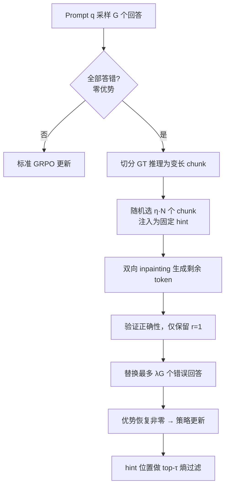

# Inpainting-Guided Policy Optimization for Diffusion Large Language Models

**会议**: ICLR 2026  
**OpenReview**: [https://openreview.net/forum?id=haVf5e4Q6C](https://openreview.net/forum?id=haVf5e4Q6C)  
**代码**: [https://github.com/facebookresearch/igpo](https://github.com/facebookresearch/igpo)  
**领域**: LLM 推理 / 扩散语言模型 / 强化学习  
**关键词**: diffusion LLM, GRPO, inpainting, RLVR, exploration, LLaDA  

## 一句话总结
利用扩散语言模型独有的「inpainting（填空）」能力，在 GRPO 训练遇到「整组全错、优势归零」时注入部分 ground-truth 推理片段引导探索，从而恢复梯度信号、提升样本效率，在四个数学推理 benchmark 上刷新 full-attention 掩码 dLLM 的 SoTA。

## 研究背景与动机
- **领域现状**: 掩码扩散大模型（dLLM，如 LLaDA、Dream）通过迭代 unmask 并行解码，性能已能与同尺寸自回归 LLM 竞争，且天生支持自回归模型做不到的双向「inpainting」——在已有文本中填补缺失内容。RLVR（可验证奖励强化学习）是提升其推理能力的主流后训练手段。
- **现有痛点**: 现有 dLLM 后训练直接照搬自回归 LLM 的做法（如 DiffuGRPO、UniGRPO），但都绕不开 RL 的**探索难题**：难题上策略很难自己采到正确解，二值奖励几乎不提供学习信号，导致大量采样浪费、训练效率低。
- **核心矛盾**: 在 GRPO 这类基于组内归一化优势的方法里，一旦一组 $G$ 个回答**全部答错**，组内奖励无方差，优势 $A_i = r(o_i) - \frac{1}{G}\sum_j r(o_j) = 0$，梯度直接坍缩为零——难域里这种「all-wrong group」出现频率惊人地高，整批算力白白浪费。
- **本文目标**: 专门缓解 all-wrong 这种零优势困境，在不引入分布漂移的前提下恢复有意义的梯度，并把 dLLM 的双向结构变成探索优势。
- **核心 idea**: **【填空即探索】** dLLM 在随机掩码下训练，天然能接受外部 hint。当整组全错时，把 ground-truth 推理轨迹切成片段、**只注入一部分**作为固定 hint，让模型 inpainting 出剩余推理与答案；用验证通过的填空样本替换部分错误回答，人为制造奖励方差、恢复梯度，同时保留自生成推理避免纯 SFT 的分布漂移。

## 方法详解

### 整体框架
IGPO 把改动严格限制在 GRPO 的**采样层**：只有当一组回答全错（零优势）时才触发 inpainting，注入部分 ground-truth 片段生成补充回答，用验证为正确的填空样本替换掉若干错误回答，让优势重新非零；其余 GRPO 目标、优势计算、log-prob 估计全部不变。完整 recipe 还在 RL 前加一段 Length-Aligned SFT 提供更好的初始化。

### 关键设计

**1. 弹性触发的 inpainting 采样（Elastic Inpainting-Triggered Sampling）：只在零优势时出手。** IGPO 的精妙之处在于「按需触发」——只有检测到组内 $\{o_1,\dots,o_G\}$ 全部 $r(o_i)=0$ 时才启动填空，避免对本就有梯度的组施加额外偏置。触发后，先把 ground-truth 轨迹 $y^*$ 切成变长 chunk $\{c_1,\dots,c_N\}$（每段长度 $|c_j|\sim U[s_{min},s_{max}]$，并刻意**排除最终答案 token** 以防模型跳过推理直接抄答案的 reward hacking），再为每个补充回答 $\tilde o_i$ 独立采样注入比例 $\eta_i \sim U[\eta_{low},\eta_{high}]$ 以保证 hint 密度多样。注入由二值掩码 $m$ 控制：$z_{hint}[i]=y^*_i$（若 $m[i]=1$）否则为 mask，固定 hint 在整个去噪过程中保持不变。最后只用验证正确的填空样本替换 $K=\min(|\{\tilde o_i:r=1\}|,\lfloor\lambda G\rfloor)$ 个错误回答，得到增广组 $\{o_1,\dots,o_{G-K},\tilde o_1,\dots,\tilde o_K\}$，优势按原式正常计算。

**2. 部分注入而非完整注入：在 on-policy 与监督之间插值。** 这是全文最反直觉也最关键的发现：**注入部分 hint（$\eta\sim U[0.2,0.6]$）显著优于注入完整 ground-truth（$\eta=1.0$）**。完整注入相当于纯监督，生成轨迹完全偏离当前策略分布；而部分注入只给「路标」，模型必须用自己的推理把离散 hint chunk 连贯地缝合起来，非 hint 的 token 仍然 on-policy，从而在 SFT 与 RL 之间形成平滑插值——既借外部信号指向高奖励区域，又不引入纯 SFT 的分布漂移。形式上 IGPO 目标与 GRPO 完全一致，仅采样过程不同：
$$\mathcal{L}_{\text{IGPO}}(\theta)=\mathbb{E}\Big[\tfrac{1}{G}\sum_{i=1}^{G}\tfrac{1}{L_i}\sum_{k=1}^{L_i}\min\big(\rho_i^k A_i^k,\ \mathrm{clip}(\rho_i^k,1-\varepsilon,1+\varepsilon)A_i^k\big)-\beta D_{KL}[\pi_\theta\|\pi_{ref}]\Big]$$
log-prob 估计沿用 DiffuGRPO 的均值场近似（所有补全 token 在估计时掩码、去掉对 prompt token 的随机掩码），并借鉴序列级重要性比以提升稳定性。

**3. hint token 的熵过滤梯度（Entropy-based Gradient Filtering）：只在模型「拿不准」处学。** 注入的 ground-truth chunk 来自不同于当前策略 $\pi_\theta$ 的分布，构成 off-policy 学习——在模型本就高置信（低熵）的位置硬塞 ground-truth 会与模型已有信念冲突、引发训练不稳。解法是对每个 hint token 位置计算熵，**只对熵最高的 top-$\tau$ 百分位位置施加梯度更新**。高熵位置是模型自然不确定的「真实决策边界」，概率分布更平坦，吸收外部指导时梯度更稳；这相当于把学习聚焦在「模型本就愿意改变」的地方，而不是去对抗低熵位置的强信念。

**4. Length-Aligned SFT：用改写的精简轨迹对齐长度。** 作者发现 SFT、RL 采样、评测三个阶段存在严重的**生成长度错配**：full-attention dLLM（如 LLaDA）默认无 KV cache，每步去噪都要全序列注意力，因此 RL rollout 被限制在 256 token；而 OpenR1 等推理 SFT 语料常超 1 万 token 且充斥重复反思。为此用 LLaMA-4-Maverick 把冗长轨迹**系统改写为精简、结构化**的版本——去掉冗余反思、把多句阐述压缩为数学严谨的陈述、保留核心推理，使 SFT 数据长度与 RL/评测对齐，为 RL 提供更强初始化（并观察到 dLLM 比 AR LLM 更受益于更长训练，如 100 epoch）。

## 实验关键数据

### 主实验表格
base 模型 LLaDA-8B-Instruct，四个数学 benchmark，括号为相对 baseline 的绝对提升（百分点）：

| Model | GSM8K | MATH500 | AMC (avg@16) | Minerva | Average |
|---|---|---|---|---|---|
| LLaDA-Instruct (baseline) | 81.5 | 39.0 | 14.5 | 9.2 | 36.0 |
| LLaDA-1.5 | 83.3 | 42.6 | 13.6 | 8.8 | 37.1 |
| + UniGRPO | 82.2 | 39.2 | 15.0 | 11.0 | 36.9 |
| + DiffuGRPO | 82.4 | 40.2 | 15.5 | 10.3 | 37.1 |
| **+ IGPO (ours)** | 83.1 (+1.6) | 42.8 (+3.8) | 17.5 (+3.0) | 12.1 (+2.9) | **38.9 (+2.9)** |
| + Length-aligned SFT | 83.6 | 45.2 | 22.3 | 10.3 | 40.4 (+4.4) |
| **+ SFT + IGPO (ours)** | **86.8 (+5.3)** | **47.4 (+8.4)** | **25.9 (+11.4)** | **13.2 (+4.0)** | **43.3 (+7.3)** |

- 完整两阶段 pipeline 累计提升 GSM8K +5.3 / MATH500 +8.4 / AMC +11.4 / Minerva +4.0，全面超越含 LLaDA-1.5 在内的所有 full-attention dLLM baseline，建立新 SoTA。
- 即便不做 SFT，单独把 IGPO 加在 LLaDA-Instruct 上（Average 38.9）也已超过 LLaDA-1.5 与其他 RL 方法。

### 消融实验表格

| 消融维度 | 设置 | 结论 |
|---|---|---|
| hint 注入比例 | $\eta=1.0$（完整） vs $\eta\sim U[0.2,0.6]$（部分） vs 无 inpaint | **部分注入 > 完整注入 > 无注入**，验证自生成推理的价值 |
| all-wrong group | IGPO vs GRPO | IGPO 把全错组比例**降低约 60%** |
| 训练曲线 | IGPO vs GRPO（SFT 前/后初始化） | 两种初始化下 IGPO 都更高更稳（3 seed 平均） |
| 熵过滤 | top-τ 熵过滤 hint 位置 | 缓解 off-policy 分布失配，稳定训练 |

### 关键发现
- **零优势困境是 dLLM RL 的隐形瓶颈**：难域中全错组高频出现，直接吃掉一大批采样算力；IGPO 把这部分「废样本」转化为有效梯度。
- **部分 > 完整**：给路标而非给全程，让模型保持 on-policy 自我推理，是性能提升的核心，也说明 inpainting 的价值在于「引导探索」而非「直接监督」。
- 论文还报告 IGPO 对**不完美推理轨迹具有鲁棒性**，并给出零优势区梯度恢复的理论分析。

## 亮点与洞察
- **把模态独有能力转化为算法设计**：inpainting 通常被当作 dLLM 的推理期 feature，本文首次把它用进 RL 训练循环，是「模型结构 → 算法设计」的漂亮范例。
- **最小侵入式改造**：只改采样层，GRPO 其余部分原封不动，易于复现与嫁接到其他 group-based 方法。
- **三处工程化细节扎实**：排除答案 token 防 reward hacking、熵过滤防 off-policy 冲突、长度对齐 SFT 防分布错配，每个都对应一个真实失败模式。

## 局限与展望
- 实验只覆盖数学推理四个 benchmark 与 LLaDA-8B 单一 base 模型，对代码、通用推理、更大尺寸 dLLM 的泛化性未验证。
- 方法**依赖每道题都有 ground-truth 推理轨迹**（用于切 chunk 注入），在缺乏 step-level 标注的任务上不适用。
- 仅针对 all-wrong 这一种零优势情形，all-correct（全对同样零优势）未处理。
- RL rollout 受限于 256 token 与 full-attention 无 KV cache 的算力瓶颈，更长推理场景的可扩展性待考。

## 相关工作与启发
- **dLLM RL 后训练**: DiffuGRPO/d1、UniGRPO、LLaDA-1.5、wd1——IGPO 直接站在 DiffuGRPO 的 log-prob 估计之上，正交于这些方法。
- **GRPO 系列**: 继承 GRPO 的组内归一化优势框架，针对其零优势缺陷打补丁。
- **SFT↔RL 插值**: 与「在 RL 中混入监督信号缓解探索」的思路（如 hint/expert demonstration 引导）一脉相承，但首次借 dLLM 双向性以 inpainting 形式实现。
- **熵引导更新**: hint 位置 top-τ 熵过滤呼应近期「高熵 token 主导 RL 学习」的观察。
- **启发**: 任何具备双向 / 可编辑生成结构的模型（如部分多模态扩散模型），都可借鉴「在策略卡壳时局部注入 ground-truth 引导探索」这一思路。

## 评分
- 新颖性: ⭐⭐⭐⭐ 首次把 dLLM 的 inpainting 能力用进 RL 训练，「部分注入插值 SFT 与 RL」的观察有普适价值。
- 实验充分度: ⭐⭐⭐⭐ 四个 benchmark + 3 seed + 完整消融（注入比例/熵过滤/SFT/all-wrong 比例），但 base 模型与任务域偏单一。
- 写作质量: ⭐⭐⭐⭐ 动机—方法—消融逻辑清晰，零优势困境与部分注入的解释到位。
- 价值: ⭐⭐⭐⭐ 为 full-attention dLLM 数学推理立新 SoTA，且方法最小侵入、易迁移，对 dLLM 后训练社区有直接参考意义。

<!-- RELATED:START -->

## 相关论文

- [\[ICLR 2026\] Improving Reasoning for Diffusion Language Models via Group Diffusion Policy Optimization](improving_reasoning_for_diffusion_language_models_via_group_diffusion_policy_opt.md)
- [\[ICLR 2026\] Reference-guided Policy Optimization for Molecular Optimization via LLM Reasoning](reference-guided_policy_optimization_for_molecular_optimization_via_llm_reasonin.md)
- [\[ICLR 2026\] HiPO: Self-Hint Policy Optimization for RLVR](hipo_self-hint_policy_optimization_for_rlvr.md)
- [\[ICLR 2026\] On the Reasoning Abilities of Masked Diffusion Language Models](on_the_reasoning_abilities_of_masked_diffusion_language_models.md)
- [\[ICLR 2026\] DRPO: Efficient Reasoning via Decoupled Reward Policy Optimization](drpo_efficient_reasoning_via_decoupled_reward_policy_optimization.md)

<!-- RELATED:END -->
