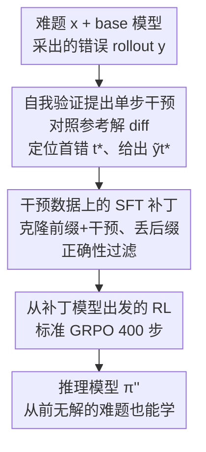

# InT: Self-Proposed Interventions Enable Credit Assignment in LLM Reasoning

**会议**: ICLR 2026  
**OpenReview**: [https://openreview.net/forum?id=YAhTj2VgBw](https://openreview.net/forum?id=YAhTj2VgBw)  
**领域**: LLM推理  
**关键词**: 信用分配, 强化学习, 自我验证, 单步干预, 数学推理

## 一句话总结
针对 outcome-reward RL「整条轨迹一起奖惩、无法区分对错步骤」的信用分配难题，本文让模型对照参考答案自我验证、给错误轨迹的第一处错误提出一个**单步纠正干预**，再用 SFT 把这些干预「打补丁」进基模型后接 RL，在 4B 模型上把 IMO-AnswerBench 准确率提了近 14%，反超 gpt-oss-20b。

## 研究背景与动机

**领域现状**：用结果奖励的强化学习（outcome-reward RL，如 GRPO）做后训练，已经被证明能显著提升大模型的推理能力。它只看最终答案对不对，给一个二值奖励 $r(x,y)\in\{0,1\}$，然后按 prompt 内的组平均算出优势 $A(x,y_i)=r(x,y_i)-\frac{1}{n}\sum_j r(x,y_j)$。

**现有痛点**：这种奖励是「整条轨迹一锅端」的。优势为正时，回答里**每一步都被一致地加强**；优势为负时，**每一步都被一致地压制**。后果是：失败轨迹里那些其实正确的中间步骤被错杀，成功轨迹里那些无关紧要甚至投机的步骤被强化。在动辄上百步、单条 rollout ~7k token 的长推理场景里，这种噪声会淹没真正的学习信号，导致训练奖励早早 plateau、回答越来越啰嗦或被提前截断。更糟的是，在足够难的题上根本没有一条正确 rollout（作者统计奥赛级题目里 >80% 的 rollout 组开局一条都对不了），优势全塌成 0，RL 完全没有信号可学。

**核心矛盾**：要解决这个问题就得做**信用分配**（credit assignment）——精确定位轨迹在哪一步走偏、只惩罚那一步、同时保住前面正确的步骤。但传统做法要么训练步级价值函数 / 过程奖励模型（PRM），代价极高且训练不稳定（Qwen2.5-Math-PRM 用了约 300 万条 rollout）；要么用分支 rollout 估计每步价值，开销同样难以承受。而且就算有了准确的价值函数，「在巨大的后续步骤空间里搜出一个更好的替代步骤」本身又是一个难题。

**本文目标**：不训练价值函数、不改 RL 目标、不依赖更强的外部模型，就能对失败轨迹做精细信用分配，尤其是从「全是错答案」的难题里榨出可用信号。

**切入角度**：作者抓住一个**任务难度的非对称性**——「从零生成正确解」远难于「对照一份参考解去逐步验证哪里错了」。base 模型常常自己解不出题，却能在给定标准答案时看出自己的推理在哪一步偏了。于是把信用分配这个难题，归约成模型对自己轨迹做一次「文本 diff」式的自我验证。

**核心 idea**：让模型对照参考解、找出错误轨迹里**第一处出错的步骤** $y_{t^*}$，自己提出一个**单步纠正干预** $\tilde{y}_{t^*}$ 去替换它；再用 SFT 把「前缀 + 干预」克隆进模型当作初始化，最后接标准 RL。即 **InT（Intervention Training）**。

## 方法详解

### 整体框架
InT 的目标是给基模型「打补丁」：让它学会避开自己原本会犯的那些错误步骤，从而为后续 RL 提供一个更好的起点。整条 pipeline 是离线数据采集 → SFT 补丁 → RL 三段串行。对每道难题 $x$，先用 base 模型采一条 rollout $y\sim\pi(\cdot|x)$；若答错，就让同一个模型对照参考解自我验证，定位第一处错误 $t^*$ 并提出单步干预 $\tilde{y}_{t^*}$，把「错误前缀 + 干预」$(y_{<t^*},\tilde{y}_{t^*})$ 收进干预数据集 $\mathcal{D}_{\text{InT}}$；然后用 SFT 把这些干预内化进模型得到 $\pi'$；最后从 $\pi'$ 出发跑标准 GRPO。关键在于：干预很短（多在 200 token 以内，而完整 rollout ~7k token），所以 InT 训练用的轨迹绝大多数 token 仍来自 base 模型本身，是**高度 on-policy** 的，这让它成为远比「直接克隆参考解」更优的 RL 初始化。

### 关键设计

**1. 自我验证提出单步干预：用「验证比生成易」的非对称性替代价值函数**

这一步直击「定位错误步骤」与「搜索更优替代步骤」两个传统难题。作者不训练任何 PRM，而是用一次两阶段 prompting 让 base 模型自己干完。第一阶段：给定模型自己生成的错误轨迹（按 `\n\n` 切成步骤序列 $y=(y_0,\dots,y_T)$）和一份参考解，指示模型逐步验证每步逻辑是否正确，显式输出可能出错的步骤编号。第二阶段：只针对**第一处错误步骤** $y_{t^*}$ 生成一个替代步骤 $\tilde{y}_{t^*}$。只修第一处错是有讲究的——要把错答案救成对的，第一处错必须被纠正；而后面的错误往往是早期错误的连锁后果，一旦早错被改、轨迹大概率就不再沿原路走，后面的错也就不必单独修。整个定位+干预通过一次查询 $\sim\pi(\cdot\,|\,x,y,p_{\text{InT}})$ 完成，全程不用更强的模型，纯靠同一个 base 模型在「指令遵循 / 验证 / 生成」三种任务上的难度落差来做信用分配。作者还做了泄漏防护：若干预里直接出现了最终答案就丢弃这条，免得模型学成「背答案」而非「补全推理」。实测这一步极其有效：把错误前缀拼上干预后继续采样 $\pi(\cdot|x,y_{<t^*},\tilde{y}_{t^*})$，平均奖励从 0.0713% 飙到 1.56%（约 22×），能解出的不同题目从 29/334 涨到 80/334。

**2. 干预数据上的 SFT 补丁：克隆「前缀+干预」、丢弃后缀、再加正确性过滤**

拿到干预后，「该用 intervention-guided 轨迹的哪些部分来 SFT」是核心设计问题，作者用消融逐一定下来。其一，**必须连错误前缀 $y_{<t^*}$ 一起克隆**，不能只克隆那一步干预——因为若不强化前缀，微调后模型在同一题上可能生成不同的前缀、犯出别的错，使得原来那个干预 $\tilde{y}_{t^*}$ 完全不对症（去掉前缀克隆，235 题里少解 40 道）。其二，**要丢掉正确后缀 $\tilde{y}_{>t^*}$**：克隆一条已经正确的后缀会缩窄后续 RL 可探索的序列空间、限制探索，实测带上后缀反而把解题数几乎砍半（202→111）。其三，**只保留那些在 32 次续写里至少能得到一次正确答案的干预**（正确性过滤），又多解了 6 道。最终 SFT 目标只对前缀和干预步求似然：

$$\nabla_\pi J(\pi)\approx\mathbb{E}_{x\sim\mathcal{D}_{\text{train}},\,y\sim\tilde\pi(\cdot|x)\;\text{s.t.}\;r(x,y)=0}\Big[\nabla_\pi\log\pi(\tilde{y}_{t^*}\,|\,y_{<t^*})+\sum_{t=0}^{t^*}\nabla_\pi\log\pi(y_t\,|\,y_{<t})\Big].$$

这一步本质是选择性地压低 base 模型原本会产生的那个错误步骤的似然，把概率质量挪向更优的步骤。补丁后模型在 train/test 两个集上 pass@k（$k=16,\dots,1024$）全面抬高，且干预 token 的似然显著上升，说明模型在没见过的测试题上也学会了自发产生「干预式」纠正步骤。

**3. 从补丁模型出发的 RL：靠 on-policy + 低熵初始化让 GRPO 真正学得动**

补丁完成后接标准 outcome-reward RL（GRPO 跑 400 步），但起点已截然不同：模型大概率避开了 base 会犯的错误、保留了原本正确的行为，RL 从这个 checkpoint 出发会进一步放大纠正行为、压制无效推理段，并能从「以前一条都对不了」的题上提取出信号。InT 比其它「利用参考解」的方案好的根因，在于它训练用的轨迹是**最 on-policy** 的：因为干预很短、整条轨迹绝大多数 token 仍出自 base 模型，所以它在 base 分布下负对数似然（NLL）最低、下一 token 分布的熵最接近 base（InT 0.29 vs base 0.26），而直接克隆参考解会把熵抬到 1.66。高熵初始化对后续 RL 是灾难——它让 rollout 过于随机、阻碍有效探索；训久了又会扭曲 base 已有的推理模式（off-policy 轨迹容易被死记硬背）。InT 既不掉进 off-policy SFT 的记忆陷阱，又保住了可探索性，所以 RL 阶段能持续涨点。

### 损失函数 / 训练策略
SFT 阶段用式 (2)：只对错误轨迹（$r(x,y)=0$）的前缀 $y_{<t^*}$ 与干预步 $\tilde{y}_{t^*}$ 做似然最大化，丢弃后缀。RL 阶段用标准 GRPO，二值结果奖励，跑 400 步。基模型为 Qwen3-4B-Instruct-2507。难题池由 Polaris / AceReason-Math / Omni-MATH / IMO-AnswerBench 经「零准确率过滤」（64~128 次 rollout 全错）构造，约 4500 道，生成干预并过滤后得 1076 道带干预的题。

## 实验关键数据

### 主实验
在四个奥赛级数学 benchmark（均在基模型发布后才公开，降低污染风险）上的 pass@1 / pass@8（128 次 rollout 估计）：

| 方法（Qwen3-4B-Instruct-2507） | IMO-AnswerBench | HMMT'25 Nov | AMO-Bench | Apex Shortlist | 平均 |
|--------|------|------|------|------|------|
| Base | 11.68 | 41.61 | 26.24 | 20.79 | 21.17 |
| + RL（标准 GRPO） | 23.46 | 46.46 | 35.21 | 22.72 | 28.26 |
| + Hint-guided RL | 16.89 | 47.27 | 33.34 | 22.23 | 28.56 |
| + SFT(参考解) + RL | 11.56 | 27.45 | 25.19 | 20.51 | 20.76 |
| + SFT(自反思) + RL | 15.53 | 38.65 | 36.72 | 23.93 | 27.60 |
| **+ InT + RL（本文）** | **25.62** | **49.77** | 36.16 | **28.22** | **33.72** |

InT 平均 33.72，相对 base（21.17）提升约 59%，相对标准 SFT+RL（28.26）提升约 19%。IMO-AnswerBench 上 25.62 是 base（11.68）的两倍多、近 14 个百分点的绝对提升，且在 16K token 预算下反超 gpt-oss-20b（23.36，32K 预算）和 DeepSeek-R1-0528-Qwen3-8B（18.44）。

### 消融实验
SFT 设计选择（DeepScaleR 子采的 235 题）：

| 配置 | Coverage | Accuracy | 说明 |
|------|---------|---------|------|
| 前缀 + 无后缀 + 过滤（最终方案） | 202/235 | 7.71% | 完整配置 |
| - 去掉正确性过滤 | 196/235 | 5.06% | 少解 6 道 |
| - 去掉前缀克隆 | 162/235 | 2.87% | 少解 40 道，掉点最狠 |
| + 加回后缀 | 111/235 | 2.31% | 解题数几乎砍半 |

干预本身有效性（334 题）：续写时拼上干预把平均奖励从 0.0713% 提到 1.56%（22×），coverage 从 29/334 提到 80/334。

### 关键发现
- **前缀克隆贡献最大**：去掉它在 235 题里少解 40 道，远超其它选项，印证「不强化前缀则干预对不上后续可能产生的新错误」的假设。
- **后缀有害**：克隆正确后缀会限制 RL 探索空间，解题数几乎减半——这与「要给 RL 留探索余地」的直觉一致。
- **on-policy 程度决定成败**：各方法 RL 后的性能排序紧跟其 SFT 轨迹在 base 下的 NLL 排序，InT 的 NLL 最低、熵最接近 base（0.29 vs 1.66 of 参考解 SFT），因而 RL init 最稳。直接 SFT 参考解 + RL 平均仅 20.76，甚至**低于未微调的 base**（21.17），说明盲目克隆 off-policy 参考解会抑制下游探索。
- **零优势比大幅下降**：InT+RL 在难题训练集上既给出最高训练奖励，又把「从不产生正确 rollout 的题目占比」（zero-advantage ratio）压得最低，让以前没信号的题也能学。

## 亮点与洞察
- **把「信用分配」归约成「文本 diff」**：核心洞察是验证（对照参考解找错）比生成（从零解题）容易得多，于是用同一个弱模型的验证能力替代昂贵的价值函数 / PRM。这个「难度非对称性」视角可迁移到任何「有参考答案但模型解不出」的任务。
- **干预短 → 自然 on-policy**：一个常被忽略的工程巧思——只改一步、保留模型自己的前缀，使训练轨迹天然贴近 base 分布，避开了 off-policy SFT「高熵 / 记忆化 / 扭曲已有技能」三连坑。这把「SFT 该克隆什么」从经验问题变成了可量化（NLL / 熵）的设计原则。
- **只修第一处错**：基于「后错多是前错的连锁」这一推理结构假设，把多步纠错简化为单步，既省算力又避免引入冗余监督，值得借鉴到其它链式推理纠错场景。

## 局限与展望
- **依赖参考解**：方法假设每道训练题都有人写或 Gemini 生成的参考解，在没有标准答案的开放任务（如证明题、开放式生成）上不直接适用——作者也确实把无法自动验证答案的题过滤掉了。
- **验证能力的天花板**：干预质量受 base 模型自我验证能力限制，作者也观察到 30B 模型提出的干预准确率约为 4B 的 2 倍；若 base 模型连「对照答案找错」都做不好，整套流程会退化。
- **只在数学推理上验证**：实验全在奥赛级数学 benchmark 上，能否推广到代码、科学问答等其它长程推理任务尚待检验。
- **「第一处错」检测本身可能出错**：定位首错和判断「后错都是连锁」都由同一个模型完成，存在误判风险；正确性过滤能缓解但不能消除。

## 相关工作与启发
- **vs 过程奖励模型（PRM）**：PRM 路线要训练步级价值函数、采集海量 rollout（Qwen2.5-Math-PRM 约 300 万条）且难题上常失效；InT 完全绕开价值函数，用一次自我验证 + SFT 就做了信用分配，更简单可扩展。
- **vs 直接 SFT 参考解**：参考解是高度 off-policy 的，克隆它会抬高熵、扭曲 base 推理模式，本文实测 SFT(参考解)+RL 反而低于 base；InT 通过「短干预 + 保留前缀」保持 on-policy，是关键区别。
- **vs 自反思（Self-Reflection）基线**：自反思让模型重写整条错误解，InT 只提单步干预。两者都用到参考解，但自反思泛化更差（IMO-AnswerBench 15.53 vs InT 25.62），因为整条重写仍偏 off-policy。
- **vs Hint-guided RL**：提示引导 RL 在简单 benchmark 上接近，但平均（28.56）明显低于 InT（33.72），尤其在最难的 IMO-AnswerBench 上（16.89 vs 25.62）差距拉开。

## 评分
- 新颖性: ⭐⭐⭐⭐⭐ 用「验证易于生成」的非对称性把信用分配归约为自我 diff + 单步干预，绕开 PRM，视角新颖。
- 实验充分度: ⭐⭐⭐⭐ 四个新 benchmark + 多个强基线 + on-policy/熵/pass@k 多角度分析，SFT 设计消融扎实；但仅限数学单一领域。
- 写作质量: ⭐⭐⭐⭐ 动机推导清晰，图表与 takeaway 框配合好；部分实验细节散落附录。
- 价值: ⭐⭐⭐⭐⭐ 用 4B 模型反超 20B 开源模型，给「从全错难题里榨信号」提供了简单可复现的范式。

<!-- RELATED:START -->

## 相关论文

- [\[NeurIPS 2025\] Stop Summation: Min-Form Credit Assignment Is All Process Reward Model Needs for Reasoning](../../NeurIPS2025/llm_reasoning/stop_summation_minform_credit_assignment_is_all_process_rewa.md)
- [\[ICLR 2026\] Are Reasoning LLMs Robust to Interventions on Their Chain-of-Thought?](are_reasoning_llms_robust_to_interventions_on_their_chain-of-thought.md)
- [\[ICLR 2026\] Linking Process to Outcome: Conditional Reward Modeling for LLM Reasoning](linking_process_to_outcome_conditional_reward_modeling_for_llm_reasoning.md)
- [\[ICLR 2026\] Slow-Fast Policy Optimization: Reposition-Before-Update for LLM Reasoning](slow-fast_policy_optimization_reposition-before-update_for_llm_reasoning.md)
- [\[NeurIPS 2025\] Segment Policy Optimization: Effective Segment-Level Credit Assignment in RL for Large Language Models](../../NeurIPS2025/llm_reasoning/segment_policy_optimization_effective_segment-level_credit_assignment_in_rl_for_.md)

<!-- RELATED:END -->
