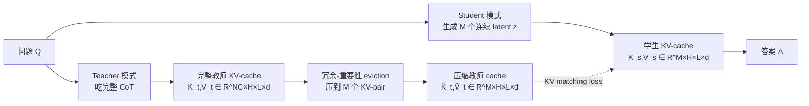

# KaVa: Latent Reasoning via Compressed KV-Cache Distillation

**会议**: ICLR 2026  
**OpenReview**: [https://openreview.net/forum?id=ePrhcLbtGv](https://openreview.net/forum?id=ePrhcLbtGv)  
**代码**: 待确认  
**领域**: LLM 推理 / 隐式推理 / KV-Cache 压缩蒸馏  
**关键词**: latent reasoning, KV-cache distillation, continuous thought, CoT compression, self-distillation  

## 一句话总结
KaVa 把教师模型从显式 CoT 算出的 KV-cache 先做冗余-重要性压缩、再直接蒸馏进学生的连续隐式推理轨迹，用"逐步对齐 KV"这一新监督信号补上隐式推理长期缺乏的中间步监督，从而在自然语言推理 trace 上同时拿到 CoT 的精度和隐式推理的效率。

## 研究背景与动机
**领域现状**：显式思维链（CoT）让 LLM 在数学、科学、代码等多步推理上表现优异，但冗长的 trace 带来巨大的 KV-cache 增长和推理开销，还常常夹带风格化噪声甚至"听起来合理但逻辑错误"的内容。隐式推理（latent reasoning）应运而生——把推理过程内化到连续隐空间，用一串连续 latent token 替代显式文字 trace，从而大幅压缩生成 token 数与 KV-cache 占用。

**现有痛点**：隐式推理最大的软肋是**缺乏对内部 thought 的直接监督**。latent trace 在训练时不可观测，已有方法只能间接补救——iCoT 用课程学习逐步移除 CoT，Coconut 把上一步隐藏态直接喂回当输入，CODI 用单个蒸馏 token 对齐答案前一刻的隐藏激活（即只监督"端点"而非整条轨迹），PCCoT 用 Jacobi 迭代并行刷新 latent token。这些方法在"方程式化"的短模板 trace 上还行，一旦换成更贴近真实工作负载的长自然语言 trace，内部读出就变得脆弱、泛化变差。

**核心矛盾**：CoT 信息其实高度冗余——已有工作（R-KV、KeyDiff）证明 KV-cache 砍到 10–30% 几乎不掉精度，说明推理的"本质动力学"藏在可压缩的结构里而非不可或缺的文字里。那么能不能把这份压缩后的 cache 当作监督信号喂给隐式学生？难点在于：KV 压缩的 eviction 是**逐层逐头独立**做的，压缩后的 KV 向量丢失了与具体输入 token 的对应关系，传统"对齐 token 激活/逐层隐藏态"的蒸馏方式直接失效。

**本文目标**：首次让隐式推理学生成功吸收"压缩教师 KV-cache"里那份抽象、无 token 对应的知识，给隐式轨迹提供逐步的内部监督。

**核心 idea**：**[KV 空间监督]** 隐式 token 的连续高维表示天然具备吸收"抽象 cache 结构"的表达力——既然压缩 KV 无法在 token 层对齐，那就**直接在 KV 空间逐层逐步匹配**：让学生每一步生成的 K/V 去逼近压缩后的教师 K/V，从而把"think like 一份自己显式推理的紧凑 cache"这件事教给学生，同时完整保留隐式推理的推理期效率。

## 方法详解

### 整体框架
KaVa 采用**自蒸馏**：同一个 backbone 在 teacher 模式（吃完整 CoT，建逐层逐头 KV-cache）和 student 模式（生成连续 latent thought）之间切换。训练时教师 cache 先经过"冗余-重要性感知的 eviction"压缩到和 latent 预算等长，再用 KV-matching loss 把学生每一步的 K/V 对齐到压缩目标；推理时学生直接生成这份压缩 cache，无需先吐出完整 CoT。整套目标 = 学生答案损失 + 教师损失 + CODI 蒸馏 + KV 蒸馏。

### 关键设计

**1. KV-cache 蒸馏：把"压缩 cache"当作逐步监督信号** —— 这是全文的灵魂。隐式推理把显式 trace $C$ 换成 $M$ 个连续 latent token $Z=\{z_i\}_{i=1}^M$，以 `<bot>` 开头、`<eot>` 结尾，一个可训练投影层把连续 embedding 映回输入 embedding 空间来预测下一 token。训练目标在 CODI 自蒸馏基础上叠加 KV 蒸馏：

$$\mathcal{L}_{\text{KaVa}}=-\tfrac{1}{N_A}\log p(A|Z,Q)-\tfrac{1}{N_A+N_C}\log p(A,C|Q)+\alpha_1\mathcal{L}_{\text{CODI}}+\alpha_2\mathcal{L}_{\text{KV}}$$

前两项分别是学生（只看 latent）和教师（看完整 trace）的交叉熵，$\mathcal{L}_{\text{CODI}}$ 沿用 Shen et al. 对答案前一 token 隐藏态的 L1 对齐，$\mathcal{L}_{\text{KV}}$ 是新增的核心项。关键洞察是：CODI 只在单个"端点 token"上监督，信号稀薄；而 KV 蒸馏在**每一层、每一步**都给监督，密度高得多。值得注意的是在更长的 MetaMathQA 上 CODI 损失常引发训练不稳定，作者干脆令 $\alpha_1=0$，完全靠 KV 蒸馏撑起监督。

**2. 长度对齐 + 冗余-重要性 eviction：把教师 cache 压到 latent 预算** —— 教师 cache 长度 $N_C$ 远大于学生 latent 数 $M$，必须先压缩对齐。KaVa 改造 R-KV，对每个 token $i$、头 $h$、层 $l$ 算一个融合分数，按 top-$M$ 选 KV-pair：

$$S_{i,h,l}=\lambda\,\underbrace{I_{i,h,l}}_{\text{重要性}}+(1-\lambda)\,\underbrace{R_{i,h,l}}_{\text{冗余}},\quad \lambda\in[0,1]$$

重要性 $I$ 来自答案 token 对教师 keys 的注意力分数 $A=\mathrm{softmax}(Q\cdot K_t^\top/\sqrt{d})$ 沿答案维聚合——巧妙之处是这些注意力分数在教师前向时已顺带算出，几乎零额外开销（GQA 设定下对一组 query 先 MaxPool）；冗余 $R$ 是所有 key 向量两两余弦相似度的均值再 softmax 归一。eviction **只在训练时**用（推理时学生直接生成压缩 cache），所以可以"作弊"地用训练数据里的答案 token 来算重要性。消融显示 $\lambda=0.1$（重要性+冗余结合）优于纯余弦（$\lambda=0$）或纯注意力（$\lambda=1$），也优于"直接裁右边只留前 $M$ 个 token"的朴素 crop baseline。

**3. 直接匹配 K/V 而非 token 激活 + Jacobi 并行解码** —— 由于逐层逐头独立 eviction 后压缩 cache 已无 token 对应关系，传统按 token 对齐激活的蒸馏不再适用，KaVa 改为**直接蒸馏 keys 和 values**，K、V 等权相加：

$$\mathcal{L}_{\text{KV}}=\tfrac{1}{2M}\big(\|\,\mathrm{sg}[\tilde K_t]-K_s\|_p^p+\|\,\mathrm{sg}[\tilde V_t]-V_s\|_p^p\big)$$

$\mathrm{sg}$ 为 stop-gradient，$p=1$ 即 L1、$p=2$ 即 MSE（消融发现 Llama-1b + GSM8k-AUG 下 L1 更稳，其他数据集 MSE 有时更好）。为解决 latent token 串行生成难以并行训练的问题，KaVa 沿用 PCCoT 的 Jacobi 迭代：用 $T$ 次迭代同时刷新全部 latent token（取最后一次迭代 $T$ 的 cache 来蒸馏），把前向次数从 $M$ 降到 $T$（实验取 $M=24,\,T=3$）；$T=M$ 退化为 CODI，$T=0$ 退化为 Pause Token。

## 实验关键数据

### 主实验表格
在 LLaMA3.2-1B/3B、Qwen2.5-0.5B 上 LoRA 微调，对比强隐式 baseline（CODI、PCCoT、iCoT、Coconut），Full CoT 为上界、No-CoT 为下界。准确率（in-distribution GSM8k + zero-shot GSM8k-Hard/SVAMP）：

| 模型 / 数据集 | 方法 | GSM8k (AUG) | GSM8k (AUG-NL) |
|---|---|---|---|
| Qwen2.5-0.5B | Full CoT (上界) | 50.6 | 48.5 |
| | CODI | 37.5 | 20.2 |
| | PCCoT | 20.5 | 19.1 |
| | **KaVa** | **46.9** | **44.4** |
| LLaMA3.2-1B | Full CoT (上界) | 63.4 | 53.2 |
| | CODI | 53.9 | 50.1 |
| | PCCoT | 54.2 | 51.1 |
| | **KaVa** | **56.5** | **55.7** |
| LLaMA3.2-3B | Full CoT (上界) | 73.2 | 68.4 |
| | CODI | 61.0 | 55.9 |
| | PCCoT | 54.7 | 47.6 |
| | **KaVa** | **65.7** | **60.0** |

关键观察：KaVa 全面超越隐式 baseline，且**从方程式 trace（AUG）切到自然语言 trace（AUG-NL）时掉点最小**——Qwen-0.5B 上 CODI 从 37.5 暴跌到 20.2，KaVa 只从 46.9 到 44.4；LLaMA-1B 上 KaVa 在 NL 设定（55.7）甚至逼近其 AUG-only 上界，说明 trace 越长（压缩越激进）KaVa 的 KV 监督优势越明显，可扩展性更好。效率上 KaVa 复用 PCCoT 的 $T=3$ 迭代，每题前向次数比 Full CoT 减少 **62%–92%**。

### 消融实验表格
LLaMA3.2-1B 上三随机种子均值：

| 消融项 | 设置 | GSM8k |
|---|---|---|
| 组件 | 完整（KV 蒸馏 + 投影层） | 56.5 |
| | 去 CODI 蒸馏损失 | 52.8 |
| | 去投影层 | 52.2 |
| 是否去 trace 末步 | Drop Last（KV 匹配 + 蒸馏） | 56.5 |
| | All Steps（KV 匹配 + 蒸馏） | 51.2 |
| | All Steps（仅蒸馏，无 KV）= PCCoT | 47.2 |

另有图示消融：eviction 方法上 R-KV（$\lambda=0.1$）> cosine-only / attn-only / crop；KV 损失系数与 L1/MSE 类型对结果敏感需调；latent 数 $M$ 较大（12/24）时迭代 $T$ 超过某阈值反而掉点；训练数据量（砍到 50%/25%）对性能影响显著。

### 关键发现
- **KV 蒸馏能自动补偿"端点 token 不可靠"**：CODI 必须靠"删掉 trace 最后一步"来保证蒸馏 token 信息量；当强行在所有步上训练时，纯蒸馏的 PCCoT 暴跌到 47.2，而带 KV 匹配的 KaVa 只到 51.2，说明逐步 KV 监督在缺乏好端点时依然撑得住。
- **压缩 cache 确实是富监督信号**：即便去掉投影层或 CODI 损失，KaVa 仍远超 No-CoT，证明"逐层逐头压缩后的 KV"本身携带了可用的逐步推理知识。
- **重要性+冗余双准则缺一不可**：单看注意力或单看相似度都不如二者结合。

## 亮点与洞察
- **把"KV-cache 压缩"从推理加速工具重新定位为监督信号源**：以往 R-KV/KeyDiff 等是推理时省内存的，KaVa 反过来把"learning-free 压缩出的 cache"当成训练标签，思路新颖且复用现成压缩器、零训练成本。
- **直面"压缩后无 token 对应"的硬骨头**：逐层逐头 eviction 破坏了 token 对齐，作者没有回避而是论证连续 latent 的高维表达力恰好能吸收这种抽象结构，并用"直接匹配 K/V"绕开传统激活对齐的失效。
- **逐步监督 > 端点监督**：相比 CODI 单 token 蒸馏，KaVa 在每层每步给信号，密度更高，正好解释了它在长自然语言 trace 上掉点更小。
- **重要性分数零开销**：答案 token 的注意力在教师前向时已算出，复用即可，工程上很经济。

## 局限与展望
- **只验证数学推理**：实验集中在 GSM8k 系列、MetaMathQA、MATH500 等数学基准，是否迁移到代码、常识、多跳问答等其他推理类型未知。
- **模型规模偏小**：最大只到 LLaMA3.2-3B，且全程 LoRA 微调，更大 backbone 与全参训练下 KV 监督是否同样有效待验证。
- **依赖压缩器与超参敏感**：性能受 eviction 方法、$\lambda$、KV 损失类型（L1/MSE）、系数、$M$/$T$ 等多个超参影响，需要逐数据集 sweep，落地需调参成本。
- **训练时仍需完整 CoT**：教师模式要吃完整 trace 来建 cache，训练期开销并未省，省的是推理期；对没有现成 CoT 标注的任务不直接适用。
- **可解释性初探**：论文有一节尝试解码 latent trace，但隐式 thought 的可读性与可控性仍是开放问题。

## 相关工作与启发
- **隐式推理谱系**：Pause/Filler token（隐式增算）→ iCoT（课程式移除 CoT）→ Coconut（连续 thought 喂回）→ CODI（端点自蒸馏）→ PCCoT（Jacobi 并行）。KaVa 的差异化在于"逐步 KV 空间监督"，正面解决隐式推理缺监督的核心痛点。
- **KV-cache 压缩谱系**：R-KV（重要性+冗余）、KeyDiff（key 相似度）、HeadKV、PyramidKV、LESS、Eigen Attention 等。KaVa 把这些"推理时省显存"的工具反用为"训练时造监督"。
- **与 KV-Distill 对比**：KV-Distill 学一个 adaptor 压长上下文 cache 并用输出级 KL 对齐；KaVa 用 learning-free 压缩器，把压缩 cache 当蒸馏目标直接灌进 latent 轨迹，使学生推理时能直接生成压缩 cache、跳过昂贵的完整 CoT。
- **启发**：当两个表示空间无法做 token 级对齐时，"换一个更抽象的中间表示（如 KV）直接匹配"是一条值得借鉴的蒸馏路径；同样思路或可用于跨模态/跨架构蒸馏。

## 评分
- 新颖性: ⭐⭐⭐⭐⭐ 首次证明"逐层逐头压缩、丢失 token 对应的 KV-cache"可作隐式推理的逐步监督信号，把压缩工具反用为监督源，角度独到。
- 实验充分度: ⭐⭐⭐⭐ 三种 backbone、多数据集、效率-精度 Pareto、丰富消融（组件/eviction/损失/迭代/数据量）扎实；但局限于数学任务、模型 ≤3B、仅 LoRA。
- 写作质量: ⭐⭐⭐⭐ 动机层层递进、公式清晰、图示到位，把"为什么传统蒸馏失效、为什么直接匹配 KV 可行"讲得明白。
- 价值: ⭐⭐⭐⭐ 同时兼顾 CoT 精度与隐式推理效率，对端侧/受限部署有实际意义，且为"压缩即监督"开了一个可延展的方向。

<!-- RELATED:START -->

## 相关论文

- [\[ICLR 2026\] Beyond Speedup - Utilizing KV Cache for Sampling and Reasoning](beyond_speedup_-_utilizing_kv_cache_for_sampling_and_reasoning.md)
- [\[ICLR 2026\] Bottlenecked Transformers: Periodic KV Cache Consolidation for Generalised Reasoning](bottlenecked_transformers_periodic_kv_cache_consolidation_for_generalised_reason.md)
- [\[ICLR 2026\] SkillFactory: Self-Distillation for Learning Cognitive Behaviors](skillfactory_self-distillation_for_learning_cognitive_behaviors.md)
- [\[ICML 2026\] ForesightKV: Optimizing KV Cache Eviction for Reasoning Models by Learning Long-Term Contribution](../../ICML2026/llm_reasoning/foresightkv_optimizing_kv_cache_eviction_for_reasoning_models_by_learning_long-t.md)
- [\[ICLR 2026\] Probing to Refine: Reinforcement Distillation of LLMs via Explanatory Inversion](probing_to_refine_reinforcement_distillation_of_llm_reasoners_via_explanatory_in.md)

<!-- RELATED:END -->
