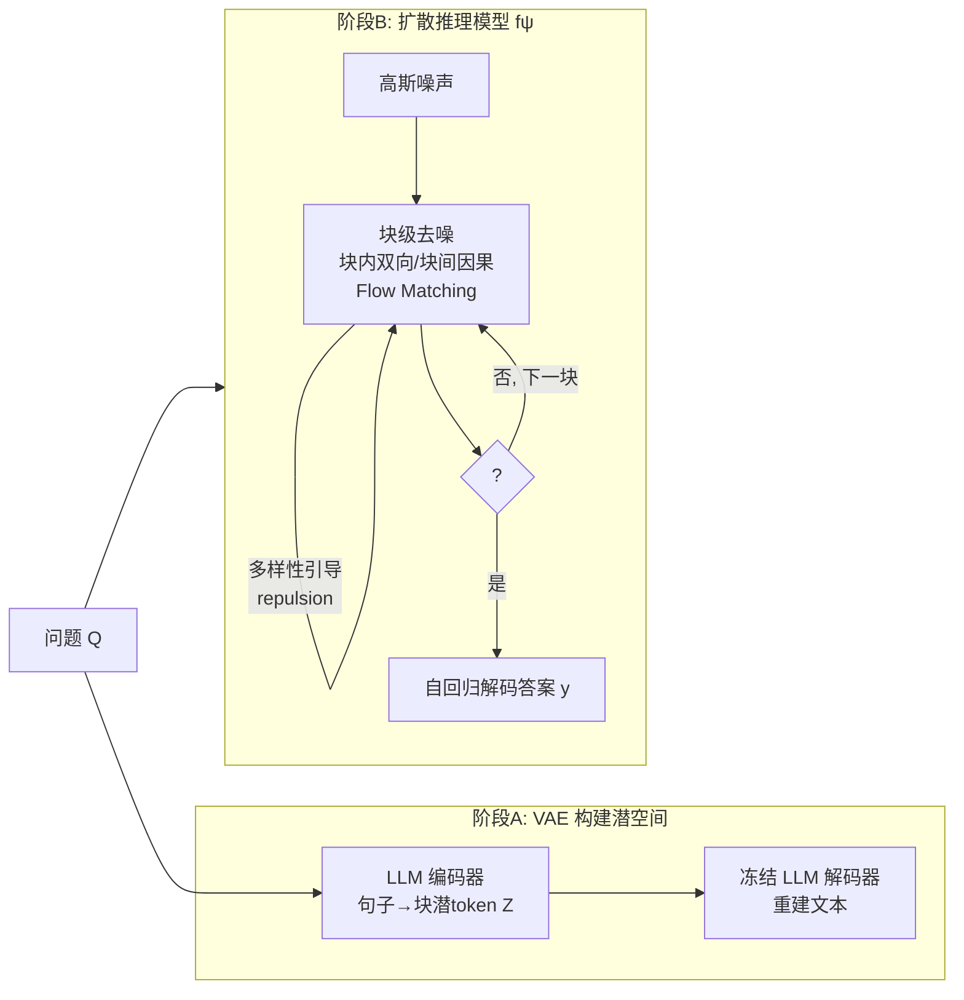

# LaDiR: Latent Diffusion Enhances LLMs for Text Reasoning

**会议**: ICLR 2026  
**OpenReview**: [https://openreview.net/forum?id=z5cPEZ4n6i](https://openreview.net/forum?id=z5cPEZ4n6i)  
**代码**: 待确认  
**领域**: LLM 推理 / 潜空间扩散推理  
**关键词**: 潜空间推理, 扩散模型, Flow Matching, VAE, 思维 token, 多样性引导, 测试时计算  

## 一句话总结
LaDiR 用 VAE 把每个推理步骤压缩成一"块"连续的思维 token，再用块级潜空间扩散（flow matching）对这些 token 反复去噪精炼，让 LLM 在语义层面做可迭代修正与并行多样探索，同时在数学、代码、规划任务上一致超越自回归 / 离散扩散 / 潜空间推理基线。

## 研究背景与动机
**领域现状**：LLM 靠链式思维（CoT）展现推理能力，主流是自回归（AR）逐 token 解码；扩散语言模型近年也被引入文本生成，看重的是并行化与全局连贯。潜空间扩散（LD4LG、PLANNER 等）则把扩散放到文本自编码器的潜空间里，但这些工作几乎都只关心"流畅生成"。

**现有痛点**：① AR 的顺序生成天然无法回头改写早先 token，自我修正低效且困难；② 离散 CoT 只能生成一条线性思维链，限制了多样性、难以探索多个有效解；③ 离散扩散语言模型虽能并行，但本质只是把 `[MASK]` 转成离散文本 token，无法在语义层面做自我精炼；④ 已有潜空间推理方法（如 Coconut）在数学基准上甚至打不过 AR CoT 微调，存在潜空间塌缩、误差累积问题。

**核心矛盾**：表层 token 级的精炼 ≠ 深层语义级的推理修正——既要连续表示的表达力（可迭代精炼、可探索多样轨迹），又要保留可解释性和可控的推理步数。

**本文目标**：把扩散模型的迭代精炼能力真正用来"增强 LLM 的推理"，而非仅做流畅生成。

**核心 idea**：**「语义级潜空间 + 块级扩散」**——先用 β-VAE 把每个推理句子编码成一块连续思维 token，构建结构化、可解释的潜推理空间；再训练一个潜空间扩散模型对这些块逐块去噪，块内双向注意力、块间因果注意力；推理时通过加大初始噪声 + 多样性梯度引导，在一个 batch 内并行生成多条互相排斥的推理轨迹，最后自回归解码出文本答案。

## 方法详解

### 整体框架
LaDiR 把"推理"与"答题"解耦成两个组件、两阶段训练：(1) 一个 **VAE** 把 CoT 按句切块、每句编码成 $L_b$ 个连续潜思维 token，构建语义潜空间；(2) 一个从同一预训练 LLM 初始化的**潜空间扩散推理模型** $f_\psi$，用 flow matching 对潜块逐块去噪，再以 LM head 自回归生成最终答案文本。推理时从高斯噪声出发迭代去噪出潜块，遇到 `<SOA>` 特殊 token 即停止推理、转入答案生成。

### 关键设计

**1. 一句一块的结构化潜空间：用 β-VAE 把推理步骤编码成可解释的思维 token。** 作者用前缀 "The answer is" 把数据切成 CoT $c$ 与答案 $y$，再把 $c$ 按句拆成 $N$ 个块，每块 $Z^{(b)}=\{z^{(b)}_1,\dots,z^{(b)}_{L_b}\}$，使每个推理步骤在潜空间里被局部化。VAE 编码器从预训练 LLM 初始化并全参微调，配 $L_b$ 个可学习 embedding，末层隐状态过两个线性投影得到均值方差并采样 $Z^{(b)}\sim\mathcal{N}(\mu,\sigma^2)$；解码器是**冻结**的预训练 LLM，条件于潜块重建文本。训练用 β-VAE 目标 $L_{\beta\text{-VAE}}=\mathbb{E}_{q_\phi(z|x)}[-\log p_\theta(x|z)]+\beta\,\mathrm{KL}(q_\phi(z|x)\|p(z))$，较大的 $\beta$ 换更结构化的潜空间。为让潜空间平滑、抗扰，训练时还做两种增强：给潜 token 注入各向同性高斯噪声 $z'^{(b)}_i=z^{(b)}_i+\eta_i,\ \eta_i\sim\mathcal{N}(0,k^2 I)$（$k=3$ 最佳），以及以 $p=0.3$ 随机替换输入 token，逼编码器学到对改写/笔误不变的语义而非词形。

**2. 块级潜空间扩散 + 混合注意力：把"思维链的因果性"装进去噪过程。** 推理模型从同一 LLM 初始化，用 flow matching 学习对潜块去噪。Flow matching 在干净数据 $z_0$ 与噪声 $\epsilon$ 间构造插值路径 $z_t=(1-t)z_0+t\epsilon$，目标速度场 $u^\star(z_t,t)=\epsilon-z_0$，网络 $u_\theta$ 最小化 $L_{FM}=\mathbb{E}\|u_\theta(z_t,t)-u^\star(z_t,t)\|^2$；推理时从 $z_1\sim\mathcal{N}(0,I)$ 用 ODE 求解器 $z_{t-\Delta t}=z_t-\Delta t\,u_\theta(z_t,t)$ 逐步还原。关键在注意力掩码 $M$：问题 $Q$ 后用 `<BOT>`/`<EOT>` 包住每块，被预测块在 `<BOT>` 与首 token 间插入时间步 embedding；**块内双向注意力**让模型在 block size 定义的视野里整体地推理、捕捉局部依赖，**块间严格因果**让后面的步骤依赖前面、保持自回归式的逻辑顺序。这正是 AR（无法回头改）与全并行扩散（无因果）之间的折中。

**3. 两阶段训练 + 答案/特殊 token 监督：把"答对"的信号反传到潜 token。** 模型用同一 backbone 加 LM head 自回归预测答案，目标为交叉熵 $L_{Ans}=-\sum_w \log p_\psi(y_w\mid q,Z^{(\le B)},y_{<w})$；再加一个二分类头，在每个 `<EOT>` 处预测下一个是 `<SOA>` 还是 `<BOT>`，从而**显式控制推理块数**，损失 $L_{Spec}=-\sum_{\tau}\log p_\psi(s_\tau\mid q,Z^{(\le B)})$。总目标 $L=\lambda_{FM}L_{FM}+\lambda_{Ans}L_{Ans}+\lambda_{Spec}L_{Spec}$。**阶段 1（teacher forcing）** 用 VAE 编码器给出的 oracle 潜块作上下文；但推理时模型只能条件于自己生成的潜块，存在 train/inference 失配与误差累积，于是 **阶段 2（rollout）** 让模型从噪声自生成潜块 $\tilde Z^{(1:B)}$（去噪步数从 50 降到 10，仿 FlowGRPO），并在去噪轨迹上保留梯度，使答案监督直接反传塑造潜预测；同时保留 flow matching loss 以避免像无课程的 Coconut 那样潜空间塌缩。消融显示去掉阶段 2，数学平均 Pass@1 从 43.5 暴跌到 27.9。

**4. 并行多样性引导：让一个 batch 内的轨迹互相排斥、探索不同解。** 不同于 AR 顺序生成单条轨迹，LaDiR 在 batch 内并行生成多条互异轨迹。两个机制：① **加大初始噪声**——首步用更大方差 $\tilde\sigma^2$ 拓宽起点分布；② **多样性梯度引导**——每个去噪步给 batch 内潜 token 加排斥力。先取 batch 内两两距离中位数作带宽 $\sigma=\mathrm{median}_{i<j}\|z_i-z_j\|_2$，排斥力场为 $F(z_i)=\sum_{j\ne i}2\left(1-\frac{\|z_i-z_j\|^2}{\sigma^2}\right)\exp\!\left(-\frac{\|z_i-z_j\|^2}{\sigma^2}\right)(z_i-z_j)$，并以随时间衰减的强度 $\gamma_t=\gamma_{max}(t/T)$ 在去噪早期强、后期弱地施加。最终预测以类似 classifier-free guidance 的形式融合：$\hat z_{t-1}=f_\psi(x_t,t,x)+\gamma_t F(z)$。消融表明 $\gamma_{max}=0.3\sim0.5$ 在多样性与准确率间最优，过强（$\ge 1.0$）会过度发散反伤准确率。

## 实验关键数据

### 主实验：数学推理（7 基准，LLaMA 3.1 8B；Pass@1 / Pass@100，平均）

| 方法 | 类别 | Avg. P@1 / P@100 |
|---|---|---|
| LLaDA CoT SFT | 掩码扩散 8B | 35.8 / 44.3 |
| SFT (α=1) | AR CoT | 39.3 / 47.1 |
| Coconut | AR 潜推理 | 31.9 / 34.8 |
| Discrete Latent | AR 潜推理 | 40.8 / 46.4 |
| Soft Think | AR 潜推理 | 41.0 / 43.5 |
| TaH+（此前最强） | AR 潜推理 | 42.0 / 45.5 |
| LD4LG | 潜空间扩散 | 15.7 / 21.7 |
| PLANNER | 潜空间扩散 | 13.6 / 20.3 |
| **LaDiR** | 潜空间扩散 | **43.5 / 52.0** |

P@1 比此前最强 TaH+ 高 1.5%，P@100 比 AR CoT SFT 高 6.1%（全基准最高），且远超此前只会流畅生成的潜空间扩散方法 LD4LG/PLANNER。

### 代码生成（Qwen3-8B-Base，Pass@1，平均）

| 方法 | MBPP+ | HumanEval+ | Avg. |
|---|---|---|---|
| AR SFT | 52.8 | 76.5 | 69.3 |
| Soft Thinking | 53.1 | 75.2 | 69.4 |
| TaH+ | 56.5 | 79.3 | 71.8 |
| Ouro 2.6B（循环潜推理） | 66.6 | 70.7 | 74.0 |
| **LaDiR** | **59.5** | **84.2** | **74.5** |

同 backbone 下比 AR SFT 平均 +5.2%，HumanEval+ 高近 8%。

### 规划任务 Countdown（Pass@1 / Pass@100 / 多样性）

| 模型 | CD-4 P@1 | CD-4 Div. | CD-5 P@1 | CD-5 P@100 |
|---|---|---|---|---|
| LLaMA 8B SFT | 46.7 | 3.0 | 8.9 | 15.4 |
| LLaDA 8B SFT | 51.2 | 5.4 | 34.4 | 45.2 |
| MGDM（专用扩散） | 91.5 | 3.2 | 46.6 | 70.4 |
| **LaDiR** | 76.6 | **7.3** | 38.5 | **75.2** |

CD-4 比 LLaMA SFT Pass@1 高 25%+、多样性最高；CD-5 比 AR Pass@1 高近 30%、P@100 高 30%+。

### 消融与关键发现
- **阶段 2 rollout 不可或缺**：去掉后数学平均 P@1 43.5→27.9，验证它缓解误差累积。
- **多样性参数**：初始噪声 1→2 同时提升多样性与准确率，过大（3）伤收敛；$\gamma_{max}=0.3\sim0.5$ 最优。
- **迭代自我精炼**：解码不同时间步可见潜块从"含算术错误的雏形"逐步被修正，$t=0.25$ 起稳定收敛到正确答案——证明扩散确实在语义层做自我纠错。
- **自适应测试时计算**：去噪步数 5→10 平均 +11.7 分，→30 再 +4.8，→50 共 +9.8，可灵活用算力换准确率。

## 亮点与洞察
- **把扩散的"迭代精炼"从像素/像 token 提升到"语义推理步"**：解码中间时间步能看到推理被一步步纠错，是少见的可视化"思考过程"证据。
- **统一三种能力**：连续潜空间（表达力）+ 块级因果扩散（逻辑顺序）+ VAE 解码（可解释性），一举补齐了过往潜推理/离散扩散各缺一角的短板。
- **多样性作为一等公民**：用 batch 内排斥力 + classifier-free-guidance 式融合显式造多样轨迹，直接对应 Pass@100 与未来 RL post-training 所需的高 pass@k。
- **诚实对比**：明确指出 Coconut 等在数学上打不过 AR SFT、LD4LG/PLANNER 在推理上崩溃，凸显"为推理而设计"与"为流畅而设计"的本质区别。

## 局限与展望
- **两组件两阶段、训练较重**：VAE 与扩散模型分开训，还需 rollout 阶段保梯度，pipeline 比单一 AR 微调复杂。
- **测试时计算换准确率**：迭代去噪 + 并行多样轨迹带来额外推理开销，延迟分析仅在附录，端到端效率与 AR 的权衡仍需更全面评估。
- **超参敏感**：噪声尺度 $k$、初始方差 $\tilde\sigma^2$、$\gamma_{max}$、块大小 $L_b$ 等需调，过强多样性会反伤准确率。
- **OOD 仍有短板**：在 Olympia 等最难基准上提升有限（12.9 P@1），语义潜空间对超难证明题的泛化待加强。
- **展望**：高 pass@k 暗示与 RL post-training 天然契合，是把潜空间扩散推理推向更强自我改进的明显方向。

## 相关工作与启发
- **潜空间推理**：Coconut / CODI / Soft Thinking / TaH+ 等把推理放进连续/软 token，但多为 AR、易塌缩；LaDiR 用扩散+VAE 给出更稳的语义潜空间。
- **离散/掩码扩散语言模型**：LLaDA、Dream、Diffu-Coder 强调并行，但只在离散 token 上转 `[MASK]`，无法语义级自我精炼。
- **文本潜空间扩散**：LD4LG、PLANNER 面向流畅生成，本文证明它们直接迁到推理会崩，需"为推理而设计"。
- **Flow Matching / 块级扩散**：借鉴 Lipman 等的 flow matching 与 Block Diffusion（Arriola 2025）、FlowGRPO 的少步 rollout，将其组织进因果块结构。
- **启发**：把"思维"建模在语义级而非 token 级、用排斥力显式造多样性、用扩散步数做自适应测试时计算，这三点对未来"可控、可解释、可扩展"的推理框架都很有借鉴价值。

## 评分
- **新颖性**: ⭐⭐⭐⭐⭐ 首次把"语义级潜空间 + 块级因果扩散 + 多样性引导"系统性地用于增强 LLM 推理，明确区分于"为流畅生成"的潜空间扩散，范式上有开创性。
- **实验充分度**: ⭐⭐⭐⭐ 覆盖数学（7）、代码（4）、规划三域共十余基准，含大量 AR/离散扩散/潜推理基线与关键消融；但延迟/效率分析多在附录，超难 OOD 仍偏弱。
- **写作质量**: ⭐⭐⭐⭐ 动机递进清晰、图 1/图 2 把范式差异讲得直观，迭代精炼的解码示例很有说服力；公式与训练细节完整。
- **价值**: ⭐⭐⭐⭐⭐ 在准确率、多样性、可解释性三轴同时改进，且高 pass@k 直指 RL post-training，为"超越自回归推理"提供了一条有原则、可落地的新路径。

<!-- RELATED:START -->

## 相关论文

- [\[ICLR 2026\] Improving Reasoning for Diffusion Language Models via Group Diffusion Policy Optimization](improving_reasoning_for_diffusion_language_models_via_group_diffusion_policy_opt.md)
- [\[ICLR 2026\] Test-Time Scaling in Diffusion LLMs via Hidden Semi-Autoregressive Experts](test-time_scaling_in_diffusion_llms_via_hidden_semi-autoregressive_experts.md)
- [\[ICLR 2026\] Latent-Guided Reasoning: Empowering Small LLMs with Large-Model Thinking](latent-guided_reasoning_empowering_small_llms_with_large-model_thinking.md)
- [\[ICLR 2026\] On the Reasoning Abilities of Masked Diffusion Language Models](on_the_reasoning_abilities_of_masked_diffusion_language_models.md)
- [\[ICLR 2026\] Inpainting-Guided Policy Optimization for Diffusion Large Language Models](inpainting-guided_policy_optimization_for_diffusion_large_language_models.md)

<!-- RELATED:END -->
