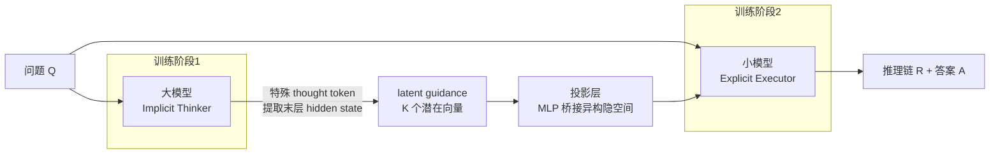

# Latent-Guided Reasoning: Empowering Small LLMs with Large-Model Thinking

**会议**: ICLR 2026  
**OpenReview**: [https://openreview.net/forum?id=jqGWLxbghD](https://openreview.net/forum?id=jqGWLxbghD)  
**代码**: 待确认  
**领域**: LLM 推理 / 推理蒸馏 / 高效推理  
**关键词**: Latent Guidance, Cognitive Distillation, 认知规划解耦, 小模型推理, 信息论训练目标  

## 一句话总结
让大模型只做"认知规划"并把解题策略压成一小撮潜在向量（latent guidance），再交给小模型负责"语言实现"生成推理链，用大模型的思考能力武装小模型，把推理性能-成本权衡推到新平衡点。

## 研究背景与动机
- **领域现状**：CoT 让 LLM 在多步推理上表现强劲，但"巨大参数量 + 长链文本生成"叠加导致推理成本高昂，难以落地到实时或资源受限场景。
- **现有痛点**：降本的两条主路各有硬伤——① **大模型 CoT 压缩 / 潜空间推理**（缩短链长或在隐空间里算）会牺牲 CoT 的可读性与可解释性，在需要透明解题过程的领域是致命缺陷；② **知识蒸馏到小模型**（SFT 或更高阶目标把推理能力迁给小模型）受限于小模型的参数容量，在复杂、未见过的任务上泛化差。
- **核心矛盾**：标准自回归框架里，**高层认知规划（想策略）**和**低层语言实现（写文字）**被紧紧耦合在一起——想要做高层规划，就必须经由昂贵的逐字生成这个唯一通道。蒸馏"最终文本"等于逼小模型把整个复杂推理过程从头复刻，而它根本没那个容量。
- **本文目标**：高效地把大模型的推理能力迁到小模型，同时拿到高性能与低推理成本。
- **核心 idea**：**[解耦认知劳动]** 把"想策略"和"写文字"拆开分工——大模型当 **Implicit Thinker（隐式思考者）**，一次前向就把解题策略压缩成紧凑的潜在引导向量；小模型当 **Explicit Executor（显式执行者）**，接过引导向量去生成简洁有效的推理链。蒸馏的不是最终文本，而是**高层解题策略本身（Cognitive Distillation 认知蒸馏）**。

## 方法详解

### 整体框架
框架把推理拆成两个专门化阶段并用两阶段训练串起来：大模型（Implicit Thinker）通过处理一组特殊 thought token，在单次前向中把问题 $Q$ 的解题策略编码进 $K$ 个紧凑潜在向量 $H_{\text{guidance}}$（即 latent guidance，充当高层认知规划）；这组向量经一个轻量投影层桥接到小模型（Explicit Executor），小模型再以问题与引导向量为条件，自回归生成完整可读的推理链 $R$ 与答案 $A$。推理时大模型那一步无需任何自回归文本生成，极快；小模型只负责"语言实现"，因此在精度与成本间取得更优平衡。

### 关键设计

**1. 双损失训练 Implicit Thinker：让潜向量既"对"又"全"。** 阶段一把目标序列改写成 `<start_thought><thought_1>...<thought_K><end_thought> A`，用 $K$ 个占位 thought token 替代原推理文本，作为潜在表示的显式锚点。训练目标是任务损失与重构损失之和 $L_{\text{LLM}} = L_{\text{task}} + L_{\text{recon}}$：任务损失是标准自回归 LM 损失，只预测最终答案 $A$，$L_{\text{task}} = -\sum_{j=1}^{L}\log P(a_j \mid Q, \{\text{thought}_k\}_{k=1}^{K}, a_{<j}; \theta_{\text{LLM}})$，把认知规划牢牢锚在"解对题"这个最终目标上；重构损失是本方法的基石——从前向后取 thought token 对应的末层 hidden state $\{h_1,\dots,h_K\}$ 组成 $H_{\text{guidance}}$，再逼它们重建出完整原始推理链 $R$，$L_{\text{recon}} = -\sum_{i=1}^{M}\log P(r_i \mid H_{\text{guidance}}, r_{<i}; \theta_{\text{LLM}})$。

**2. 信息论支撑：重构损失等价于最大化互信息。** 之所以非要那个重构损失，是因为最小化它在信息论上等价于最大化引导向量与推理链的互信息，论文给出显式下界 $I(R; H_{\text{guidance}} \mid Q) \ge H(R \mid Q) - L_{\text{recon}}$，从而保证 latent guidance 编码了一份完整且高保真的认知规划，而不是稀里糊涂的隐状态。附录进一步用 rate-distortion 理论与 Fano 不等式论证了这份认知规划的鲁棒性，诊断实验估计 latent guidance 大约捕获了 3.1 nats 的推理链信息量——这正是与"缺乏对内部思考监督"的纯潜空间推理方法的关键区别。

**3. 投影层桥接异构隐空间。** 大小模型隐维度不同、潜空间不兼容，所以阶段二先用训练好的 Implicit Thinker 为训练集每道题离线生成并存好 $H_{\text{guidance}}$，再经一个轻量投影层 $H'_{\text{guidance}} = \text{MLP}(H_{\text{guidance}})$ 对齐到小模型空间。该 MLP 是两层线性、中间维 2048、GELU 激活、dropout 0.1、末尾 LayerNorm，兼顾容量与正则，保证信息稳定迁移。

**4. 阶段二语言实现 + 解耦推理。** 小模型以标准 LM 目标微调，条件于问题与投影后引导向量生成拼接序列 $(R, A)$，$L_{\text{SLM}} = -\sum_{i=1}^{M+L}\log P(t_i \mid Q, H'_{\text{guidance}}, t_{<i}; \theta_{\text{SLM}})$，本质是教小模型对一份"预先算好的认知规划"做语言实现。推理两步走：① 认知规划——大模型单次前向产出 $H_{\text{guidance}}$（无自回归，极快）；② 语言实现——小模型据此自回归写出最终推理链与答案。规划的重活留给大模型，生成的快活交给小模型。

## 实验关键数据

### 主实验表格
8 个推理基准、4 类小模型（0.5B–8B），大模型用 Qwen2.5-32B-Instruct，对比 Std-CoT / MT-CoT / Step-by-step / KARD / CasCoD / NesyCD 等蒸馏方法（节选 Overall Avg. 与 OOD Avg.，单位 %）：

| 小模型 | 方法 | BBH-test (ID) | GSM8K (ID) | OOD Avg. | Overall Avg. |
|--------|------|------|------|------|------|
| LLaMA-3-8B | NesyCD（最强基线） | 82.2 | 64.9 | 68.1 | 70.3 |
| LLaMA-3-8B | **Ours** | **82.5** | **67.4** | **71.9** | **73.1** |
| Qwen2-0.5B | NesyCD | 68.7 | 32.2 | 37.3 | 42.6 |
| Qwen2-0.5B | **Ours** | **71.0** | **34.8** | **38.6** | **44.3** |
| Qwen2-1.5B | NesyCD | 74.6 | 55.8 | 55.6 | 59.5 |
| Qwen2-1.5B | **Ours** | **78.4** | **56.0** | **58.0** | **61.7** |
| Qwen2-7B | NesyCD | 80.9 | 76.3 | 74.9 | 76.4 |
| Qwen2-7B | **Ours** | **82.1** | **77.5** | **78.5** | **79.0** |

LLaMA-3-8B 上 OOD Avg. 71.9% 比次优 NesyCD 高 3.8 个点；Qwen2-7B OOD 领先 3.6 点。增益主要来自 OOD 泛化，印证"解耦认知规划与语言实现"是普适有效的策略。

### 消融实验表格
用 instruct-tuned Qwen2.5-7B 当小模型，看精度与平均 token 数（节选）：

| 类型 | 数据集 | 指标 | SFT | KD | **Ours** |
|------|--------|------|------|------|------|
| In-Domain | GSM8K | Accuracy (%) | 77.3 | 73.0 | **80.5** |
| In-Domain | GSM8K | Avg. Tokens | 235.4 | 253.7 | **128.9** |
| OOD | Odyssey-Math | Accuracy (%) | — | 基线 | **+7.2 vs KD** |

Latent Guidance 在 GSM8K 上既把精度从 SFT 的 77.3% 提到 80.5%，又把推理链 token 数从 235.4 几乎砍半到 128.9——精度更高、链更短。

### 关键发现
- **更准 + 更简洁的协同**：高层认知规划让小模型走"直接策略"而非冗长试探，OOD 上 token 更省、精度更高，避免过拟合训练数据的风格性产物。
- **跨 12+ 领域的长文 QA 泛化**：在完全 OOD 的 ELI5-Test 上，GPT-4o 判定本方法在 Correctness 与 Relevance 上一致优于 SFT 与 KD，说明蒸馏出的认知规划是通用推理结构而非任务专用。
- **潜在规划可解释**：t-SNE 与定量探针显示 latent guidance 向量会聚成不同的"高层推理策略簇"，证明小模型执行的是结构化抽象规划，而非学到表面特征相关。

## 亮点与洞察
- **诊断对了病根**：把小模型推理弱归因于"认知规划与语言实现的耦合"，进而对症下药地解耦，框架动机干净有力。
- **蒸"策略"而非蒸"文本"**：Cognitive Distillation 把规划负担甩给大模型、把生成负担留给小模型，绕开了"逼小模型复刻完整推理过程"的容量瓶颈，这是相比传统 outcome distillation 的本质升级。
- **理论与监督闭环**：重构损失 ↔ 互信息最大化的等价关系，给"潜思考"提供了纯潜空间推理方法所缺的强监督信号，3.1 nats 的信息量估计让"潜向量真装了东西"可量化。
- **保留可解释性**：最终输出仍是人类可读 CoT，规避了潜空间推理牺牲透明度的缺陷。

## 局限与展望
- **依赖强大教师**：方法效果建立在 32B 大模型能产出高质量认知规划上，教师能力或领域覆盖不足时迁移收益可能受限。
- **两阶段 + 离线缓存开销**：需先训 Implicit Thinker，再为全训练集离线生成并存储 $H_{\text{guidance}}$，训练管线比单纯 SFT 更重。
- **潜在容量 $K$ 是超参**：thought token 数 $K$ 与重构保真度的权衡需要调；论文虽给出容量-保真界，但最优配置仍随任务变化。
- **推理时仍需大模型在场**：虽然大模型只做单次前向，但部署上仍要同时持有大小两个模型，端侧纯小模型场景未必适用。

## 相关工作与启发
- **vs CoT 知识蒸馏（Std-CoT/MT-CoT/Step-by-step/CasCoD/NesyCD）**：这些是 outcome distillation，训小模型复刻最终文本；本文蒸高层策略，让小模型只学"对既定规划的语言实现"。
- **vs 潜空间推理（COCONUT、LightThinker、pause token、self-distillation）**：前者目的是让单个大模型推理更快、常牺牲精度或可解释性；本文反向使用潜计算——目的是让小模型更强，且用重构损失补上对内部思考的强监督。
- **启发**：①"压缩策略而非压缩文本"的思路可推广到 agent 规划、多模态推理等需要把高层意图迁移给轻量执行器的场景；② 用信息论重构目标显式约束潜表示的保真度，是给各类"隐式中间表示"加可验证监督的通用配方。

## 评分
- **新颖性**: ⭐⭐⭐⭐ —— "解耦认知规划与语言实现 + 蒸馏策略而非文本"的视角清新，重构损失的互信息诠释把直觉落到理论上。
- **实验充分度**: ⭐⭐⭐⭐ —— 8 基准 × 4 尺度（0.5B–8B）× 多基线，ID/OOD 分离评估，外加 token 效率、长文 QA、t-SNE/探针等机制分析，覆盖面扎实。
- **写作质量**: ⭐⭐⭐⭐ —— 动机—方法—理论—实验逻辑连贯，图 1/图 2 把分工与双损失讲得清楚。
- **价值**: ⭐⭐⭐⭐ —— 在保留 CoT 可解释性的前提下显著改善推理性能-成本权衡（最高 +13.9%），对小模型落地复杂推理有实际意义。

<!-- RELATED:START -->

## 相关论文

- [\[ICLR 2026\] Predicting LLM Reasoning Performance with Small Proxy Model](predicting_llm_reasoning_performance_with_small_proxy_model.md)
- [\[ICLR 2026\] AgentMath: Empowering Mathematical Reasoning for Large Language Models via Tool-Augmented Agent](agentmath_empowering_mathematical_reasoning_for_large_language_models_via_tool-a.md)
- [\[ICLR 2026\] DAG-Math: Graph-of-Thought Guided Mathematical Reasoning in LLMs](dag-math_graph-of-thought_guided_mathematical_reasoning_in_llms.md)
- [\[ICLR 2026\] LaDiR: Latent Diffusion Enhances LLMs for Text Reasoning](ladir_latent_diffusion_enhances_llms_for_text_reasoning.md)
- [\[ICLR 2026\] On the Thinking-Language Modeling Gap in Large Language Models](on_the_thinking-language_modeling_gap_in_large_language_models.md)

<!-- RELATED:END -->
