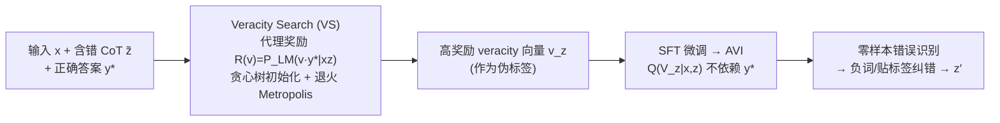

# Latent Veracity Inference for Identifying Errors in Stepwise Reasoning

**会议**: ICLR 2026  
**OpenReview**: [https://openreview.net/forum?id=eux1cp8GqC](https://openreview.net/forum?id=eux1cp8GqC)  
**代码**: [https://github.com/alstn12088/veracity_inference](https://github.com/alstn12088/veracity_inference)  
**领域**: LLM 推理 / 过程验证  
**关键词**: Chain-of-Thought, 错误检测, 潜变量模型, 后验推断, MCMC, 过程奖励模型, 自我纠错  

## 一句话总结
把"CoT 每一步是否正确"建模成一组潜在 veracity 变量，用语言模型对「veracity + 最终答案」的联合似然作为代理奖励，通过离散 MCMC 搜索（Veracity Search）做后验推断来定位错误步骤，再把搜索结果蒸馏成一个无需真答案的零样本验证器（AVI），全程不需要逐步人工标注。

## 研究背景与动机

**领域现状**：Chain-of-Thought 让语言模型的推理能力和可解释性都上了一个台阶，但 CoT 里经常夹杂错误的中间步骤，这些错误既损害可解释性，又会沿着推理链传播污染最终答案，于是"自动定位推理链里的错误步骤"成了提升模型可信度的关键问题。

**现有痛点**：现有方案各有硬伤。①直接训练过程奖励模型（PRM）需要逐步的人工标注，标注成本极高、数据稀缺；②只用最终答案做 outcome supervision 训出来的 step reward，学到的是"这步对最终答案有没有用（value/advantage）"而非"这步本身对不对"，会奖励那些"有用但其实错了"的步骤；③基于外部证据检索的 fact verifier 受限于检索复杂度和证据覆盖；④直接 zero/few-shot prompt 让 LM 当 verifier 又对 prompt 极其敏感、表现脆弱。

**核心矛盾**：我们想要的是"步骤本身的正确性（veracity）"这个监督信号，但它既贵（人工标注）又不能从最终答案里直接蒸馏（outcome supervision 学到的是别的东西）。

**本文目标**：在不需要任何逐步监督的前提下，自动识别 CoT 中的错误步骤。

**核心 idea（潜变量后验推断）**：把错误识别重新表述成一个潜变量模型（LVM）里的后验推断问题——给 CoT 的每一步 $z_i$ 配一个二值潜变量 $V_{z_i}\in\{0,1\}$ 表示这步是否正确，把 CoT $z$ 和最终答案 $y$ 当作观测，去推断后验 $\mathbb{P}(V_z\mid x,z,y^*)$。语言模型对 $(v,y^*)$ 的联合似然 $P_{\text{LM}}(vy^*\mid xz)$ 恰好可以当成这个后验的代理奖励，从而把"哪些步骤错了"变成"在 $\{0,1\}^N$ 上找高奖励向量"的搜索问题。

## 方法详解

### 整体框架

方法分三层递进。先把 CoT 解析成 $N$ 个原子语句 $z=(z_1,\dots,z_N)$，并定义条件潜变量模型 $\mathbb{P}(V_z=v,Y=y\mid x,z):=P_{\text{LM}}(vy\mid xz)$，于是定位错误等价于在观测到 $Y$ 的情况下推断未观测的 $V_z$，也就是在序列 $X\to Z\to V_z\to Y$ 里"填空" $V_z$；但精确后验要对 $2^N$ 种取值求和，不可解。于是第二层提出 **Veracity Search（VS）**：在已知正确答案 $y^*$ 时，用联合似然当代理奖励，跑带模拟退火的单比特 Metropolis 搜索去近似采样后验。第三层 **Amortized Veracity Inference（AVI）**：把 VS 搜出来的高奖励向量当伪标签，SFT 微调一个不依赖 $y^*$、不依赖搜索的零样本验证器，使其能在测试时直接对新 CoT 判对错。

### 关键设计

**1. 潜变量建模：把 veracity 显式拆出来，避开"CoT 即正确"的隐含假设。** 标准做法把 CoT $z$ 当成"$z$ 是正确的"这一命题来条件化，等于隐含假设每步 veracity 恒为 1，这正是大量工作去"纠正推理链"的根源。本文反其道而行：固定 CoT 的"身份" $Z=z$ 不变，只新引入一组二值向量 $V_z$ 来刻画它的正确性。由此后验写成

$$\mathbb{P}(V_z=v\mid Y=y,x,z)=\frac{P_{\text{LM}}(v\mid xz)\,P_{\text{LM}}(y\mid xzv)}{\sum_{v'\in\{0,1\}^N}P_{\text{LM}}(v'\mid xz)\,P_{\text{LM}}(y\mid xzv')}$$

关键洞察在于因子化顺序：真正想要的后验对应生成序 $X\to Z\to V_z\to Y$（先有 veracity 再预测答案），而一个朴素的 in-context baseline $P_{\text{LM}}(v\mid xzy)$ 对应的是 $X\to Z\to Y\to V_z$，两者通常不相等——这解释了为什么直接 prompt LM 当 verifier 效果差，也说明了为什么要老老实实做后验推断。框架同时兼容二值之外的多类别 veracity。

**2. Veracity Search：用联合似然当代理奖励，在低维离散空间跑退火 MCMC。** 给定 $x$、（可能含错的）$z$ 和正确答案 $y^*$，定义代理奖励 $R(v):=P_{\text{LM}}(vy^*\mid xz)\propto\mathbb{P}(V_z=v\mid Y=y^*,x,z)$（由 Bayes 规则得到正比关系），于是寻高奖励 $v$ 就等价于从后验采样。**工作假设**是：LM 即便自己生成不出逻辑自洽的 CoT，却能在"veracity 向量越接近真值 $v^*_z$ 时给联合分布越高的概率"——即后验概率与 Hamming 距离 $|v_z-v^*_z|$ 呈负相关。搜索本身是**单比特 Metropolis + 模拟退火**：每步随机选一个坐标 $j$ 翻转得到 $v'_z=v^{(t)}_z\oplus e_j$，因为提议对称且只翻一位，接受率退化成纯似然比

$$\alpha_t=\min\Big\{1,\big(R(v'_z)/R(v^{(t)}_z)\big)^{\beta_t}\Big\}$$

其中逆温 $\beta_t$ 按退火 schedule 从小到大（高温多探索、低温多利用），帮助跳出局部最优。相比只用最终答案当奖励、或把 CoT 整体当潜变量（身份与 veracity 纠缠在一起）的做法，这里固定 $Z=z$、只在低维的 veracity 空间局部搜索，效率高得多。

**3. 贪心树初始化：给随机搜索一个高质量起点。** 在跑随机搜索前，用一个深度优先的贪心过程挑初始向量 $v^{(0)}_z$：从 $i=1$ 到 $N$，对前 $i-1$ 位已定、第 $i$ 位分别试 0/1、后面位留空，让 LM 内部对未指定位做边缘化，算部分得分 $\tilde R(v_{1:i})=P_{\text{LM}}(\,\cdot\mid xz_{1:i}v_{1:i}y^*)$，取得分更高的值固定第 $i$ 位。这个"树搜索"暖启动常常一上来就落在高奖励盆地附近，让后续 Metropolis 更新收敛更快——消融显示它显著提升样本效率。

**4. Amortized Veracity Inference：把搜索蒸馏成无需真答案的零样本验证器。** 仿照变分 EM，把 VS（退火到接近零温，逼近代理奖励的最大化点 $Q(V_z\mid x,z)\propto\lim_{\beta\to\infty}R(V_z)^\beta$）搜出的高奖励向量当伪标签，对 $P_{\text{LM}}$ 做 SFT 得到摊还采样器 $Q$。与测试期搜索不同，$Q(V_z\mid x,z)$ **不条件化最终答案 $Y$**，带来两个好处：①测试时无需搜索、也无需先看到正确答案就能零样本验证 CoT；②可直接当自我纠错/自我提升的反馈模块——在 PRONTOQA 这类任务里，被判错的步骤可以直接加"not"取反得到纠正链 $z'$（期望 $P_{\text{LM}}(y^*\mid xz')>P_{\text{LM}}(y^*\mid xz)$）；不便取反的任务（如 COMMONSENSEQA）则把预测的 True/False 标签直接附在语句后面。

## 实验关键数据

### 主实验表格（Hamming 相似度，1000 样本/数据集）

| 数据集 | 方法 | Qwen-4B | Qwen-8B | Llama-3B | Llama-8B |
|---|---|---|---|---|---|
| PRONTOQA | CoT | 0.591 | 0.384 | 0.459 | 0.515 |
| PRONTOQA | Voting | 0.603 | 0.692 | 0.514 | 0.536 |
| PRONTOQA | **VS (ours)** | **0.910** | **0.945** | **0.948** | **0.964** |
| GSM8K | CoT | 0.614 | 0.695 | 0.496 | 0.496 |
| GSM8K | **VS (ours)** | **0.711** | **0.751** | **0.614** | **0.646** |
| COMMONSENSEQA | CoT | 0.695 | 0.590 | 0.507 | 0.535 |
| COMMONSENSEQA | **VS (ours)** | **0.935** | **0.931** | **0.836** | **0.903** |

VS 在三类推理任务（逻辑/数学/常识）上全面超过 in-context baselines，PRONTOQA 上近乎完美。GSM8K 增益相对小，因为数学步骤光"标记错误"还不够、还得重做计算才能纠错。

### 消融实验表格

| 消融维度 | 结论 |
|---|---|
| 模拟退火 (SA) | 线性/余弦退火（$T$ 从 2 降到 0.1）略胜恒温；恒定 $T=0.1$ 会卡在局部最优 |
| 贪心树初始化 | 显著提升样本效率，高质量起点让搜索更快收敛 |
| 搜索算法对比 | SA-Metropolis 明显优于均匀随机翻位（random search）和 Best-of-N，证明结构感知的局部移动很关键 |

**AVI 泛化（PRONTOQA Hamming 相似度，仅在 4-hop 训练）**：

| Base LLM | 方法 | 3-hop | 4-hop | 5-hop |
|---|---|---|---|---|
| Qwen 4B | Many2Many | 0.710 | 0.779 | 0.684 |
| Qwen 4B | **AVI (ours)** | **0.886** | **0.921** | **0.913** |
| Qwen 8B | **AVI (ours)** | **0.956** | **0.967** | **0.955** |

**AVI 用于下游纠错（推理准确率）**：

| 方法 | Qwen 4B (3/4/5-hop) | Qwen 8B (3/4/5-hop) |
|---|---|---|
| No Correction | 0.60/0.52/0.59 | 0.54/0.65/0.52 |
| Self Correction | 0.54/0.60/0.48 | 0.54/0.58/0.46 |
| **AVI (ours)** | **0.68/0.72/0.77** | **0.87/0.85/0.81** |

### 关键发现
- **VS 对推理链长度鲁棒**：1→5 hop（最多 13 步）范围内 Hamming 相似度几乎不衰减、稳定在 0.85 以上，比 baseline 高 20–25 点；exact-match 虽随 hop 指数衰减，VS 仍明显更稳，而 baseline 在 5-hop 时已经"一个错误都找不出来"。
- **AVI 跨长度泛化**：仅用 4-hop 数据微调，却能在 3/5-hop 上良好工作，比最强 one-shot baseline 高 15–25 点。
- **纠错确实提升推理**：把 AVI 判错的步骤取反，Qwen-8B 上真答案条件概率提升最多 25%，Qwen-4B 提升 10–12 点，且 3/4/5-hop 一致。
- **验证不是唯一瓶颈**：当 AVI 作为 Self-Refine 的反馈模块时，仍超 baseline，但推理提升幅度小于验证准确率提升的幅度，说明 self-correction 框架里"验证"之外还有其他瓶颈。

## 亮点与洞察
- **重新定义了问题**：把"找错误步骤"从一个分类/打分任务，重构成潜变量模型里的后验推断任务，这个视角解释了为什么直接 prompt LM 当 verifier 不靠谱（因子化顺序不对），理论框架干净。
- **代理奖励选得巧**：用 $P_{\text{LM}}(vy^*\mid xz)$ 这个联合似然，既绕开了对逐步标注的需求，又区别于 outcome-only reward（后者会奖励"有用但错"的步骤），直击 veracity 本身。
- **VS→AVI 的 EM 式蒸馏**：测试期昂贵搜索→伪标签→摊还成零样本验证器，把"要真答案、要搜索"的限制全部去掉，工程落地友好。
- **低维搜索的效率优势**：固定 CoT 身份、只在 $\{0,1\}^N$ 的 veracity 空间做 MCMC，比在 token 级 CoT 空间搜索维度低得多，这是 VS 高效的根本原因。

## 局限与展望
- **VS 测试期需要正确答案 $y^*$**：这一限制靠 AVI 蒸馏来消除，但 AVI 的质量上限受 VS 伪标签质量约束。
- **数学推理增益有限**：GSM8K 上"标记错误"不等于"纠正错误"，需要重算才能修复，方法对这类"步骤即计算"的任务收益小。
- **依赖人造错误分布**：GSM8K/COMMONSENSEQA 的"真值 CoT"靠 GPT-4.1 生成再人为加噪，veracity 准确率的衡量受这套 corruption scheme 影响，真实世界错误分布下的表现仍需更多验证。
- **验证非唯一瓶颈**：用作自我纠错反馈时推理提升小于验证提升，self-correction/improvement 框架还需在 refinement 环节继续打磨。
- **展望**：把 AVI 接入更强的 self-improvement pipeline、扩展到多类别 veracity（已在附录初探 block Metropolis 处理 veracity 间联合依赖）、以及更贴近真实错误分布的评测。

## 相关工作与启发
- **vs. 过程奖励模型（PRM）**：PRM 通常要逐步人工标注；纯 outcome supervision 训出的 step reward 学的是 value/advantage（工具性效用）而非正确性，会奖励"有用但错"的步骤。本文用 LVM 后验推断显式瞄准 step veracity，不要过程监督。
- **vs. 自我纠错/自我提升**：本文是这类方法的"补件"——提供一个识别错误步骤的反馈来源，可即插即用进任何 self-correction/improvement 框架（如替换 Self-Refine 里的 few-shot prompt verifier）。
- **vs. 搜索式推理**：相比 best-of-N（随候选数线性 scale、不改中间步）、tree search/MCTS/GFlowNets（在 CoT 空间搜），VS 在低维 veracity 空间做局部 MCMC，借鉴了模拟退火、树搜索初始化等思路但维度更友好。
- **启发**：当目标信号"贵且不能从现有监督直接蒸馏"时，找一个语言模型已经隐式掌握的联合似然当代理奖励，再用 MCMC 做后验推断、最后摊还成前馈模型，是一条值得复用的范式。

## 评分
- **新颖性**: ⭐⭐⭐⭐⭐ 把 stepwise 错误检测重构为潜变量后验推断，并用联合似然代理奖励 + 退火 MCMC + 摊还蒸馏串成完整链路，视角新颖、理论自洽。
- **实验充分度**: ⭐⭐⭐⭐ 覆盖逻辑/数学/常识三类任务、4 个开源 LM、长度可扩展性、三组消融与下游纠错，较扎实；但下游推理提升相对有限、且依赖人造错误分布，真实场景验证偏少。
- **写作质量**: ⭐⭐⭐⭐ 公式推导清晰、因子化顺序的洞察讲得透，框架图与分节贡献明确；记号偏密集，读起来需要一点概率图模型基础。
- **价值**: ⭐⭐⭐⭐ 提供了不需逐步标注的零样本步骤验证器，可作为各类 self-correction/improvement 框架的通用反馈模块，对提升 LM 推理可信度有实用价值。

<!-- RELATED:START -->

## 相关论文

- [\[ICLR 2026\] TRIM: Hybrid Inference via Targeted Stepwise Routing in Multi-Step Reasoning Tasks](trim_hybrid_inference_via_targeted_stepwise_routing_in_multi-step_reasoning_task.md)
- [\[ACL 2025\] ProcessBench: Identifying Process Errors in Mathematical Reasoning](../../ACL2025/llm_reasoning/processbench_identifying_process_errors_in_mathematical_reasoning.md)
- [\[ICLR 2026\] RL of Thoughts: Navigating LLM Reasoning with Inference-Time Reinforcement Learning](rl_of_thoughts_navigating_llm_reasoning_with_inference-time_reinforcement_learni.md)
- [\[ICLR 2026\] VoG: Enhancing LLM Reasoning through Stepwise Verification on Knowledge Graphs](vog_enhancing_llm_reasoning_through_stepwise_verification_on_knowledge_graphs.md)
- [\[ICLR 2026\] The Limits of Inference Scaling Through Resampling](the_limits_of_inference_scaling_through_resampling.md)

<!-- RELATED:END -->
