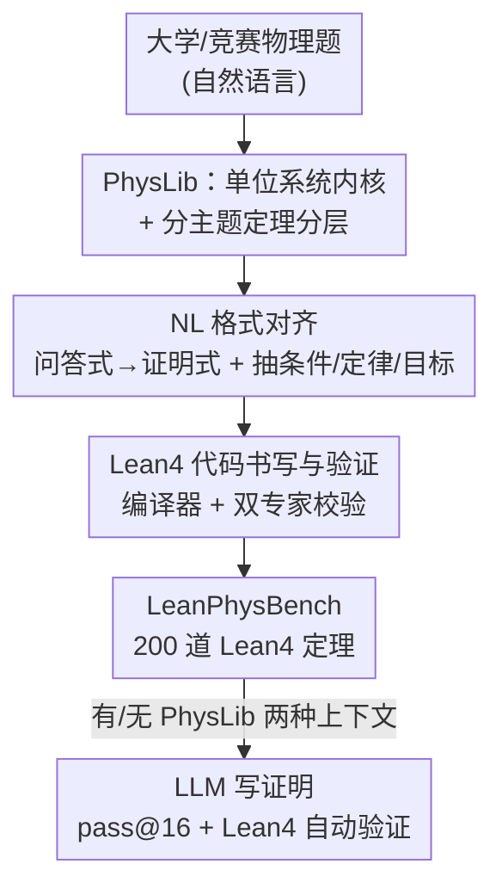

# Lean4PHYS: Comprehensive Reasoning Framework for College-level Physics in Lean4

**会议**: ICLR 2026  
**OpenReview**: [https://openreview.net/forum?id=wQ2jyFz18H](https://openreview.net/forum?id=wQ2jyFz18H)  
**代码**: https://github.com/ShirleyLIYuxin/Lean4PHYS (即将开源)  
**领域**: LLM推理 / 形式化推理 / Benchmark  
**关键词**: 形式化物理推理, Lean4, 单位系统, 定理库, 大学物理 Benchmark

## 一句话总结
本文提出 Lean4PHYS——首个面向大学物理的 Lean4 形式化推理框架，它包含一个带单位系统的社区物理定理库 PhysLib 与一个含 200 道人工形式化题目的评测集 LeanPhysBench，并用实验揭示出"数学专家证明器在物理域上并不比通用大模型强"这一过拟合现象，同时证明把 PhysLib 放进上下文能让模型平均提升 11.90%。

## 研究背景与动机

**领域现状**：把推理"形式化"以获得可机器验证的正确性，是近年 LLM 推理研究的重要方向。Lean、Coq、Isabelle、HOL 等形式语言中，Lean4 因学术界与工业界的高关注度成为研究最充分的一个，围绕它已经积累了大量 benchmark（miniF2F 等）、数据集和专家证明器（DeepSeek-Prover、Kimina-Prover、Goedel-Prover 等）。

**现有痛点**：这些工作几乎全部集中在**数学**领域。物理这种同样可以被形式化、却更依赖经验规律的自然科学，几乎无人涉足——没有可用的 Lean4 物理定理库，也没有任何 Lean4 物理评测集。更关键的是，专家证明器都是靠"在数学 benchmark 上刷高分"来宣称自己具备形式推理能力的，但这种能力到底是**真正学会了形式推理**，还是只是**过拟合到数学这一个域**，从未被检验过。

**核心矛盾**：物理与数学的根本区别在于，数学的每个基本构件都来自纯粹定义，而物理是由实验归纳出的经验规律支撑的，天然没有数学那么清晰的定义。要在 Lean4 里证明物理命题，必须先找到一个能支撑全领域推理的"不变内核"，否则连"一个量带不带单位、量纲是否一致"都无法严格表达。

**本文目标**：(1) 为 Lean4 物理推理打地基——造一个可扩展、社区维护的物理定理库；(2) 造出第一个 Lean4 物理评测集；(3) 用它检验现有专家证明器的能力到底能不能跨域迁移。

**切入角度**：作者把物理形式化的"内核"锁定为**单位系统**——七个 SI 基本单位是所有物理量纲推导的共同根基，只要把它在 Lean4 里建好，上层不同主题的定理就能自底向上长出来。

**核心 idea**：用"单位系统为内核、按主题分层堆叠定理"的自底向上方式构建物理定理库 PhysLib，再用一条严格的"NL→证明命题→Lean4"形式化流水线人工构造评测集 LeanPhysBench，从而把形式推理从数学扩展到物理这一更一般的领域。

## 方法详解

### 整体框架
Lean4PHYS 由两个主体构成，且它们以"自底向上"的同一原则串联：**先建库（PhysLib），再用库构造评测集（LeanPhysBench），最后在评测集上测模型**。PhysLib 这一侧从七个 SI 基本单位的单位系统起步，往上叠加各主题（力学、波与声学、热力学、电磁学、光学、近代物理）的专属单位、常量、由实验归纳的物理规则（写成定义）以及可复用的定理。LeanPhysBench 这一侧则把自然语言物理题先对齐成"证明命题"，再写成可验证的 Lean4 theorem，每题至少由一位专家形式化、两位专家校验。评测时让 LLM 在"有 PhysLib / 无 PhysLib"两种上下文下写证明，交给 Lean4 编译器自动验证，用 pass@16 衡量。

### 关键设计

**1. PhysLib 单位系统内核：给物理形式化找一个"不变的根"**

物理形式化最难的地方在于，它不像数学那样人人都从干净的定义出发，而是处处依赖带量纲的经验量。本文把这个"不变内核"定位为单位系统：在 Mathlib 之上扩展出一个 `UnitsSystem`，实现 SI 的七个基本单位（时间、长度、质量、电流、热力学温度、物质的量、发光强度），让所有物理量都携带量纲、从而支持"量纲一致"的符号计算。在这个根之上，作者还引入了最常用的一阶导数示例——长度对时间求导得到速度，示范上层物理量如何从单位系统派生出来。这一层被设计成"非必要不改动"的稳定底座，是整个库能自底向上生长的前提：没有它，连"$\mu = f/N$ 两边量纲是否相容"这种最基本的检查都无从谈起。

**2. 按主题分层的定理库与三层可扩展架构：让物理知识能被社区持续堆叠**

光有单位系统不够，真正解题还要各领域的物理规律。作者把 PhysLib 组织成三层层级：(1) 基础单位系统（仅必要时改动）；(2) 主题专属单位系统（当现有单位无法表达某主题命题时再加）；(3) 主题专属定理（最活跃、需要持续更新的实用定理）。实现上为力学、波与声学、热力学、电磁学、光学、近代物理六大主题各开独立 namespace 与 Lean 文件，按"主题单位/常量 → 由实验总结的物理规则（写成 definition）→ 可复用定理（带证明）"的顺序逐层填充，并以力学为范例做了较完整实现、作为社区其他主题的样板。这种分层借鉴了 Mathlib 的协作范式，作者明确把它设计成社区驱动、长期维护，并指出同样的分层逻辑可推广到自然/社会科学乃至更一般的证明系统。

**3. NL→Lean4 形式化流水线：把"求答案"的物理题改造成"证命题"再落地**

NL 物理题与 Lean4 命题之间存在巨大的表示鸿沟：NL 题通常是"求某个数值/表达式"的问答式，而 Lean4 里题型是封闭式证明、不存在"求答案"。本文据此设计了两阶段流水线。第一阶段是 **NL 格式对齐**：把"求 X 是多少"重述为"证明 X 等于 …"，再让 LLM 写出分步解答，从解答中抽取所用物理定律与全部初始条件，并把证明目标归为三类——数值、物理表达式、或描述物理状态的逻辑公式。第二阶段是 **Lean4 代码书写与验证**：把条件与目标分别写成 Lean4 的 hypothesis 与 goal，书写条件时把缺失的物理定律补进 PhysLib 并以 Lean 代码恰当呈现，最后交编译器验证能否通过，并由至少两位专家核对定理的完整性。正是这条严格流水线保证了 200 道题"准确捕捉 NL 描述背后的物理语义"，而非机械翻译。

### 一个完整示例
以一道力学竞赛题（球壳内做圆周运动的小块、求维持运动所需的最小摩擦系数）为例走一遍形式化：原始 NL 题问"最小摩擦系数 $\mu$ 是多少"。**格式对齐**后变成"证明 $\mu = \dots$"，并让模型写出分步解答——沿表面与水平方向列力平衡方程 $\sin\theta\cdot N + \cos\theta\cdot f = mg$、$\cos\theta\cdot N - \sin\theta\cdot f = m\omega^2 r$，解得 $N = m(g\sin\theta + \cos^2\theta\,\omega^2 R)$、$f = m\cos\theta(g - \sin\theta\,\omega^2 R)$，再代入 $\mu = f/N$。**条件抽取**得到角度范围、各量为正、$r = R\cos\theta$ 等 hypothesis，**目标**则是关于 $\mu$ 的物理表达式。最后写成 `theorem Ch2_Q5 (... h_vert ... h_horiz ... h_fric_min : f = μ • N) : μ = (...).val / (...).val := by`，其中带单位的量（`Mass`、`Length`、`Force`、`Scalar (-time_unit)`）全部依赖 PhysLib 的单位系统才能合法书写——这正体现了内核库的作用。

## 实验关键数据

### 主实验
评测在 8 个代表性 LLM 上进行（闭源：GPT-4o、Claude-Sonnet-4、Gemini-2.5-Pro；开源通用：DeepSeek-R1、Qwen3-8B；开源专家证明器：Kimina-Prover-8B、Goedel-Prover-V2-8B、DeepSeek-Prover-V2-7B），每个模型测"有/无 PhysLib"两种模式，pass@16、3 次取平均。难度分 College / Comp-Easy / Comp-Hard。

| 模型 | PhysLib | College | Comp-Easy | Comp-Hard | Overall |
|------|---------|---------|-----------|-----------|---------|
| Gemini-2.5-Pro | ✓ | 32.69% | 74.19% | 0.00% | **40.00%** |
| Claude-Sonnet-4 | ✓ | 29.49% | 61.83% | 0.00% | 34.50% |
| DeepSeek-Prover-V2-7B | ✓ | 8.01% | 31.18% | 5.88% | 14.83% |
| Goedel-Prover-V2-8B | ✓ | 10.58% | 26.34% | 5.88% | 14.67% |
| GPT-4o | ✓ | 9.29% | 30.11% | 0.00% | 14.17% |
| Kimina-Prover-8B | ✓ | 9.94% | 23.12% | 6.86% | 13.50% |
| Gemini-2.5-Pro | ✗ | 6.09% | 11.29% | 0.00% | 6.67% |
| Claude-Sonnet-4 | ✗ | 3.21% | 5.91% | 0.00% | 3.50% |

两个核心结论：(1) 体量大、编码能力强的通用闭源模型（Gemini、Claude）在物理形式推理上反而最强，而在数学域上碾压它们的专家证明器整体只有约 10%——专家证明器的能力**没能从数学迁移到物理**，尤其是面对单位系统这种新定义时；(2) 把 PhysLib 加入上下文后，所有模型、所有难度上的表现一致提升，平均 +11.90%。

### 消融 / 格式分析
| 配置 | 现象 | 说明 |
|------|------|------|
| 有 PhysLib | 平均 +11.90% | 模型能学会 `simp`、`norm_num` 等更高级 tactic |
| 无 PhysLib | 整体显著更低 | 模型只能用 `constructor / rw / abel / exact / aesop` 等基础简化 |
| 仅 Comp-Hard | 所有模型几乎全军覆没（多为 0%） | 涉及积分、求导、量词、函数关系等复杂符号推理 |

按题型看：College 题以带单位的数值计算为主、极依赖 PhysLib 保证量纲一致，in-context learning 弱的模型在此很吃亏；Comp-Easy 接近 miniF2F 式数学题、两步内推导、常只用 Mathlib tactic，所以熟悉 Lean 数学的专家模型即使没 PhysLib 也表现不错；Comp-Hard 需要量纲转换叠加符号操作、还常涉及微积分概念，是当前形式化物理的能力天花板。

### 关键发现
- **PhysLib 的增益机制是"解锁更高级 tactic"**：没有库时模型只会基础简化策略；有库后它能基于库里的定义与定理用上 `simp`、`norm_num`，从而真正推进证明。
- **专家证明器之间差距很小**：数学上的大幅提升并不保证物理推理的大幅提升，佐证了"过拟合数学域"的判断。
- **唯一专家占优的场景是 Comp-Hard**：这一档需要更强的复杂演绎能力，专家证明器反超闭源大模型，但绝对分仍极低。

## 亮点与洞察
- **把"单位系统"认定为物理形式化的不变内核**，是全文最关键的洞察：它一句话点破了物理与数学在形式化上的本质差异，并给出一个可实现、可扩展的落脚点。
- **用一个新 benchmark 反向审计"专家证明器"**：通过让数学专家证明器在物理域上现原形，实证了"刷数学榜≠学会形式推理"，这个负面结论比单纯刷分更有价值。
- **三层库架构 + NL→FL 流水线可迁移**：作者明确指出这套"内核单位 → 主题单位 → 主题定理"的分层和"问答式改证明式"的对齐，可复制到化学、其他自然/社会科学，提供了一条把形式推理逐步推广到更多学科的路线。

## 局限与展望
- **Comp-Hard 几乎全 0**：当前模型在涉及积分、求导、量词、函数关系的复杂物理证明上基本无能为力，说明形式化物理还很初级。
- **PhysLib 实现以力学为主**：其余五大主题只搭了框架、未做完整实现，依赖后续社区贡献，短期内覆盖度有限。
- **评测集规模偏小**：仅 200 题，且依赖大量专家人工形式化（每题 1 人形式化 + ≥2 人校验），扩展成本高；实验用的是 PhysLib 初版，结论可能随库更新而变化。
- **改进方向**：补全其余主题定理、引入对积分/极限/连续性的形式化支持、探索能自动补全 PhysLib 缺失定律的 agent 流程，都可能成为下一步。

## 相关工作与启发
- **vs 数学 Lean benchmark（miniF2F 等）**：它们只覆盖数学且题型偏纯符号推导；本文首次把 Lean4 形式化推理扩展到物理，必须额外解决量纲/单位这一数学里不存在的难题。
- **vs 专家 Lean 证明器（DeepSeek-Prover、Kimina-Prover、Goedel-Prover）**：它们靠数学 benchmark 宣称形式推理能力，本文证明这种能力难以迁移到物理；本文不做新证明器，而是提供库 + 评测集这一基础设施，并暴露专家模型的过拟合问题。
- **vs 纯 NL 物理推理**：以往把物理推理当作只靠"对最终答案"判分的 NL 任务，无法验证中间步骤；本文借 Lean4 让每一步推理都可机器验证。

## 评分
- 新颖性: ⭐⭐⭐⭐⭐ 首个 Lean4 物理库 + 评测集，并把"单位系统为内核"立为方法论。
- 实验充分度: ⭐⭐⭐⭐ 覆盖 8 个代表性模型 × 两种模式 × 三档难度，但评测集仅 200 题、库以力学为主。
- 写作质量: ⭐⭐⭐⭐ 动机与自底向上设计讲得清晰，框架图与示例到位。
- 价值: ⭐⭐⭐⭐⭐ 提供可长期维护的基础设施，并实证"刷数学榜≠会形式推理"，为形式推理跨学科扩展开了新方向。

<!-- RELATED:START -->

## 相关论文

- [\[ICLR 2026\] A State-Transition Framework for Efficient LLM Reasoning](a_state-transition_framework_for_efficient_llm_reasoning.md)
- [\[ICLR 2026\] Structured Reasoning for LLMs: A Unified Framework for Efficiency and Explainability](structured_reasoning_for_llms_a_unified_framework_for_efficiency_and_explainabil.md)
- [\[ICLR 2026\] Enhancing Language Model Reasoning with Structured Multi-Level Modeling](enhancing_language_model_reasoning_with_structured_multi-level_modeling.md)
- [\[ICLR 2026\] FaithCoT-Bench: Benchmarking Instance-Level Faithfulness of Chain-of-Thought Reasoning](faithcot-bench_benchmarking_instance-level_faithfulness_of_chain-of-thought_reas.md)
- [\[ICML 2026\] Scientific Logicality Enriched Methodology for LLM Reasoning: A Practice in Physics](../../ICML2026/llm_reasoning/scientific_logicality_enriched_methodology_for_llm_reasoning_a_practice_in_physi.md)

<!-- RELATED:END -->
