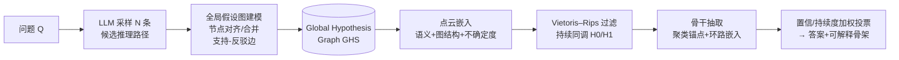

# Learning Global Hypothesis Space for Enhancing Synergistic Reasoning Chain

**会议**: ICLR 2026  
**OpenReview**: [https://openreview.net/forum?id=9QSWEdHDnT](https://openreview.net/forum?id=9QSWEdHDnT)  
**代码**: 待确认  
**领域**: LLM 推理 / 推理链结构化  
**关键词**: Chain-of-Thought, 全局假设图, 拓扑数据分析, 持续同调, 多角色协同, 自洽推理  

## 一句话总结
本文提出 GHS-TDA：先把 LLM 采样出的多条推理路径融合成一张「全局假设图」，再用拓扑数据分析（持续同调）从图里抽出稳定的「逻辑骨干」和「自洽闭环」，用结构稳定性而非局部置信度来挑选推理链，从而抑制误差传播、提升准确率与可解释性。

## 研究背景与动机
- **领域现状**：CoT 把复杂问题拆成逐步中间推理，显著提升 LLM 的准确率和可解释性；ToT / GoT / AoT 等结构化扩展进一步把单路径扩成树、图、原子结构，增加推理多样性。
- **现有痛点**：这些方法本质仍是**自回归、逐步生成**——每一步都条件于前一步输出，导致 (1) 早期错误极易沿链条传播放大，缺乏全局协调与纠错；(2) 缺乏结构化分析框架来剪除冗余、识别关键推理特征，推理轨迹不稳定、可解释性差。ToT/GoT 虽扩了搜索空间，但分支间假设并未显式协调，错误反而可能跨分支累积；ReAct/AFlow/ReCEval 等偏向「结果优化」而非「结构调控」，没有统一的分析工具刻画推理链。
- **核心矛盾**：推理空间本质是多条相互依赖的候选路径构成的**高维复杂结构**，无法被置信度、最短路径等局部指标完整刻画；缺一个「全局、抗噪」的结构视角，就管不住误差传播和冗余。
- **本文目标**：用结构鲁棒性（而非局部正确性）作为推理可靠性的判据，自动抽出既准确又可解释、且对扰动稳健的推理链。
- **核心 idea**（**拓扑视角建模推理空间**）：把「逻辑骨干」「自洽闭环」形式化为**拓扑不变量**——用持续同调捕捉跨尺度稳定的连通分量（H0）和环（H1），它们天然对应推理的主干路径和自我验证结构，为选路提供有原则的依据。

## 方法详解

### 整体框架
GHS-TDA 是「构建—分析」两阶段框架。**构建阶段**把 LLM 采样的多条推理路径语义对齐、合并成统一的**全局假设图 GHS**，系统整合多样信息并管理冲突；**分析阶段**对 GHS 施加拓扑数据分析（持续同调），抽出稳定骨干与自洽闭环，得到高置信、可解释的推理链。构建保证「连贯整合」，分析把「拓扑稳定性」当作结构约束与收敛判据。

### 关键设计

**1. 全局假设图建模（GHS）：把孤立路径并进共享推理空间** — 给定问题 $Q$，先采样 $N$ 条候选路径 $P=\{P_1,\dots,P_N\}$，每条 $P_i=(s_1^{(i)},\dots,s_{m_i}^{(i)})$ 是变长的逐步假设序列。论文把它们融成有向多重图 $G=(V,E)$，每个节点 $v=(\text{text},\text{canon},c,r)$ 同时记录自然语言表述、用于判等的规范化形式（如符号/归一化逻辑式）、置信度 $c\in[0,1]$ 和进度指标 $r\in[0,1]$（离最终答案多远）；边则编码邻接、显式引用、推断出的支持/反驳关系。关键的对齐合并发生在「跨路径语义等价」的节点上：当两节点规范化形式相似度 $\mathrm{Sim}(\text{canon}(s_a),\text{canon}(s_b))>\theta_\text{merge}$ 就合并成一个代表顶点，继承所有边——这让 "2+2=4" 和 "the sum is four" 这种表面不同、语义相同的步骤统一起来。合并后置信度取来源平均、进度取最大值以保留下游完整性，并记录 provenance 以便后续溯源。这样得到的图无重复地编码了所有采样路径的并集，把竞争性假设放进同一空间统一比较，也为后续拓扑分析铺好地基。

**2. 点云表示与混合距离：把推理图嵌入可做拓扑分析的度量空间** — 要对图做持续同调，先得把节点变成「点云」。每个节点嵌成联合特征向量 $z_v=[\,e_v;\ \phi_\text{graph}(v);\ u_v\,]$：其中 $e_v$ 是 L2 归一化的语义嵌入，$\phi_\text{graph}(v)$ 编码图结构（进度 $r_v$、BFS 位置编码、中心性，按实例标准化），$u_v=-\log(c_v+10^{-6})$ 是不确定度。节点间距离用三项混合度量 $d(v_i,v_j)=\alpha(1-\langle e_i,e_j\rangle)+\beta\lVert\phi_\text{graph}(i)-\phi_\text{graph}(j)\rVert_1+\nu(u_i+u_j)$，分别融合语义相似、结构差异与不确定度。再建 $k$ 近邻图（$k\approx15$）并按全局阈值 $\tau$（距离 95 分位）剪枝，在稀疏图上构 Vietoris–Rips 过滤——既保留 H0/H1 的显著拓扑特征，又降低计算复杂度。

**3. 持续同调与骨架抽取：用拓扑不变量挑出主干和验证闭环** — 计算到 H1 的持续同调，得到连通分量（H0）和环（H1）的条形码，按寿命 $L=\text{death}-\text{birth}$ 取 Top-q% 的显著特征：H0 给出主聚类，H1 反映自洽闭环。把特征映回图时定义操作尺度 $\varepsilon_{H_0}=\mathrm{median}\{\text{death}(b)\mid b\in B_0\}$、$\varepsilon_b=0.99\cdot\text{death}(b)$，得到阈值子图 $G(\varepsilon)$。在 $G(\varepsilon_{H_0})$ 上保留规模 $|C|>3$ 且覆盖至少两条路径的分量，锚点取进度最小/最大的节点作为起点 $s_C=\arg\min_{v\in C}r_v$、终点 $g_C=\arg\max_{v\in C}r_v$；每个环 $b$ 被分配给重叠最大的聚类。骨干即 $s_C\to g_C$ 的最短路；若有主环 $b_C$，则改道经一个中位进度附近的枢轴 $s_C\to v\to(\text{绕行}\ b_C)\to v\to g_C$，**显式嵌入一个验证闭环**来增强自洽性（环由 Horton 最小权环基算法或拼接启发式实例化）。多聚类时按「有主环 > 环寿命大 > 聚类大 > 骨干代价小」排序优先。

**4. 自适应收敛与答案聚合：拓扑稳定性同时当选路依据和停机判据** — 最终答案由沿骨架的**置信/持续度加权投票**聚合；若存在环，再做数值代入或蕴含检查二次校验。输出不仅给高置信答案，还给骨架结构和关键统计（贡献路径、平均边权、环寿命）。整个机制把「推理多样性」（多路径采样）和「拓扑稳定性」（持续同调）联合起来，达成自适应收敛——不再靠固定步数或局部置信阈值停机，而是看结构是否稳定。实现上用 text-embedding-3-large 做嵌入、GUDHI 算持续同调、5 个随机种子、温度 0.7、top-p 0.95、每例最多 16 次 LLM 调用。

## 实验关键数据

### 主实验：八个推理基准（EM %，三种 backbone）
对比 9 个代表性基线（CoT、CoT-SC、Self-Refine、Analogical Prompting、AFlow、ToT、GoT、FoT、AoT），覆盖链/树/图/森林/原子各类范式。

| Backbone | 方法 | MATH | OlympiadBench | GSM8K | BBH | MMLU-CF | LongBench | HotpotQA | MuSiQue | Avg |
|---|---|---|---|---|---|---|---|---|---|---|
| GPT-4o-mini | CoT | 78.3 | 9.3 | 90.9 | 78.3 | 69.6 | 57.6 | 67.2 | 34.1 | 60.7 |
| GPT-4o-mini | AoT（最强基线） | 83.6 | 12.1 | 95.0 | 86.0 | 70.9 | 68.5 | 80.6 | 38.4 | 66.9 |
| GPT-4o-mini | **GHS-TDA** | **83.9** | **14.5** | **95.2** | **88.4** | **71.6** | **69.5** | **81.4** | **39.8** | **68.0** |
| Qwen-Turbo | AoT | 83.5 | 12.6 | 94.7 | 85.4 | 70.5 | 68.1 | 80.0 | 39.2 | 66.8 |
| Qwen-Turbo | **GHS-TDA** | **83.7** | **14.4** | **94.8** | **87.9** | **71.2** | **68.6** | **80.3** | **39.6** | **67.6** |
| DeepSeek-V3 | AoT | 84.0 | 13.1 | 95.1 | 86.1 | 70.8 | 68.7 | 80.6 | 39.6 | 67.3 |
| DeepSeek-V3 | **GHS-TDA** | **84.5** | **14.7** | **95.2** | **88.7** | **71.6** | **69.9** | **81.7** | **40.1** | **68.3** |

三种 backbone 上 GHS-TDA 平均 EM 全面超过最强基线 AoT（68.0 vs 66.9、67.6 vs 66.8、68.3 vs 67.3），在 OlympiadBench（难题）和 BBH 上提升最明显。

### 选路策略对比 + 鲁棒性（MATH 数据集）
这组实验既验证「拓扑选路 > 局部置信选路」，也带人工可解释性打分（1–5 分）。

| 选路策略 | 准确率 % | 平均步数 | 平均置信 | 置信方差 ↓ | 清晰 | 连贯 | 可信 | 简洁 |
|---|---|---|---|---|---|---|---|---|
| 最短路（GHS） | 75.2 | 5.8 | 0.81 | 0.12 | 3.6 | 2.9 | 3.4 | 4.3 |
| 最高置信路（GHS） | 82.1 | 11.5 | 0.93 | 0.21 | 4.1 | 4.2 | 4.3 | 3.9 |
| 人工选路（GHS） | 83.6 | 9.2 | 0.88 | 0.07 | 4.5 | 4.6 | 4.7 | 4.4 |
| **TDA 骨架（本文）** | **83.9** | 8.7 | 0.90 | **0.07** | 4.4 | 4.5 | 4.7 | 4.3 |

| 对抗扰动鲁棒性 | 扰动前 % | 扰动后 % | 答案变化率 |
|---|---|---|---|
| 最高置信路 | 82.1 | 77.1 | 7.4% |
| **GHS-TDA** | 83.9 | 81.5 | **2.9%** |

TDA 骨架自动选出的链几乎追平甚至略超人工选路，且在语义等价改写的对抗扰动下答案变化率仅 2.9%，远低于最高置信路的 7.4%。

### 关键发现：H1 持续度可预测推理正确性

| 分析项 | 数值 | 解释 |
|---|---|---|
| 全局 Spearman ρ | 0.349（p≈0） | 中等正相关 |
| Logistic 回归（标准化 H1） | 1.247（OR≈3.48） | +1 SD ⇒ 约 3.5× 几率 |
| ROC–AUC（仅 H1） | 0.74 | 良好判别力 |
| 各数据集 AUC | 0.70–0.78（HotpotQA 0.778 最强） | 跨基准稳健 |

正确推理链的 H1 持续度系统性高于错误链——拓扑持续度可作为「任务无关」的推理可靠性信号。

## 亮点与洞察
- **把拓扑数据分析首次系统引入推理链分析**：用持续同调的尺度不变性和结构鲁棒性，把「逻辑骨干」「自洽闭环」形式化为 H0/H1 拓扑不变量，给「哪条推理链可靠」一个有原则、抗噪的全局答案，跳出了置信度/最短路径这类局部启发式。
- **「构建—分析」解耦干净**：先无损融合多路径成全局假设图（含语义对齐合并 + 支持/反驳边），再做拓扑分析，避免了 ToT/GoT 分支间不协调导致的跨分支误差累积。
- **H1 持续度 = 推理可靠性信号**：这是个很漂亮的实证发现，AUC 0.74、OR≈3.5，且跨 8 个基准稳健，意味着可以**无需金标准答案**就用拓扑结构预判一条链靠不靠谱，对自适应停机和置信校准有现实价值。
- **可解释性可量化**：TDA 骨架在人工 1–5 分评估上逼近「人工选路」，同时步数更紧凑（8.7 vs 11.5），兼顾准确、稳健与简洁。

## 局限与展望
- **计算与调用开销**：每例需采样多路径 + 嵌入 + 持续同调（GUDHI）+ 最多 16 次 LLM 调用，比单路径 CoT 重很多，论文未充分量化端到端时延/成本对比（虽报告了 LLM 调用数作为代价指标）。
- **提升幅度偏小**：相对最强基线 AoT，多数数据集平均 EM 仅 +0.3~1.5 点，主要增益集中在 OlympiadBench、BBH 等难/结构化任务；简单算术（GSM8K）已近饱和、几乎无差。
- **超参与阈值依赖**：合并阈值 $\theta_\text{merge}$、$k$ 近邻、过滤阈值 $\tau$、寿命 Top-q% 等需要设定，论文未给敏感性分析，跨域迁移稳定性存疑。
- **缺组件级消融**：没有「去掉多角色构建 / 去掉 H1 环 / 去掉支持-反驳边」的拆解实验，难以判断各模块各自贡献多少；现有 Table 2 更像选路策略对比而非严格 ablation。
- **展望**：把拓扑持续度作为在线置信信号接入解码/早停、扩展到 H2 及更高阶不变量、与强化学习式推理优化结合，都是自然延伸方向。

## 相关工作与启发
- **结构化推理**：CoT → ToT / GoT / AoT / FoT 一路把推理从单链扩到树/图/原子/森林；本文的差异是不止「扩搜索空间」，而是给扩出来的空间一套**全局结构分析工具**（拓扑），解决分支协调缺失的问题。
- **推理工作流优化**：ReAct（推理+行动）、AFlow（MCTS 搜索工作流）、ReCEval（评估链正确性）偏结果/流程优化；本文强调「结构调控」与统一分析框架，是互补视角。
- **TDA 应用**：持续同调此前用于生物信息、材料科学、神经网络分析与表示学习；本文把它迁到「LLM 推理链」这一新载体，是一个有想象力的跨界，启发后续把更多几何/拓扑工具引入推理可靠性度量。

## 评分
- 新颖性: ⭐⭐⭐⭐ — 首次系统把拓扑数据分析（持续同调 H0/H1）引入 LLM 推理链结构分析，「H1 持续度预测正确性」是有原创性的实证发现。
- 实验充分度: ⭐⭐⭐ — 覆盖 8 基准 × 3 backbone × 9 基线，外加对抗扰动与拓扑-正确性相关性分析较扎实；但缺组件级消融、缺超参敏感性与端到端成本对比。
- 写作质量: ⭐⭐⭐⭐ — 动机—方法—实验链条清晰，公式与图示到位，拓扑概念解释得当；个别图引用有笔误（Fig. ??）。
- 价值: ⭐⭐⭐⭐ — 提供「用结构稳定性而非局部置信度选推理链」的新范式，且 H1 持续度作为无监督可靠性信号有实用潜力，对推理可解释性与鲁棒性研究有启发；提升幅度偏小是落地时需权衡的点。

<!-- RELATED:START -->

## 相关论文

- [\[ICLR 2026\] Generative Adversarial Reasoner: Enhancing LLM Reasoning with Adversarial Reinforcement Learning](generative_adversarial_reasoner_enhancing_llm_reasoning_with_adversarial_reinfor.md)
- [\[ICLR 2026\] ∇-Reasoner: LLM Reasoning via Test-Time Gradient Descent in Latent Space](nabla-reasoner_llm_reasoning_via_test-time_gradient_descent_in_latent_space.md)
- [\[ICLR 2026\] MathFimer: Enhancing Mathematical Reasoning by Expanding Reasoning Steps through Fill-in-the-Middle Task](mathfimer_enhancing_mathematical_reasoning_by_expanding_reasoning_steps_through_.md)
- [\[ICLR 2026\] Learning to Reason over Continuous Tokens with Reinforcement Learning (HyRea)](learning_to_reason_over_continuous_tokens_with_reinforcement_learning.md)
- [\[ACL 2026\] Revisiting the Uniform Information Density Hypothesis in LLM Reasoning](../../ACL2026/llm_reasoning/revisiting_the_uniform_information_density_hypothesis_in_llm_reasoning.md)

<!-- RELATED:END -->
