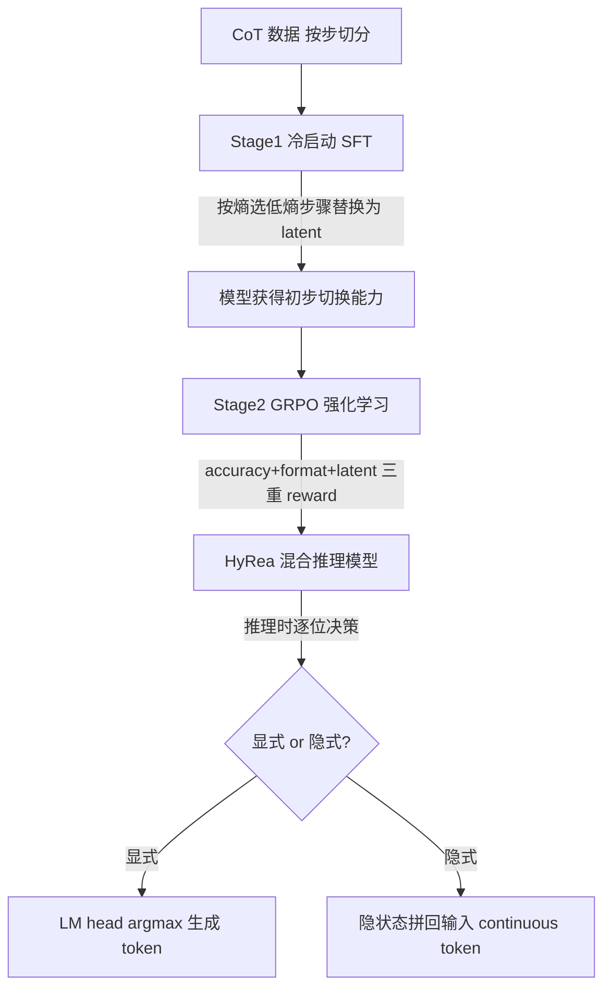

# Learning to Reason over Continuous Tokens with Reinforcement Learning (HyRea)

**会议**: ICLR 2026  
**OpenReview**: [https://openreview.net/forum?id=lebJ6wz1vj](https://openreview.net/forum?id=lebJ6wz1vj)  
**代码**: [https://github.com/zhaoyiran924/HyRea](https://github.com/zhaoyiran924/HyRea)  
**领域**: LLM 推理 / 高效推理 / 隐空间推理  
**关键词**: Hybrid Reasoning, Latent Reasoning, Continuous Token, Chain-of-Thought, GRPO, 强化学习  

## 一句话总结
HyRea 让 LLM 在推理时**自主在「显式 token 推理」与「隐式 embedding 推理」之间动态切换**：通过熵引导的冷启动 SFT 把低熵 CoT 步骤替换成连续 embedding，再用 GRPO 强化学习训练模型学会何时该切到隐空间，从而在数学推理上把输出 token 砍掉约一半而几乎不掉精度。

## 研究背景与动机
- **领域现状**：Chain-of-Thought（CoT）通过显式生成中间步骤大幅提升了 LLM 的复杂推理能力，但所有推理都发生在离散 token 空间，冗长的中间步骤带来高昂的计算与显存开销，尤其在长上下文和 RL 训练数学任务（如 DeepSeek-R1 式训练）中 token 成本高、收敛慢。
- **现有痛点**：为了省 token，近期工作（Coconut、Soft Thinking 等）尝试直接在 embedding 空间做「隐式推理」，把最后一层隐状态喂回首层、绕过 tokenization，确实能大幅压缩。但纯隐空间推理**精度损失明显**——有些 token 编码了复杂、精确的符号信息（数学/代码尤甚），压成 embedding 后语义保真度丢失就会推错；而且现有模型只能**统一/固定启发式地压缩**，无法判断哪些 token 该压、哪些该保留。
- **核心矛盾**：显式推理可解释、精度高但低效；隐式推理高效但牺牲清晰度与性能。二者各执一端，缺一个让模型**按内容自适应取舍**的统一机制。
- **本文目标**：构建一个统一框架，让模型在解码每一步时自主决定走 token 空间还是 embedding 空间，在保持精度的前提下显著减少生成 token 数。
- **核心 idea**：**[混合推理 + 可学习切换]** 用特殊 token 标记隐空间片段，把「何时切换」建模成强化学习问题——**[熵引导压缩]** 只把低熵（确定性高、易在隐空间表示）的步骤替换为连续 embedding，再用 GRPO 让模型基于下游 reward 学会切换策略。

## 方法详解

### 整体框架
HyRea 由「推理范式」和「两阶段训练」两部分构成。推理时模型逐位解码：若选**显式模式**就按常规 LM head 取 argmax 生成下一个 token；若选**隐式模式**就把上一层隐状态直接拼回输入序列继续前传（Coconut 式），并用 `<start-latent>` / `<end-latent>` 标记隐空间跨度。要让模型学会这种自主切换，训练分两阶段：先用熵引导的冷启动 SFT 注入「把低熵步骤换成 latent」的基本能力，再用 GRPO 强化学习把切换策略调到既准又省。

### 关键设计

**1. 混合推理范式：在一条轨迹里交错 token 与 embedding。** HyRea 把理想的推理序列定义为 `[Question][Step1]...<start-latent>[latent]<end-latent>...[StepN][Answer]`。显式步骤沿用标准自回归——隐状态 $h_t$ 经 LM head 得到 logits 后取 $\hat{x}_{t+1}=\arg\max_V \mathrm{LMhead}(h_t)$；隐式步骤则借鉴 Coconut，跳过解码直接把最后一层隐状态拼接回序列再前传：$H_{t+1}=\mathrm{Transformer}(E\|h_t)$。这样模型可以在**不确定的中间推理步骤**保留可解释的显式 token，而在**自信、可压缩的片段**切到紧凑的连续表示，兼顾可解释性与效率。

**2. 熵引导的冷启动：只压「确定性高」的步骤。** 直接让模型学会切换很难，HyRea 先做一个监督冷启动来注入先验。它把原始 CoT 按 `\n` 和 `.` 切成独立步骤，**优先挑选熵最低的步骤**替换为 latent 段 `<start-latent> c×[latent] <end-latent>`（$c$ 为 latent token 数）。直觉是低熵步骤更确定、更易在隐空间忠实表达，而高熵步骤往往编码关键/复杂信息、压了就会丢——熵阈值因此天然防止模型压坏重要内容。训练损失只在可见的非 latent token 上计算 $\mathcal{L}_{\text{cold}}=-\log \mathrm{LLM}(C\setminus[\text{Latent}])$，并让被替换的步骤数从 0 渐进涨到上限 $S$（每轮增量引入 10% 新数据），形成由易到难的课程。消融显示这一熵引导比随机替换收敛更快（10 轮内破 80 分 vs 随机停在 75）、token 更省。

**3. GRPO 强化学习：用 reward 学会「何时切换」。** 冷启动只给了初步能力，真正决定切换时机靠强化学习。HyRea 采用 Group Relative Policy Optimization——对每个 query 采样一组 $G$ 个输出，用组内归一化优势 $A_i=\frac{r_i-\mathrm{mean}(\{r\})}{\mathrm{std}(\{r\})}$ 做无 critic 的策略优化，目标为带 clip 的 $\mathcal{L}_{\text{GRPO}}(\theta)=\mathbb{E}\big[\frac{1}{G}\sum_i \min(\frac{\pi_\theta(o_i|q)}{\pi_{\theta_{\text{old}}}(o_i|q)}A_i,\ \mathrm{clip}(\cdot,1-\varepsilon,1+\varepsilon)A_i)\big]$。reward 由三部分组成：**accuracy reward**（答对）、**format reward**（结构合规）、以及专门的 **latent reward**（鼓励生成 `[Latent]`、引导用隐空间）。loss 计算同样排除 `[Latent]` token。这一步**免去人工构造切换合成数据**，模型在 reward 驱动下自监督地学会在什么语境下调用隐式计算最划算。

## 实验关键数据

### 主实验表格
在 Qwen2.5-7B/32B-Instruct 上、四个数学基准（pass@1），与 CoT(SFT+RL)、Coconut、Soft Thinking 对比，报告准确率 / 平均 token 数 / 平均切换次数：

| 模型 | 方法 | MATH-500 Acc/#Tok | Minerva Acc/#Tok | AMC23 Acc/#Tok | Olympiad Acc/#Tok |
|---|---|---|---|---|---|
| Qwen2.5-7B | SFT+RL | 84.2 / 698 | 26.8 / 671 | 48.2 / 892 | 40.0 / 854 |
| | Coconut | 70.4 / 106 | 22.1 / 174 | 33.7 / 217 | 26.8 / 296 |
| | Soft Thinking | 66.4 / 617 | 16.9 / 604 | 24.1 / 784 | 24.7 / 595 |
| | **HyRea** | **83.6 / 387** | **27.2 / 425** | **48.2 / 526** | **39.6 / 583** |
| Qwen2.5-32B | SFT+RL | 85.2 / 588 | 39.7 / 608 | 61.4 / 905 | 49.5 / 899 |
| | **HyRea** | **84.4 / 369** | **38.6 / 381** | 57.8 / 498 | **48.9 / 563** |

HyRea 在 7B 上 MATH-500 几乎追平 SFT+RL（83.6 vs 84.2）却只用约一半 token（387 vs 698），Minerva 上甚至反超（27.2 vs 26.8）；相比纯隐式的 Coconut，精度高出 10+ 个点（83.6 vs 70.4），证明「全压」过犹不及。

### 消融实验表格
**熵引导 vs 随机替换**（7B，去掉随机性看 token 压缩与精度）：

| 策略 | MATH Acc/#Tok | Minerva Acc/#Tok | AMC23 Acc/#Tok | Olympiad Acc/#Tok |
|---|---|---|---|---|
| SFT+RL（基线） | 84.2 / 698 | 26.1 / 619 | 48.2 / 892 | 40.0 / 854 |
| Random 替换 | 83.4 / 309 | 26.5 / 419 | 49.4 / 452 | 39.6 / 492 |
| **Entropy 替换** | 83.6 / **287** | **27.2 / 372** | 48.2 / **426** | 39.6 / **483** |

熵引导在所有基准上 token 最少、精度更稳，验证了「用熵识别确定性、可压缩步骤」的设计动机。**Latent 替换数量 $c$** 的消融显示：$c$ 从 1 涨到 8，精度从 80%+ 暴跌到 10% 以下，且 $c>4$ 后输出反而变长——说明压得太多会迅速破坏训练稳定性。

### 关键发现
- **泛化性（Table 3）**：在非数学的 MMLU / GPQA 上，HyRea 仅用 53 / 685 token 就拿到 68.6 / 27.4 的精度，相比 SFT+RL（102 / 1083 token）大幅更短而精度可比，显示出跨域稳健性——即便没有针对性优化，混合推理能力也能迁移到新领域。
- **切换模式**：latent 步骤集中在低熵区域（模型自信处），且常出现在推理轨迹的开头或结尾（压缩问题设定或最终推导）；每个样本约 3–5 次切换，且 latent 倾向成段出现而非孤立调用，说明模型把隐式推理「成块」地用在确定片段上。
- **RL 不可或缺**：去掉 RL（HyRea w/o RL）精度明显下滑（如 7B MATH 71.8 vs 83.6），强化学习是把切换策略调到「又准又省」的关键一步。
- **训练动态**：RL 阶段 accuracy reward 与 latent reward 稳步上升并收敛，format reward 始终高位——模型在三者间学到了平衡，而非顾此失彼。
- **冷启动技巧**：`<start-latent>` / `<end-latent>` 的 loss 被放大 4 倍以强调切换边界，帮助模型更快学会「在哪切」。

## 亮点与洞察
- **「选择性压缩」比「全压」更聪明**：核心洞见是并非所有 token 都该进隐空间——用熵把推理步骤分成「确定可压」和「关键须留」，从根上回避了纯隐式推理的精度崩塌问题。
- **把「何时切换」当成 RL 问题**：不靠人工标注切换数据，而是用 accuracy/format/latent 三重 reward 让模型自监督地学会调度，思路干净且可扩展。
- **效率与精度的真实双赢**：token 砍半、精度几乎不掉，且在 7B/32B 两个规模、数学与通用任务上都成立，工程价值清晰。
- **课程式渐进引入**：被替换步骤数从 0 渐增到上限、每轮注入 10% 新数据，把「学会隐式推理」拆成由易到难的课程，缓解了直接训练隐空间的不稳定。

## 局限与展望
- **隐空间压缩量极敏感**：$c>4$ 即精度雪崩，说明隐式片段的容量很窄，鲁棒性有待加强；如何自适应决定每段该放多少 latent token 仍未解决。
- **可解释性部分让渡**：被压进 embedding 的步骤不再可读，对需要全程审计推理链的场景（如安全关键任务）是隐患。
- **依赖熵作为压缩信号的代理**：低熵不等于「该压」，更细粒度的「信息价值」度量可能进一步提升压缩-保真权衡。
- **任务范围**：主战场是数学推理，代码、agent、多跳问答等更复杂符号操作场景的有效性还需验证。
- **训练成本**：两阶段（SFT + GRPO）流水线与 8×H200 的算力需求不低，latent reward 等多项 reward 的权衡也需调参，复现门槛偏高。

## 相关工作与启发
- **CoT 与高效推理**：从 prompt 工程到 SFT/RL 显式优化多步推理，再到 test-time scaling law，HyRea 站在「推理效率」这条新主线上，回应 O1/R1 式深思熟虑带来的 token 浪费。
- **隐空间推理谱系**：`<pause>` token、filler token（`...`）、implicit CoT、planning token，到 Coconut 把离散 CoT 换成连续 latent、以及 Zhu et al. 对「连续 CoT 优于离散」的理论论证——HyRea 的差异点在于**选择性替换低熵 token + 用 RL 学习切换**，而非一刀切替换。
- **与 Soft Thinking 对比**：Soft Thinking 用概率加权的概念 token 在连续概念空间做软推理（训练无关），HyRea 则是训练得到的「硬切换 + 可学习路由」，实验上 token 更省、精度更高。
- **启发**：「用一个廉价的不确定性信号（熵）来路由计算路径」是个可迁移的范式，可推广到 KV cache 压缩、推测解码、early-exit 等任何需要「按需精算」的高效推理场景。

## 评分
- **新颖性**: ⭐⭐⭐⭐ — 「熵引导选择性隐式压缩 + RL 学切换」的组合在隐空间推理里是清晰且有说服力的新点，虽然显式/隐式各部件均有前作。
- **实验充分度**: ⭐⭐⭐⭐ — 两个模型规模、四个数学基准 + 两个通用基准、与多种高效推理 baseline 对比、含熵 vs 随机/latent 数量/RL 消融，较完整；但仅限数学+少量通用任务，缺更大规模与更多领域。
- **写作质量**: ⭐⭐⭐⭐ — 动机—方法—实验逻辑顺畅，公式与算法框图清楚，切换模式分析有画面感。
- **价值**: ⭐⭐⭐⭐ — token 砍半、精度几乎不掉且开源，对 LLM 高效推理落地有直接实用价值。

<!-- RELATED:START -->

## 相关论文

- [\[ICLR 2026\] NFT: Bridging Supervised Learning and Reinforcement Learning in Math Reasoning](nft_bridging_supervised_learning_and_reinforcement_learning_in_math_reasoning.md)
- [\[ICLR 2026\] Emergent Hierarchical Reasoning in LLMs through Reinforcement Learning](emergent_hierarchical_reasoning_in_llms_through_reinforcement_learning.md)
- [\[ICLR 2026\] Learning to Reason via Mixture-of-Thought for Logical Reasoning](learning_to_reason_via_mixture-of-thought_for_logical_reasoning.md)
- [\[ICLR 2026\] Curriculum Reinforcement Learning from Easy to Hard Tasks Improves LLM Reasoning](curriculum_reinforcement_learning_from_easy_to_hard_tasks_improves_llm_reasoning.md)
- [\[ICLR 2026\] Learning What Reinforcement Learning Can't: Interleaved Online Fine-Tuning for Hardest Questions](learning_what_reinforcement_learning_cant_interleaved_online_fine-tuning_for_har.md)

<!-- RELATED:END -->
