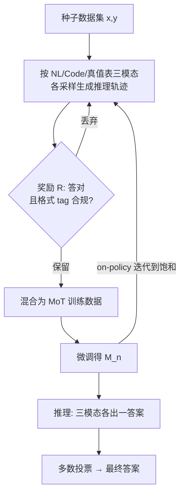

# Learning to Reason via Mixture-of-Thought for Logical Reasoning

**会议**: ICLR 2026  
**OpenReview**: [https://openreview.net/forum?id=xhrN80hmJ9](https://openreview.net/forum?id=xhrN80hmJ9)  
**代码**: 待确认  
**领域**: LLM 推理 / 逻辑推理  
**关键词**: Mixture-of-Thought, 逻辑推理, 真值表推理, 自演化训练, 多模态思维, 多数投票  

## 一句话总结
本文提出 Mixture-of-Thought（MoT）框架，让单个 LLM 学会用自然语言、代码、以及新引入的"真值表"三种互补的推理范式来做逻辑推理，并通过自演化训练把三种范式的能力联合提升、推理时用多数投票融合，在 FOLIO/ProofWriter 上比单一思维链基线最高提升 +11.7pp。

## 研究背景与动机
- **领域现状**：LLM 做逻辑推理主要靠 Chain-of-Thought（CoT），即便用自洽性（self-consistency）等集成方法，本质仍局限在**单一自然语言模态**；另一条线是 neuro-symbolic 方法（Logic-LM 等），把 LLM 当翻译器、把推理外包给符号求解器。
- **现有痛点**：近期把 CoT 和符号推理结合的工作（HybridMind、Logic-LM 系列）只在**推理时**做模态选择或单向增强，**训练过程仍是"模态盲"的**——训练只见一种模态，无法学到不同模态之间的协同。
- **核心矛盾**：人类天然会在自然语言、过程式代码、形式符号之间灵活切换来学习和解决逻辑问题，而当前 LLM 被困在单模态训练里，缺乏这种"用多种表征处理信息"的认知灵活性。作者的误差分析（Figure 1c）显示 NL CoT 近三分之二的错误来自 **missing-branch（漏分支）和 invalid-converse（无效逆否）**，即穷举能力和复杂推理能力不足。
- **本文目标**：回答"LLM 能否通过显式学习跨多个互补推理模态来获得更鲁棒、更通用的逻辑推理能力"，并解决两个挑战：(1) 该选哪些**互补**的模态；(2) 缺少跨模态的高质量对齐推理轨迹该如何训练。
- **核心 idea**：**【多模态互补 + 自演化训练】** 选定 NL/Code/真值表三种互补模态（真值表系统化枚举所有真值赋值，恰好补 NL 漏分支的短板，三者并集覆盖率达 85%），用模型自己生成、过滤、再训练的自演化循环联合学习，推理时三路输出多数投票。

## 方法详解

### 整体框架
MoT 把"用什么思维方式推理"作为可学习的对象。它先定义三种互补的推理模态（自然语言 CoT、代码 CoT、真值表 CoT），再用一个**自演化训练**循环让单个模型把三种模态的能力一起练强：每轮让模型对每道题在每种模态下采样生成推理轨迹，用一个轻量奖励函数过滤出"答对且格式合规"的轨迹，混合后微调，迭代到性能饱和；推理时让模型按 tag 分别产出三路答案，再多数投票得最终预测。

### 关键设计

**1. 真值表推理模态：用枚举补自然语言的短板。** 这是本文新引入、也是最关键的符号模态。作者从误差分析出发：NL CoT 最大的两类错误是漏分支和无效逆否，本质都是"没穷尽所有可能"，而真值表恰好系统化列出所有真值赋值。但直接做真值表有两大障碍——**指数爆炸**（变量一多行数 $2^n$ 直接撑爆上下文）和**一阶逻辑落地**（真实任务是一阶逻辑，需要 grounding 成有限命题谓词）。为此设计两步策略：(i) **grounding**，把一阶公式实例化成有限的命题谓词集；(ii) **reason-to-prune**，让 LLM 通过推理删掉违反任一前提的赋值行，只保留**部分真值表**。最后用判定规则给答案：所有存活赋值都满足结论则 True，都不满足则 False，否则 Uncertain。

**2. 自演化 MoT 训练：从自己生成的轨迹里联合学三种模态。** 由于缺少跨模态的标注推理轨迹（尤其真值表是全新的），作者让模型自举。优化目标是在问题 $x$ 和模态 $t\in\{\text{NL},\text{Code},\text{TruthTable}\}$ 上最大化期望奖励：
$$\mathbb{E}_{(x_i,y_i)\sim D,\, t\sim T,\, (z_i^t,\hat y_i^t)\sim M(\cdot|x_i,t,E_t)}\big[R(z_i^t,\hat y_i^t,y_i;t)\big]$$
其中 $E_t$ 是为唤起模态 $t$ 而拼在题前的少样本示例。借助策略梯度可直接得到梯度形式，更新策略 $M_n$。一个关键工程细节：**只有第一轮用少样本提示**唤起各模态（Line 7），一旦模型自举出该能力，后续所有轮都切到零样本（Line 9）。与 STaR（每轮从 base 模型重启）不同，MoT 是 **on-policy**——始终从上一轮自己验证过的输出继续学。

**3. 二值奖励 + 格式一致性校验：用最简单的检查防止模态互相干扰。** 奖励函数定义为
$$R(z,\hat y,y;t)=\begin{cases}1,& y=\hat y \wedge \text{isValid}(z,t)\\ 0,& \text{otherwise}\end{cases}$$
`isValid` 做两件事：(a) 轨迹必须正确带上该模态的结构标签（如 NL 要有 `<end_of_nl_cot>`），(b) 代码轨迹必须同时含有效的 `def` 和 `class` 定义。作者发现一个反直觉现象——**tag 与实际推理内容不匹配会让不同模态互相负干扰、显著掉点**（代码模态尤其严重），所以这个看似简单的格式校验非常关键。他们刻意**不做**步级中间推理验证（那要额外的 LLM judge 工具且大幅拖慢训练），实践证明仅靠 tag + 基本代码结构这种轻量检查就已经带来显著收益。由于奖励是二值的，整个框架退化为"拒绝采样 + 监督微调"，等价于一种 STaR 式自演化。

**4. 多数投票推理：融合三种互补视角。** 推理时对每道题用 `<nl_cot>`、`<code>`、`<truth_table>` 三个 tag 各唤起一路输出，对三路答案做多数投票得最终答案，平票时随机选一路。这种简单融合让模型把不同视角的优势叠加——代码与真值表的强项在不同题目上恰好覆盖 NL 的盲区。作者还分析了 MoT 的 test-time scaling：固定预算 $k$ 时，把 $k$ 平均分给三个模态采样，比把 $k$ 全给单模态采样能得到更高的 pass@k 上界。

## 实验关键数据

### 主实验
FOLIO / ProofWriter（取深度 5 最难子集）准确率（%），四个底座模型：

| 底座模型 | 方法 | FOLIO | ProofWriter | Avg |
|---|---|---|---|---|
| GPT-4 | Logic-LM（外部求解器） | 78.9 | 79.7 | 79.3 |
| GPT-4 | CoT (Vanilla) | 70.6 | 68.1 | 69.4 |
| Gemma-2-2B-It | 基座 3-shot (best nl) | 42.4 | 39.8 | 41.1 |
| Gemma-2-2B-It | **MoT 训练 + MoT 推理** | 62.6 | 65.0 | **63.8** |
| Gemma-2-9B-It | 基座 3-shot (best nl) | 69.5 | 61.2 | 65.4 |
| Gemma-2-9B-It | **MoT 训练 + MoT 推理** | 78.9 | 70.7 | **74.8** |
| Qwen2.5-7B-Instruct | 基座 3-shot (best nl) | 71.9 | 60.5 | 66.2 |
| Qwen2.5-7B-Instruct | **MoT 训练 + MoT 推理** | 78.3 | 71.8 | **75.1** |
| Qwen3-4B-Instruct-2507 | 基座 3-shot (best nl) | 83.3 | 79.7 | 81.5 |
| Qwen3-4B-Instruct-2507 | **MoT 训练 + MoT 推理** | 89.2 | 86.0 | **87.6** |

要点：仅 MoT 训练（单模态推理）就比基座平均 +11.7pp；再叠加 MoT 推理还能多 +2.1pp；9B 模型 FOLIO 达 78.9%，**追平用了外部求解器的 GPT-4+Logic-LM**。

### 消融实验
不同训练策略 × 推理模态（Gemma-2-9B，FOLIO，%，Ensemble 为三模态多数投票）：

| 训练方式 | Code | NL CoT | 真值表 | Avg | Ensemble |
|---|---|---|---|---|---|
| 不训练 | 56.7 | 69.5 | 63.6 | 63.3 | 66.0 |
| 单模态(NL CoT) | 52.7 | 73.9 | 69.0 | 65.2 | 73.4 |
| 单模态(三模型合并 3×9B) | 61.6 | 73.9 | 71.9 | 69.1 | 77.3 |
| MoT(Code+NL) | 70.9 | 70.0 | 74.4 | 71.8 | 74.9 |
| **MoT(全部三模态)** | 73.9 | 76.9 | 70.0 | **73.6** | **78.9** |

单模型 MoT 训练（73.6 Avg / 78.9 Ensemble）甚至超过"为每个模态各训一个模型"的 3×9B 方案（69.1 / 77.3），且只需 1 个模型部署。

### 关键发现
- **模态互补且必要**：仅用三模态中任意两种（Code+NL）训练就能超过所有单模态基线，证明训练阶段存在协同；用上全部三种最优。
- **越难越有用**：在 ProofWriter 深度 1-5 vs 5-8 上，MoT 对更深推理问题的增益更大（如 86.4→更高的相对优势）。
- **test-time scaling 更优**：MoT 采样在 pass@k 上全程压过单模态采样，且预算 <20 时差距尤其显著；NL 在低 $k$ 强于真值表但上界趋同，代码上界最低，MoT 融合上界最高。
- **真值表确实补盲**：真值表范式能解决一部分 NL 特有的漏分支 / 无效逆否错误。

## 亮点与洞察
- **从误差分析反推模态设计**：不是拍脑袋堆模态，而是先量化 NL CoT 的失败模式（漏分支、无效逆否占 ~66%），再针对性引入真值表来补这个具体短板，方法论上很扎实。
- **"部分真值表 + 推理剪枝"绕开指数爆炸**：让 LLM 用推理删掉违反前提的行，而非真去枚举 $2^n$ 行，把符号方法和 LLM 的语义推理结合得很巧。
- **训练阶段的协同被首次显式利用**：以往工作只在推理时拼模态，本文证明"训练时就联合学多模态"能把每个单模态的天花板都抬高（synergy）。
- **格式 tag 的隐性陷阱**：揭示了多模态联合训练里一个容易被忽视的坑——tag 与内容不匹配会导致模态互相负干扰，简单的格式校验就能救回不少分。

## 局限与展望
- **不执行代码**：Code CoT 只把代码当结构化逻辑描述、并不真跑，可能没充分发挥代码的可验证性优势。
- **奖励是粗粒度二值**：只校验最终答案对错 + 格式，不做步级验证，中间推理可能"对答案错过程"，作者也承认这是为速度做的妥协。
- **任务范围偏窄**：仅在命题/一阶逻辑的 FOLIO、ProofWriter 上验证，是否能迁移到数学、常识、多跳 QA 等更广推理任务待验证。
- **真值表的 grounding 依赖 LLM 自身**：一阶落地和剪枝都靠模型推理，复杂前提下 grounding 出错会污染整条真值表轨迹。
- 展望：把真值表/代码模态接入真实求解器或执行器做硬验证，引入步级奖励，扩展到更多模态（如图/表/方程）和更广的推理基准。

## 相关工作与启发
- **CoT 与集成**：self-consistency、best-of-N、多 agent 辩论等都在单模态内做集成；MoT 把"集成"提升到跨模态层面。
- **Neuro-symbolic**：Logic-LM、LINC（Olausson 2023）等把 LLM 当翻译器外包给符号求解器；MoT 让 LLM 自己内化符号（真值表）推理，无需外部求解器即追平 Logic-LM。
- **混合模态推理**：HybridMind/Xiong 2024 在推理时选模态或单向增强（Code↔NL）；MoT 的差异在于训练时联合 + 引入第三种真值表模态，把并集覆盖率从 code+NL 推高到三模态 85%。
- **自演化 / STaR**：基于 STaR（Zelikman 2022）的拒绝采样 + SFT 思想，但改成 on-policy 迭代（不每轮重启）并扩展到多模态，给"用模型自己的轨迹自举多种思维方式"提供了可复制范式。

## 评分
- **新颖性**: ⭐⭐⭐⭐ — 真值表作为可学习推理模态 + 训练阶段多模态联合自演化，是对"模态盲训练"的实质性突破，思路新颖且有误差分析支撑。
- **实验充分度**: ⭐⭐⭐⭐ — 四个底座模型、两个基准、丰富消融（单模态 vs MoT、部分 vs 全 MoT、test-time scaling、难度分层、误差分析），证据链完整；但任务域偏逻辑推理、未跑更广基准。
- **写作质量**: ⭐⭐⭐⭐ — 从"人类用多模态"动机到误差分析到方法，逻辑清晰，图表（覆盖率、误差分布、scaling 曲线）有力。
- **价值**: ⭐⭐⭐⭐ — 提供了一个无需外部求解器、可在中小模型上即插即用的多模态推理训练范式，9B 追平 GPT-4+Logic-LM，实用价值高且易复现。

<!-- RELATED:START -->

## 相关论文

- [\[ICLR 2026\] Learning to Reason over Continuous Tokens with Reinforcement Learning (HyRea)](learning_to_reason_over_continuous_tokens_with_reinforcement_learning.md)
- [\[ICLR 2026\] ActivationReasoning: Logical Reasoning in Latent Activation Spaces](activationreasoning_logical_reasoning_in_latent_activation_spaces.md)
- [\[ICLR 2026\] MoDr: Mixture-of-Depth-Recurrent Transformers for Test-Time Reasoning](modr_mixture-of-depth-recurrent_transformers_for_test-time_reasoning.md)
- [\[ICLR 2026\] VERICOT: Neuro-Symbolic Chain-of-Thought Validation via Logical Consistency Checks](vericot_neuro-symbolic_chain-of-thought_validation_via_logical_consistency_check.md)
- [\[ICLR 2026\] TUMIX: Multi-Agent Test-Time Scaling with Tool-Use Mixture](tumix_multi-agent_test-time_scaling_with_tool-use_mixture.md)

<!-- RELATED:END -->
