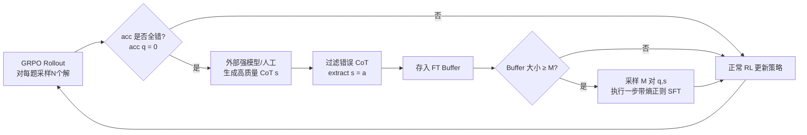

# Learning What Reinforcement Learning Can't: Interleaved Online Fine-Tuning for Hardest Questions

**会议**: ICLR 2026  
**OpenReview**: [https://openreview.net/forum?id=LzCBLrNoyM](https://openreview.net/forum?id=LzCBLrNoyM)  
**代码**: 已开源（论文 abstract 提供链接）  
**领域**: LLM 推理 / 后训练（RL + SFT）  
**关键词**: RLVR, GRPO, 监督微调, 在线微调, 数学推理, 难题学习  

## 一句话总结
通过分析 RL 与 SFT 在不同难度题目上的训练动态，发现 RL 只擅长把"已会的题做对"而学不会"超纲题"，于是提出 ReLIFT——在 RL 主训练中动态识别模型答全错的最难题、在线收集高质量 CoT 解答并穿插少量 SFT 步，用更少的演示数据和训练时间在六个推理基准上平均超越纯 RL/纯 SFT 及各种混合方法 +6.7 分。

## 研究背景与动机
- **领域现状**: 以 DeepSeek-R1 为代表的长 CoT 推理模型主要靠 RLVR（可验证奖励强化学习，PPO/GRPO）驱动，奖励只看答案是否正确或是否通过单测，无需演示数据即可规模化。
- **现有痛点**: 多项工作（Yue et al. 2025、Zhao et al. 2025、Cheng et al. 2025）指出 RLVR 本质上只是**强化基座模型已有的行为**而非注入新能力——RLVR 训练后的模型在高 k 的 pass@k 上甚至不如基座，说明推理能力边界没有扩展。其根源是 RL 的 on-policy 特性：它只能从模型自己采样出的 rollout 中学习，自然只会偏向那些"它已经知道大概率能拿奖励"的推理路径。
- **核心矛盾**: SFT 能借助高质量演示数据注入新知识与新推理模式，恰好补 RL 的短板，但 SFT 重度依赖大量演示数据，且在 OOD 上泛化差、容易破坏模型原有能力（在简单题上反而退化、响应变长）。两者优劣互补但难以兼得。
- **本文目标**: 如何把 RL 与 SFT 有效结合，既提升推理与 OOD 泛化、又减少对昂贵演示数据的依赖，并突破基座模型的认知边界。
- **核心 idea**: **【难度分层的训练动态分析】** 把验证集按基座模型 8 次采样的正确率分成 Easy/Medium/Hard/Hardest 四档，观察 RL 与 SFT 在各档上的精度与响应长度演化，量化"RL 提升易题、SFT 攻克难题"的互补规律；**【按需穿插的在线微调】** 据此让 RL 当主力，仅对训练中暴露出的"全错难题"在线补 SFT，做到哪里弱补哪里。

## 方法详解

### 整体框架
ReLIFT（Reinforcement Learning Interleaved with Online Fine-Tuning）以 GRPO 为主训练循环，在每次 rollout 中根据组内正确率挑出模型答全错（acc(q)=0）的最难题，对这些题在线获取经过滤的正确 CoT 解答存入微调缓冲区；当缓冲区攒够一个 batch 时，插入一步带熵正则的 SFT，然后继续 RL。整个过程自适应交替——训练早期模型弱、SFT 触发更频繁以快速学新模式，后期模型变强则以 RL 为主继续激发已有能力。

### 关键设计

**1. 难度分层动态分析：定位 RL 的能力天花板。** 作者用 Qwen2.5-Math-7B 在 Open-R1-math-220K 子集上分别独立跑 120 步 SFT 与 RL，每 30 步存 checkpoint，并按基座 8 次采样正确率把 1000 道验证题分为 Easy(≥6/8 对)、Medium(3–5/8)、Hard(1–2/8)、Hardest(0/8)。结论清晰：RL 在 Easy/Medium 上优于 SFT 且能保住原有能力，但对 Hardest 几乎无改善；SFT 则相反——它能让更多 Hardest 题转入可解类别，却会在简单题上让模型"学坏"（精度下降、响应被拉长去模仿长解答）。这组观测直接给出了"用 SFT 学 RL 学不会的题"的方法论依据。

**2. RL 主训练 + 在线收集难题：GRPO 之上挂一个难题筛子。** 主循环沿用 GRPO，对题目 $q$ 采样 $N$ 个解 $o_i$，用组内奖励估计优势而免去价值模型：

$$L_{GRPO}(\theta)=\frac{1}{\sum_i|o_i|}\sum_{i=1}^{N}\sum_{t=1}^{|o_i|}\min\big[r_{i,t}(\theta)A_i,\ \mathrm{clip}(r_{i,t}(\theta);1-\epsilon,1+\epsilon)A_i\big],\quad A_i=\frac{R(o_i)-\mathrm{mean}(\{R(o_i)\})}{\mathrm{std}(\{R(o_i)\})}$$

rollout 阶段顺带统计每题 acc(q)，把 acc(q)=0 的难题交给更强的推理模型（如 DeepSeek-R1）或人工产出 CoT 解 $s$，仅保留答案正确（extract(s)=a）的 (q,s) 对存入缓冲：$\text{Buffer}_{hardest}=\{(q,s)\mid acc(q)=0,\ s=M(q),\ extract(s)=a\}$。整个收集是**在线**的，不需要预先备好大规模 CoT 数据集，只为训练中真正遇到的难题动态生成解答，这也是它演示数据需求只有 8K（vs SFT 的 46K）的来源。

**3. 带熵正则的穿插微调：补知识又不掐死探索。** 当 $|\text{Buffer}_{FT}|\ge M$（M 设为 FT 的 batch size）时采样一个 batch 做一步标准交叉熵 SFT。为防止 SFT 把模型的探索行为压死，作者在损失里加一项熵正则：

$$L_{FT}(\theta)=-\frac{1}{|s|}\sum_{i=1}^{|s|}\log\pi_\theta(s_i\mid q,s_{<i})-\alpha\frac{1}{|s|}\sum_{i=1}^{|s|}H(\pi_\theta(s_i\mid q,s_{<i}))$$

其中 $\alpha$ 控制熵项权重，实验中 $\alpha=10^{-4}$ 最优。这一项是混合 RL/SFT 的关键润滑剂——训练曲线显示纯 RL 的熵随训练单调下降（探索枯竭、响应变短），而 ReLIFT 的熵持续偏高并波动，因而能不断发现新解、在后期仍持续涨分。

**4. 自适应调度：早密后疏、只攻最难题。** 微调频率不是固定的——早期模型弱、难题多，SFT 触发更频繁以快速注入推理模式；随模型变强转为 RL 主导。消融证明这种调度和"只选最难题"缺一不可：ReLIFT(all)（每步 RL 后都配一步 SFT）会因 RL 与 FT 目标冲突而迅速崩溃；ReLIFT(uniform)（每 8 步固定插一次）与 ReLIFT(random)（缓冲填非最难题）都掉点且响应更长。

## 实验关键数据

设置：基座 Qwen2.5-Math-7B，训练集 OpenR1-Math-46k-8192（46K prompt，DeepSeek-R1 生成解答并经 Math-verify 过滤）。评测五个数学基准（AIME-24/25、AMC、MATH-500、OlympiadBench，前三 avg@32、后二 avg@8）+ 一个 OOD 基准 MMLU-Pro。

### 主实验表格（Qwen2.5-Math-7B，Overall ACC / 平均长度）

| 方法 | AIME-24 | AIME-25 | AMC | MATH-500 | Olympiad | MMLU-Pro | Overall ACC | Overall LEN |
|---|---|---|---|---|---|---|---|---|
| SFT | 26.9 | 25.5 | 59.8 | 84.8 | 52.6 | 44.4 | 49.0 | 5533 |
| RL (GRPO) | 21.1 | 17.5 | 62.1 | 85.7 | 48.6 | 46.3 | 46.9 | 2175 |
| RL w/ SFT loss | 26.9 | 23.1 | 59.8 | 84.1 | 53.6 | 44.4 | 48.6 | 5508 |
| SFT then RL (v1) | 29.4 | 21.0 | 63.1 | 87.3 | 55.7 | 47.6 | 50.7 | 3845 |
| SFT then RL (v2) | 26.8 | 23.0 | 63.8 | 88.1 | 54.4 | 48.9 | 50.8 | 4534 |
| LUFFY | 27.3 | 23.0 | 63.5 | 85.6 | 53.8 | 52.6 | 50.9 | 3808 |
| **ReLIFT** | 28.3 | 22.9 | 65.1 | 87.9 | 57.3 | 53.9 | **52.6** | 3502 |

ReLIFT 取得 52.6% 的新 SOTA，且每个基准都是最佳或次佳。资源对比（GPU 小时 / 演示数据）：SFT 8×8 时/46K、RL 40×8 时/0、RL w/SFT loss 113.5×8 时/46K、SFT-then-RL v1 57×8 时/46K、LUFFY 73×8 时/46K，而 **ReLIFT 仅 52×8 时 / 8K 演示**——更高精度、更短响应、更省数据与算力。

### 消融实验表格

| 设置 | Accuracy(%) | Length |
|---|---|---|
| **ReLIFT** | **52.60** | 3502 |
| ReLIFT(all)（每步 RL 后插 SFT） | 23.80 | 6743 |
| ReLIFT(uniform)（固定每 8 步插一次） | 49.10 | 3716 |
| ReLIFT(random)（缓冲填非最难题） | 45.50 | 5268 |

熵系数 α 消融：α=0、1e-5、1e-4、1e-3 中，**α=1e-4 最优（52.6）**，两侧偏离都显著掉点，证明熵正则是融合 SFT 与 RL 的关键。

### 关键发现
- **互补规律实锤**: RL 提升并保住易/中题，SFT 才能让 Hardest 题转化为可解；这是 ReLIFT 设计的实验根基。
- **探索不枯竭**: 训练动态中 ReLIFT 的奖励持续高于 RL、响应长度逐渐上升、熵保持高位波动，而纯 RL 熵单调衰减、响应变短，说明 ReLIFT 在后期仍能发现新解持续涨分。
- **跨模型泛化**: 在 Qwen2.5-Math-1.5B（36.5 vs RL 34.2）、Qwen2.5-7B（45.0 vs RL 43.1）、LLaMA-3.1-8B（17.3 vs RL 14.6）上 ReLIFT 均稳定优于 SFT 与 RL，验证方法对更小/更弱/异构架构的普适性。

## 亮点与洞察
- **把"RL 学不会什么"量化清楚**：用难度四分层 + 初末态迁移分析，把"RLVR 只强化已有能力"的抽象论断变成可操作的诊断信号（acc(q)=0 即超纲题），方法因此有据可依而非拍脑袋。
- **在线、按需、最小演示**：只对训练中真正暴露的难题生成 CoT，绕开"先备一个大 CoT 数据集"的昂贵前提，把演示需求从 46K 压到 8K，同时训练时间最短。
- **熵正则是点睛之笔**：直觉上 SFT 会压缩分布、掐死 RL 的探索，作者用一个轻量熵项就把两种目标的冲突调和掉，消融显示它对成败至关重要。

## 局限与展望
- **依赖外部强教师/人工**：难题的高质量 CoT 来自 DeepSeek-R1 等更强模型或人工，当任务领域没有更强的可用教师时，方法的"在线补知识"链条会断。
- **主要验证于数学推理**：除 MMLU-Pro 一个 OOD 基准外，实验集中在数学竞赛题；在代码、科学、Agent 等其他可验证奖励任务上的有效性仍待检验。
- **LLaMA-3.1-8B 上绝对分偏低**：虽相对 SFT/RL 仍有提升，但该架构整体精度远低于 Qwen 系，说明方法收益与基座质量强相关。
- **调度与阈值需调参**：FT 触发阈值 M、熵系数 α、早密后疏的频率策略都需经验设定，缺乏自动化机制。

## 相关工作与启发
- **RLVR 能力边界**：Yue et al. (2025)、Zhao et al. (2025)、Cheng et al. (2025) 指出 RL 只强化而非扩展能力，本文将其作为出发点并给出可操作的补救方案。
- **SFT/RL 混合**：相比 RL w/ SFT loss、SFT-then-RL 两阶段、以及 LUFFY（mixed-policy GRPO），ReLIFT 的差异在于"在线、动态、只针对最难题"地穿插 SFT，而非固定配比或固定顺序。
- **启发**：这套"用诊断信号定位模型弱项 → 只在弱项上注入外部知识 → 用正则保护探索"的范式，可推广到任何"on-policy 学习触及能力天花板"的场景（如代码 RL、Agent RL），核心是把昂贵的监督信号花在刀刃上。

## 评分
- **新颖性**: ⭐⭐⭐⭐ — "在线按需穿插 SFT 攻最难题"是对 SFT/RL 混合范式的清晰且有理论支撑的新切法，难度分层分析尤其扎实。
- **实验充分度**: ⭐⭐⭐⭐ — 六基准 + 四基座 + 资源对比 + 调度/熵系数消融 + 训练动态全覆盖，论证链完整；略欠数学外领域验证。
- **写作质量**: ⭐⭐⭐⭐ — 从"诊断→动机→方法→验证"逻辑顺畅，图表（难度迁移、训练动态）信息量大且直观。
- **价值**: ⭐⭐⭐⭐ — 用更少数据/算力刷新数学推理 SOTA，且范式可迁移，对资源受限的推理后训练有直接实用价值。

<!-- RELATED:START -->

## 相关论文

- [\[ICLR 2026\] NFT: Bridging Supervised Learning and Reinforcement Learning in Math Reasoning](nft_bridging_supervised_learning_and_reinforcement_learning_in_math_reasoning.md)
- [\[ICLR 2026\] Temperature as a Meta-Policy: Adaptive Temperature in LLM Reinforcement Learning](temperature_as_a_meta-policy_adaptive_temperature_in_llm_reinforcement_learning.md)
- [\[ICLR 2026\] Learning to Reason over Continuous Tokens with Reinforcement Learning (HyRea)](learning_to_reason_over_continuous_tokens_with_reinforcement_learning.md)
- [\[ICLR 2026\] Generative Adversarial Reasoner: Enhancing LLM Reasoning with Adversarial Reinforcement Learning](generative_adversarial_reasoner_enhancing_llm_reasoning_with_adversarial_reinfor.md)
- [\[ICLR 2026\] Conditional Advantage Estimation for Reinforcement Learning in Large Reasoning Models](conditional_advantage_estimation_for_reinforcement_learning_in_large_reasoning_m.md)

<!-- RELATED:END -->
