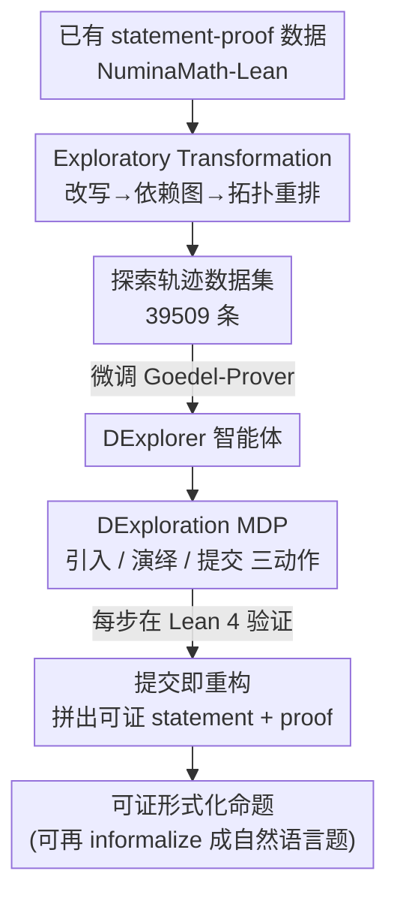

# Let's Explore Step by Step: Generating Provable Formal Statements with Deductive Exploration

**会议**: ICLR 2026  
**OpenReview**: [https://openreview.net/forum?id=Njrkeo3DiJ](https://openreview.net/forum?id=Njrkeo3DiJ)  
**代码**: https://github.com/Purewhite2019/dexploration_main  
**领域**: LLM推理 / 形式化定理证明 / 数学问题合成  
**关键词**: 形式化证明, Lean 4, 问题合成, 演绎探索, 数据蒸馏

## 一句话总结
本文提出 DExploration，把数学问题合成从"一次性生成"改成"在 Lean 4 里一步步演绎探索"，用三个原子动作（引入变量/假设、演绎新事实、提交结论）边走边验证，从而生成天然可证、覆盖广、难度高的形式化命题；并用 Exploratory Transformation 把已有证明数据蒸馏成探索轨迹来训练智能体，最终把成功率从 40.70% 提到 54.52%，token 成本降 83%。

## 研究背景与动机

**领域现状**：随着 LLM 把人类生成的数学数据快速"吃完"，且评测普遍受数据污染、泄漏、静态难度困扰，"可扩展地合成新鲜、有效、高难度的数学问题"成了刚需。现有合成方法分三类：纯 LLM 方法（WizardMath、MathScale、PromptCoT 等）直接让模型出题判分；领域专用方法（DyVal、几何/一阶逻辑等）用确定性算法保证正确性；形式化方法把 LLM 和 Lean 4 结合，又细分为先出 informal 再自动形式化的 Autoformalizer 路线，和直接生成 formal statement 再调 prover 证明的 Conjecture-Prover 路线。

**现有痛点**：作者把这些方法的共同困境概括为一个**「表达力-有效性-复杂度」三难（trilemma）**。纯 LLM 方法表达力强但出题、判分都容易出错，问题难度被模型自身能力卡死；领域专用方法保证有效性却牺牲了表达广度；形式化方法虽然兼得表达力和可验证性，但 Autoformalizer 路线的错误形式化会破坏有效性，Conjecture-Prover 路线不保证生成的命题可证、还得花大量 LLM 调用去补证明。

**核心矛盾**：作者定位三难的一个根因——**对外部模型（自动形式化器 / prover）的依赖**。一旦问题太复杂，自动形式化或证明就容易失败，于是"真正有挑战性"的问题反而生成不出来，复杂度被外部模型的能力上限封死。

**本文目标**：在保住表达力和可验证性的前提下，突破复杂度上限，让生成的命题天然带证明、不必再依赖外部 prover。

**切入角度**：作者借用数学"问题提出"里的 forward posing 思想——与其从已知知识点反向构造题目（backward），不如像数学家一样**主动探索数学世界、发现有趣结论再把它当题目**。每一步探索都落到 Lean 4 上验证，过程本身就是证明的雏形。

**核心 idea**：把问题合成形式化为一个**确定性 MDP 的逐步演绎探索过程**，智能体用三个原子动作在 Lean 里探索，提交结论时直接拼出可证命题及其证明；再用 Exploratory Transformation 从已有定理证明数据蒸馏探索轨迹来冷启动训练。

## 方法详解

### 整体框架
方法分两条线。**推理线（DExploration）**：把数学探索建模为确定性 MDP，智能体在 Lean 4 维护的探索状态上反复执行三个原子动作——引入变量/假设、演绎新事实、提交某个已得事实作为结论；一旦提交，框架就把引入的假设和提交的事实拼成 formal statement，并从轨迹里抽出证明，保证命题可证。**数据线（Exploratory Transformation）**：DExploration 是全新范式，没有现成训练数据，于是把已有的 statement-proof 对蒸馏成探索轨迹——先把证明改写成演绎风格、再分析变量与步骤间的依赖建成 DAG、最后按拓扑序重排成一条交织"引入/演绎/提交"的轨迹。用这些轨迹微调出 DExplorer 智能体后，就能在推理时自主探索、提交命题。

### 关键设计

**1. DExploration：把问题合成建模为可验证的逐步演绎探索 MDP**

针对"一次性生成命题导致复杂度被外部模型卡死"的痛点，本文不再让模型一口气吐出整条 statement，而是定义一个确定性 MDP：探索状态 $S_t=(\Gamma_t,\Lambda_t)$，其中引入上下文 $\Gamma_t=[(v_i:T_i)]_{i=1}^n$ 是已引入的变量/假设有序列表，演绎上下文 $\Lambda_t=[(h_i:H_i)]_{i=1}^m$ 是已推得的中间事实，初始状态为空 $([\,],[\,])$。智能体在其上执行三个原子动作：$\text{Introduce}(v:T)$ 往 $\Gamma$ 里加一个新变量或假设；$\text{Deduce}(h:H)$ 基于已有上下文断言并证明一个新事实 $\Gamma\circ\Lambda\vdash H$，加入 $\Lambda$；$\text{Submit}(h:H)$ 把某个已得事实 $H$ 当作结论、重构出命题 $\Gamma\vdash H$ 并结束这一回合。

这三个动作"简单却强大"：复杂命题不是凭空造出来的，而是由一连串小步演绎逐渐"长"出来的，因此能突破单个模型一次生成的难度天花板。整个过程不依赖外部 prover 来事后补证明——证明本身就是探索轨迹的副产物。

**2. Lean 4 落地与可证性保证：每一步都接受类型检查、提交即得证明**

光有 MDP 抽象还不够，关键是怎么保证"探索出来的命题真的可证、不矛盾"。本文把三动作全部落到 Lean 4 的 tactic 上：引入上下文 $\Gamma$ 与演绎上下文 $\Lambda$ 的并集对应 Lean 的证明状态 $\{\Gamma\circ\Lambda\vdash \text{False}\}$。$\text{Introduce}$ 用 `obtain ⟨v, _⟩ : ∃(v:T), True := sorry` 引入一个无需实证的自由变量/假设，再去掉占位符避免上下文腐化；为防止引入相互矛盾的假设（一旦 $\Gamma\circ[v:T]\vdash\text{False}$，任何结论都"爆炸"成立），引入后会跑一个轻量启发式 explosion check（Aesop + DeepSeek-Prover 采样一次），能证出 False 就拒绝这一步。$\text{Deduce}$ 严格版只允许 `have` tactic，但为增强表达力放宽到"演绎型 tactic"——即不产生额外目标、不修改目标结论、不修改局部上下文中类型层变量的 tactic（如 `have`、`apply ... at` 是演绎型，`constructor`、`apply` 不是）。$\text{Submit}$ 在外部实现，输出的 $\Gamma\vdash H$ 被保证可证：把所有演绎步骤串起来、再把提交步转成 `exact` tactic，就能重构出一条完整证明。这样 DExploration 实现了**全过程可验证**和**statement 与 proof 的统一生成**，从根上摆脱对外部 prover 的依赖。

**3. Exploratory Transformation：把已有证明数据蒸馏成探索轨迹来冷启动训练**

新范式最大的障碍是没有训练数据。作者的办法是反向操作：从大规模已有 statement-proof 对里"蒸馏"出数学家的探索直觉，分三步。**Deductive Rewriting（演绎改写）**：给定 $(\Gamma\vdash U,[s_i]_{i=1}^m)$，找到第一个非演绎 tactic $s_k$，把 $i\le k$ 的步骤保留为演绎步，剩下的步骤打包进 `have hU : U := by [s_i]_{k<i≤m}`，再补一个 `exact hU`，从而得到一条纯演绎风格的证明。**Dependency Analysis（依赖分析）**：把 $\Gamma$ 里的变量和各演绎步当节点，若一步 $s_i$ 用到的变量与 $\Gamma$ 相交、或后续步 $s_j$ 用到 $s_i$ 新产生的变量（$V_-(s_j)\cap V_+(s_i)\neq\varnothing$），就连一条依赖边，最终构成一个 DAG。**Exploratory Reassembling（探索重排）**：数学家偏好"尽量多推结论、必要时才引入新假设"，作者用推理深度 $d(s)$（节点在 DAG 里的拓扑生成层级，$d(s)=\max_{s'\in dep(s)}d(s')+1$）来蒸馏这种深度优先偏好——做拓扑排序时优先选择 ① 推理深度最高、② 非引入类型的可用节点，把遍历路径中的变量节点替换为 $\text{Introduce}$、tactic 节点替换为 $\text{Deduce}$，末尾接 $\text{Submit}$，就得到一条交织引入与演绎的探索轨迹。这一步是后面消融里最关键的增益来源。

### 一个完整示例
以论文 Fig.1 的例子走一遍：原始题目"求所有 $x>1$ 使 $x^{(x^x)}=(x^x)^x$"，对应一个 Lean statement-proof 对。Exploratory Transformation 先把 tactic 证明改写成演绎风格（`have h1 : 0 < x := ...`、`have h2 : x^x > 1 := ...`、`have hlogx : Real.log x > 0 := ...` 等一串演绎步），再分析变量 $v_1,\dots,v_5$ 与步骤 Step1–Step5 的依赖建成 DAG，最后按拓扑序重排成轨迹：`Introduce(v1)，Introduce(v2)，Deduce(Step1)，Deduce(Step3)，Introduce(v3)，Deduce(Step2)，Deduce(Step4)，Introduce(v4)，Introduce(v5)，Deduce(Step5)，Submit(hU)`。训练好的 DExplorer 在推理时反过来沿这种"边引入边演绎"的节奏自主探索，每个 Deduce 都过 Lean 检查，最后 Submit 时把 $\Gamma$ 和 $hU$ 拼成天然可证的新命题。

### 损失函数 / 训练策略
作者用 Exploratory Transformation 在 NuminaMath-Lean 数据集上得到 39,509 条探索轨迹，微调 Goedel-Prover-V2-8B 作为 DExplorer 智能体（作为概念验证）。推理时每个 episode 最多生成 $N_s=80$ 步。所有方法共享相同训练 recipe 与采样参数。

## 实验关键数据

### 主实验
每个方法跑 5,000 个 episode 生成命题（MUSTARD 用其全部 3,794 对）。核心对比（Token Cost 为每条有效命题的平均输出 token；Cplx.500 / Diff.500 为 Top-500 平均复杂度 / 难度，难度越低越难）：

| 方法 | Valid↑ | Token Cost↓ | Cplx.500↑ | Diff.500↓ | Rouge-L↓ |
|------|--------|-------------|-----------|-----------|----------|
| MUSTARD (Autoformalizer) | 3791 | — | 335 | 0.16 | 0.202 |
| PromptCoT-QwQ (Autoform.-Prover) | 1024 | >172,927 | 1231 | 0.30 | 0.187 |
| ScaleQuest-Math | 2035 | >52,915 | 599 | 0.28 | 0.220 |
| Conjecture-Prover (消融) | 1164 | 187,128 | 1072 | 0.51 | 0.174 |
| **DExplorer (本文)** | **2726** | **8,841** | **1374** | **0.05** | **0.173** |

关键指标对比 ScaleQuest-Math：成功率 40.70%→54.52%，可证率 47.38%→64.18%，矛盾率从 14.58%（PromptCoT-QwQ）降到 9.94%，token 成本从对手 5 万~18 万级别降到 8.8K（约 83%↓），且达到成功率上的 Pareto 最优。在 2726 条有效命题中，三个 SOTA prover（Goedel-Prover-V2-8B、DeepSeek-Prover-V2-7B、Kimina-Prover-Distill-8B）Pass@4 证不出 60 条、Pass@64 仍证不出 8 条——说明本文能在保证可证的同时生成超出现有 prover 能力的难题。

### 消融实验
| 配置 | Valid | 成功率 | Cplx.500 | 说明 |
|------|-------|--------|----------|------|
| DExplorer (Full) | 2726 | 54.52% | 1374 | 完整模型 |
| DExplorer (Staged) | 2340 | — | 1193 | 去掉 Exploratory Transformation 的交织性（强制先引入再演绎）|
| Conjecture-Prover | 1164 | 40.70% | 1072 | 去掉整个 DExploration（同训练集/同底座）|

去掉 DExploration 退化成 Conjecture-Prover 后，性能只与最强 baseline 持平；去掉 Exploratory Transformation 的交织重排（Staged）后，成功率 64.18%→52.10%、Top-500 复杂度 1374→1193、整体复杂度 515→470，而平均 token 成本几乎不变（8841→8800）。

### 关键发现
- **Exploratory Transformation 的交织重排是难度/可证性的主要来源**：Staged 消融在 token 成本不变的情况下复杂度和成功率全面下滑，说明"边引入边演绎、深度优先"的轨迹结构而非单纯演绎风格才是关键。
- **DExploration 框架本身决定了能不能超越 baseline**：去掉它直接退化到与最强 baseline 持平。
- **难度分布更广**：DExplorer 在 >300 复杂度区间生成的问题多于所有 baseline，Top-500 难度 0.05 远难于 baseline（0.16）；整体难度略易（0.47）只是因为它也能生成简单题，覆盖谱更宽。Top-500 问题比 AIME24 还难，整体比 MATH500 还难。
- **效率与多样性兼得**：token 成本比对手低一个数量级，Rouge-L 0.173 为最低（多样性最高，且略优于同底座的 Conjecture-Prover 0.174）。

## 亮点与洞察
- **把"问题合成"重述成"可验证的探索"**：最"啊哈"的地方是不再把生成和验证分成两段（先生成再调 prover 证），而是让每一步探索都接受 Lean 类型检查，证明自然成为轨迹的副产物——这从根上解决了 Conjecture-Prover 不保证可证、要花大钱补证明的问题。
- **三个原子动作的极简设计**：Introduce / Deduce / Submit 三个动作就能覆盖大部分数学探索，且把"放宽到演绎型 tactic"的判定标准（不开新目标、不改目标、不改类型层变量）讲得很清楚，可迁移到任何 tactic-style 证明系统。
- **反向蒸馏训练数据**：新范式没数据时，从已有 proof 反推出"如果当初是一步步探索会怎么走"，用拓扑序+深度偏好把静态证明变成动态轨迹——这种"从结果反推过程"的数据构造思路可迁移到其他需要过程监督却只有结果数据的任务。
- **explosion check 防矛盾**：用轻量启发式在引入假设后立即查 False，避免生成"条件自相矛盾、结论任意成立"的废题，是形式化合成里容易被忽略但很重要的细节。

## 局限与展望
- **DExplorer 只是概念验证**：作者明确说智能体是 proof-of-concept，规模/训练数据有限，性能上限尚未探明。
- **演绎型 tactic 的限制**：放宽到"演绎型 tactic"虽增强了表达力，但仍排除了 `constructor`、`apply` 等会开新目标或改目标的 tactic，某些证明风格可能无法纳入探索。
- **依赖 Lean 4 生态**：方法完全建立在 Lean 4 + Mathlib 之上，表达力上界即 Lean 的上界；迁移到其他证明助手需重做动作落地。
- **explosion check 与矛盾判定是启发式**：引入后的 False 检查和命题矛盾性判定都用采样/启发式，论文也承认"非矛盾"只是"未被证伪"而非保证，存在漏判风险。
- **整体难度略低于部分 baseline**：覆盖谱宽带来整体难度被简单题拉低，若目标是纯粹堆难度，单看 overall difficulty 并不占优（需结合复杂度分布看）。

## 相关工作与启发
- **vs Autoformalizer 路线（MUSTARD / Leang et al.）**：它们先出自然语言题再自动形式化，错误形式化会破坏有效性；本文全程在已验证的形式化环境里探索，避开了 error-prone 的自动形式化。
- **vs Conjecture-Prover 路线（STP / LeanConjecturer / Poesia et al.）**：它们直接生成整条 formal statement 再调 prover 补证明，不保证可证、LLM 调用昂贵；本文把生成拆成细粒度探索步，提交即得证明，token 成本低一个数量级且保证可证（消融里 Conjecture-Prover 与本文同底座同数据，仅去掉 DExploration，性能直接掉到持平 baseline）。
- **vs 领域专用方法（DyVal / 几何 / 一阶逻辑）**：它们用确定性算法保证有效性但局限于特定领域；本文基于 Lean 4，表达力覆盖到研究级数学。

## 评分
- 新颖性: ⭐⭐⭐⭐⭐ 把问题合成重述为 Lean-grounded 的逐步演绎探索 MDP，且反向蒸馏轨迹训练，范式上确有突破。
- 实验充分度: ⭐⭐⭐⭐ 对比/消融覆盖形式与非形式推理、效率、多样性、Pareto，但智能体规模偏小、部分判定靠启发式。
- 写作质量: ⭐⭐⭐⭐ 三难框架清晰、方法与公式严谨，个别实现细节（tactic 落地、explosion check）需配合附录才完全清楚。
- 价值: ⭐⭐⭐⭐⭐ 生成天然可证、能难倒 SOTA prover 的命题，对训练数据耗尽与评测污染都是直接有用的解法。

<!-- RELATED:START -->

## 相关论文

- [\[ICLR 2026\] Mathesis: Towards Formal Theorem Proving from Natural Languages](mathesis_towards_formal_theorem_proving_from_natural_languages.md)
- [\[ICLR 2026\] Making Slow Thinking Faster: Compressing LLM Chain-of-Thought via Step Entropy](making_slow_thinking_faster_compressing_llm_chain-of-thought_via_step_entropy.md)
- [\[ICLR 2026\] TRIM: Hybrid Inference via Targeted Stepwise Routing in Multi-Step Reasoning Tasks](trim_hybrid_inference_via_targeted_stepwise_routing_in_multi-step_reasoning_task.md)
- [\[ICLR 2026\] Agentic Reinforcement Learning with Implicit Step Rewards](agentic_reinforcement_learning_with_implicit_step_rewards.md)
- [\[ICLR 2026\] Hilbert: Recursively Building Formal Proofs with Informal Reasoning](hilbert_recursively_building_formal_proofs_with_informal_reasoning.md)

<!-- RELATED:END -->
